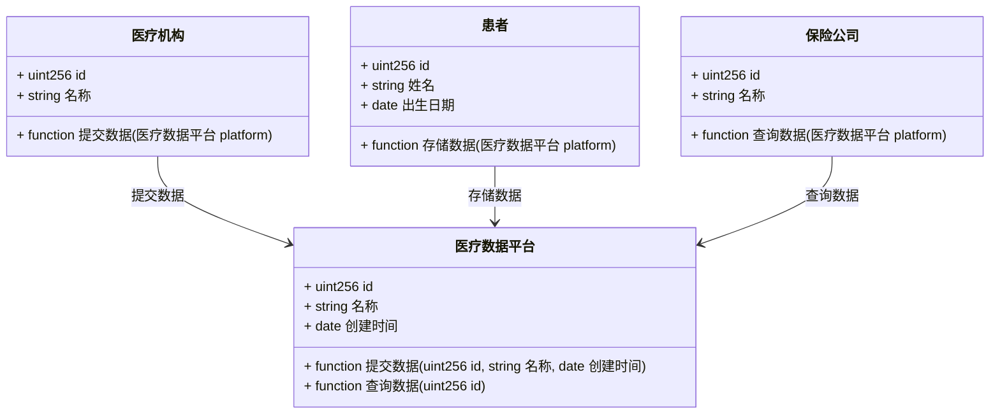
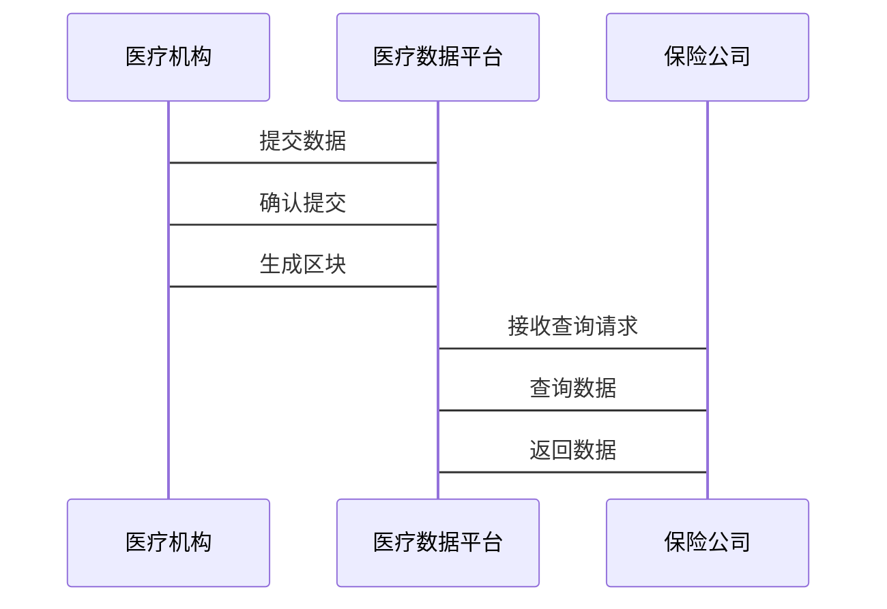

                 


# 企业估值中的区块链医疗数据交换平台评估

> **关键词**: 医疗数据、区块链、企业估值、数据交换平台、智能合约

> **摘要**: 本文深入探讨了区块链技术在医疗数据交换平台中的应用及其对企业估值的影响。通过分析医疗数据的重要性、区块链技术的核心原理、数据交换平台的系统架构，以及实际案例的分析，本文为读者提供了全面的视角，帮助其理解如何通过区块链技术提升医疗数据交换的效率和安全性，从而优化企业估值。

---

# 第1章 医疗数据交换平台的背景与挑战

## 1.1 医疗数据的重要性与价值

### 1.1.1 医疗数据的定义与分类

医疗数据是指在医疗过程中产生的各种信息，包括患者的病历、检查结果、治疗记录、用药信息等。这些数据通常可以分为以下几类：
- **结构化数据**: 如实验室检查结果、诊断代码等。
- **非结构化数据**: 如医生的病历记录、影像报告等。
- **时间序列数据**: 如患者的血压、心率等生命体征数据。

医疗数据的价值在于其能够为医疗决策提供支持，帮助医生制定个性化的治疗方案，同时也能为药企、保险公司等机构提供重要的参考信息。

### 1.1.2 医疗数据在企业估值中的作用

医疗数据在企业估值中的作用主要体现在以下几个方面：
- **优化业务流程**: 通过高效的数据交换，减少信息不对称，提升业务效率。
- **降低运营成本**: 区块链技术的去中心化特性可以减少中间环节，降低运营成本。
- **提升数据安全性**: 区块链的不可篡改性能够有效保护患者隐私，减少数据泄露风险。

### 1.1.3 医疗数据交换的现状与问题

当前医疗数据交换面临的主要问题包括：
- **数据孤岛**: 各医疗机构之间的数据难以共享，导致资源浪费。
- **数据安全性**: 数据在传输和存储过程中容易被篡改或泄露。
- **数据标准不统一**: 不同机构的数据格式和标准不统一，增加了数据交换的难度。

---

## 1.2 区块链技术的引入

### 1.2.1 区块链技术的基本概念

区块链是一种分布式账本技术，通过去中心化的共识机制确保数据的安全性和一致性。其核心特点包括：
- **去中心化**: 没有单点故障，数据由多个节点共同维护。
- **不可篡改性**: 数据一旦写入区块链，难以被修改。
- **透明性**: 每个节点都可以查看交易记录，确保数据的透明性。

### 1.2.2 区块链在医疗数据交换中的优势

区块链技术在医疗数据交换中的优势主要体现在以下几个方面：
- **数据安全性**: 区块链的不可篡改性确保了医疗数据的安全性。
- **数据共享性**: 区块链的去中心化特性使得数据可以在不同机构之间高效共享。
- **隐私保护**: 区块链可以通过零知识证明等技术保护患者隐私。

### 1.2.3 区块链技术的局限性与挑战

尽管区块链技术在医疗数据交换中有诸多优势，但也存在一些局限性：
- **性能瓶颈**: 区块链的交易速度较慢，难以满足大规模数据交换的需求。
- **技术复杂性**: 区块链的实现需要较高的技术门槛。
- **监管合规性**: 医疗数据受严格监管，区块链技术需要符合相关法规。

---

## 1.3 医疗数据交换平台的定义与目标

### 1.3.1 平台的功能定位

医疗数据交换平台是一个基于区块链技术的分布式平台，旨在实现医疗数据的安全共享和高效交换。其功能定位主要包括：
- 数据采集: 从各医疗机构收集医疗数据。
- 数据存储: 将数据存储在区块链上，确保数据的安全性和一致性。
- 数据查询: 提供数据查询接口，支持不同机构的数据需求。

### 1.3.2 平台的建设目标

平台的建设目标主要包括：
- **提升数据共享效率**: 通过区块链技术实现数据的高效共享。
- **确保数据安全性**: 通过区块链的不可篡改性保护患者隐私。
- **降低运营成本**: 通过去中心化减少中间环节，降低运营成本。

### 1.3.3 平台的预期效益

平台的预期效益包括：
- **提升医疗服务质量**: 通过高效的数据共享，提升医疗诊断的准确性和治疗方案的优化。
- **降低企业运营成本**: 通过去中心化减少运营成本。
- **增强患者信任**: 通过数据的安全性和透明性增强患者对医疗机构的信任。

---

## 1.4 本章小结

本章主要介绍了医疗数据交换平台的背景与挑战，分析了区块链技术在医疗数据交换中的作用及其优势与局限性。通过本章的分析，我们可以更好地理解医疗数据交换平台的建设目标和预期效益。

---

# 第2章 医疗数据交换平台的核心概念与联系

## 2.1 核心概念的定义

### 2.1.1 医疗数据交换平台的组成要素

医疗数据交换平台的组成要素主要包括：
- **数据源**: 医疗机构、患者等数据提供方。
- **数据接收方**: 医疗机构、保险公司等数据使用方。
- **区块链网络**: 用于数据的存储和传输。
- **智能合约**: 实现数据的自动验证和授权。

### 2.1.2 区块链技术的核心组件

区块链技术的核心组件包括：
- **节点**: 区块链网络中的参与者，负责数据的验证和存储。
- **区块**: 数据的存储单位，每个区块包含一定量的交易记录。
- **链式结构**: 区块链的基本结构，每个新区块都连接到前一个区块。
- **共识机制**: 确保数据一致性的机制，如POW、DPOS等。

### 2.1.3 数据交换的流程与规则

数据交换的流程主要包括：
1. **数据提交**: 数据源将数据提交到区块链网络。
2. **数据验证**: 区块链节点对数据进行验证，确保数据的合法性和有效性。
3. **数据存储**: 数据被存储在区块链上，形成区块。
4. **数据查询**: 数据接收方通过区块链查询数据。

---

## 2.2 核心概念的属性特征对比

### 2.2.1 医疗数据与传统数据的对比

| 特性         | 医疗数据                  | 传统数据              |
|--------------|--------------------------|-----------------------|
| 安全性       | 高，涉及患者隐私          | 中，通常涉及企业数据    |
| 时效性       | 高，需要实时更新          | 中，更新频率较低        |
| 标准化       | 高，遵循医疗行业标准      | 中，不同行业标准不同    |

### 2.2.2 区块链与传统数据库的对比

| 特性         | 区块链                   | 传统数据库             |
|--------------|--------------------------|------------------------|
| 数据结构     | 分布式链式结构            | 集中式结构              |
| 数据一致性   | 高，通过共识机制保证      | 中，依赖中心化机构保证    |
| 数据修改     | 不可篡改                  | 可修改                  |

### 2.2.3 数据交换平台的功能与性能对比

| 特性         | 基于区块链的平台         | 传统平台               |
|--------------|--------------------------|------------------------|
| 数据安全性   | 高，区块链不可篡改        | 中，依赖中心化机构保证    |
| 数据共享性   | 高，去中心化              | 低，依赖中介机构          |
| 性能          | 低，区块链交易速度较慢     | 高，传统数据库处理速度快  |

---

## 2.3 ER实体关系图架构

```mermaid
erDiagram
    actor 医疗机构 {
        key id
        string 名称
        string 类型
    }
    actor 患者 {
        key id
        string 姓名
        date 出生日期
    }
    actor 保险公司 {
        key id
        string 名称
        string 类型
    }
    actor 医疗数据平台 {
        key id
        string 名称
        date 创建时间
    }
    医疗机构 --> 医疗数据平台 : 提交数据
    患者 --> 医疗数据平台 : 存储数据
    保险公司 --> 医疗数据平台 : 查询数据
```

---

## 2.4 本章小结

本章详细介绍了医疗数据交换平台的核心概念，包括平台的组成要素、区块链技术的核心组件以及数据交换的流程与规则。通过对比分析，我们明确了医疗数据与传统数据、区块链与传统数据库在安全性、共享性和性能方面的差异。

---

# 第3章 区块链技术在医疗数据交换中的算法原理

## 3.1 区块链共识机制

### 3.1.1 共识机制的定义与分类

共识机制是区块链技术的核心组件之一，用于确保区块链网络中所有节点的数据一致性。常见的共识机制包括：
- **POW（工作量证明）**: 比特币采用的共识机制，通过计算哈希函数来验证交易。
- **POS（权益证明）**: 基于持币者的权益分配验证权。
- **DPOS（ delegated proof of stake）**: 委托权益证明，通过选举节点进行验证。

### 3.1.2 常见共识算法（如POW、DPOS等）

#### 3.1.2.1 POW算法

POW算法通过计算哈希函数来验证交易，具体步骤如下：
1. 每个节点需要解决一个数学难题，通常是寻找一个特定的哈希值。
2. 解决难题的节点将获得记账权，并将交易记录到区块链中。
3. 其他节点验证该区块的哈希值是否正确。

POW算法的优点是安全性高，但缺点是计算资源消耗大，且容易受到51%攻击。

#### 3.1.2.2 DPOS算法

DPOS算法通过选举节点来验证交易，具体步骤如下：
1. 网络中的持币者通过投票选举一定数量的节点作为验证节点。
2. 验证节点负责验证交易并生成区块。
3. 其他节点验证区块的有效性。

DPOS算法的优点是效率高，且对计算资源的需求较低，缺点是存在中心化风险。

### 3.1.3 共识算法的优缺点分析

| 特性         | POW                        | DPOS                      |
|--------------|----------------------------|---------------------------|
| 安全性       | 高，抗女娲攻击              | 中，存在中心化风险          |
| 性能          | 低，计算资源消耗大          | 高，对计算资源需求低        |
| 去中心化      | 高，无中心节点              | 中，存在验证节点中心化      |

---

## 3.2 区块链智能合约

### 3.2.1 智能合约的定义与特点

智能合约是区块链上的自动化程序，用于自动执行合同条款。其特点包括：
- **自动化**: 智能合约可以根据预设条件自动执行。
- **去中心化**: 智能合约运行在区块链上，无中心化机构控制。
- **不可篡改性**: 智能合约一旦部署，难以被修改。

### 3.2.2 智能合约的执行流程

智能合约的执行流程主要包括：
1. **触发条件**: 满足特定条件时，智能合约自动执行。
2. **合约执行**: 智能合约根据预设逻辑执行操作。
3. **结果验证**: 其他节点验证合约执行结果是否正确。

### 3.2.3 智能合约的编写与部署

智能合约通常使用Solidity等编程语言编写，并通过编译器部署到区块链上。以下是Solidity智能合约的示例：

```solidity
// SPDX-License-Identifier: MIT
pragma solidity ^0.8.0;

contract MedicalDataExchange {
    struct PatientData {
        uint256 id;
        string name;
        date birthDate;
    }

    mapping(uint256 => PatientData) public patientData;

    function setData(uint256 id, string memory name, date birthDate) public {
        patientData[id] = PatientData(id, name, birthDate);
    }

    function getData(uint256 id) public view returns (PatientData memory) {
        return patientData[id];
    }
}
```

---

## 3.3 医疗数据交换的算法实现

### 3.3.1 数据加密算法

医疗数据的加密是保障数据安全的重要手段。常用的加密算法包括：
- **对称加密**: 如AES算法，加密速度快，适合大量数据加密。
- **非对称加密**: 如RSA算法，安全性高，适合数据签名和验证。

### 3.3.2 数据签名与验证

数据签名是区块链中的重要技术，用于验证数据的来源和完整性。具体步骤如下：
1. 数据提供方对数据进行签名，生成签名信息。
2. 数据接收方通过公钥验证签名信息，确保数据未被篡改。

### 3.3.3 数据一致性验证

区块链通过共识机制确保数据一致性，具体步骤如下：
1. 每个节点将数据提交到区块链网络。
2. 区块链节点通过共识机制验证数据的有效性。
3. 数据被存储在区块链上，形成区块。

---

## 3.4 本章小结

本章详细介绍了区块链技术在医疗数据交换中的算法原理，包括共识机制、智能合约以及数据加密与签名技术。通过这些技术的结合，我们可以实现医疗数据的安全共享和高效交换。

---

# 第4章 医疗数据交换平台的系统架构设计

## 4.1 问题场景介绍

医疗数据交换平台需要解决的主要问题包括：
- **数据孤岛**: 各医疗机构之间的数据难以共享。
- **数据安全性**: 数据在传输和存储过程中容易被篡改或泄露。
- **数据标准不统一**: 不同机构的数据格式和标准不统一，增加了数据交换的难度。

---

## 4.2 系统功能设计

### 4.2.1 领域模型类图



### 4.2.2 系统架构图


### 4.2.3 接口设计

医疗数据平台的接口设计如下：
- **提交数据接口**: 用于医疗机构提交数据。
- **存储数据接口**: 用于患者存储数据。
- **查询数据接口**: 用于保险公司查询数据。

### 4.2.4 交互序列图



---

## 4.3 本章小结

本章详细设计了医疗数据交换平台的系统架构，包括领域模型类图、系统架构图、接口设计和交互序列图。通过这些设计，我们可以清晰地理解平台的运行机制和各模块之间的关系。

---

# 第5章 医疗数据交换平台的项目实战

## 5.1 环境安装

要运行医疗数据交换平台，首先需要安装以下环境：
- **区块链框架**: 如Ethereum、FISCO等。
- **智能合约开发工具**: 如Solidity、 Remix等。
- **开发语言**: 如Python、JavaScript等。

---

## 5.2 系统核心实现

以下是医疗数据交换平台的核心代码示例：

### 5.2.1 区块链网络搭建

```python
from web3 import Web3

# 初始化区块链节点
web3 = Web3(Web3.HTTPProvider("http://localhost:8545"))
```

### 5.2.2 智能合约部署

```solidity
// SPDX-License-Identifier: MIT
pragma solidity ^0.8.0;

contract MedicalDataExchange {
    struct PatientData {
        uint256 id;
        string name;
        date birthDate;
    }

    mapping(uint256 => PatientData) public patientData;

    function setData(uint256 id, string memory name, date birthDate) public {
        patientData[id] = PatientData(id, name, birthDate);
    }

    function getData(uint256 id) public view returns (PatientData memory) {
        return patientData[id];
    }
}
```

### 5.2.3 数据提交与查询

```python
# 提交数据
def submit_data(platform, id, name, birthDate):
    platform.setData(id, name, birthDate)

# 查询数据
def query_data(platform, id):
    return platform.getData(id)
```

---

## 5.3 代码应用解读与分析

医疗数据交换平台的核心代码主要包含以下几个部分：
- **区块链节点初始化**: 通过Python代码连接区块链节点。
- **智能合约部署**: 使用Solidity编写智能合约，并部署到区块链上。
- **数据提交与查询**: 通过Python代码调用智能合约接口，实现数据的提交与查询。

---

## 5.4 实际案例分析

以下是一个实际案例的分析：
1. **数据提交**: 医疗机构提交患者的病历数据到区块链平台。
2. **数据存储**: 数据被存储在区块链上，形成区块。
3. **数据查询**: 保险公司通过区块链查询患者的病历数据，用于保险理赔。

---

## 5.5 本章小结

本章通过实际案例分析，展示了医疗数据交换平台的实现过程，包括环境安装、系统核心实现、数据提交与查询等步骤。通过这些实践，我们可以更好地理解平台的运行机制。

---

# 第6章 总结与展望

## 6.1 总结

本文深入探讨了区块链技术在医疗数据交换平台中的应用及其对企业估值的影响。通过分析医疗数据的重要性、区块链技术的核心原理、数据交换平台的系统架构，以及实际案例的分析，本文为读者提供了全面的视角，帮助其理解如何通过区块链技术提升医疗数据交换的效率和安全性，从而优化企业估值。

---

## 6.2 展望

未来，随着区块链技术的不断发展，医疗数据交换平台将具有更广阔的应用前景。以下是未来的发展方向：
- **技术优化**: 提升区块链的性能，降低交易延迟。
- **应用扩展**: 将区块链技术应用于更多医疗场景，如药品溯源、医疗设备管理等。
- **法规 compliance**: 加强区块链技术的监管合规性，确保数据交换的合法性。

---

# 作者

**作者：AI天才研究院/AI Genius Institute & 禅与计算机程序设计艺术 /Zen And The Art of Computer Programming**

---

**注意**: 本文内容版权归作者所有，未经授权禁止转载。

