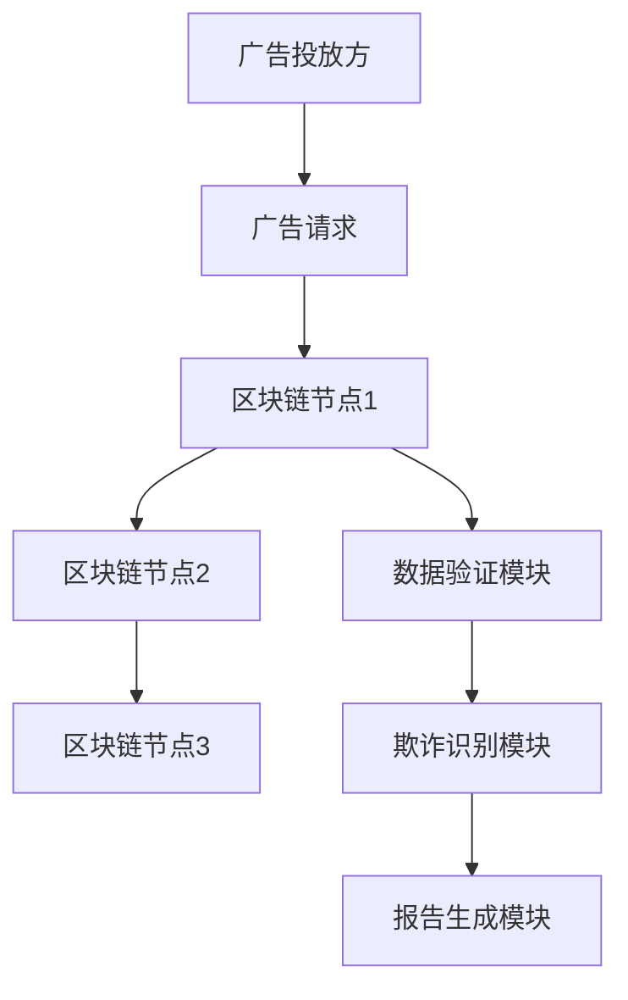

                 


# 企业估值中的区块链数字广告反欺诈平台评估

---

## 关键词：企业估值、区块链、数字广告、反欺诈、平台评估

---

## 摘要

在数字化广告迅速发展的今天，广告欺诈问题日益严重，给企业带来了巨大的经济损失和信任危机。区块链技术的去中心化、不可篡改和透明性等特性，为解决广告反欺诈问题提供了新的思路。本文将从企业估值的角度出发，详细分析区块链数字广告反欺诈平台的核心原理、技术实现、系统架构以及实际应用案例。通过深入探讨该平台如何利用区块链技术实现广告数据的透明化、真实性和可追溯性，为企业的广告投放和价值评估提供可靠的支持。

---

# 第一部分：企业估值与数字广告反欺诈平台的背景

## 第1章：问题背景与解决方案

### 1.1 广告欺诈的现状与挑战

广告欺诈是指通过虚假的广告点击、浏览或安装行为，骗取广告投放方的费用。近年来，随着数字广告的普及，广告欺诈手段也愈加 sophisticated，包括点击欺诈、流量欺诈、假 installs 等。这些行为不仅浪费了企业的广告预算，还严重损害了企业的品牌形象和客户信任。

广告欺诈的具体表现形式包括：

- **点击欺诈**：通过虚假点击广告，骗取广告费用。
- **流量欺诈**：通过虚假的流量来源，掩盖真实的用户行为。
- **假 installs**：通过恶意软件或虚假操作，制造虚假的安装行为。

广告欺诈不仅增加了企业的广告支出，还降低了广告投放的实际效果。传统广告监测方法依赖于第三方监测工具，但由于数据来源单一、监测手段有限，难以有效识别复杂的欺诈行为。

---

### 1.2 区块链技术的潜力

区块链技术作为一种分布式账本技术，具有去中心化、不可篡改、透明性和可追溯性等特点，为广告反欺诈提供了新的解决方案。以下是区块链在广告反欺诈中的核心优势：

- **数据不可篡改性**：区块链上的数据一旦记录，就无法被修改或删除，确保了广告数据的真实性和完整性。
- **透明性**：区块链上的数据对所有参与者透明，广告投放方和监测方可以实时查看广告行为的详细信息。
- **可追溯性**：通过区块链，可以追溯广告数据的来源和流向，快速定位欺诈行为。
- **去中心化**：区块链技术去除了中心化的信任机构，降低了欺诈的可能性。

通过区块链技术，广告反欺诈平台可以实现广告数据的透明化和可追溯性，从而有效识别和防止广告欺诈行为。

---

### 1.3 平台设计目标与功能定位

区块链数字广告反欺诈平台的设计目标是通过区块链技术，提供一个高效、透明、可靠的广告监测和反欺诈解决方案。具体功能包括：

1. **广告数据上链**：将广告投放、点击、浏览等数据实时记录到区块链上。
2. **数据验证**：通过区块链智能合约，验证广告数据的真实性和有效性。
3. **欺诈行为识别**：利用区块链数据，识别异常行为模式，标记欺诈行为。
4. **透明报告生成**：为广告投放方提供详细的广告行为报告，确保数据的透明性和可追溯性。

---

## 第2章：区块链技术与广告反欺诈的结合

### 2.1 区块链技术的基本原理

区块链是一种分布式账本技术，通过去中心化的网络节点共同维护数据的一致性。区块链的核心特点包括：

- **去中心化**：数据由多个节点共同存储，没有单一的中心机构控制数据。
- **共识机制**：通过共识算法（如PoW、PoS等），确保所有节点对数据的一致性达成共识。
- **数据不可篡改性**：区块链上的数据一旦写入，就无法被修改，确保了数据的完整性和可信度。
- **智能合约**：通过智能合约，可以实现自动化的业务逻辑，确保数据的透明性和可执行性。

---

### 2.2 广告反欺诈中的区块链应用

区块链技术在广告反欺诈中的应用主要体现在以下几个方面：

1. **广告数据的分布式存储**：通过区块链技术，广告数据被分布式存储在多个节点上，确保数据的不可篡改性和透明性。
2. **广告请求的链上追踪**：通过区块链，可以追踪广告请求的来源和流向，确保广告请求的真实性和合法性。
3. **广告点击的透明验证**：通过区块链智能合约，可以验证广告点击行为的真实性和有效性，防止虚假点击欺诈。

---

### 2.3 平台的架构设计

区块链数字广告反欺诈平台的架构设计包括以下几个关键模块：

1. **数据采集模块**：负责收集广告投放、点击、浏览等数据，并将数据实时上传到区块链。
2. **区块链存储模块**：将广告数据存储在区块链上，确保数据的不可篡改性和透明性。
3. **数据验证模块**：通过区块链智能合约，验证广告数据的真实性和有效性。
4. **欺诈识别模块**：通过数据分析和机器学习算法，识别异常行为模式，标记欺诈行为。
5. **报告生成模块**：为广告投放方提供详细的广告行为报告，包括欺诈行为的详细信息。

---

## 第3章：广告反欺诈平台的算法原理

### 3.1 广告反欺诈的核心算法

区块链数字广告反欺诈平台的核心算法包括以下几个方面：

1. **数据签名算法**：通过区块链技术，对广告数据进行签名，确保数据的完整性和真实性。
2. **智能合约验证算法**：通过智能合约，验证广告数据的有效性和合法性。
3. **欺诈行为识别算法**：通过数据分析和机器学习算法，识别广告数据中的异常行为模式，标记欺诈行为。

---

### 3.2 算法原理的数学模型

以下是广告反欺诈平台中数据签名算法的数学模型：

$$ \text{签名} = \text{私钥} \times \text{数据哈希} $$

通过数据签名算法，可以确保广告数据的完整性和真实性。以下是智能合约验证算法的数学模型：

$$ \text{验证结果} = \text{智能合约}(\text{签名}, \text{数据}) $$

通过智能合约验证算法，可以验证广告数据的有效性和合法性。

---

### 3.3 算法实现与应用案例

以下是一个简单的广告数据签名和验证的代码示例：

```python
def sign_data(private_key, data):
    # 计算数据哈希
    hash_data = hash(data)
    # 生成签名
    signature = private_key * hash_data
    return signature

def verify_signature(public_key, data, signature):
    # 计算数据哈希
    hash_data = hash(data)
    # 验证签名
    return public_key * hash_data == signature
```

通过上述代码示例，可以实现广告数据的签名和验证，确保数据的完整性和真实性。

---

## 第4章：系统架构与实现方案

### 4.1 系统架构设计

以下是区块链数字广告反欺诈平台的系统架构图：



通过上述架构图，可以清晰地看到广告数据从投放到监测的整个流程。

---

### 4.2 系统功能设计

以下是平台的功能模块划分：

1. **数据采集模块**：负责收集广告投放、点击、浏览等数据，并将数据实时上传到区块链。
2. **区块链存储模块**：将广告数据存储在区块链上，确保数据的不可篡改性和透明性。
3. **数据验证模块**：通过区块链智能合约，验证广告数据的真实性和有效性。
4. **欺诈识别模块**：通过数据分析和机器学习算法，识别异常行为模式，标记欺诈行为。
5. **报告生成模块**：为广告投放方提供详细的广告行为报告，包括欺诈行为的详细信息。

---

## 第5章：项目实战与案例分析

### 5.1 环境安装与配置

以下是项目实战中需要安装的环境和工具：

1. **区块链平台**：以太坊、比特币等。
2. **智能合约开发工具**：Solidity、 Remix 等。
3. **数据可视化工具**：Tableau、 Grafana 等。
4. **编程语言**：Python、 Java 等。

---

### 5.2 核心功能实现

以下是平台核心功能的代码实现：

```python
def main():
    # 数据采集模块
    data = collect_data()
    # 数据签名模块
    signature = sign_data(private_key, data)
    # 数据验证模块
    if verify_signature(public_key, data, signature):
        print("数据有效")
    else:
        print("数据无效")

if __name__ == "__main__":
    main()
```

通过上述代码示例，可以实现广告数据的签名和验证，确保数据的完整性和真实性。

---

## 第6章：总结与展望

### 6.1 总结

区块链技术为广告反欺诈提供了新的解决方案，通过区块链技术可以实现广告数据的透明化、真实性和可追溯性。本文详细分析了区块链数字广告反欺诈平台的核心原理、技术实现、系统架构以及实际应用案例，为企业的广告投放和价值评估提供了可靠的支持。

---

### 6.2 未来展望

随着区块链技术的不断发展，广告反欺诈平台的功能和性能也将不断提升。未来，区块链技术将更加智能化和自动化，广告反欺诈平台将更加高效、透明和可靠。同时，随着人工智能和大数据技术的结合，广告反欺诈平台将更加智能化，能够更好地识别和防止广告欺诈行为。

---

## 作者

作者：AI天才研究院/AI Genius Institute & 禅与计算机程序设计艺术 /Zen And The Art of Computer Programming

