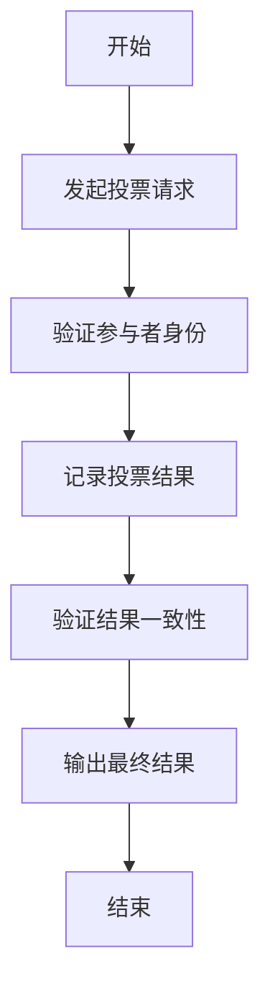
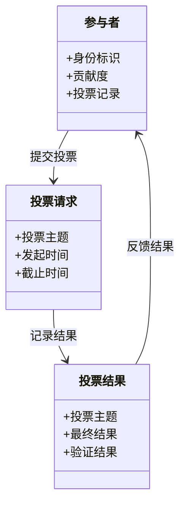
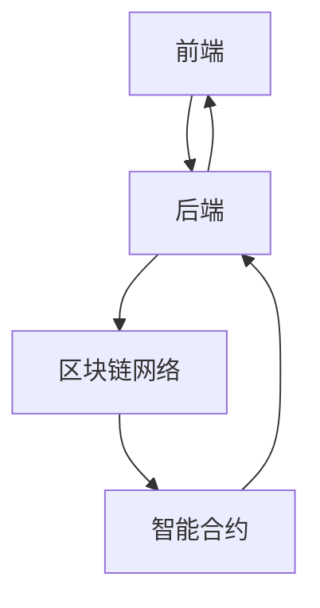
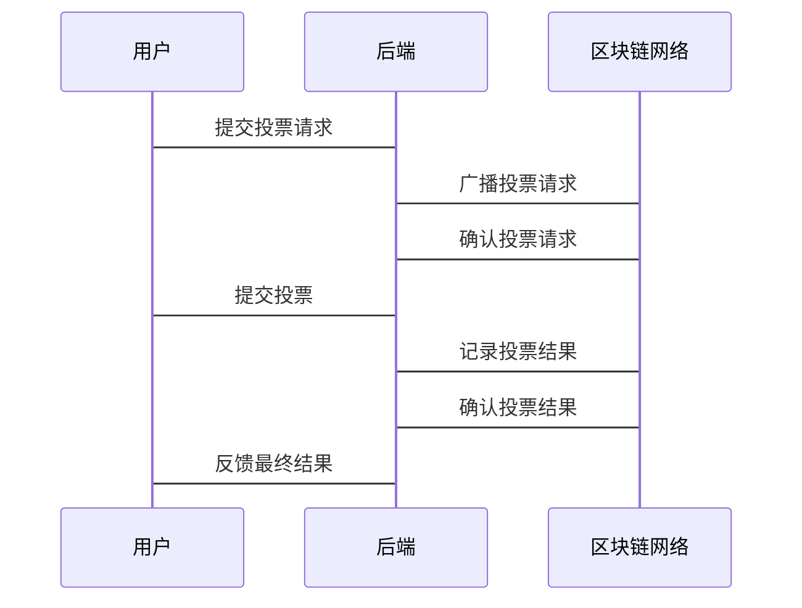

                 


# 《企业估值中的区块链数字投票系统评估》

> 关键词：企业估值、区块链、数字投票系统、共识机制、智能合约、投票权重计算

> 摘要：本文深入探讨了区块链数字投票系统在企业估值中的应用，分析了其核心概念、算法原理、系统架构，并通过实际案例展示了其在企业估值中的优势和应用价值。

---

# 第一部分: 区块链数字投票系统概述

## 第1章: 区块链与数字投票系统背景

### 1.1 区块链技术的起源与发展

#### 1.1.1 区块链的定义与核心特性
区块链是一种去中心化的分布式账本技术，通过密码学保证数据的安全性，并通过共识机制实现数据的一致性。其核心特性包括：
- **去中心化**：无须依赖中心机构，数据由所有节点共同维护。
- **不可篡改性**：数据一旦写入区块链，无法被修改或删除。
- **透明性**：所有交易记录对参与者公开可见。
- **匿名性**：参与者身份可通过加密地址部分隐藏。

#### 1.1.2 区块链的演进历程
区块链技术起源于比特币的白皮书，经历了从1.0（比特币）到2.0（智能合约）再到3.0（去中心化应用）的发展阶段。目前，区块链技术已经广泛应用于金融、医疗、法律等多个领域。

#### 1.1.3 区块链在企业估值中的应用前景
区块链技术的透明性和不可篡改性为企业估值提供了新的可能性。通过区块链记录企业资产、交易数据等信息，可以提高数据的可信度，从而提升估值的准确性。

---

### 1.2 数字投票系统的概念与特点

#### 1.2.1 数字投票系统的定义
数字投票系统是一种基于数字技术的投票机制，通过区块链等技术实现投票过程的透明化和不可篡改性。

#### 1.2.2 数字投票系统的核心特点
- **高效性**：数字投票系统可以快速完成投票过程，减少传统投票方式的时间和成本。
- **透明性**：所有投票记录均可追溯，确保投票结果的真实性和公正性。
- **安全性**：通过区块链技术加密投票数据，防止数据篡改和攻击。

#### 1.2.3 区块链与数字投票系统的结合
区块链技术为数字投票系统提供了去中心化的支持，确保投票过程的透明性和安全性。数字投票系统则为区块链技术提供了应用场景，进一步推动了区块链技术的普及。

---

### 1.3 区块链数字投票系统在企业估值中的作用

#### 1.3.1 传统企业估值方法的局限性
传统企业估值方法通常依赖于财务数据和市场分析，存在以下问题：
- 数据获取成本高：需要收集大量历史数据，且数据可能存在偏差。
- 信息不对称：企业内部数据可能不对外公开，导致估值结果不准确。
- 中间环节复杂：需要依赖中介机构进行数据验证，增加了时间和成本。

#### 1.3.2 区块链数字投票系统的优势
区块链数字投票系统通过以下方式解决了传统估值方法的局限性：
- 数据透明化：所有投票记录均可追溯，确保数据的真实性和准确性。
- 去中心化：无须依赖中介机构，降低了估值成本。
- 高效性：通过智能合约自动完成投票过程，提高了估值效率。

#### 1.3.3 企业估值中的投票机制创新
区块链数字投票系统在企业估值中的投票机制创新包括：
- **智能合约**：通过智能合约自动执行投票规则，确保投票过程的公正性。
- **投票权重计算**：根据参与者的贡献度计算投票权重，确保投票结果的公平性。
- **结果验证**：通过区块链技术验证投票结果的一致性，确保结果的准确性。

---

### 1.4 本章小结
本章主要介绍了区块链技术的起源与发展，数字投票系统的概念与特点，以及区块链数字投票系统在企业估值中的作用。通过分析传统估值方法的局限性，提出了区块链数字投票系统的优势和创新点。

---

# 第二部分: 区块链数字投票系统的核心概念

## 第2章: 区块链数字投票系统的原理

### 2.1 区块链的核心原理

#### 2.1.1 去中心化账本
区块链通过分布式账本记录所有交易数据，每个节点都有一份完整的账本副本，确保数据的透明性和安全性。

#### 2.1.2 共识机制
共识机制是区块链的核心机制，用于确保所有节点达成一致。常见的共识机制包括工作量证明（PoW）、权益证明（PoS）和拜占庭容错（BFT）。

#### 2.1.3 智能合约
智能合约是区块链上的自动执行程序，可以根据预设条件自动执行合同条款，确保合同履行的透明性和公正性。

---

### 2.2 数字投票系统的实现原理

#### 2.2.1 投票请求的发起
投票请求由发起者提交，系统将请求广播到所有节点，确保所有参与者都知道投票请求的存在。

#### 2.2.2 投票过程的记录
参与者根据投票请求进行投票，投票记录将被写入区块链，确保投票数据的不可篡改性。

#### 2.2.3 投票结果的验证
投票结果通过智能合约自动验证，确保结果的一致性和公正性。

---

### 2.3 区块链与数字投票系统的结合原理

#### 2.3.1 数据存储的不可篡改性
区块链的不可篡改性确保了投票数据的安全性，防止数据被恶意修改。

#### 2.3.2 投票过程的透明性
区块链的透明性确保了投票过程的公开性，所有参与者都可以追溯投票记录。

#### 2.3.3 结果的公正性保障
通过区块链技术验证投票结果的一致性，确保结果的公正性。

---

### 2.4 本章小结
本章详细讲解了区块链数字投票系统的核心原理，包括区块链的核心机制、数字投票系统的实现原理以及区块链与数字投票系统的结合原理。通过这些机制的结合，确保了投票过程的透明性、公正性和不可篡改性。

---

# 第三部分: 区块链数字投票系统的算法原理

## 第3章: 区块链数字投票系统的算法实现

### 3.1 共识算法的实现

#### 3.1.1 工作量证明机制
工作量证明机制通过计算哈希值的难度来确保区块链的安全性，常见于比特币等区块链系统。

#### 3.1.2 权益证明机制
权益证明机制通过验证节点的权益来确保区块链的安全性，常见于以太坊等区块链系统。

#### 3.1.3 拜占庭容错共识
拜占庭容错共识通过投票机制确保区块链的安全性，常见于Cosmos等区块链系统。

---

### 3.2 投票系统算法的设计

#### 3.2.1 投票请求的生成与传播
投票请求由发起者生成，并通过区块链网络传播到所有节点。

#### 3.2.2 投票结果的汇总与验证
投票结果通过智能合约进行汇总，并通过区块链网络验证结果的一致性。

#### 3.2.3 投票过程的可追溯性
区块链技术确保了投票过程的可追溯性，参与者可以随时查看投票记录。

---

### 3.3 数学模型与公式

#### 3.3.1 投票权重计算公式
投票权重计算公式如下：
$$
\text{权重} = \frac{\text{参与者的贡献度}}{\text{总贡献度}}
$$

#### 3.3.2 投票结果验证公式
投票结果验证公式如下：
$$
\text{结果} = \sum_{i=1}^{n} (\text{权重}_i \times \text{投票}_i)
$$

---

### 3.4 算法流程图



---

### 3.5 本章小结
本章详细讲解了区块链数字投票系统的算法实现，包括共识算法的实现、投票系统算法的设计以及数学模型与公式的推导。通过这些算法的结合，确保了投票过程的透明性、公正性和不可篡改性。

---

# 第四部分: 区块链数字投票系统的系统架构设计

## 第4章: 系统架构设计

### 4.1 系统功能模块划分

#### 4.1.1 用户模块
用户模块负责管理参与者身份，包括注册、登录和投票操作。

#### 4.1.2 投票模块
投票模块负责处理投票请求，包括投票请求的生成、传播和结果汇总。

#### 4.1.3 结果验证模块
结果验证模块负责验证投票结果的一致性，确保结果的公正性。

---

### 4.2 系统功能设计

#### 4.2.1 领域模型设计
领域模型设计包括参与者、投票请求和投票结果三个核心实体，如下所示：



---

### 4.3 系统架构设计

#### 4.3.1 系统架构图
系统架构设计包括前端、后端和区块链网络三个部分，如下所示：



---

### 4.4 系统接口设计

#### 4.4.1 用户接口
用户接口包括投票请求发起、投票提交和结果查询三个功能。

#### 4.4.2 后台接口
后台接口包括投票请求验证、投票结果汇总和结果验证三个功能。

---

### 4.5 系统交互流程图



---

### 4.6 本章小结
本章详细讲解了区块链数字投票系统的系统架构设计，包括功能模块划分、领域模型设计、系统架构图以及系统交互流程图。通过这些设计，确保了系统的高效性、透明性和安全性。

---

# 第五部分: 区块链数字投票系统的项目实战

## 第5章: 项目实战

### 5.1 环境安装

#### 5.1.1 安装区块链平台
选择一个合适的区块链平台，如Ethereum、Hyperledger Fabric或Cosmos。

#### 5.1.2 安装开发工具
安装区块链开发工具，如Remix IDE、Geth或Postman。

---

### 5.2 系统核心实现源代码

#### 5.2.1 智能合约实现
以下是投票系统的智能合约代码（Solidity）：

```solidity
// SPDX-License-Identifier: MIT
pragma solidity ^0.8.0;

contract VotingSystem {
    struct Voter {
        uint contribution;
        bool isRegistered;
    }

    struct Proposal {
        string title;
        uint endTime;
    }

    mapping(address => Voter) public voters;
    mapping(bytes32 => Proposal) public proposals;

    function registerVoter(address voter) public {
        voters[voter] = Voter(0, false);
    }

    function createProposal(string memory title) public {
        Proposal memory proposal = Proposal(title, block.timestamp + 1 days);
        proposals[keccak256(abi.encode(title))] = proposal;
    }

    function vote(bytes32 proposalId, uint weight) public {
        require(block.timestamp < proposals[proposalId].endTime, "投票已截止");
        voters[msg.sender].contribution += weight;
    }

    function getVoteResult(bytes32 proposalId) public view returns (uint totalWeight, uint result) {
        Proposal memory proposal = proposals[proposalId];
        require(block.timestamp >= proposal.endTime, "投票未截止");
        uint weight = 0;
        for (uint i = 0; i < voters.length; i++) {
            if (voters[i].contribution > 0) {
                weight += voters[i].contribution;
            }
        }
        result = weight / 2;
        return (weight, result);
    }
}
```

#### 5.2.2 投票结果验证
以下是投票结果验证的代码：

```python
def validate_result(proposal_id):
    # 获取投票权重总和
    total_weight = contract.functions.getVoteResult(proposal_id).call()[0]
    # 获取最终结果
    result = contract.functions.getVoteResult(proposal_id).call()[1]
    # 验证结果一致性
    assert result == total_weight / 2, "投票结果验证失败"
```

---

### 5.3 案例分析与解读

#### 5.3.1 案例背景
某企业需要对一项投资决策进行投票，参与者包括股东、管理层和外部专家。

#### 5.3.2 案例实施
1. **注册参与者**：所有参与者在区块链上注册。
2. **发起投票请求**：企业发起投票请求，设定投票主题和截止时间。
3. **提交投票**：参与者根据权重提交投票。
4. **验证结果**：通过智能合约验证投票结果。

#### 5.3.3 案例结果
最终投票结果通过智能合约自动计算，并通过区块链网络验证结果的一致性。

---

### 5.4 本章小结
本章通过实际案例展示了区块链数字投票系统的实现过程，包括环境安装、核心代码实现和案例分析与解读。通过这些实战内容，读者可以更好地理解理论知识的应用。

---

# 第六部分: 区块链数字投票系统的最佳实践

## 第6章: 最佳实践

### 6.1 关键点总结

#### 6.1.1 系统设计的关键点
- **去中心化设计**：确保系统的透明性和安全性。
- **智能合约的应用**：通过智能合约自动执行投票规则。
- **投票权重计算**：根据参与者的贡献度计算投票权重。

#### 6.1.2 开发中的注意事项
- **安全性**：确保智能合约的安全性，防止漏洞攻击。
- **性能优化**：优化系统性能，确保投票过程的高效性。
- **可扩展性**：设计可扩展的系统架构，适应未来的业务需求。

---

### 6.2 小结
通过本文的分析和讲解，读者可以全面了解区块链数字投票系统的原理、设计和实现过程。区块链数字投票系统在企业估值中的应用前景广阔，可以帮助企业提高估值的准确性和公正性。

---

### 6.3 注意事项

#### 6.3.1 系统安全性
确保系统的安全性，防止数据篡改和攻击。

#### 6.3.2 用户隐私保护
保护用户的隐私，防止个人信息泄露。

#### 6.3.3 系统维护
定期维护系统，确保系统的稳定性和安全性。

---

### 6.4 拓展阅读
以下是推荐的拓展阅读材料：
- 《区块链：重新定义价值的互联网》
- 《智能合约与区块链应用开发》
- 《分布式系统的设计与实现》

---

# 作者：AI天才研究院/AI Genius Institute & 禅与计算机程序设计艺术 /Zen And The Art of Computer Programming

