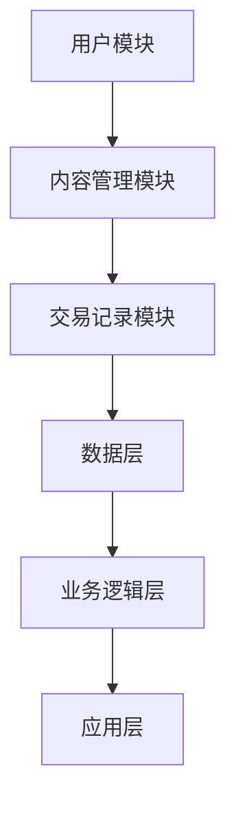

                 


# 企业估值中的区块链数字版权管理平台评估

> 关键词：区块链、数字版权管理、企业估值、智能合约、去中心化

> 摘要：本文深入探讨了区块链技术在数字版权管理中的应用，分析了区块链数字版权管理平台的核心要素、系统架构设计、算法原理及项目实战。通过具体案例，展示了如何利用区块链技术提升企业估值，为相关领域的从业者提供了理论支持和实践指导。

---

# 第一部分: 区块链数字版权管理平台评估背景与概念

## 第1章: 区块链与数字版权管理概述

### 1.1 区块链技术的基本概念

#### 1.1.1 区块链的定义与核心特点
区块链是一种分布式账本技术，通过去中心化、不可篡改和可追溯的特性，实现了数据的安全性和透明性。其核心特点包括：
- **去中心化**：无需依赖中心机构，数据由所有参与者共同维护。
- **不可篡改**：通过加密算法确保数据的安全性。
- **可追溯**：每一条数据都可以追踪其来源和交易历史。

#### 1.1.2 区块链的共识机制
共识机制是区块链的核心之一，确保所有节点达成一致。常见的共识机制包括：
- **工作量证明（PoW）**：通过计算哈希函数找到特定值来证明工作量。
- **权益证明（PoS）**：根据节点持有的币数或贡献来分配记账权。
- ** delegated Proof of Stake（DPoS）**：通过投票选举记账人。

#### 1.1.3 区块链的去中心化特性
去中心化使得数据不再依赖单一机构，避免了单点故障和数据篡改的风险。这种特性在数字版权管理中尤为重要，确保版权信息的真实性和不可篡改性。

### 1.2 数字版权管理的定义与挑战

#### 1.2.1 数字版权管理的核心概念
数字版权管理（Digital Rights Management, DRM）是指通过技术手段保护数字内容的版权，防止非法复制和传播。其核心目标是确保创作者的权益，同时为用户提供合法的使用方式。

#### 1.2.2 数字版权管理的主要挑战
数字版权管理面临以下挑战：
- **数据篡改**：数字内容易于复制和篡改，难以追踪来源。
- **版权归属**：如何准确识别版权持有者并记录其权益。
- **跨平台管理**：数字内容可能分布在多个平台，难以统一管理。

#### 1.2.3 区块链在数字版权管理中的应用潜力
区块链的去中心化和不可篡改特性为数字版权管理提供了新的解决方案。通过区块链，可以实现版权信息的透明记录、自动化的权益分配和便捷的交易追踪。

### 1.3 企业估值中的数字版权管理需求

#### 1.3.1 企业估值的基本概念
企业估值是通过对企业资产、收入、利润等多方面的评估，确定其市场价值。数字版权作为企业的无形资产，其价值评估对企业整体估值至关重要。

#### 1.3.2 数字版权在企业估值中的重要性
数字版权的价值直接影响企业的市场价值。特别是在内容产业，版权资产的保护和管理能力直接关系到企业的收入和利润。

#### 1.3.3 区块链技术如何助力企业估值
区块链通过提供透明、不可篡改的记录，帮助企业准确评估数字版权的价值。同时，区块链技术还可以实现版权的自动交易和权益分配，提升企业的运营效率和估值能力。

### 1.4 本章小结
本章介绍了区块链技术的基本概念、数字版权管理的核心挑战以及区块链在企业估值中的应用潜力。区块链的去中心化和不可篡改特性为数字版权管理提供了新的解决方案，为企业估值提供了有力支持。

---

## 第2章: 区块链数字版权管理平台的核心要素

### 2.1 数字版权管理平台的组成结构

#### 2.1.1 用户角色与权限管理
数字版权管理平台需要支持多种用户角色，如创作者、版权持有者、买家等。每个角色的权限需要严格控制，确保数据安全和合规性。

#### 2.1.2 内容存储与标识
内容存储需要确保数据的完整性和唯一性。通过区块链技术，可以为每个数字内容生成唯一的哈希值，作为其标识。

#### 2.1.3 交易记录与追踪
平台需要记录所有交易信息，并支持追踪交易历史。区块链的特性使得交易记录不可篡改，为版权估值提供了可靠依据。

### 2.2 区块链在版权管理中的关键作用

#### 2.2.1 数据不可篡改性
区块链的特性使得版权信息一旦记录，无法被篡改。这为企业估值提供了可靠的数据基础。

#### 2.2.2 智能合约的自动执行
智能合约可以自动执行预设的规则，例如版权交易的自动结算和权益分配。这不仅提高了效率，还减少了人为干预的风险。

#### 2.2.3 去中心化身份认证
通过区块链实现去中心化身份认证，确保用户身份的真实性和不可篡改性。这为数字版权管理提供了坚实的基础。

### 2.3 平台的评估维度与指标

#### 2.3.1 技术实现的评估维度
- **区块链选择**：选择适合的区块链技术，如公链、私链或联盟链。
- **智能合约开发**：评估智能合约的安全性和可扩展性。
- **系统性能**：评估平台的处理能力，如TPS（每秒交易数）。

#### 2.3.2 业务逻辑的评估维度
- **版权登记流程**：评估登记流程的简便性和效率。
- **交易流程**：评估交易过程的透明性和自动化程度。
- **权益分配机制**：评估权益分配的公平性和效率。

#### 2.3.3 用户体验的评估维度
- **界面设计**：评估用户界面的友好性和易用性。
- **操作流程**：评估用户操作的便捷性和效率。
- **技术支持**：评估平台的技术支持能力和服务质量。

### 2.4 本章小结
本章分析了区块链数字版权管理平台的核心组成结构和关键要素，探讨了区块链在版权管理中的关键作用，并提出了平台的评估维度和指标。这些内容为后续的技术实现和系统设计奠定了基础。

---

## 第3章: 区块链数字版权管理平台的系统架构设计

### 3.1 系统功能模块划分

#### 3.1.1 用户模块
用户模块负责管理平台的用户信息，包括注册、登录、权限管理等。通过智能合约实现用户身份的去中心化认证。

#### 3.1.2 内容管理模块
内容管理模块负责数字内容的上传、存储和标识。通过区块链技术确保内容的唯一性和不可篡改性。

#### 3.1.3 交易记录模块
交易记录模块负责记录所有版权交易信息，包括交易金额、交易时间、交易双方等。通过区块链实现交易的透明性和可追溯性。

### 3.2 系统架构的分层设计

#### 3.2.1 数据层
数据层负责存储和管理所有数字内容和交易记录。通过区块链技术确保数据的安全性和完整性。

#### 3.2.2 业务逻辑层
业务逻辑层负责处理用户的操作请求，如版权登记、交易确认等。通过智能合约实现业务逻辑的自动化执行。

#### 3.2.3 应用层
应用层负责与用户的交互，包括用户界面、操作流程等。通过良好的用户体验设计，提升平台的使用效率和用户满意度。

### 3.3 系统架构设计的Mermaid图



### 3.4 本章小结
本章详细描述了区块链数字版权管理平台的系统架构设计，包括功能模块划分和分层设计。通过Mermaid图展示了系统的整体架构，为后续的技术实现提供了清晰的指导。

---

## 第4章: 区块链数字版权管理平台的算法原理与数学模型

### 4.1 区块链的共识机制

#### 4.1.1 工作量证明（PoW）
工作量证明机制通过计算哈希函数找到特定的值来证明工作量。其数学模型如下：

$$
H = hash(message)
$$

其中，H是哈希值，message是输入消息。

#### 4.1.2 权益证明（PoS）
权益证明机制根据节点持有的币数或贡献来分配记账权。其数学模型如下：

$$
P_i = \frac{V_i}{\sum_{j} V_j}
$$

其中，P_i是节点i的概率，V_i是节点i的贡献值，∑V_j是所有节点贡献值的总和。

### 4.2 智能合约的实现原理

#### 4.2.1 智能合约的自动执行
智能合约通过预设的规则自动执行交易和操作。其核心算法如下：

$$
if (条件满足) {
    执行操作
} else {
    不执行操作
}
$$

#### 4.2.2 智能合约的安全性
智能合约的安全性依赖于代码的正确性和区块链的去中心化特性。通过严格的代码审查和测试，可以降低合约漏洞的风险。

### 4.3 数学模型与公式

#### 4.3.1 哈希函数
哈希函数用于生成数据的唯一标识。其数学表达式如下：

$$
H = hash(message)
$$

其中，H是哈希值，message是输入消息。

#### 4.3.2 数字签名
数字签名用于验证数据的完整性和真实性。其数学模型如下：

$$
S = sign(private_key, message)
$$

其中，S是签名，private_key是私钥，message是输入消息。

### 4.4 本章小结
本章详细讲解了区块链数字版权管理平台的算法原理与数学模型，包括共识机制、智能合约的实现原理以及相关的数学公式。这些内容为平台的技术实现提供了理论基础。

---

## 第5章: 区块链数字版权管理平台的项目实战与案例分析

### 5.1 项目环境搭建

#### 5.1.1 开发工具安装
- **Solidity**：用于编写智能合约。
- ** Remix IDE**：用于开发和部署智能合约。
- **Ganache**：用于本地测试区块链环境。

#### 5.1.2 区块链网络选择
选择适合的区块链网络，如以太坊、EOS等。以太坊是最常用的公链之一，适合数字版权管理的开发和测试。

### 5.2 核心代码实现

#### 5.2.1 智能合约实现

```solidity
// SPDX-License-Identifier: MIT
pragma solidity ^0.8.0;

contract CopyrightManagement {
    mapping(address => uint) public balances;

    function deposit() public payable {
        balances[msg.sender] += msg.value;
    }

    function withdraw(uint amount) public {
        require(balances[msg.sender] >= amount, "Insufficient balance");
        balances[msg.sender] -= amount;
        payable(msg.sender).transfer(amount);
    }

    function createCopyright(uint256 contentHash) public {
        // 实现版权创建逻辑
    }

    function transferCopyright(uint256 contentHash, address receiver) public {
        // 实现版权转移逻辑
    }
}
```

#### 5.2.2 后端接口实现

```python
from flask import Flask, request, jsonify
from web3 import Web3

app = Flask(__name__)
web3 = Web3(Web3.HTTPProvider("http://localhost:8545"))

@app.route('/register', methods=['POST'])
def register():
    data = request.json
    content_hash = int(data['contentHash'])
    # 实现版权注册逻辑
    return jsonify({'status': 'success'})

@app.route('/transfer', methods=['POST'])
def transfer():
    data = request.json
    content_hash = int(data['contentHash'])
    receiver = data['receiver']
    # 实现版权转移逻辑
    return jsonify({'status': 'success'})
}
```

### 5.3 实际案例分析

#### 5.3.1 案例背景
某数字内容创作者通过区块链数字版权管理平台注册了自己的作品，并实现了版权交易的自动化管理。

#### 5.3.2 案例分析
通过区块链平台，创作者能够实时追踪版权的使用情况和交易记录。智能合约自动执行版权交易的结算和权益分配，确保创作者的合法权益。

### 5.4 本章小结
本章通过实际案例展示了区块链数字版权管理平台的项目实战，详细讲解了智能合约的实现和后端接口的设计。案例分析进一步验证了平台的实际应用价值。

---

## 第6章: 区块链数字版权管理平台的总结与展望

### 6.1 本章总结
本文详细探讨了区块链数字版权管理平台的核心要素、系统架构设计、算法原理及项目实战。通过实际案例，展示了区块链技术在企业估值中的巨大潜力。

### 6.2 未来展望
随着区块链技术的不断发展，数字版权管理平台的应用前景广阔。未来，可以通过以下方面进一步优化和创新：
- **技术优化**：进一步提升区块链的性能和安全性。
- **应用场景扩展**：探索区块链技术在更多领域的应用，如医疗、教育等。
- **法律法规完善**：推动相关法律法规的完善，为区块链技术的应用提供法律保障。

### 6.3 最佳实践 Tips
- **选择合适的区块链平台**：根据实际需求选择适合的区块链平台，如以太坊、EOS等。
- **注重代码安全性**：智能合约的代码需要经过严格审查和测试，避免漏洞。
- **用户体验优化**：通过良好的用户界面设计，提升平台的易用性和用户满意度。

### 6.4 本章小结
本章总结了全文内容，并展望了未来的发展趋势。通过最佳实践 Tips，为读者提供了宝贵的建议。

---

# 作者：AI天才研究院 & 禅与计算机程序设计艺术

---

通过以上内容，希望为读者提供一篇详实的技术博客文章，深入探讨区块链数字版权管理平台的评估方法和实际应用。

