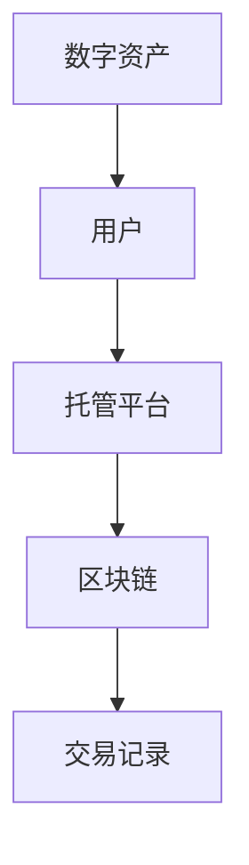
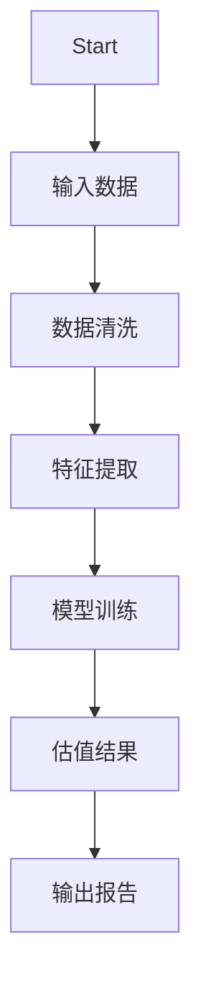
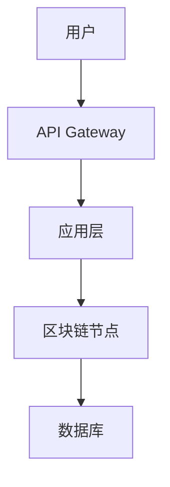
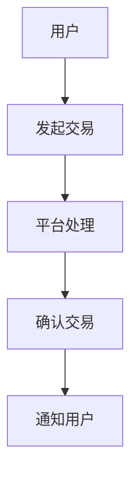

                 


# 企业估值中的区块链数字资产托管平台评估

> **关键词**：企业估值、区块链、数字资产、托管平台、评估方法

> **摘要**：本文深入探讨了企业在估值过程中如何评估区块链数字资产托管平台。通过分析区块链技术的核心属性、数字资产的分类与特征，结合托管平台的功能模块，本文提出了一套基于多因素评估法的估值模型，并通过实际案例展示了如何在企业中应用这些方法。

---

# 第一部分: 区块链数字资产托管平台背景与问题描述

## 第1章: 区块链数字资产托管平台的背景

### 1.1 数字资产托管的概念与定义

数字资产托管是指通过技术手段将数字资产（如比特币、以太坊等）存储在安全的在线平台中，确保资产的安全性和可访问性。托管平台通常提供多种功能，包括资产存储、交易记录、身份验证和风险管理等。

### 1.2 区块链技术在数字资产托管中的作用

区块链技术通过去中心化、不可篡改和透明性等特点，为数字资产托管提供了更高的安全性和信任度。区块链的分布式账本确保了交易记录的不可篡改性，而智能合约则可以自动化执行托管协议，减少人为干预的风险。

### 1.3 企业估值中的数字资产托管需求

在企业估值过程中，数字资产的价值评估变得越来越重要。企业需要通过托管平台准确评估其数字资产的价值，以支持财务报告、投资决策和风险管理。区块链技术的引入，使得数字资产的估值更加透明和可靠。

---

## 第2章: 区块链数字资产托管平台的核心概念与联系

### 2.1 区块链技术的核心属性

区块链技术的核心属性包括：

1. **去中心化**：数据分布在多个节点上，没有单一的控制点。
2. **不可篡改性**：一旦数据被记录在区块链上，就无法被修改。
3. **透明性**：所有交易记录对所有参与者公开，确保透明度。

### 2.2 数字资产的分类与特征

数字资产可以分为以下几类：

1. **加密货币**：如比特币、以太坊，用于支付和价值转移。
2. **代币**：如ERC-20代币，用于特定项目或平台的通证。
3. **NFTs**：非同质化代币，用于表示独特的数字资产，如艺术品、收藏品。

### 2.3 托管平台的功能模块

托管平台通常包括以下功能模块：

1. **资产存储**：安全存储数字资产。
2. **交易记录**：记录所有交易历史。
3. **身份验证**：通过多重身份验证确保用户身份。
4. **风险管理**：识别和防范潜在的安全风险。

### 2.4 ER实体关系图

以下是数字资产托管平台的ER实体关系图：



---

## 第3章: 区块链数字资产托管平台的估值算法原理

### 3.1 估值算法的核心原理

在评估数字资产托管平台时，多因素评估法是一种常用的方法。该方法考虑多个因素，如安全性、交易量、平台透明度等，并根据每个因素的重要性进行加权，最终计算出一个综合的估值。

### 3.2 算法流程图

以下是多因素评估法的流程图：



### 3.3 数学模型与公式

#### 加权平均公式

$$ \text{估值} = \sum_{i=1}^{n} w_i \times x_i $$

其中，$w_i$ 是第 $i$ 个特征的权重，$x_i$ 是第 $i$ 个特征的值。

#### 交易量与价格关系模型

$$ P = a \times V + b $$

其中，$P$ 是价格，$V$ 是交易量，$a$ 和 $b$ 是模型参数。

---

## 第4章: 系统分析与架构设计

### 4.1 问题场景介绍

数字资产托管平台需要处理大量的交易数据，确保数据的安全性和准确性。平台需要支持多种数字资产类型，并提供实时的估值服务。

### 4.2 系统功能设计

以下是系统的功能模块：

1. 用户管理：包括用户注册、身份验证和权限管理。
2. 资产管理：包括资产存储、交易记录和估值计算。
3. 风险管理：包括风险评估、预警和应对措施。

### 4.3 系统架构设计

以下是系统的架构图：



### 4.4 系统接口设计

以下是系统的接口设计：

1. 用户登录接口：用于用户身份验证。
2. 资产查询接口：用于查询用户的数字资产信息。
3. 交易记录接口：用于获取用户的交易历史。

### 4.5 系统交互流程图

以下是系统的交互流程图：



---

## 第5章: 项目实战

### 5.1 环境安装

以下是安装环境的步骤：

1. 安装Python和相关库（如Pandas、Scikit-learn）。
2. 安装区块链开发框架（如Web3.py）。
3. 配置数据库（如PostgreSQL）。

### 5.2 核心代码实现

以下是核心代码：

```python
import pandas as pd
from sklearn.linear_model import LinearRegression

# 加载数据
data = pd.read_csv('transaction.csv')

# 特征提取
features = data[['交易量', '价格']]
labels = data['估值']

# 模型训练
model = LinearRegression()
model.fit(features, labels)

# 预测估值
new_transaction = [[100, 200]]
prediction = model.predict(new_transaction)
print("预测估值:", prediction[0])
```

### 5.3 代码解读与分析

上述代码使用线性回归模型对交易量和价格进行预测。通过训练模型，可以预测未来交易的估值。模型的准确性和稳定性取决于数据的质量和特征的选择。

### 5.4 实际案例分析

以下是一个实际案例的分析：

1. 某公司需要评估其比特币托管平台的价值。
2. 数据包括过去一年的交易量、价格和估值。
3. 使用多因素评估法，计算出平台的综合估值。

### 5.5 项目小结

通过实际案例分析，我们可以看到多因素评估法在数字资产托管平台估值中的应用。模型的准确性和稳定性需要根据实际情况进行调整和优化。

---

## 第6章: 最佳实践

### 6.1 小结

本文深入探讨了区块链数字资产托管平台的评估方法，包括核心概念、算法原理和系统设计。通过实际案例分析，我们展示了如何在企业中应用这些方法。

### 6.2 注意事项

1. 在评估过程中，需要考虑平台的安全性和透明度。
2. 模型的准确性和稳定性需要根据实际情况进行调整。
3. 需要定期更新模型和数据，以应对市场变化。

### 6.3 拓展阅读

1. 加密货币的估值方法研究。
2. 区块链技术在金融领域的应用。
3. 数字资产托管平台的合规性与风险管理。

---

# 作者：AI天才研究院/AI Genius Institute & 禅与计算机程序设计艺术 /Zen And The Art of Computer Programming

