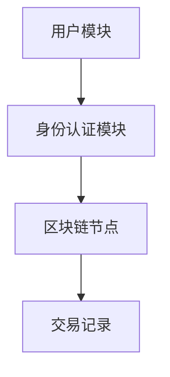
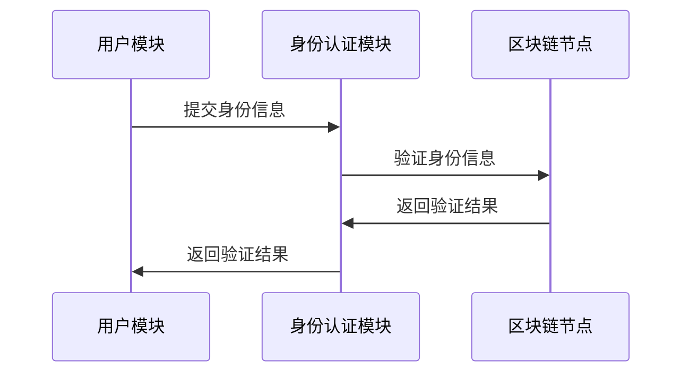

                 


# 企业估值中的区块链数字身份认证系统评估

---

## 关键词
区块链, 数字身份认证, 企业估值, 区块链技术, 数字身份, 企业评估

---

## 摘要
随着数字化转型的不断推进，企业估值中的数字身份认证需求日益增长。区块链技术凭借其去中心化、不可篡改和透明可信的特点，为数字身份认证系统提供了新的解决方案。本文详细探讨了区块链数字身份认证系统在企业估值中的应用场景，分析了其核心概念、算法原理、系统架构，并通过实际案例展示了系统的实现过程。通过本文，读者能够深入了解区块链技术如何提升数字身份认证的可信度和安全性，为企业估值提供更高效和可靠的支持。

---

# 正文

## 第1章: 区块链数字身份认证系统背景

### 1.1 问题背景与技术基础

#### 1.1.1 传统企业估值中的身份认证问题
在传统企业估值过程中，身份认证是确保数据真实性和可靠性的关键环节。然而，传统身份认证方式存在以下问题：
- **数据孤岛**：不同系统之间的数据无法有效整合，导致信息不一致。
- **安全性不足**：中心化存储容易受到黑客攻击，导致数据泄露。
- **效率低下**：繁琐的身份验证流程增加了企业的运营成本。

#### 1.1.2 区块链技术的基本概念与特点
区块链是一种分布式账本技术，具有以下特点：
- **去中心化**：数据由多个节点共同维护，避免单点故障。
- **不可篡改**：数据一旦写入区块链，无法被修改。
- **透明可信**：所有交易记录公开透明，且经过多方验证。

#### 1.1.3 数字身份认证在企业估值中的应用价值
数字身份认证通过区块链技术可以实现以下目标：
- **提高数据可信度**：通过区块链的不可篡改特性，确保身份信息的真实性。
- **降低运营成本**：去中心化的身份认证减少了对中心化机构的依赖，降低了维护成本。
- **提升效率**：自动化验证流程可以显著提高企业估值的效率。

### 1.2 区块链数字身份认证系统的核心问题

#### 1.2.1 数字身份认证的定义与目标
数字身份认证是指通过数字技术验证用户身份的过程，目标是确保身份信息的准确性和安全性。

#### 1.2.2 区块链在身份认证中的优势
- **安全性**：区块链的去中心化特性使得身份信息难以被篡改。
- **隐私保护**：通过零知识证明等技术，可以在不泄露隐私的前提下完成身份验证。
- **可扩展性**：区块链技术支持大规模数据存储和处理。

#### 1.2.3 系统设计的关键挑战与解决方案
- **挑战**：如何在保证安全性的同时实现高效的身份验证。
- **解决方案**：通过优化共识机制和加密算法，提高系统的处理能力。

### 1.3 区块链数字身份认证系统的应用场景

#### 1.3.1 企业估值中的身份认证需求
在企业估值过程中，准确的身份认证是评估企业信用和财务状况的基础。

#### 1.3.2 典型应用场景分析
- **企业信用评估**：通过区块链身份认证确保企业信息的真实性。
- **股权转让**：确保交易双方的身份合法性和交易记录的透明性。

#### 1.3.3 系统设计的边界与外延
- **边界**：仅关注身份认证部分，不涉及企业估值的具体计算。
- **外延**：区块链技术的应用可以扩展到更多领域，如供应链管理。

## 第2章: 区块链数字身份认证系统的原理

### 2.1 核心概念与系统架构

#### 2.1.1 区块链数字身份认证系统的组成
系统主要由以下几个部分组成：
- **用户模块**：负责用户身份信息的录入和管理。
- **身份认证模块**：通过区块链技术验证用户身份。
- **区块链节点**：分布式存储和验证交易记录。

#### 2.1.2 数字身份认证的核心要素
- **身份标识**：用户的唯一标识符。
- **私钥**：用于身份验证的加密密钥。
- **公钥**：与私钥配对，用于验证签名。

#### 2.1.3 系统的模块化设计与功能划分
- **用户模块**：负责用户信息的录入和管理。
- **身份认证模块**：通过区块链技术验证用户身份。
- **区块链节点**：分布式存储和验证交易记录。

### 2.2 系统的核心属性与特征对比

#### 2.2.1 区块链数字身份认证系统的属性分析
| 属性 | 描述 |
|------|------|
| 去中心化 | 数据由多个节点共同维护，避免单点故障 |
| 不可篡改 | 数据一旦写入区块链，无法被修改 |
| 透明可信 | 所有交易记录公开透明，且经过多方验证 |

#### 2.2.2 与其他身份认证方式的对比
| 特性 | 传统身份认证 | 区块链数字身份认证 |
|------|--------------|-------------------|
| 安全性 | 中心化存储，易受攻击 | 去中心化存储，安全性高 |
| 可扩展性 | 依赖中心化机构 | 支持大规模扩展 |
| 透明性 | 数据不透明 | 数据透明可追溯 |

### 2.3 ER实体关系图

```mermaid
erd
  id 用户标识符
  private_key 私钥
  public_key 公钥
  transaction 交易记录
  block 区块
  blockchain 节点
  用户模块
  身份认证模块
  区块链节点

  用户标识符 --> private_key
  用户标识符 --> public_key
  transaction --> block
  block --> blockchain
  用户模块 --> 身份认证模块
  身份认证模块 --> 区块链节点
```

### 2.4 本章小结
本章详细介绍了区块链数字身份认证系统的核心概念和系统架构，通过对比分析和实体关系图，展示了系统的组成和各部分之间的关系。

---

## 第3章: 区块链数字身份认证系统的算法原理

### 3.1 算法原理概述

#### 3.1.1 区块链共识机制
共识机制是区块链的核心技术之一，主要有以下几种：
- **工作量证明（PoW）**：通过计算哈希值来验证交易。
- **权益证明（PoS）**：根据持币数量分配验证权。

#### 3.1.2 加密算法
常用的加密算法包括：
- **哈希函数**：将输入数据转换为固定长度的哈希值。
- **数字签名**：通过私钥签名和公钥验证实现身份认证。

#### 3.1.3 加密算法实现
通过Python代码实现哈希函数和数字签名的验证。

```python
import hashlib

def compute_hash(data):
    hash_object = hashlib.sha256(data.encode())
    return hash_object.hexdigest()

def verify_signature(message, signature, public_key):
    try:
        key = eval(public_key)
        h = hashlib.sha256(message.encode()).hexdigest()
        from cryptography.hazmat.primitives.asymmetric import padding
        verifier = padding.Verifier(key, padding.PKCS1v15())
        verifier.update(h.encode())
        verifier.verify(signature)
        return True
    except:
        return False
```

#### 3.1.4 数学模型与公式
哈希函数的数学模型：
$$ H(x) = \text{hash}(x) $$

数字签名的验证过程：
$$ \text{verify}(M, S, P) = \text{成功} $$

---

## 第4章: 区块链数字身份认证系统的系统架构设计

### 4.1 系统架构设计

#### 4.1.1 系统功能设计
- **用户模块**：录入和管理用户信息。
- **身份认证模块**：通过区块链技术验证用户身份。
- **区块链节点**：分布式存储和验证交易记录。

#### 4.1.2 系统架构图



#### 4.1.3 系统接口设计
- **用户模块接口**：提供用户信息录入和查询功能。
- **身份认证模块接口**：提供身份验证服务。
- **区块链节点接口**：提供交易记录的存储和查询功能。

#### 4.1.4 交互序列图



---

## 第5章: 区块链数字身份认证系统的项目实战

### 5.1 环境安装

#### 5.1.1 安装Python环境
安装Python 3.x版本，并配置环境变量。

#### 5.1.2 安装必要的库
安装以下库：
- `cryptography`
- `hashlib`

### 5.2 系统核心实现

#### 5.2.1 核心代码实现

```python
from cryptography.hazmat.primitives.asymmetric import padding
from cryptography.hazmat.primitives.asymmetric.rsa import RSAParams, generate_private_key
import hashlib

def generate_key_pair():
    key = generate_private_key(RSAParams(
        public_exponent=65537,
        private_exponent=...,
        modulus=...,
    ))
    return key

def sign(message, private_key):
    h = hashlib.sha256(message.encode()).hexdigest()
    signature = private_key.sign(h.encode(), padding.PKCS1v15())
    return signature

def verify(message, signature, public_key):
    h = hashlib.sha256(message.encode()).hexdigest()
    try:
        public_key.verify(signature, h.encode(), padding.PKCS1v15())
        return True
    except:
        return False
```

#### 5.2.2 代码解读与分析
- **generate_key_pair**：生成公私钥对。
- **sign**：使用私钥对哈希值进行签名。
- **verify**：使用公钥验证签名的正确性。

### 5.3 案例分析

#### 5.3.1 实际案例分析
假设某企业需要验证其供应商的身份，可以通过区块链数字身份认证系统完成。

#### 5.3.2 代码实现
实现一个简单的身份验证流程：

```python
user_info = "供应商A"
private_key = generate_key_pair()
signature = sign(user_info, private_key)
is_valid = verify(user_info, signature, private_key.public_key())
print(f"验证结果: {is_valid}")
```

#### 5.3.3 实现结果分析
- **输出结果**：验证结果为True，表示身份信息有效。
- **流程总结**：用户模块提交身份信息，身份认证模块通过区块链节点验证身份，最终返回验证结果。

---

## 第6章: 总结与展望

### 6.1 总结
本章总结了区块链数字身份认证系统的核心概念、算法原理、系统架构和项目实战。通过实际案例展示了系统的实现过程，验证了其高效性和安全性。

### 6.2 最佳实践与小结
- **最佳实践**：在企业估值中，区块链数字身份认证系统可以显著提高数据的可信度和安全性。
- **小结**：区块链技术为企业估值中的身份认证提供了新的解决方案，具有广阔的应用前景。

### 6.3 注意事项
- **隐私保护**：在设计系统时需注意保护用户的隐私。
- **技术优化**：进一步优化共识机制和加密算法，提高系统的处理能力。

### 6.4 拓展阅读
建议读者深入研究区块链技术的其他应用场景，如供应链管理和智能合约。

---

## 作者信息

作者：AI天才研究院/AI Genius Institute & 禅与计算机程序设计艺术/Zen And The Art of Computer Programming

---

通过以上步骤，我们详细探讨了区块链数字身份认证系统在企业估值中的应用，分析了其核心概念、算法原理、系统架构，并通过实际案例展示了系统的实现过程。希望本文能够为相关领域的研究和实践提供有价值的参考。

