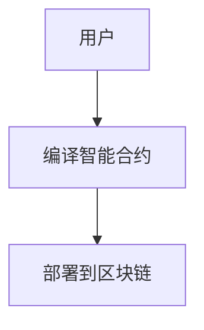
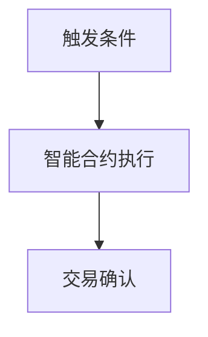
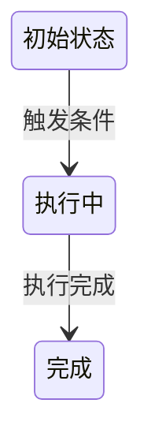
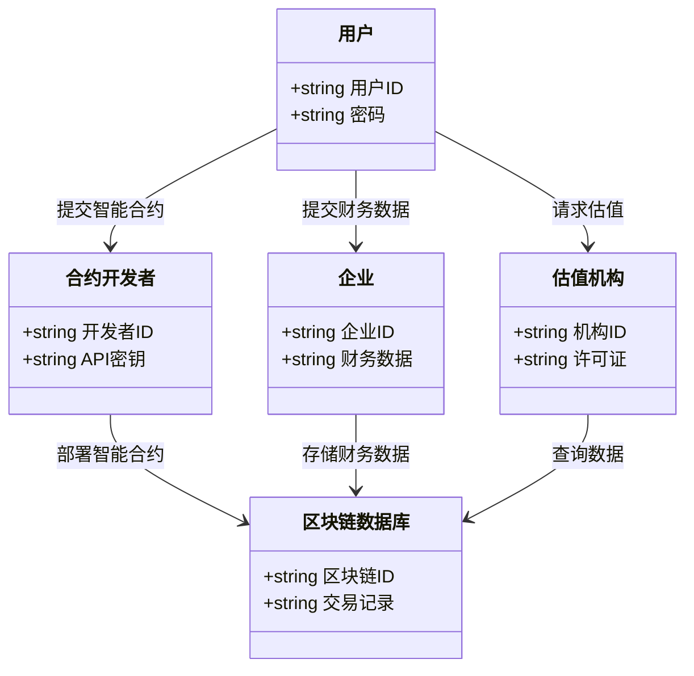
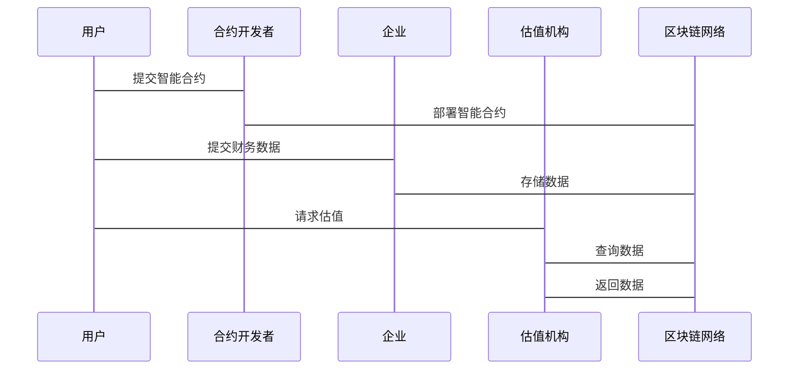

                 


# 企业估值中的区块链智能合约平台评估

> 关键词：企业估值，区块链，智能合约，智能合约平台，去中心化，分布式系统

> 摘要：区块链技术在企业估值中的应用正变得越来越重要，智能合约作为区块链技术的核心组件之一，为企业的价值评估提供了新的可能性。本文将详细探讨区块链智能合约平台在企业估值中的评估方法，从基本概念、技术原理、系统设计到实际应用案例，全面分析智能合约平台在企业估值中的价值与挑战。

---

# 第1章 区块链智能合约平台概述

## 1.1 区块链智能合约的核心概念

### 1.1.1 区块链的基本概念
区块链是一种分布式账本技术，通过去中心化的网络实现数据的安全存储和传输。区块链的特性包括去中心化、不可篡改、透明性和可追溯性，这些特性使其在多个领域得到了广泛应用。

### 1.1.2 智能合约的定义与特点
智能合约是区块链技术中的一个关键概念，它是部署在区块链上的自动执行程序。智能合约的特点包括：
1. **自动化**：智能合约在满足特定条件时会自动执行操作，无需人工干预。
2. **不可篡改**：智能合约的代码一旦部署到区块链上，就不能被修改，确保了合同的可信性。
3. **透明性**：智能合约的执行过程对所有参与者都是透明的，可以在区块链上查看。
4. **去中心化**：智能合约不依赖于任何中央机构，运行在分布式网络上。

### 1.1.3 区块链智能合约的运行机制
智能合约的运行机制包括以下几个步骤：
1. **部署**：将智能合约部署到区块链网络上。
2. **触发**：当满足特定条件时，智能合约被触发。
3. **执行**：智能合约自动执行预设的操作。
4. **确认**：交易被确认并记录在区块链上。

## 1.2 区块链智能合约在企业估值中的应用背景

### 1.2.1 企业估值的传统方法与挑战
传统的企业估值方法主要包括财务指标分析、市场比较法和DCF模型等。这些方法虽然成熟，但也存在以下挑战：
1. **数据不透明**：企业财务数据可能存在造假或不透明的问题。
2. **人为干预**：估值过程需要大量的人工判断，可能导致主观偏差。
3. **效率低下**：传统估值方法需要大量的人力和时间，效率较低。

### 1.2.2 区块链技术如何赋能企业估值
区块链技术的特性（去中心化、不可篡改、透明性）为企业估值提供了新的思路。区块链可以用于存储企业的财务数据、交易记录等，确保数据的真实性和透明性，从而提高估值的准确性。

### 1.2.3 智能合约在企业估值中的潜在价值
智能合约可以用于自动执行与企业估值相关的操作，例如：
1. **自动计算企业价值**：通过智能合约自动计算企业的财务指标和市场价值。
2. **自动触发估值事件**：当企业的某些指标达到特定阈值时，智能合约可以自动触发估值事件。
3. **自动化报告生成**：智能合约可以自动生成估值报告，并将其发布到区块链上。

## 1.3 区块链智能合约平台的现状与发展趋势

### 1.3.1 当前市场中的区块链智能合约平台
目前市场上有许多区块链智能合约平台，如以太坊、波场、Solana等。这些平台提供了不同的智能合约开发和部署环境，满足了不同场景的需求。

### 1.3.2 区块链智能合约平台的发展趋势
随着区块链技术的不断发展，智能合约平台也在不断进化。未来的发展趋势包括：
1. **性能优化**：提高智能合约的执行效率，降低交易成本。
2. **功能扩展**：增加智能合约的功能，例如支持更复杂的逻辑和跨链交互。
3. **安全性提升**：增强智能合约的安全性，防止漏洞利用。

### 1.3.3 技术与市场需求的结合
区块链智能合约平台的发展离不开技术与市场需求的结合。企业对高效、透明、安全的估值工具的需求，推动了智能合约平台在企业估值中的应用。

## 1.4 本章小结
本章介绍了区块链智能合约的核心概念及其在企业估值中的应用背景。通过对比传统估值方法与区块链技术的优势，我们看到了智能合约在企业估值中的巨大潜力。接下来的章节将深入探讨智能合约的原理、算法、系统设计以及实际应用案例。

---

# 第2章 区块链智能合约平台的核心概念与联系

## 2.1 区块链智能合约的原理

### 2.1.1 智能合约的工作流程
智能合约的工作流程包括以下几个步骤：
1. **部署**：将智能合约部署到区块链网络上。
2. **触发**：当满足特定条件时，智能合约被触发。
3. **执行**：智能合约自动执行预设的操作。
4. **确认**：交易被确认并记录在区块链上。

### 2.1.2 区块链的去中心化特性与智能合约的关系
区块链的去中心化特性为智能合约提供了信任的基础。智能合约的执行不依赖于任何中央机构，而是通过分布式网络实现自动执行。

### 2.1.3 智能合约的安全性与可靠性
智能合约的安全性是区块链技术的核心问题之一。通过密码学技术，智能合约可以确保代码的安全性和数据的不可篡改性。

## 2.2 智能合约与传统合同的对比

### 2.2.1 合同形式的对比
传统合同是纸质或电子文档，而智能合约是部署在区块链上的代码。

### 2.2.2 执行方式的对比
传统合同需要人工执行，而智能合约可以自动执行。

### 2.2.3 信任机制的对比
传统合同依赖于法律和信任机构，而智能合约依赖于区块链的去中心化和不可篡改性。

## 2.3 区块链智能合约的实体关系图

### 2.3.1 ER实体关系图
以下是区块链智能合约平台的ER实体关系图：

```mermaid
erDiagram
    actor 用户 {
        +string 用户ID
        +string 密码
    }
    actor 合约开发者 {
        +string 开发者ID
        +string API密钥
    }
    actor 企业 {
        +string 企业ID
        +string 财务数据
    }
    actor 估值机构 {
        +string 机构ID
        +string 许可证
    }
    database 区块链数据库 {
        +string 区块链ID
        +string 交易记录
    }
    用户 --> 合约开发者 : 提交智能合约
    用户 --> 企业 : 提交财务数据
    用户 --> 估值机构 : 请求估值
    合约开发者 --> 区块链数据库 : 部署智能合约
    企业 --> 区块链数据库 : 存储财务数据
    估值机构 --> 区块链数据库 : 查询数据
```

### 2.3.2 实体之间的关系
- 用户可以提交智能合约或财务数据。
- 合约开发者负责部署智能合约。
- 企业存储财务数据。
- 估值机构根据区块链上的数据进行估值。

### 2.3.3 数据流的展示
- 用户提交智能合约 → 合约开发者部署智能合约 → 区块链数据库存储合约。
- 用户提交财务数据 → 区块链数据库存储数据。
- 估值机构查询区块链数据库 → 得到企业估值结果。

## 2.4 本章小结
本章详细讲解了区块链智能合约的原理及其与传统合同的对比，并通过ER实体关系图展示了智能合约平台的实体关系和数据流。接下来的章节将探讨智能合约的算法原理和系统设计。

---

# 第3章 区块链智能合约平台的算法原理

## 3.1 智能合约的执行流程

### 3.1.1 合约的编译与部署
智能合约需要先编译成字节码，然后部署到区块链网络上。以下是部署流程：



### 3.1.2 合约的触发与执行
智能合约的触发通常由区块链上的事件触发，例如交易完成或时间到达。以下是执行流程：



### 3.1.3 合约的验证与确认
智能合约的执行结果需要经过区块链网络的验证，确认无误后交易才会被记录到区块链上。

## 3.2 区块链智能合约的共识算法

### 3.2.1 共识算法的定义与分类
共识算法是区块链的核心技术之一，常见的共识算法包括：
- **工作量证明（PoW）**：以比特币为代表的共识算法。
- **权益证明（PoS）**：以太坊2.0采用的共识算法。
- **拜占庭容错（BFT）**：适用于小规模网络的共识算法。

### 3.2.2 常见共识算法的优缺点
- **PoW**：安全性高，但效率低。
- **PoS**：效率高，但安全性依赖于质押的权益。
- **BFT**：效率高，但适用性有限。

### 3.2.3 共识算法对智能合约的影响
共识算法的选择直接影响智能合约的执行效率和成本。例如，PoW的效率低，可能导致智能合约的执行成本较高。

## 3.3 智能合约的数学模型与公式

### 3.3.1 合约执行的数学模型
智能合约的执行过程可以用状态机模型来表示。以下是状态机模型的示例：



### 3.3.2 合约状态的表示方法
智能合约的状态可以用布尔变量来表示，例如：
- `isTriggered`：表示合约是否被触发。
- `isExecuted`：表示合约是否被执行。

### 3.3.3 合约执行的数学公式
智能合约的执行可以用以下公式表示：
$$
\text{结果} = f(\text{输入})
$$
其中，$f$ 是智能合约的执行函数，$\text{输入}$ 是触发合约的条件。

## 3.4 本章小结
本章详细讲解了智能合约的执行流程和共识算法，并通过数学模型和公式展示了智能合约的执行过程。接下来的章节将探讨智能合约平台的系统设计。

---

# 第4章 区块链智能合约平台的系统分析与架构设计

## 4.1 系统需求分析

### 4.1.1 企业估值的核心需求
- **数据存储**：需要存储企业的财务数据和交易记录。
- **智能合约执行**：需要支持智能合约的部署和执行。
- **估值计算**：需要根据区块链上的数据自动计算企业估值。

### 4.1.2 智能合约平台的功能需求
- **智能合约管理**：支持智能合约的部署、触发和执行。
- **数据存储与查询**：支持区块链上的数据存储和查询。
- **估值报告生成**：根据智能合约的执行结果生成估值报告。

### 4.1.3 系统性能需求
- **交易处理能力**：每秒处理的交易数量。
- **响应时间**：智能合约执行的响应时间。
- **存储容量**：区块链数据库的存储能力。

## 4.2 系统功能设计

### 4.2.1 领域模型
以下是智能合约平台的领域模型：



### 4.2.2 系统架构设计

以下是智能合约平台的系统架构图：


### 4.2.3 系统接口设计
智能合约平台需要以下接口：
- **智能合约部署接口**：用于部署智能合约。
- **数据提交接口**：用于提交企业的财务数据。
- **估值查询接口**：用于查询企业的估值结果。

### 4.2.4 系统交互设计

以下是智能合约平台的交互流程图：



## 4.3 本章小结
本章详细分析了智能合约平台的系统需求、功能设计和架构设计，并通过mermaid图展示了系统的结构和交互流程。接下来的章节将探讨智能合约平台的项目实战。

---

# 第5章 区块链智能合约平台的项目实战

## 5.1 环境安装与配置

### 5.1.1 安装区块链平台
以以太坊为例，安装步骤如下：
1. 安装以太坊客户端（如Geth）。
2. 启动以太坊节点。

### 5.1.2 安装智能合约开发工具
安装Solidity编译器和以太坊钱包（如MetaMask）。

### 5.1.3 配置开发环境
安装Node.js和相关开发库。

## 5.2 系统核心实现源代码

### 5.2.1 智能合约代码
以下是一个简单的智能合约代码（Solidity语言）：

```solidity
// SPDX-License-Identifier: MIT
pragma solidity ^0.8.0;

contract EnterpriseValuation {
    mapping(address => uint256) public valuation;

    function setValue(address _address, uint256 _value) public {
        valuation[_address] = _value;
    }

    function getValue(address _address) public view returns (uint256) {
        return valuation[_address];
    }
}
```

### 5.2.2 合约部署与测试
使用以太坊钱包部署智能合约，并进行功能测试。

## 5.3 代码应用解读与分析

### 5.3.1 合约功能分析
上述智能合约实现了企业估值的功能，包括设置估值和获取估值。

### 5.3.2 合约部署与调用
以下是合约部署和调用的步骤：
1. 编写智能合约代码。
2. 使用以太坊钱包部署合约。
3. 调用合约的设置和获取函数。

## 5.4 实际案例分析与详细讲解

### 5.4.1 案例背景
某企业希望通过智能合约实现自动估值。

### 5.4.2 案例实现
1. 部署智能合约到以太坊网络。
2. 提交企业的财务数据到区块链。
3. 调用智能合约进行估值。

### 5.4.3 案例分析
通过智能合约自动计算企业估值，提高了估值的效率和准确性。

## 5.5 本章小结
本章通过实际案例展示了智能合约平台的部署和应用，详细讲解了合约的实现和部署过程。通过实际操作，读者可以更好地理解智能合约在企业估值中的应用。

---

# 第6章 区块链智能合约平台的系统优化与扩展

## 6.1 系统优化方案

### 6.1.1 性能优化
通过优化共识算法和减少智能合约的复杂性来提高系统的性能。

### 6.1.2 安全性提升
通过引入更强大的加密算法和访问控制机制来增强系统的安全性。

### 6.1.3 功能扩展
增加智能合约的功能，例如支持多链交互和智能合约的升级。

## 6.2 系统扩展方案

### 6.2.1 支持多链交互
通过跨链技术实现不同区块链平台之间的智能合约交互。

### 6.2.2 支持智能合约升级
通过引入权限控制机制，允许合法的智能合约升级。

### 6.2.3 支持更复杂的逻辑
通过改进智能合约的编程语言和运行环境，支持更复杂的业务逻辑。

## 6.3 本章小结
本章提出了智能合约平台的优化和扩展方案，旨在提高系统的性能和安全性，同时支持更复杂的业务逻辑。

---

# 第7章 总结与展望

## 7.1 总结
本文详细探讨了区块链智能合约平台在企业估值中的评估方法，从基本概念、技术原理、系统设计到实际应用案例，全面分析了智能合约平台的潜力和价值。

## 7.2 最佳实践 tips
1. 在部署智能合约前，确保合约代码的安全性。
2. 合理选择共识算法，以提高系统的性能和安全性。
3. 定期更新和维护智能合约，以应对新的安全威胁。

## 7.3 小结
通过本文的分析，我们看到了智能合约平台在企业估值中的巨大潜力。未来，随着区块链技术的不断发展，智能合约平台将为企业估值提供更多的可能性。

## 7.4 注意事项
- 智能合约的部署和执行需要遵循相关法律法规。
- 智能合约的安全性是区块链技术的核心问题，需要特别注意。

## 7.5 拓展阅读
1. 《区块链技术与智能合约》
2. 《企业估值方法与应用》
3. 《分布式系统设计与实现》

---

# 作者：AI天才研究院/AI Genius Institute & 禅与计算机程序设计艺术 /Zen And The Art of Computer Programming

