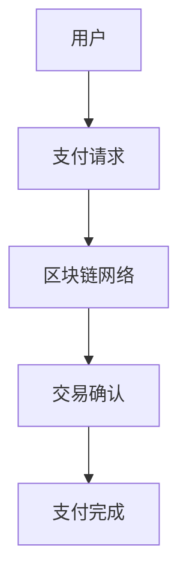
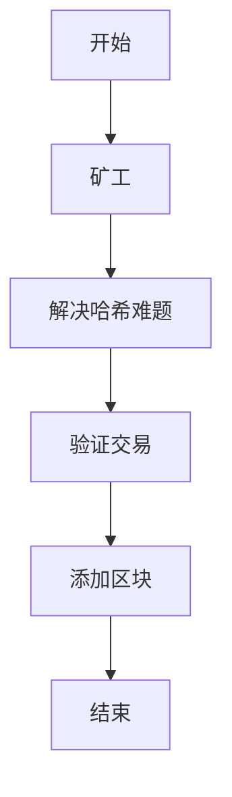
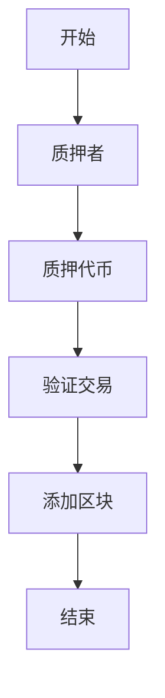
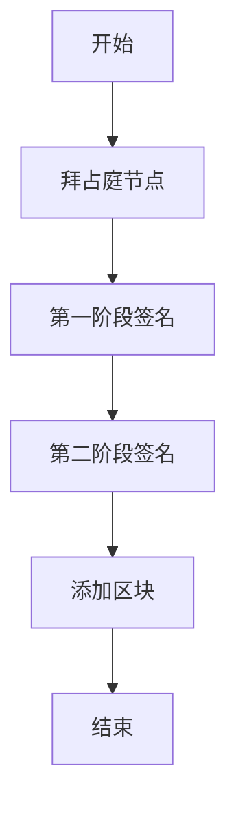

                 


# 企业估值中的区块链跨境支付系统评估

> 关键词：区块链、跨境支付、企业估值、智能合约、分布式账本

> 摘要：随着全球化的深入，跨境支付在企业估值中的重要性日益凸显。区块链技术以其去中心化、透明性和高效性，为跨境支付系统带来了革命性的变化。本文详细探讨区块链跨境支付系统的评估方法，分析其对企业估值的影响，为企业在跨境支付领域的决策提供技术支持。

---

## 第一部分：背景介绍

### 第1章：区块链与跨境支付概述

#### 1.1 区块链的基本概念

- **1.1.1 区块链的定义与核心原理**
  区块链是一种分布式账本技术，通过去中心化的方式记录交易信息，确保数据的安全性和不可篡改性。其核心原理包括分布式存储、共识机制和智能合约。

- **1.1.2 区块链的类型**
  区块链主要分为公链、私链和联盟链三种类型。公链如比特币和以太坊，完全去中心化；私链用于企业内部，权限可控；联盟链则由特定机构共同维护。

- **1.1.3 区块链的特性**
  区块链具有去中心化、不可篡改、透明性和高效性等特性，这些特性使其在跨境支付中具有重要应用价值。

#### 1.2 跨境支付的现状与挑战

- **1.2.1 跨境支付的传统模式**
  当前跨境支付主要依赖SWIFT系统，存在流程复杂、成本高昂、效率低下等问题。

- **1.2.2 跨境支付的主要挑战**
  跨境支付面临高成本、低效率、透明度不足等挑战，传统系统难以满足现代企业的高效需求。

- **1.2.3 区块链技术如何解决这些问题**
  区块链技术通过去中心化和自动化流程，降低了跨境支付的成本，提高了效率和透明度。

#### 1.3 区块链在企业估值中的作用

- **1.3.1 区块链技术对企业估值的影响**
  区块链技术提高了企业的透明度和可信度，增强了投资者对企业价值的信心。

- **1.3.2 跨境支付效率提升对企业估值的贡献**
  高效的跨境支付系统降低了企业的运营成本，提升了资金周转效率，从而提高企业估值。

- **1.3.3 区块链技术如何增强企业透明度和信任度**
  区块链技术确保数据的不可篡改性，增强了企业与投资者之间的信任，提升了企业估值。

---

## 第二部分：核心概念与联系

### 第2章：区块链跨境支付系统的核心要素

#### 2.1 区块链的核心组件

- **2.1.1 分布式账本**
  分布式账本是区块链的基础，记录所有交易信息，确保数据的完整性和一致性。

- **2.1.2 共识机制**
  共识机制如PoW和PoS，确保所有节点达成一致，保证区块链的安全性和稳定性。

- **2.1.3 智能合约**
  智能合约是区块链中的自动执行程序，能够自动执行预设的交易规则，确保交易的透明和高效。

#### 2.2 跨境支付系统的特点

- **2.2.1 支付流程**
  跨境支付流程包括用户发起请求、区块链网络确认、交易清算与结算。

- **2.2.2 支付参与方**
  包括用户、支付机构、银行和监管机构，各方协同完成支付过程。

- **2.2.3 支付工具**
  包括加密货币、稳定币和法币，不同工具适用于不同的支付场景。

#### 2.3 核心概念对比分析

- **2.3.1 区块链与传统支付系统的对比表格**

| 特性         | 传统支付系统 | 区块链支付系统 |
|--------------|--------------|----------------|
| 中心化程度   | 高           | 低             |
| 交易速度     | 较慢         | 较快           |
| 成本         | 较高         | 较低           |
| 透明度       | 较低         | 高             |

- **2.3.2 跨境支付系统中的ER实体关系图**



---

## 第三部分：算法原理

### 第3章：区块链跨境支付系统的算法实现

#### 3.1 共识机制的算法原理

- **3.1.1 工作量证明（PoW）**
  PoW通过解决哈希难题来验证交易，确保网络安全。其流程如下：



- **3.1.2 权益证明（PoS）**
  PoS通过持有代币的数量来决定记账权，流程如下：



- **3.1.3 拜占庭共识算法**
  拜占庭共识算法通过多阶段签名确保交易的安全性，流程如下：



#### 3.2 智能合约的算法原理

- **3.2.1 智能合约的执行流程**
  智能合约在区块链网络上自动执行，确保交易的透明和高效。

- **3.2.2 智能合约的实现代码**

```python
# 智能合约示例：简单支付合约
def pay(sender, receiver, amount):
    if sender.balance >= amount:
        sender.balance -= amount
        receiver.balance += amount
        return True
    else:
        return False
```

- **3.2.3 智能合约的数学模型**
  智能合约的执行依赖于区块链的数学模型，如哈希函数和加密算法。

---

## 第四部分：系统分析与架构设计

### 第4章：区块链跨境支付系统的架构

#### 4.1 系统功能设计

- **4.1.1 领域模型设计**
  ```mermaid
  classDiagram
      class 用户 {
          帐户地址
          余额
          }
      class 支付请求 {
          发起者
          接收者
          金额
          }
      class 区块链网络 {
          区块
          节点
          }
      用户 --> 支付请求
      支付请求 --> 区块链网络
  ```

- **4.1.2 系统功能模块**
  包括用户模块、支付请求模块、区块链网络模块和交易确认模块。

#### 4.2 系统架构设计

- **4.2.1 分层架构**
  区块链系统采用分层架构，包括数据层、业务逻辑层和应用层。

- **4.2.2 系统架构图**
  ```mermaid
  graph TD
      User[用户] --> PaymentRequest[支付请求]
      PaymentRequest --> BlockchainNetwork[区块链网络]
      BlockchainNetwork --> TransactionConfirmation[交易确认]
      TransactionConfirmation --> PaymentCompletion[支付完成]
  ```

- **4.2.3 接口设计**
  包括用户发起支付请求的API和区块链网络确认交易的API。

#### 4.3 系统交互设计

- **4.3.1 交互流程**
  用户发起支付请求，区块链网络确认交易，完成支付。

- **4.3.2 交互序列图**
  ```mermaid
  sequenceDiagram
      用户 -> 支付请求: 发起支付
      支付请求 -> 区块链网络: 提交交易
      区块链网络 -> 矿工: 确认交易
      矿工 -> 区块链网络: 确认完成
      区块链网络 -> 用户: 支付完成
  ```

---

## 第五部分：项目实战

### 第5章：区块链跨境支付系统的实现

#### 5.1 环境安装

- 安装以太坊钱包和Solidity编译器，配置区块链开发环境。

#### 5.2 核心代码实现

- **智能合约实现**
  ```solidity
  // 智能合约示例：简单支付合约
  contract SimplePayment {
      function pay(address sender, address receiver, uint amount) public {
          require(sender.balance >= amount, "余额不足");
          sender.transfer(amount);
          receiver.receivePayment();
      }
  }
  ```

- **合约部署与测试**
  使用以太坊钱包部署合约，并进行支付测试。

#### 5.3 实际案例分析

- 以某跨国企业为例，展示如何通过区块链跨境支付系统优化企业估值。

---

## 第六部分：总结与展望

### 第6章：最佳实践与小结

- **6.1 最佳实践**
  在实施区块链跨境支付系统时，建议选择合适的区块链平台，确保系统的安全性和高效性。

- **6.2 小结**
  区块链技术为跨境支付带来了革命性的变化，提高了企业估值和竞争力。

### 第7章：注意事项与拓展阅读

- **7.1 注意事项**
  在实际应用中，需注意数据安全、法律合规和系统兼容性等问题。

- **7.2 拓展阅读**
  建议阅读相关书籍和技术文档，深入了解区块链技术的最新发展和应用。

---

## 作者：AI天才研究院/AI Genius Institute & 禅与计算机程序设计艺术 /Zen And The Art of Computer Programming

---

以上是《企业估值中的区块链跨境支付系统评估》的完整目录和内容概述，详细探讨了区块链技术在跨境支付中的应用及其对企业估值的影响。

