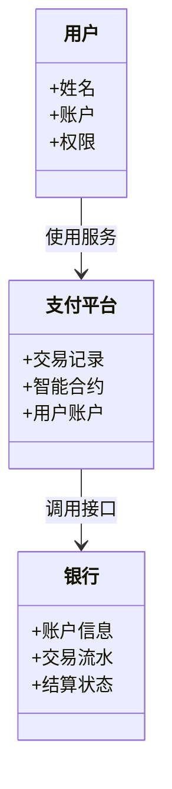
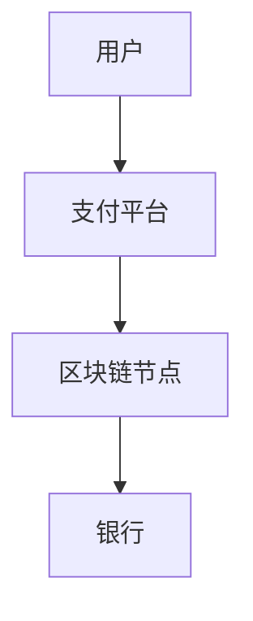

                 


# 《企业估值中的区块链跨境支付结算平台评估》

## 关键词：区块链，跨境支付，企业估值，支付平台，智能合约

## 摘要：本文探讨了区块链技术在跨境支付结算平台评估中的应用，分析了平台的核心原理、评估模型和系统架构，为企业估值提供了新的视角和方法。

---

## 第一部分: 企业估值中的区块链跨境支付结算平台评估基础

### 第1章: 背景介绍与核心概念

#### 1.1 问题背景

- **跨境支付结算的现状与挑战**  
  跨境支付结算的传统模式存在效率低、成本高、透明度低等问题。区块链技术通过去中心化和智能合约，能够有效解决这些问题。

- **区块链技术在跨境支付中的作用**  
  区块链提供了一种安全、透明且高效的支付方式，能够减少中间环节，降低交易成本。

- **企业估值中的支付平台评估需求**  
  在企业估值中，评估支付平台的性能和安全性是关键，区块链技术为企业提供了新的评估维度。

#### 1.2 核心概念与问题描述

- **区块链跨境支付结算平台的定义**  
  一种基于区块链技术的支付平台，用于实现跨境支付的高效结算。

- **企业估值的核心要素**  
  包括平台的交易量、用户数量、技术性能等关键指标。

- **平台评估的边界与外延**  
  评估范围包括技术、业务和综合能力，外延涉及支付流程优化和安全性保障。

#### 1.3 核心概念与联系

- **区块链技术与跨境支付的结合**  
  区块链的去中心化和不可篡改特性，确保了支付过程的安全性和透明性。

- **实体关系图（ER图）架构**  
  通过ER图展示用户、支付平台和银行之间的关系，确保数据的准确性和一致性。

### 第2章: 区块链跨境支付结算平台的核心原理

#### 2.1 区块链技术原理

- **区块链的基本概念**  
  区块链是一种分布式账本技术，通过共识机制确保数据的安全性。

- **区块链的核心特性**  
  包括去中心化、不可篡改和可追溯性。

- **区块链的共识机制**  
  包括工作量证明（PoW）、权益证明（PoS）等，确保网络的安全性和稳定性。

#### 2.2 跨境支付结算的区块链实现

- **跨境支付的流程优化**  
  区块链技术能够简化支付流程，减少中间银行的参与，降低交易成本。

- **区块链在支付中的应用**  
  通过智能合约实现自动化的支付和结算，确保交易的高效性和可靠性。

- **智能合约的使用**  
  智能合约能够自动执行预设的支付规则，确保支付过程的透明和安全。

#### 2.3 平台评估的关键指标

- **技术指标**  
  包括区块链的性能、网络延迟和交易吞吐量等。

- **业务指标**  
  包括交易量、用户数量和合作伙伴数量等。

- **综合评估模型**  
  综合考虑技术、业务和市场因素，构建一个全面的评估模型。

### 第3章: 平台评估的数学模型与算法

#### 3.1 评估模型的构建

- **模型的输入变量**  
  包括交易量、用户数量、技术性能等。

- **模型的输出结果**  
  生成一个综合评分，反映平台的整体性能。

- **模型的数学表达式**  
  $$评估分数 = \sum_{i=1}^{n} w_i \cdot x_i$$  
  其中，\( w_i \) 是第i个指标的权重，\( x_i \) 是第i个指标的得分。

#### 3.2 算法原理

- **加权评分法**  
  根据各个指标的重要性，赋予不同的权重，计算综合评分。

- **层次分析法（AHP）**  
  将问题分解为多个层次，通过比较各个因素的重要性，构建判断矩阵。

- **模糊综合评价法**  
  将各个指标的得分进行模糊处理，综合得到一个整体评估结果。

#### 3.3 算法实现

- **加权评分法的实现**  
  需要确定各个指标的权重，然后根据实际数据计算综合评分。

- **层次分析法的步骤**  
  包括构建判断矩阵、计算特征向量、一致性检验等步骤。

- **模糊综合评价法的应用**  
  将各个指标的得分进行模糊积分，得到最终的评估结果。

### 第4章: 系统分析与架构设计

#### 4.1 问题场景介绍

- **背景介绍**  
  在跨境支付中，传统模式存在效率低、成本高的问题，区块链技术提供了新的解决方案。

- **问题分析**  
  现有支付平台在安全性、透明性和效率方面存在不足，需要通过区块链技术进行优化。

- **目标设定**  
  构建一个基于区块链的跨境支付平台，实现高效、安全的支付和结算。

#### 4.2 系统功能设计

- **功能模块划分**  
  包括用户模块、支付模块、银行模块和管理模块。

- **领域模型设计**  
  通过ER图展示用户、支付交易和银行之间的关系。



- **系统架构设计**  
  采用分层架构，包括前端、后端和数据库。



- **系统交互流程**  
  用户发起支付请求，支付平台通过智能合约进行交易验证，银行完成结算。

```mermaid
sequenceD
用户 -> 支付平台: 发起支付请求
支付平台 -> 区块链节点: 验证交易
区块链节点 -> 支付平台: 确认交易
支付平台 -> 银行: 调用结算接口
银行 -> 支付平台: 确认结算
支付平台 -> 用户: 通知支付结果
```

## 第五章: 项目实战与最佳实践

### 5.1 项目实战

- **环境安装**  
  安装区块链开发环境，配置智能合约编译工具。

- **系统核心实现源代码**  
  编写智能合约代码，实现支付交易的验证和结算。

- **代码应用解读与分析**  
  详细解读智能合约的实现逻辑，分析其在支付过程中的作用。

- **实际案例分析**  
  通过具体案例，展示平台的评估过程和结果。

### 5.2 最佳实践

- **注意事项**  
  确保智能合约的安全性，防止漏洞攻击。

- **小结**  
  区块链技术在跨境支付中的应用前景广阔，企业应积极采用相关技术进行优化。

---

## 作者：AI天才研究院/AI Genius Institute & 禅与计算机程序设计艺术 /Zen And The Art of Computer Programming

---

通过以上详细的内容，我们构建了一个完整的基于区块链的跨境支付结算平台评估框架，为企业估值提供了新的视角和方法。希望这篇文章能为企业和技术人员提供有价值的参考和指导。

