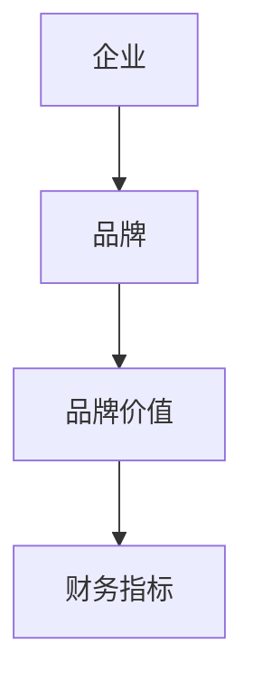

                 


# 企业估值中的品牌价值评估方法

## 关键词：品牌价值、企业估值、评估方法、品牌资产、品牌强度、品牌忠诚度、市场潜力

## 摘要：
品牌价值是企业整体价值的重要组成部分，尤其在并购和投资中具有决定性作用。本文系统地介绍了品牌价值评估的核心概念、主要方法及其在企业估值中的应用。通过详细分析品牌资产模型、品牌强度指标等方法，并结合实际案例，展示了如何将品牌价值评估融入企业估值系统。文章还探讨了数字化转型对品牌价值的影响，为未来的研究提供了方向。

---

## 第1章：品牌价值与企业估值的背景介绍

### 1.1 品牌价值的基本概念
品牌价值是企业在市场中通过品牌名称、标识、声誉等形成的资产价值。它是企业长期经营的结果，反映了消费者对品牌的认知和信任。

#### 1.1.1 品牌的定义与核心要素
- **品牌**：通过产品或服务在市场中建立的声誉和形象。
- 核心要素：品牌名称、标识、核心价值观、品牌定位、品牌故事。

#### 1.1.2 品牌价值的内涵与外延
- 内涵：品牌带来的市场影响力和消费者忠诚度。
- 外延：品牌在市场中的表现，包括市场份额、品牌知名度和美誉度。

#### 1.1.3 品牌价值与企业估值的关系
品牌价值直接影响企业的市场价值和财务表现，尤其是在并购和投资中。

### 1.2 企业估值中的品牌价值的重要性
- 品牌价值是企业核心竞争力的体现，影响企业的市场地位和盈利能力。
- 在并购中，品牌价值是决定企业收购价格的关键因素之一。

### 1.3 品牌价值评估的背景与现状
- 全球化和数字化转型使得品牌价值在企业估值中的作用日益显著。
- 当前主要的评估方法包括品牌资产模型、品牌强度指标等，但仍面临数据获取和模型优化的挑战。

---

## 第2章：品牌价值评估的核心概念与联系

### 2.1 品牌价值评估的核心原理
- 品牌资产是企业的无形资产，包括品牌忠诚度、品牌知名度等。
- 品牌强度是品牌在市场中的竞争力，与品牌忠诚度和知名度密切相关。

#### 2.1.1 品牌资产的构成与衡量
- **品牌忠诚度**：消费者对品牌的偏好程度。
- **品牌知名度**：品牌在市场中的认知度。

#### 2.1.2 品牌强度与市场表现的关系
- 品牌强度高的企业更容易获得市场份额和利润。

### 2.2 品牌价值与企业财务指标的关联
- 品牌价值通过影响销售收入、利润率等财务指标，间接影响企业的市场价值。

#### 2.2.1 品牌价值与销售收入的关系
- 高品牌价值的企业通常能够以更高价格销售产品，从而增加销售收入。

#### 2.2.2 品牌价值与利润率的关联
- 强大的品牌可以降低营销成本，提高利润率。

### 2.3 品牌价值评估的ER实体关系图
```mermaid
er
actor: 企业
actor -[拥有]-> brand: 品牌
brand -[具有]-> value: 价值
value -[影响]-> financialMetrics: 财务指标
```

---

## 第3章：品牌价值评估的主要方法

### 3.1 品牌资产模型法
- **定义**：通过量化品牌资产来评估品牌价值。
- **核心公式**：
  $$ \text{品牌价值} = \text{品牌强度} \times \text{市场潜力} $$

#### 3.1.2 品牌资产模型的特点
- 综合考虑品牌忠诚度和市场潜力。

### 3.2 品牌强度指标法
- **定义**：通过品牌强度指标来评估品牌价值。
- **核心公式**：
  $$ \text{品牌强度} = \frac{\text{品牌忠诚度} + \text{品牌知名度}}{2} $$

### 3.3 品牌价值贡献度分析
- **定义**：品牌价值占企业总价值的比例。
- **核心公式**：
  $$ \text{品牌价值贡献度} = \frac{\text{品牌价值}}{\text{企业总价值}} \times 100\% $$

### 3.4 品牌强度与经济贡献的综合评估
- **综合评估模型**：结合品牌强度和经济贡献，构建综合评估模型。
- **应用实例**：通过实际案例分析，展示模型的应用过程。

---

## 第4章：品牌价值评估的系统分析与架构设计

### 4.1 系统架构设计
- **系统功能**：数据采集、品牌评估、结果分析。
- **系统架构图**：


### 4.2 系统接口设计
- **数据接口**：品牌数据的输入和输出接口。
- **API设计**：提供品牌价值评估的API接口。

---

## 第5章：项目实战

### 5.1 案例分析：某品牌价值评估
- **环境安装**：安装必要的工具和数据集。
- **数据处理**：收集品牌忠诚度和知名度数据。
- **模型实现**：使用品牌资产模型进行评估。
- **结果分析**：解读评估结果并提出优化建议。

### 5.2 代码实现
```python
def calculate_brand_value(loyalty,知名度):
    intensity = (loyalty + 名誉度) / 2
    market_potential = ...  # 根据实际情况计算
    brand_value = intensity * market_potential
    return brand_value

# 示例数据
loyalty = 0.8
知名度 = 0.7
print(calculate_brand_value(loyalty, 名誉度))
```

---

## 第6章：总结与展望

### 6.1 总结
品牌价值是企业估值的重要组成部分，本文系统介绍了品牌价值评估的核心概念和主要方法，并通过实际案例展示了评估过程。

### 6.2 展望
随着数字化转型的推进，品牌价值评估将更加依赖人工智能和大数据分析，未来的研究将更加注重模型的优化和数据的准确性。

---

## 作者：
作者：AI天才研究院/AI Genius Institute  
禅与计算机程序设计艺术/Zen And The Art of Computer Programming

