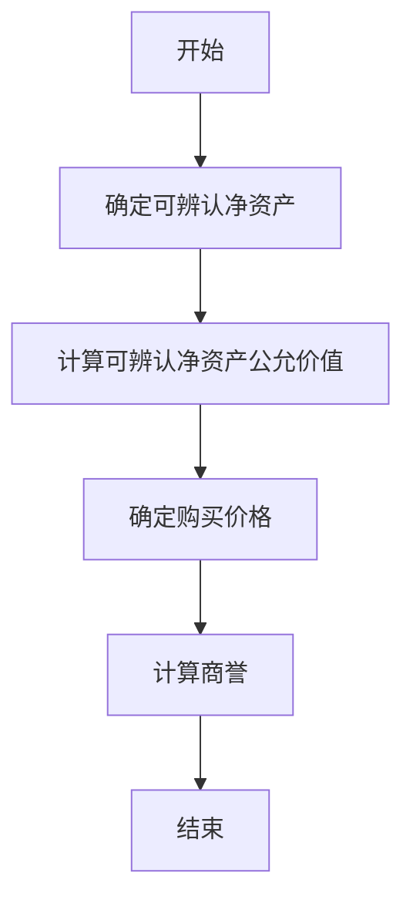
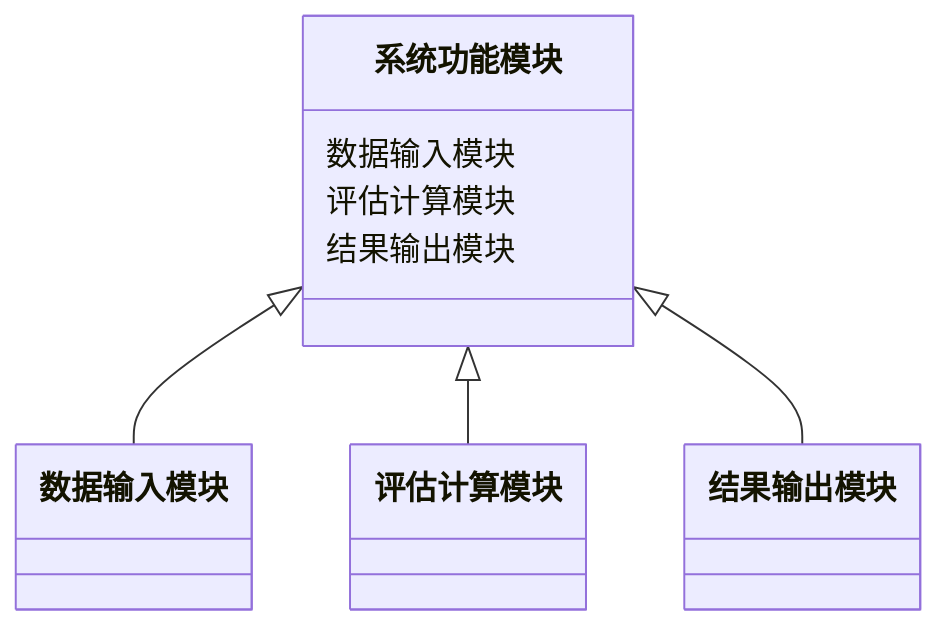

                 


# 企业估值中的商誉处理方法

> 关键词：商誉，企业估值，无形资产，会计准则，并购重组，ERP系统，企业价值

> 摘要：商誉是企业在并购过程中产生的一个重要概念，其处理方法直接影响企业的财务健康和价值评估。本文从商誉的基本概念出发，详细探讨了商誉的属性、评估方法、数学模型、系统设计及实际案例，为企业在估值中处理商誉提供了全面的指导。

---

## 第1章: 商誉的基本概念与背景

### 1.1 商誉的定义与形成
商誉是企业在市场中由于其良好的声誉、客户关系、技术优势或管理团队等因素而产生的超出其有形资产和可辨认无形资产的价值。它通常在企业并购时体现，当购买价格超过被购企业可辨认净资产公允价值时，差额即为商誉。

- **商誉的形成原因**包括：品牌价值、客户忠诚度、技术优势、管理团队等。

### 1.2 商誉的分类与特点
商誉主要分为整体商誉和可分离商誉。整体商誉是企业整体价值的一部分，而可分离商誉则是指能够单独识别并计量的商誉部分。

- **商誉的特点**：
  - 无形性：商誉不能单独存在，依附于企业整体。
  - 持久性：商誉的价值通常较为稳定，不易快速贬值。
  - 难以量化：商誉的评估需要综合考虑多种因素，具有主观性。

### 1.3 商誉处理的背景与现状
随着企业并购活动的频繁，商誉的处理成为企业财务管理中的重要环节。准确评估商誉不仅影响企业的财务报表，还会影响投资者对企业价值的判断。

- **挑战**：商誉的评估涉及大量主观判断，容易引发争议。
- **机遇**：通过科学的方法和工具，可以提高商誉评估的准确性和透明度。

---

## 第2章: 商誉的核心概念与联系

### 2.1 商誉的属性与特征
商誉作为无形资产，具有以下属性：
- **不可辨认性**：商誉不能单独识别，必须依附于企业整体。
- **价值贡献**：商誉通过提升企业收入或降低成本为企业创造价值。

#### 商誉与有形资产的对比
| 特性       | 有形资产         | 商誉         |
|------------|------------------|--------------|
| 存在形式   | 具体实物         | 无形价值     |
| 计量方式   | 历史成本加成法   | 公允价值法   |
| 贬值方式   | 可能存在物理损耗 | 难以量化      |

### 2.2 商誉的ER实体关系图
以下是商誉的实体关系图：

```mermaid
er
    entity 企业 {
        [标识符] 名称
        [标识符] 法人代表
        属性 创建时间
        属性 企业规模
    }
    entity 资产 {
        [标识符] 资产编号
        属性 资产类型
        属性 账面价值
    }
    entity 负债 {
        [标识符] 负债编号
        属性 负债类型
        属性 负债金额
    }
    entity 商誉 {
        [标识符] 商誉编号
        属性 商誉价值
        属性 评估时间
    }
    企业 o2m 资产
    企业 o2m 负债
    企业 o2m 商誉
```

---

## 第3章: 商誉的评估方法与算法原理

### 3.1 商誉的评估方法
商誉的评估方法主要有三种：
- **购买价格法**：基于企业整体价值的评估。
- **公允价值法**：基于可辨认资产的公允价值。
- **可能性加权法**：综合考虑多种可能性。

#### 商誉计算公式
商誉的计算公式为：
$$ \text{商誉} = \text{购买价格} - \text{购买日可辨认净资产公允价值} $$

### 3.2 商誉评估的算法原理
以下是商誉评估的算法流程图：



---

## 第4章: 商誉评估的数学模型与公式

### 4.1 商誉的计算公式
商誉的计算公式为：
$$ \text{商誉} = \text{购买价格} - \sum (\text{可辨认净资产公允价值}) $$

#### 示例：
假设A公司以1000万元的价格收购B公司，B公司的可辨认净资产公允价值为800万元，则商誉为：
$$ \text{商誉} = 1000 - 800 = 200 \text{万元} $$

### 4.2 商誉评估的数学模型
商誉的评估模型如下：
$$ \text{企业价值} = \text{商誉} + \sum (\text{可辨认净资产公允价值}) $$

---

## 第5章: 商誉处理的系统分析与架构设计

### 5.1 系统功能设计
系统功能模块包括：
- 数据输入模块：录入企业并购信息。
- 评估计算模块：计算商誉价值。
- 结果输出模块：展示评估结果。

#### 功能模块类图：


### 5.2 系统架构设计
系统采用分层架构：
- 数据层：存储企业并购数据。
- 业务逻辑层：处理商誉计算。
- 用户界面层：展示结果。

#### 系统架构图：


---

## 第6章: 商誉处理的项目实战

### 6.1 项目环境安装
- **工具**：Python 3.8+
- **库**：pandas, numpy

### 6.2 项目核心实现
以下是商誉计算的Python代码：

```python
def calculate_goodwill(purchase_price, net_assets):
    goodwill = purchase_price - net_assets
    return goodwill

# 示例
purchase_price = 1000  # 万元
net_assets = 800       # 万元
goodwill = calculate_goodwill(purchase_price, net_assets)
print(f"商誉为：{goodwill}万元")
```

### 6.3 项目案例分析
以A公司收购B公司为例：
- 购买价格：1000万元
- 可辨认净资产公允价值：800万元
- 商誉计算：200万元

---

## 第7章: 商誉处理的最佳实践与总结

### 7.1 最佳实践
- **定期评估**：定期重新评估商誉价值。
- **遵循准则**：严格按照会计准则进行处理。
- **透明披露**：在财务报告中充分披露商誉相关信息。

### 7.2 小结
商誉的处理是企业估值中的重要环节，准确评估商誉有助于提高企业财务健康度和投资价值。

### 7.3 注意事项
- 商誉的评估具有主观性，需谨慎处理。
- 合规性是商誉处理的核心原则。

### 7.4 拓展阅读
- 《企业会计准则第20号——企业合并》
- 《商誉减值测试方法与应用》

---

## 作者：AI天才研究院 & 禅与计算机程序设计艺术

本文由AI天才研究院与禅与计算机程序设计艺术联合撰写，转载请注明出处。

