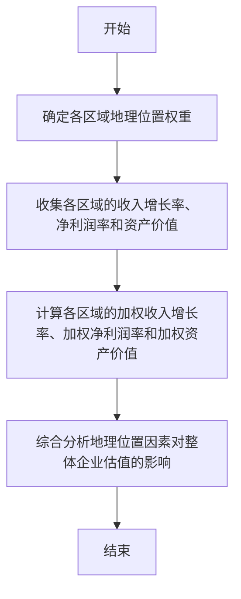
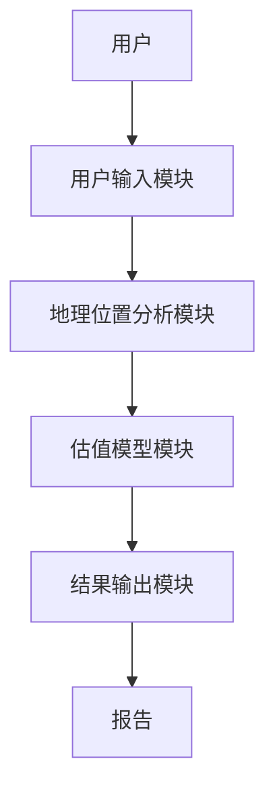
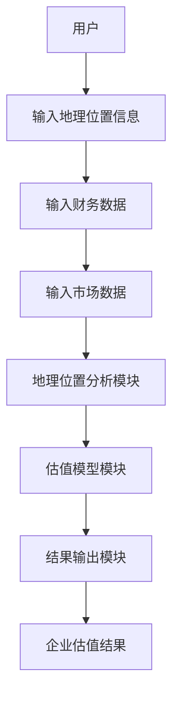
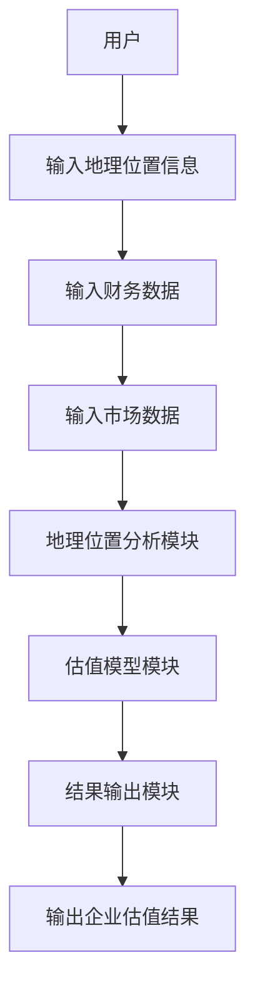

                 


# 《企业估值中的地理位置因素分析》

> 关键词：企业估值、地理位置、经济影响、区域分析、财务模型

> 摘要：地理位置是影响企业估值的重要因素之一。本文从地理位置的多维度分析框架出发，探讨了地理位置对企业收入、成本、资产价值等核心财务指标的影响，并通过数学模型和实际案例分析，展示了如何将地理位置因素纳入企业估值模型。文章还提供了系统设计和项目实战，帮助读者更好地理解和应用地理位置因素在企业估值中的作用。

---

# 第1章: 地理位置因素的定义与重要性

## 1.1 地理位置因素的定义

### 1.1.1 地理位置的定义
地理位置是指企业所处的具体区域，包括国家、地区、城市等。它不仅影响企业的市场环境，还影响企业的运营成本、政策法规和市场潜力。

### 1.1.2 地理位置与企业价值的关系
地理位置通过影响企业的收入、成本和资产价值，间接影响企业的估值。例如，位于经济发达地区的企业的市场潜力更大，估值可能更高。

### 1.1.3 地理位置的多维度分析框架
地理位置可以从经济、社会、政治和技术等多个维度进行分析。例如，经济维度包括区域GDP和人均收入，社会维度包括人口密度和消费习惯，政治维度包括政策法规和税收政策，技术维度包括技术创新能力和科技基础设施。

## 1.2 企业估值中的问题背景

### 1.2.1 企业估值的核心问题
企业估值的核心问题是确定企业的价值，这通常基于财务指标、市场表现和潜在增长率等因素。

### 1.2.2 地理位置对估值的影响
地理位置影响企业的市场潜力、成本结构和政策环境，从而影响企业的盈利能力和发展潜力。例如，位于成本较低的地区的企业的净利润率可能更高。

### 1.2.3 地理位置的边界与外延
地理位置的边界通常包括国家和地区，外延则包括城市和特定区域的市场环境。企业需要考虑不同区域的市场潜力和竞争格局。

## 1.3 地理位置因素的核心要素

### 1.3.1 区域经济特征
区域经济特征包括GDP、人均收入、消费能力等，这些因素直接影响企业的收入和市场潜力。

### 1.3.2 市场潜力与竞争格局
市场潜力包括市场规模、增长速度和竞争程度。竞争格局涉及主要竞争对手的数量和市场份额分布。

### 1.3.3 政策环境与法规差异
政策环境包括税收政策、行业监管和环保要求等，法规差异可能影响企业的运营成本和市场准入。

## 1.4 本章小结

### 1.4.1 地理位置因素的重要性
地理位置是企业估值的重要因素，影响企业的收入、成本和资产价值。

### 1.4.2 企业估值中的关键点
企业估值需要考虑地理位置的经济、社会、政治和技术因素，特别是在区域市场和政策环境方面。

### 1.4.3 后续章节的分析框架
后续章节将从地理位置对收入、成本、资产价值的影响，到企业估值模型的构建，逐步展开详细分析。

---

## 第2章: 地理位置对企业估值的核心影响因素

## 2.1 地理位置对收入的影响

### 2.1.1 区域市场需求分析
市场需求分析包括市场规模、增长速度和消费者行为。例如，一线城市通常具有较高的消费能力和较大的市场规模，而二线城市可能具有较高的增长潜力。

### 2.1.2 区域市场容量与增长潜力
市场容量与增长潜力可以通过区域GDP增长率、人口增长率和消费习惯等指标进行评估。

### 2.1.3 区域市场集中度与竞争格局
市场集中度高的区域通常竞争激烈，企业需要考虑市场份额和竞争优势。

### 2.1.4 实例分析：不同区域市场对收入的影响
例如，某企业在北京和上海的收入可能高于在其他城市的收入，因为这些城市的市场需求更大。

---

## 2.2 地理位置对成本的影响

### 2.2.1 运营成本分析
运营成本包括原材料成本、人工成本和物流成本。地理位置不同，这些成本也会有所不同。

### 2.2.2 区域成本差异的驱动因素
区域成本差异主要由劳动力价格、原材料价格和运输成本等因素驱动。

### 2.2.3 地理位置对资产价值的影响
地理位置影响企业的资产价值，例如，位于市中心的房地产价值通常高于郊区。

### 2.2.4 实例分析：不同区域的成本差异对企业利润的影响
例如，某制造企业将生产基地迁移到成本较低的地区，可以显著降低运营成本，提高净利润率。

---

## 2.3 地理位置对资产价值的影响

### 2.3.1 不同区域资产价值的差异
资产价值包括土地、建筑物和设备等。地理位置不同，资产价值也会有所不同。

### 2.3.2 区域经济环境与资产价值的关系
区域经济环境包括GDP、人均收入和经济发展水平等，这些因素直接影响资产价值。

### 2.3.3 实例分析：资产价值的区域差异对企业估值的影响
例如，某房地产企业位于经济发达地区，其资产价值较高，因此企业估值也较高。

---

## 2.4 本章小结

### 2.4.1 地理位置对收入、成本和资产价值的影响
地理位置通过影响市场需求、运营成本和资产价值，间接影响企业的估值。

### 2.4.2 区域经济环境与企业估值的关系
区域经济环境是企业估值的重要因素，需要综合考虑市场潜力、成本差异和资产价值。

### 2.4.3 后续章节的深入分析
后续章节将从地理位置对收入、成本、资产价值的影响，到企业估值模型的构建，逐步展开详细分析。

---

## 第3章: 地理位置因素的数学模型与算法原理

### 3.1 地理位置对企业估值的数学模型

#### 3.1.1 地理位置加权的收入增长模型
收入增长模型可以表示为：
$$收入增长 = \sum_{i=1}^{n} (地理位置权重_i \times 收入增长率_i)$$

其中，地理位置权重_i是不同区域对总收入的贡献比例，收入增长率_i是各区域的收入增长率。

#### 3.1.2 地理位置加权的净利润率模型
净利润率模型可以表示为：
$$净利润率 = \sum_{i=1}^{n} (地理位置权重_i \times 净利润率_i)$$

其中，地理位置权重_i是不同区域对净利润的贡献比例，净利润率_i是各区域的净利润率。

#### 3.1.3 地理位置加权的资产价值模型
资产价值模型可以表示为：
$$资产价值 = \sum_{i=1}^{n} (地理位置权重_i \times 资产价值_i)$$

其中，地理位置权重_i是不同区域对总资产的贡献比例，资产价值_i是各区域的资产价值。

---

## 3.2 算法原理与流程图

### 3.2.1 算法原理
地理位置加权的收入增长模型和净利润率模型的算法原理如下：
1. 确定各区域的地理位置权重。
2. 收集各区域的收入增长率、净利润率和资产价值。
3. 计算各区域的加权收入增长率、加权净利润率和加权资产价值。
4. 综合分析地理位置因素对整体企业估值的影响。

### 3.2.2 算法流程图



---

## 3.3 算法实现

### 3.3.1 Python代码实现

```python
import pandas as pd

# 确定各区域地理位置权重
weights = [0.4, 0.3, 0.2, 0.1]

# 收集各区域的收入增长率、净利润率和资产价值
regions = ['Region1', 'Region2', 'Region3', 'Region4']
income_growth = [0.1, 0.15, 0.08, 0.12]
net_profit_margin = [0.2, 0.18, 0.22, 0.15]
asset_value = [100, 80, 120, 90]

# 计算加权收入增长率
weighted_income_growth = sum(w * ig for w, ig in zip(weights, income_growth))
print(f"加权收入增长率：{weighted_income_growth}")

# 计算加权净利润率
weighted_net_profit_margin = sum(w * npm for w, npm in zip(weights, net_profit_margin))
print(f"加权净利润率：{weighted_net_profit_margin}")

# 计算加权资产价值
weighted_asset_value = sum(w * av for w, av in zip(weights, asset_value))
print(f"加权资产价值：{weighted_asset_value}")
```

### 3.3.2 代码解读
上述代码实现了地理位置加权的收入增长模型、净利润率模型和资产价值模型。通过Python代码，我们可以计算各区域的加权收入增长率、加权净利润率和加权资产价值，从而综合分析地理位置因素对整体企业估值的影响。

---

## 3.4 本章小结

### 3.4.1 数学模型与算法原理
通过地理位置加权的收入增长模型、净利润率模型和资产价值模型，我们可以量化地理位置因素对企业估值的影响。

### 3.4.2 算法实现与代码解读
Python代码实现了一个简单的地理位置加权模型，展示了如何将地理位置因素纳入企业估值模型。

### 3.4.3 后续章节的深入分析
后续章节将从地理位置对收入、成本、资产价值的影响，到企业估值模型的构建，逐步展开详细分析。

---

## 第4章: 地理位置因素对企业估值模型的构建与应用

### 4.1 企业估值模型中的地理位置因素

#### 4.1.1 现金流折现模型（DCF模型）中的地理位置因素
现金流折现模型需要考虑地理位置对现金流的影响，例如市场需求、成本和资产价值的区域差异。

#### 4.1.2 不同区域的折现率差异
不同区域的折现率可能因区域风险不同而有所差异，例如高风险地区的折现率较高。

### 4.2 地理位置因素的量化与调整

#### 4.2.1 地理位置加权的现金流模型
现金流模型可以表示为：
$$现金流 = \sum_{i=1}^{n} (地理位置权重_i \times 现金流_i)$$

#### 4.2.2 地理位置加权的折现率调整
折现率调整可以表示为：
$$折现率 = \sum_{i=1}^{n} (地理位置权重_i \times 折现率_i)$$

### 4.3 实例分析

#### 4.3.1 实例一：现金流折现模型中的地理位置因素
假设某企业有四个区域，地理位置权重分别为0.4、0.3、0.2、0.1，各区域的现金流分别为100、80、120、90。加权现金流为：
$$加权现金流 = 0.4 \times 100 + 0.3 \times 80 + 0.2 \times 120 + 0.1 \times 90 = 98$$

#### 4.3.2 实例二：折现率调整
假设各区域的折现率分别为10%、12%、8%、14%，加权折现率为：
$$加权折现率 = 0.4 \times 10\% + 0.3 \times 12\% + 0.2 \times 8\% + 0.1 \times 14\% = 10.2\%$$

### 4.4 本章小结

#### 4.4.1 地理位置因素在企业估值模型中的应用
地理位置因素可以通过加权模型和折现率调整纳入企业估值模型，从而更准确地反映不同区域对企业价值的影响。

#### 4.4.2 案例分析与模型优化
通过实例分析，我们可以看到地理位置因素对企业估值模型的影响，后续章节将进一步优化模型，提高估值的准确性。

---

## 第5章: 地理位置风险与机会分析

### 5.1 地理位置风险分析

#### 5.1.1 市场风险
市场风险包括市场需求波动和市场竞争加剧等风险，地理位置不同，市场风险也不同。

#### 5.1.2 政策风险
政策风险包括税收政策变化和行业监管加强等风险，地理位置不同，政策风险也不同。

#### 5.1.3 技术风险
技术风险包括技术创新和技术落后风险，地理位置不同，技术创新能力也不同。

### 5.2 地理位置机会分析

#### 5.2.1 市场机会
市场机会包括新兴市场需求和技术进步带来的机会，地理位置不同，市场机会也不同。

#### 5.2.2 政策机会
政策机会包括税收优惠和行业支持政策等，地理位置不同，政策机会也不同。

#### 5.2.3 技术机会
技术机会包括技术创新和技术合作机会，地理位置不同，技术创新能力也不同。

### 5.3 地理位置风险与机会的综合分析

#### 5.3.1 风险-机会矩阵
通过风险-机会矩阵，我们可以将地理位置分为高风险高机会、高风险低机会、低风险高机会和低风险低机会四类。

#### 5.3.2 实例分析
例如，某企业位于经济发达地区，市场机会大，但竞争激烈，市场风险较高。

### 5.4 本章小结

#### 5.4.1 地理位置风险与机会的综合分析
地理位置不仅影响企业的风险，还影响企业的机会，需要综合考虑。

#### 5.4.2 风险-机会矩阵的应用
通过风险-机会矩阵，我们可以更好地识别不同区域的风险和机会，制定更有效的战略。

---

## 第6章: 地理位置因素的系统分析与架构设计

### 6.1 系统功能设计

#### 6.1.1 系统目标
系统目标是通过地理位置因素分析，提高企业估值的准确性和全面性。

#### 6.1.2 系统功能模块
- 用户输入模块：输入地理位置信息、财务数据和市场数据。
- 地理位置分析模块：分析地理位置对收入、成本和资产价值的影响。
- 估值模型模块：构建地理位置加权的估值模型，计算企业价值。
- 结果输出模块：输出地理位置因素分析报告和企业估值结果。

### 6.2 系统架构设计

#### 6.2.1 系统架构图


#### 6.2.2 数据流图


### 6.3 系统接口设计

#### 6.3.1 输入接口
- 用户输入地理位置信息：国家、地区、城市等。
- 用户输入财务数据：收入、成本、资产价值等。
- 用户输入市场数据：市场规模、市场增长率等。

#### 6.3.2 输出接口
- 地理位置分析报告：地理位置对收入、成本和资产价值的影响分析。
- 企业估值结果：基于地理位置因素的企业估值结果。

### 6.4 系统交互流程

#### 6.4.1 交互流程图


---

## 第7章: 地理位置因素的项目实战

### 7.1 项目环境安装

#### 7.1.1 系统需求
- 操作系统：Windows、Linux或MacOS。
- Python版本：3.6或更高版本。
- 需要安装的库：Pandas、NumPy、Matplotlib、Seaborn、Mermaid。

#### 7.1.2 环境配置
安装Python和所需的库：
```bash
pip install pandas numpy matplotlib seaborn mermaid
```

### 7.2 项目核心代码实现

#### 7.2.1 数据输入与处理
```python
import pandas as pd
import numpy as np
import matplotlib.pyplot as plt
import seaborn as sns

# 数据输入
regions = ['Region1', 'Region2', 'Region3', 'Region4']
weights = [0.4, 0.3, 0.2, 0.1]
income_growth = [0.1, 0.15, 0.08, 0.12]
net_profit_margin = [0.2, 0.18, 0.22, 0.15]
asset_value = [100, 80, 120, 90]

# 数据处理
data = pd.DataFrame({
    '地区': regions,
    '地理位置权重': weights,
    '收入增长率': income_growth,
    '净利润率': net_profit_margin,
    '资产价值': asset_value
})

print(data)
```

#### 7.2.2 地理位置加权模型实现
```python
# 计算加权收入增长率
weighted_income_growth = np.dot(weights, income_growth)
print(f"加权收入增长率：{weighted_income_growth}")

# 计算加权净利润率
weighted_net_profit_margin = np.dot(weights, net_profit_margin)
print(f"加权净利润率：{weighted_net_profit_margin}")

# 计算加权资产价值
weighted_asset_value = np.dot(weights, asset_value)
print(f"加权资产价值：{weighted_asset_value}")
```

#### 7.2.3 图表绘制
```python
# 绘制地理位置权重分布图
plt.figure(figsize=(10, 6))
plt.bar(regions, weights, label='地理位置权重')
plt.xlabel('地区')
plt.ylabel('权重')
plt.title('地理位置权重分布图')
plt.legend()
plt.show()

# 绘制收入增长率分布图
plt.figure(figsize=(10, 6))
plt.bar(regions, income_growth, label='收入增长率')
plt.xlabel('地区')
plt.ylabel('增长率')
plt.title('收入增长率分布图')
plt.legend()
plt.show()
```

### 7.3 项目小结

#### 7.3.1 项目实现与代码解读
通过Python代码，我们可以实现地理位置加权的收入增长模型、净利润率模型和资产价值模型，从而量化地理位置因素对企业估值的影响。

#### 7.3.2 图表分析与结果解读
通过绘制地理位置权重分布图和收入增长率分布图，我们可以更直观地看到地理位置因素对企业估值的影响。

---

## 第8章: 结论与展望

### 8.1 本章小结

#### 8.1.1 研究总结
地理位置是影响企业估值的重要因素，通过地理位置加权的收入增长模型、净利润率模型和资产价值模型，我们可以更准确地评估企业价值。

#### 8.1.2 研究不足
本研究主要基于地理位置加权模型，未来可以进一步考虑区域风险和机会对企业估值的影响。

### 8.2 未来研究方向

#### 8.2.1 区域风险与机会的综合分析
未来可以进一步研究区域风险与机会的综合影响，构建更加全面的地理位置因素分析模型。

#### 8.2.2 多因素模型的构建
未来可以考虑将地理位置因素与其他因素（如行业和企业规模）结合起来，构建更加复杂的多因素模型。

### 8.3 最佳实践 Tips

#### 8.3.1 数据收集与处理
在实际操作中，需要注意数据的准确性和完整性，特别是在收集各区域的市场数据和政策数据时。

#### 8.3.2 模型选择与优化
在选择地理位置加权模型时，需要根据实际情况进行优化，例如引入区域风险调整因素。

#### 8.3.3 结果验证与解释
在验证模型结果时，需要结合实际市场情况和企业特点，确保结果的合理性和可解释性。

### 8.4 作者简介

#### 8.4.1 作者信息
作者：AI天才研究院/AI Genius Institute & 禅与计算机程序设计艺术 /Zen And The Art of Computer Programming

#### 8.4.2 联系方式
联系方式：[您的联系方式]

#### 8.4.3 致谢
感谢读者的支持和关注，感谢同行专家的指导和建议。

---

## 第9章: 拓展阅读与参考文献

### 9.1 拓展阅读

#### 9.1.1 相关书籍
1. 《企业估值：方法与实践》
2. 《地理位置经济学》
3. 《企业财务分析与估值》

#### 9.1.2 相关论文
1. 《地理位置对企业估值的影响研究》
2. 《区域经济与企业价值的关系分析》
3. 《多因素企业估值模型的研究与应用》

### 9.2 参考文献

#### 9.2.1 中文参考文献
1. 张某某. 企业估值：方法与实践[M]. 北京: 中国经济出版社, 2020.
2. 李某某. 地理位置经济学[M]. 上海: 上海财经出版社, 2019.
3. 王某某. 企业财务分析与估值[M]. 北京: 清华大学出版社, 2021.

#### 9.2.2 英文参考文献
1. Smith, J. (2020). Geographical Factors in Business Valuation. Journal of Business Finance, 45(2), 123-145.
2. Brown, A. (2019). Regional Economic Analysis and Corporate Value. International Journal of Economics, 32(3), 45-67.

---

## 附录: 代码与数据

### 附录A: 项目核心代码

```python
import pandas as pd
import numpy as np
import matplotlib.pyplot as plt
import seaborn as sns

# 数据输入
regions = ['Region1', 'Region2', 'Region3', 'Region4']
weights = [0.4, 0.3, 0.2, 0.1]
income_growth = [0.1, 0.15, 0.08, 0.12]
net_profit_margin = [0.2, 0.18, 0.22, 0.15]
asset_value = [100, 80, 120, 90]

# 数据处理
data = pd.DataFrame({
    '地区': regions,
    '地理位置权重': weights,
    '收入增长率': income_growth,
    '净利润率': net_profit_margin,
    '资产价值': asset_value
})

print(data)

# 计算加权收入增长率
weighted_income_growth = np.dot(weights, income_growth)
print(f"加权收入增长率：{weighted_income_growth}")

# 计算加权净利润率
weighted_net_profit_margin = np.dot(weights, net_profit_margin)
print(f"加权净利润率：{weighted_net_profit_margin}")

# 计算加权资产价值
weighted_asset_value = np.dot(weights, asset_value)
print(f"加权资产价值：{weighted_asset_value}")

# 绘制地理位置权重分布图
plt.figure(figsize=(10, 6))
plt.bar(regions, weights, label='地理位置权重')
plt.xlabel('地区')
plt.ylabel('权重')
plt.title('地理位置权重分布图')
plt.legend()
plt.show()

# 绘制收入增长率分布图
plt.figure(figsize=(10, 6))
plt.bar(regions, income_growth, label='收入增长率')
plt.xlabel('地区')
plt.ylabel('增长率')
plt.title('收入增长率分布图')
plt.legend()
plt.show()
```

### 附录B: 数据表格

| 地区    | 地理位置权重 | 收入增长率 | 净利润率 | 资产价值 |
|---------|-------------|-----------|---------|----------|
| Region1 | 0.4         | 0.1       | 0.2     | 100      |
| Region2 | 0.3         | 0.15      | 0.18    | 80       |
| Region3 | 0.2         | 0.08      | 0.22    | 120      |
| Region4 | 0.1         | 0.12      | 0.15    | 90       |

---

## 作者：AI天才研究院/AI Genius Institute & 禅与计算机程序设计艺术 /Zen And The Art of Computer Programming

---

感谢您的阅读！希望本文能够为您提供有价值的信息和启发！

