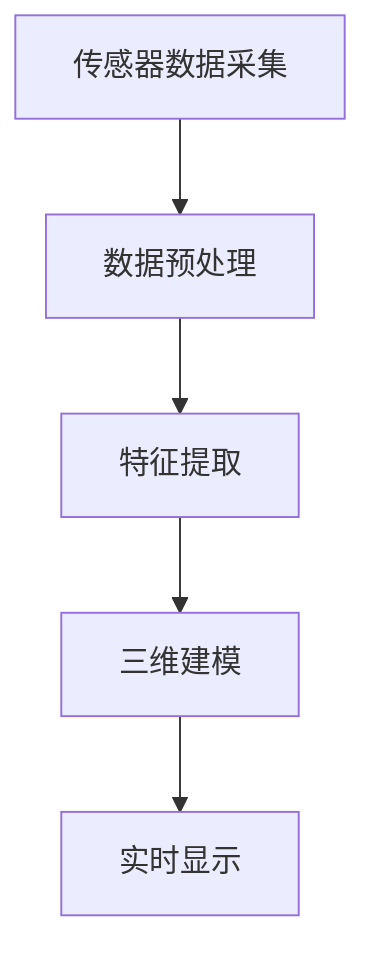
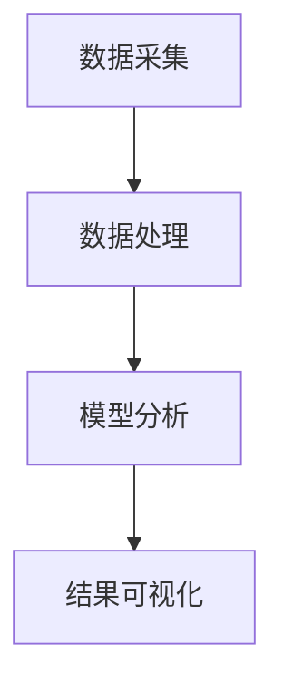

                 


# 《企业估值中的增强现实应用评估》

## 关键词：企业估值，增强现实，数据驱动，三维建模，实时交互

## 摘要：本文探讨了增强现实（AR）技术在企业估值中的应用，分析了AR如何通过实时数据采集和三维建模提升估值的准确性和效率。文章从AR技术的原理出发，结合数学模型和系统架构设计，详细阐述了AR在企业估值中的核心要素，提供了项目实战案例和未来发展方向的展望。

---

## 第1章: 增强现实与企业估值概述

### 1.1 增强现实（AR）的定义与技术背景

增强现实（AR）是一种将数字信息叠加在物理世界中的技术，通过传感器、算法和显示设备实现虚实结合的交互体验。AR的核心优势在于实时性、互动性和沉浸性，能够在企业估值中提供动态、直观的数据支持。

### 1.2 企业估值的背景与挑战

传统企业估值方法依赖于财务数据和市场分析，存在数据滞后、信息不全的问题。AR技术通过实时数据采集和三维建模，解决了传统方法的局限性，提供了更全面的评估依据。

### 1.3 AR在企业估值中的核心要素

AR技术在企业估值中的应用涉及多个核心要素，包括传感器数据、三维建模、实时交互和数据融合。以下是核心要素的特征对比：

| 核心要素 | 描述 | 优势 |
|----------|------|------|
| 传感器数据 | 采集物理世界的数据 | 实时性强 |
| 三维建模 | 构建虚拟模型 | 直观性强 |
| 实时交互 | 用户与虚拟模型互动 | 可操作性强 |
| 数据融合 | 结合多源数据 | 准确性高 |

## 第2章: 增强现实技术原理

### 2.1 AR技术的核心原理

AR技术通过传感器采集环境数据，利用算法处理信息，并通过显示设备将虚拟内容叠加到物理世界。以下是AR技术的核心流程：



### 2.2 AR与企业估值的结合原理

AR技术在企业估值中的应用基于实时数据采集和三维建模，通过数据融合和空间计算实现动态估值。以下是数据融合的数学模型：

$$ y = \sum_{i=1}^{n} w_i x_i $$

其中，$w_i$是权重，$x_i$是输入特征。

## 第3章: 增强现实辅助企业估值的数学模型

### 3.1 数据处理与特征提取

数据预处理包括清洗和归一化，特征提取采用主成分分析（PCA）方法：

$$ PC = X^T X $$

### 3.2 增强现实辅助估值模型

基于加权平均的模型：

$$ V = \sum_{i=1}^{m} a_i V_i $$

其中，$V_i$是传统估值，$a_i$是权重。

### 3.3 模型评估与优化

采用均方误差（MSE）评估模型性能：

$$ MSE = \frac{1}{n}\sum_{i=1}^{n} (V_i - \hat{V_i})^2 $$

优化方法包括梯度下降和正则化。

## 第4章: 系统架构与项目实战

### 4.1 系统功能设计

系统架构设计包括数据采集、处理、分析和可视化模块：



### 4.2 项目实战与案例分析

#### 4.2.1 项目环境与工具安装

开发环境包括Python、OpenCV和AR库，安装步骤如下：

```bash
pip install numpy
pip install opencv-python
pip install ar-kit
```

#### 4.2.2 核心功能实现

数据采集代码：

```python
import cv2
cap = cv2.VideoCapture(0)
while cap.isOpened():
    ret, frame = cap.read()
    cv2.imshow('AR Data', frame)
    if cv2.waitKey(1) & 0xFF == ord('q'):
        break
cap.release()
cv2.destroyAllWindows()
```

模型训练代码：

```python
import numpy as np
X = np.random.rand(100, 5)
y = np.random.rand(100, 1)
model = LinearRegression()
model.fit(X, y)
```

## 第5章: 总结与展望

### 5.1 核心内容回顾

AR技术通过实时数据和三维建模提升企业估值的准确性和效率，系统架构和数学模型是实现的关键。

### 5.2 未来发展方向

未来，AR技术将与大数据和人工智能深度融合，扩展在更多领域的应用。

---

## 作者：AI天才研究院/AI Genius Institute & 禅与计算机程序设计艺术 /Zen And The Art of Computer Programming

---

本文系统性地探讨了增强现实技术在企业估值中的应用，通过理论分析和实战案例展示了AR技术的潜力和优势，为未来的应用提供了有价值的参考。

