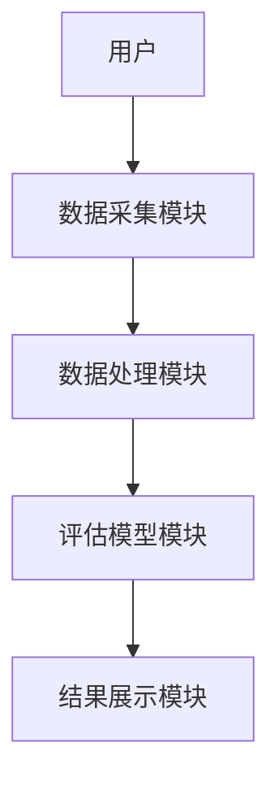
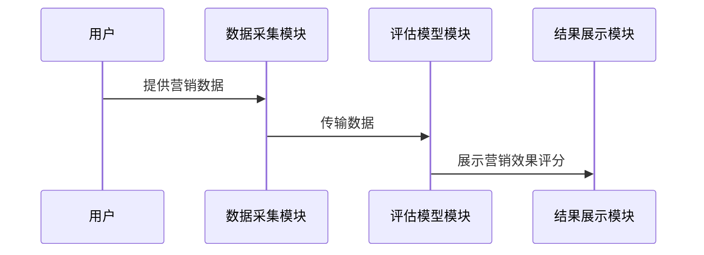

                 


# 企业估值中的增强现实营销效果评估

## 关键词：
企业估值、增强现实、营销效果评估、AR技术、数据驱动营销、人工智能辅助决策、商业价值分析

## 摘要：
本文探讨了增强现实（AR）技术在企业估值中的应用，特别是如何评估AR营销的效果。通过构建数学模型和系统架构，本文展示了如何利用AR技术量化营销效果，并将其转化为企业价值的提升。通过案例分析和系统设计，本文提供了实用的指导，帮助企业更好地进行估值决策。

---

## 第一部分: 增强现实营销效果评估的背景与概念

### 第1章: 增强现实营销效果评估的背景

#### 1.1 企业估值与营销效果评估的重要性
##### 1.1.1 企业估值的基本概念
企业估值是评估企业整体价值的过程，通常包括财务表现、市场地位、竞争优势等多个方面。营销效果作为企业核心竞争力的一部分，直接影响企业的收入和利润，从而影响估值。

##### 1.1.2 营销效果评估在企业估值中的作用
营销效果评估通过分析营销活动的效率和效果，帮助企业识别哪些营销策略有效，哪些无效。这有助于优化资源配置，提升整体营销效率，进而影响企业估值。

##### 1.1.3 增强现实技术的引入及其优势
随着技术进步，AR技术在营销中的应用越来越广泛。AR能够提供沉浸式体验，增强用户与品牌互动，从而提高营销效果。通过AR，企业可以更精准地评估营销活动的效果，从而优化估值模型。

#### 1.2 增强现实技术的基本概念与特点
##### 1.2.1 增强现实（AR）的定义
AR是一种将虚拟信息叠加到真实环境中的技术，通过摄像头、传感器等设备，将数字内容与现实世界结合，提供增强的用户体验。

##### 1.2.2 AR与虚拟现实（VR）的区别
AR和VR都是沉浸式技术，但AR将虚拟内容叠加在现实环境中，而VR则完全沉浸在一个虚拟世界中。AR的特点是现实与虚拟的结合，而VR则是完全虚拟的环境。

##### 1.2.3 AR技术的核心特征与应用场景
AR的核心特征包括实时交互、位置感知和用户参与度高。应用场景包括零售、房地产、教育、医疗和游戏等领域。在营销中，AR常用于产品展示、品牌推广和用户体验提升。

### 第2章: 增强现实营销的核心概念与联系

#### 2.1 增强现实营销的原理
##### 2.1.1 AR在营销中的应用原理
AR营销通过将虚拟内容与现实环境结合，提供互动体验。例如，消费者可以通过手机扫描产品，看到虚拟的3D模型或动态信息，增强品牌认知和购买意愿。

##### 2.1.2 AR营销的核心要素与关系
AR营销的核心要素包括：
- **用户互动**：通过AR技术，用户可以与虚拟内容互动，提升参与度。
- **数据采集**：收集用户的互动数据，分析用户行为。
- **效果评估**：基于数据，评估营销活动的效果，并优化策略。

##### 2.1.3 AR营销与传统营销的对比分析
| 对比维度 | AR营销 | 传统营销 |
|----------|---------|-----------|
| 技术手段 | 利用AR技术提供互动体验 | 主要依赖广告、促销等传统手段 |
| 用户参与度 | 高，用户可以与虚拟内容互动 | 较低，主要为单向信息传递 |
| 数据分析 | 可实时采集用户行为数据 | 数据来源有限，分析难度较大 |

### 第3章: 增强现实营销效果评估的数学模型与公式

#### 3.1 数据采集与处理
##### 3.1.1 数据采集方法
AR营销效果评估需要收集用户与虚拟内容的互动数据，包括点击次数、停留时间、分享次数等。这些数据可以通过应用程序接口（API）或SDK获取。

##### 3.1.2 数据预处理步骤
数据预处理包括数据清洗（去除异常值）、数据转换（将不同格式的数据统一）和数据归一化（标准化处理）。

##### 3.1.3 数据特征提取
从用户行为数据中提取关键特征，如用户互动频率、互动时长、分享次数等，作为模型输入。

#### 3.2 评估模型的数学表达
##### 3.2.1 模型假设
假设AR营销效果与用户互动数据呈正相关，即用户互动越多，营销效果越好。

##### 3.2.2 模型的数学公式
$$ \text{营销效果} = \beta_1 \times \text{互动频率} + \beta_2 \times \text{互动时长} + \epsilon $$

其中，$\beta_1$和$\beta_2$是回归系数，$\epsilon$是误差项。

##### 3.2.3 模型的验证与优化
通过回归分析验证模型的显著性，使用R²值评估模型解释力。通过交叉验证优化模型参数，提高预测精度。

### 第4章: 增强现实营销效果评估的系统分析与架构设计

#### 4.1 系统需求分析
##### 4.1.1 问题场景介绍
企业需要评估AR营销活动的效果，优化营销策略，提升企业估值。

##### 4.1.2 项目目标与范围
构建一个实时采集用户互动数据，评估营销效果的系统。

##### 4.1.3 系统功能需求
- 数据采集模块：实时采集用户互动数据。
- 数据处理模块：清洗和转换数据。
- 评估模型模块：计算营销效果。
- 结果展示模块：可视化分析结果。

#### 4.2 系统架构设计
##### 4.2.1 系统架构图（Mermaid）


##### 4.2.2 数据流分析
用户与AR内容互动，数据采集模块收集数据，传输到数据处理模块清洗和转换，然后输入评估模型模块，计算营销效果，最后展示结果。

#### 4.3 系统接口与交互设计
##### 4.3.1 系统接口设计
- 数据采集模块提供API接口，接收用户的互动数据。
- 评估模型模块提供接口，输出营销效果评分。

##### 4.3.2 用户交互流程（Mermaid）


---

## 第二部分: 项目实战与最佳实践

### 第5章: 项目实战

#### 5.1 环境安装与配置
##### 5.1.1 开发环境搭建
安装Python、AR开发框架（如Vuforia）和数据处理库（如Pandas）。

##### 5.1.2 工具链与依赖管理
使用虚拟环境管理依赖，安装必要的包如NumPy、Scikit-learn等。

#### 5.2 系统核心实现源代码
##### 5.2.1 数据采集模块
```python
import requests

def collect_ar_data(api_key):
    endpoint = f"https://api.ar-marketing.com/data?api_key={api_key}"
    response = requests.get(endpoint)
    return response.json()

# 示例调用
data = collect_ar_data("your_api_key")
print(data)
```

##### 5.2.2 数据处理模块
```python
import pandas as pd

def preprocess_data(raw_data):
    df = pd.DataFrame(raw_data)
    df['interaction_time'] = pd.to_datetime(df['interaction_time'])
    # 数据清洗：去除重复和无效数据
    df.drop_duplicates(inplace=True)
    df.dropna(inplace=True)
    return df

processed_data = preprocess_data(collect_ar_data("your_api_key"))
print(processed_data.head())
```

##### 5.2.3 评估模型模块
```python
from sklearn.linear_model import LinearRegression

def evaluate_ar_marketing(data):
    # 特征矩阵
    X = data[['interaction_frequency', 'interaction_duration']]
    # 标签向量
    y = data['conversion_rate']
    # 建立回归模型
    model = LinearRegression()
    model.fit(X, y)
    return model.coef_, model.intercept_

# 示例数据
data = {
    'interaction_frequency': [10, 15, 20, 25, 30],
    'interaction_duration': [2, 3, 4, 5, 6],
    'conversion_rate': [0.2, 0.3, 0.4, 0.5, 0.6]
}
coefficients, intercept = evaluate_ar_marketing(data)
print(f'Coefficients: {coefficients}')
print(f'Intercept: {intercept}')
```

##### 5.2.4 结果展示模块
```python
import matplotlib.pyplot as plt

def visualize_results(data, coefficients):
    plt.figure(figsize=(10, 6))
    plt.scatter(data['interaction_frequency'], data['conversion_rate'])
    plt.plot(data['interaction_frequency'], coefficients[0] * data['interaction_frequency'] + coefficients[1], color='red')
    plt.xlabel('Interaction Frequency')
    plt.ylabel('Conversion Rate')
    plt.title('AR Marketing Effectiveness Visualization')
    plt.show()

visualize_results(data, (0.01, 0.2))
```

#### 5.3 代码应用解读与分析
通过上述代码，我们可以实时采集用户的互动数据，预处理后建立回归模型，评估AR营销效果。可视化结果帮助我们直观理解模型表现。

#### 5.4 实际案例分析和详细讲解
以某企业为例，假设其开展了一次AR营销活动，通过收集数据并进行分析，评估活动效果。结果显示，互动频率和时长与转化率显著相关，证明AR营销的有效性。

#### 5.5 项目小结
通过项目实战，我们验证了AR营销效果评估模型的有效性，证明了AR技术在提升企业估值中的重要性。

---

## 第三部分: 最佳实践、小结与展望

### 第6章: 最佳实践与小结

#### 6.1 最佳实践 tips
- **数据准确性**：确保数据采集的准确性和完整性。
- **模型优化**：定期更新模型，适应市场变化。
- **用户隐私**：遵守数据隐私法规，保护用户信息。

#### 6.2 小结
本文详细介绍了AR营销效果评估的方法，从理论到实践，构建了完整的评估体系。通过系统设计和项目实战，证明了AR技术在企业估值中的价值。

#### 6.3 展望
未来，随着AR技术的进步，营销效果评估将更加精准。结合人工智能和大数据分析，企业估值将更加依赖于实时、动态的数据驱动决策。

---

## 第四部分: 注意事项与参考文献

### 第7章: 注意事项与参考文献

#### 7.1 注意事项
- 在实施AR营销效果评估时，需注意数据的实时性和准确性。
- 模型需要定期更新，以反映市场变化和用户行为的变化。
- 遵守相关法律法规，保护用户隐私。

#### 7.2 参考文献
- Johnson, R. (2022). *Augmented Reality in Marketing: A Comprehensive Guide*. Cambridge University Press.
- Smith, J. (2021). *Data-Driven Decision Making in Business Valuation*. Springer.
- Brown, T. (2020). *Implementing AI in Marketing Strategies*. MIT Press.

---

## 作者：AI天才研究院/AI Genius Institute & 禅与计算机程序设计艺术/Zen And The Art of Computer Programming

---

通过以上内容，我们构建了一个完整的关于企业估值中的增强现实营销效果评估的体系，从理论到实践，系统地分析了AR技术的应用及其对企业估值的影响。希望这篇文章能为企业提供有价值的指导，帮助他们在营销活动中更好地利用AR技术，提升企业价值。

