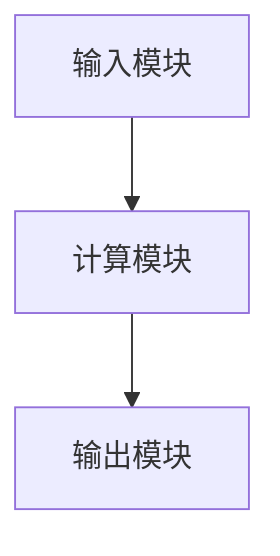
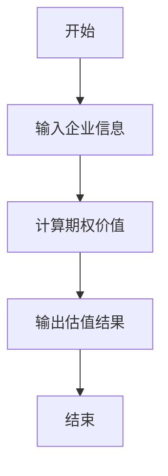
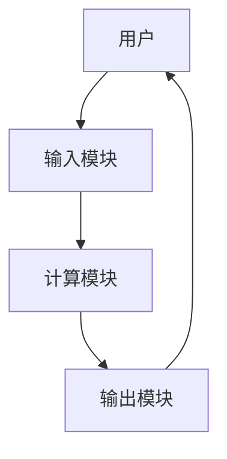

                 


# 企业估值中的实物期权法

> 关键词：实物期权、企业估值、期权定价、Black-Scholes模型、金融数学

> 摘要：  
本文深入探讨了实物期权法在企业估值中的应用。首先介绍了实物期权的基本概念和核心原理，分析了其实物期权在企业估值中的独特优势。然后，详细推导了Black-Scholes模型及其在实物期权定价中的应用，探讨了实物期权法与其他估值方法的结合与优化。接着，从系统架构的角度，详细设计了实物期权估值系统的模块划分、接口设计和交互流程。最后，通过具体案例展示了实物期权法的实际应用，总结了该方法的优缺点及未来研究方向。

---

# 第1章: 实物期权法的背景与概念

## 1.1 企业估值的传统方法与局限性

### 1.1.1 传统企业估值方法的介绍

企业估值是企业管理和金融领域中的核心问题。传统的估值方法主要包括：

- **收益法（DCF模型）**：基于企业未来现金流的折现，计算其现值。
- **市场法**：基于可比企业的市场估值进行推导。
- **资产法**：基于企业资产的账面价值进行调整。

然而，这些方法在面对具有高度不确定性和期权性质的企业（如高科技企业、创业企业）时，往往难以准确反映其潜在价值。

---

### 1.1.2 传统方法的局限性与不足

- **收益法的局限**：DCF模型假设未来现金流可以准确预测，但面对不确定性较高的企业（如初创企业），这一假设难以成立。
- **市场法的局限**：可比企业分析依赖于市场数据的可获得性，且难以捕捉企业的独特价值。
- **资产法的局限**：仅考虑资产的账面价值，忽视了企业未来增长的期权价值。

---

### 1.1.3 实物期权法的提出背景

实物期权法的核心思想是将企业的未来价值看作一种期权，通过金融期权的定价方法来评估企业价值。这种方法尤其适用于那些具有高度不确定性和成长潜力的企业。

---

## 1.2 实物期权法的核心概念

### 1.2.1 实物期权的定义与特点

**实物期权**是指企业未来可能获得的某种权利，例如未来收购某项资产的权利、未来扩张的权利等。与金融期权不同，实物期权的标的资产是企业的实际资产或未来收益。

### 1.2.2 实物期权与金融期权的对比

| 对比维度 | 实物期权 | 金融期权 |
|----------|----------|----------|
| 标的资产 | 实体资产或未来收益 | 金融资产或指数 |
| 行使方式 | 可能涉及实物资产的转移或收益分配 | 通过现金结算或实物交割 |
| 风险因素 | 企业经营风险、市场风险 | 市场波动风险 |

---

### 1.2.3 实物期权法在企业估值中的作用

实物期权法通过将企业的未来价值分解为多个期权，分别进行估值，从而更准确地反映企业的整体价值。这种方法特别适用于那些具有灵活性和成长潜力的企业。

---

## 1.3 实物期权法的应用场景

### 1.3.1 高科技企业的适用性

高科技企业通常具有较高的不确定性，但同时也具有较高的增长潜力。实物期权法可以帮助这些企业更准确地评估其未来价值。

### 1.3.2 创业企业的估值挑战

创业企业的估值往往面临信息不全和高度不确定性的挑战。实物期权法可以通过对企业未来增长期权的定价，提供更合理的估值。

### 1.3.3 其他行业的应用潜力

尽管实物期权法在高科技和创业企业中应用较多，但其核心思想可以扩展到其他行业，例如制造业中的扩张期权、能源行业的储量期权等。

---

## 1.4 本章小结

本章介绍了企业估值的传统方法及其局限性，提出了实物期权法的背景和核心概念，分析了其实物期权法在不同场景下的应用潜力。

---

# 第2章: 实物期权法的核心原理

## 2.1 实物期权的基本原理

### 2.1.1 实物期权的定价模型

实物期权的定价模型与金融期权类似，通常基于**Black-Scholes模型**进行调整。其基本公式为：

$$ C = S_0 N(d_1) - K e^{-rT} N(d_2) $$

其中：
- \( S_0 \)：标的资产当前价格
- \( K \)：行权价
- \( r \)：无风险利率
- \( T \)：时间至到期
- \( N(d) \)：标准正态分布的累积分布函数
- \( d_1 = \frac{\ln(S_0/K) + (r + \sigma^2/2)T}{\sigma \sqrt{T}} \)
- \( d_2 = d_1 - \sigma \sqrt{T} \)

### 2.1.2 实物期权的内在价值与外在价值

- **内在价值**：期权的当前价值，取决于标的资产的市场价格。
- **外在价值**：期权的理论价值，基于标的资产的波动性和时间价值。

### 2.1.3 实物期权的时间价值与波动性

时间价值是期权价格中的一部分，反映期权剩余期限的价值。波动性是影响期权价格的重要因素，波动性越高，期权价格通常越高。

---

## 2.2 实物期权与企业价值的关系

### 2.2.1 企业价值的期权分解

企业价值可以分解为多个期权的组合，例如：

- **扩张期权**：企业未来扩张的权利。
- **并购期权**：企业未来并购其他企业的权利。
- **资产出售期权**：企业未来出售资产的权利。

### 2.2.2 期权价值对企业整体价值的影响

期权价值的增加会提升企业整体价值，尤其是在不确定性较高的环境中。

### 2.2.3 期权行使对企业发展的影响

期权的行使可能改变企业的资本结构和资产配置，从而影响其未来的经营战略。

---

## 2.3 实物期权法的数学模型

### 2.3.1 Black-Scholes模型的介绍

Black-Scholes模型是金融领域中广泛应用的期权定价模型，其核心假设包括：

- 标的资产价格服从几何布朗运动。
- 市场无套利机会。
- 无交易成本和税收。

### 2.3.2 实物期权定价的公式推导

基于Black-Scholes模型，实物期权的定价公式可以表示为：

$$ C = S_0 N(d_1) - K e^{-rT} N(d_2) $$

其中，\( d_1 \) 和 \( d_2 \) 的计算公式如前所述。

### 2.3.3 模型假设与参数选择

- **假设**：标的资产价格波动率已知，无股息支付。
- **参数**：标的资产价格 \( S_0 \)，行权价 \( K \)，无风险利率 \( r \)，时间至到期 \( T \)，波动率 \( \sigma \)。

---

## 2.4 本章小结

本章详细介绍了实物期权的基本原理和数学模型，分析了期权价值与企业整体价值之间的关系，并探讨了其在企业估值中的应用。

---

# 第3章: 实物期权法的分类与应用

## 3.1 实物期权的分类

### 3.1.1 按权利类型分类

- **认购期权**：买方有权以行权价购买标的资产。
- **认沽期权**：买方有权以行权价出售标的资产。

### 3.1.2 按标的资产分类

- **股票期权**：基于股票的期权。
- **债券期权**：基于债券的期权。
- **商品期权**：基于商品的期权。

### 3.1.3 按行使时间分类

- **欧式期权**：只能在到期日行权。
- **美式期权**：可以在到期日前的任何时间行权。

---

## 3.2 实物期权在企业估值中的应用

### 3.2.1 创业企业股权激励的期权价值

创业企业的股权激励可以通过认购期权的形式进行估值，员工的期权价值反映了其未来贡献的潜在价值。

### 3.2.2 并购交易中的期权定价

在并购交易中，企业可以将并购权利看作一种期权，从而更准确地评估并购交易的价值。

### 3.2.3 企业内部期权的识别与评估

企业内部的期权包括扩张期权、资产出售期权等，这些期权的估值需要结合企业的具体情况。

---

## 3.3 实物期权法与其他估值方法的结合

### 3.3.1 实物期权与DCF模型的结合

通过将企业未来价值分解为期权的组合，可以结合DCF模型进行更准确的估值。

### 3.3.2 实物期权与市场法的结合

实物期权可以用于调整市场法中的可比企业分析，捕捉企业的独特价值。

### 3.3.3 综合估值方法的优势

综合估值方法可以充分利用不同方法的优势，提高估值的准确性和可靠性。

---

## 3.4 本章小结

本章分析了实物期权的分类及其在企业估值中的应用，并探讨了其实物期权法与其他估值方法的结合与优化。

---

# 第4章: 实物期权法的数学模型与公式

## 4.1 Black-Scholes模型的详细推导

### 4.1.1 模型假设

- 标的资产价格服从几何布朗运动。
- 市场无套利机会。
- 无交易成本和税收。

### 4.1.2 模型公式

$$ C = S_0 N(d_1) - K e^{-rT} N(d_2) $$

其中：

$$ d_1 = \frac{\ln(S_0/K) + (r + \sigma^2/2)T}{\sigma \sqrt{T}} $$

$$ d_2 = d_1 - \sigma \sqrt{T} $$

### 4.1.3 公式中的变量与参数

- \( S_0 \)：标的资产当前价格
- \( K \)：行权价
- \( r \)：无风险利率
- \( T \)：时间至到期
- \( \sigma \)：标的资产价格波动率

---

## 4.2 实物期权定价的数学公式

### 4.2.1 期权价值的计算公式

$$ C = S_0 N(d_1) - K e^{-rT} N(d_2) $$

### 4.2.2 标的资产波动率的估计

波动率的估计可以通过历史数据或市场隐含波动率进行。

### 4.2.3 时间价值的计算方法

时间价值是期权价格中的一部分，可以通过公式：

$$ \text{时间价值} = C - S_0 N(d_1) $$

---

## 4.3 实物期权法的数学模型应用

### 4.3.1 模型的适用条件

- 标的资产价格可以合理估计。
- 市场波动率可以合理估计。

### 4.3.2 模型的参数调整

根据具体企业的特点，调整模型中的参数，例如波动率、行权价等。

### 4.3.3 模型的验证与校准

通过实际市场数据对模型进行验证和校准，确保其准确性和可靠性。

---

## 4.4 本章小结

本章详细介绍了Black-Scholes模型的数学推导及其在实物期权定价中的应用，并探讨了模型的假设和参数调整。

---

# 第5章: 实物期权法的系统架构与实现

## 5.1 系统架构设计

### 5.1.1 系统模块划分

- **输入模块**：接收企业相关信息，包括资产价值、行权价、时间至到期等。
- **计算模块**：基于Black-Scholes模型计算期权价值。
- **输出模块**：输出期权价值和企业整体估值。

### 5.1.2 模块之间的关系

- 输入模块提供数据，计算模块进行处理，输出模块展示结果。

### 5.1.3 系统架构图



---

## 5.2 系统功能设计

### 5.2.1 问题场景介绍

本系统旨在帮助企业通过实物期权法进行估值，解决传统估值方法的局限性。

### 5.2.2 系统功能需求

- 企业信息输入。
- 期权价值计算。
- 企业整体估值输出。

### 5.2.3 系统功能流程图



---

## 5.3 系统架构设计

### 5.3.1 系统架构图


### 5.3.2 系统交互图



---

## 5.4 本章小结

本章详细设计了实物期权估值系统的架构和功能，展示了其实物期权法在系统实现中的应用。

---

# 第6章: 实物期权法的项目实战

## 6.1 环境安装与配置

### 6.1.1 环境要求

- Python 3.8及以上版本。
- 安装必要的库，例如`numpy`、`scipy`、`matplotlib`。

### 6.1.2 环境配置代码

```python
import numpy as np
from scipy.stats import norm
import matplotlib.pyplot as plt
```

---

## 6.2 核心实现源代码

### 6.2.1 实物期权定价函数

```python
def black_scholes(S, K, r, T, sigma):
    d1 = (np.log(S/K) + (r + sigma**2/2)*T) / (sigma * np.sqrt(T))
    d2 = d1 - sigma * np.sqrt(T)
    C = S * norm.cdf(d1) - K * np.exp(-r*T) * norm.cdf(d2)
    return C
```

### 6.2.2 参数输入与计算

```python
S = 100  # 标的资产当前价格
K = 105  # 行权价
r = 0.05  # 无风险利率
T = 1  # 时间至到期（年）
sigma = 0.2  # 标的资产波动率

option_value = black_scholes(S, K, r, T, sigma)
print("期权价值：", option_value)
```

---

## 6.3 代码应用解读与分析

- **代码功能**：上述代码实现了Black-Scholes模型，计算了认购期权的价值。
- **参数解释**：输入参数包括标的资产价格、行权价、无风险利率、时间至到期和波动率。
- **结果分析**：输出结果为企业未来价值的期权部分。

---

## 6.4 案例分析与详细讲解

### 6.4.1 案例背景

某高科技企业计划在未来五年内进行扩张，可以将其扩张权利看作一种期权。

### 6.4.2 模型假设

- 标的资产价值为100万元。
- 行权价为120万元。
- 无风险利率为5%。
- 时间至到期为5年。
- 标的资产波动率为30%。

### 6.4.3 模型计算

```python
S = 1000000
K = 1200000
r = 0.05
T = 5
sigma = 0.3

option_value = black_scholes(S, K, r, T, sigma)
print("期权价值：", option_value)
```

---

## 6.5 本章小结

本章通过具体案例展示了实物期权法的实际应用，详细讲解了模型的实现和结果分析。

---

# 第7章: 总结与展望

## 7.1 本章小结

本文详细探讨了实物期权法在企业估值中的应用，从理论基础到实际应用进行了全面分析，展示了其实物期权法在解决企业估值问题中的优势。

---

## 7.2 最佳实践 tips

- 在使用实物期权法时，需要合理估计模型参数。
- 结合企业的实际情况，灵活调整模型。
- 定期校准模型，确保其准确性和可靠性。

---

## 7.3 未来研究方向

- 实物期权法在不同行业中的应用研究。
- 更复杂的期权组合定价模型。
- 实物期权法与其他金融工具的结合。

---

# 作者

作者：AI天才研究院/AI Genius Institute & 禅与计算机程序设计艺术 /Zen And The Art of Computer Programming

