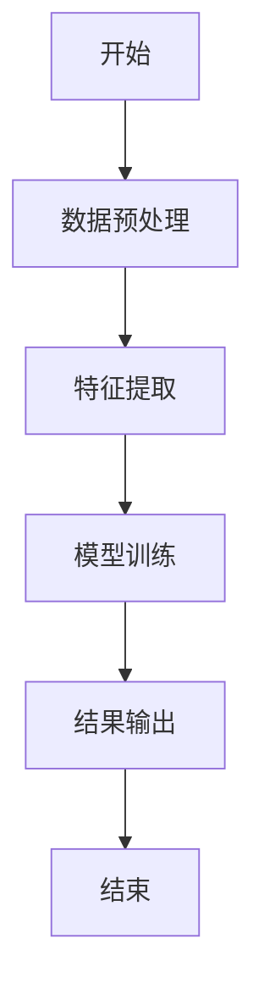
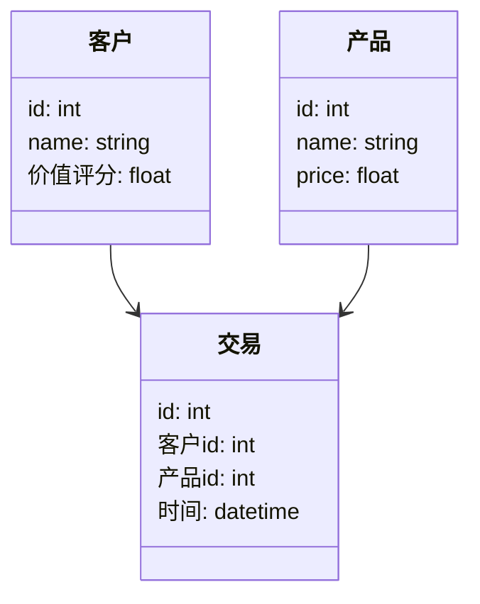
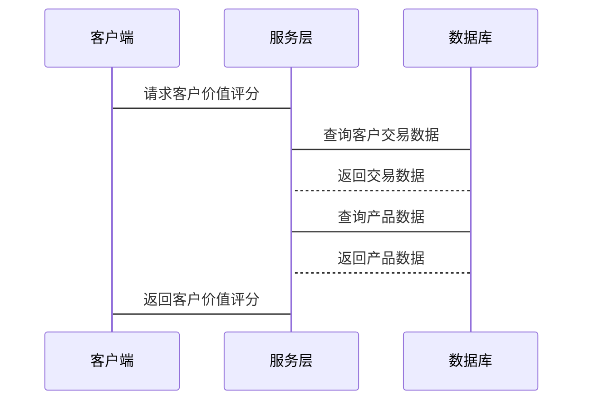

                 


# 企业估值中的客户价值评估法

> 关键词：客户价值评估法, 企业估值, 客户价值模型, RFM模型, 数据分析, 商业价值

> 摘要：客户价值评估法是一种基于客户行为和交易数据的分析方法，用于帮助企业更准确地评估客户的商业价值。本文将详细介绍客户价值评估法的背景、核心概念、算法原理、系统架构设计、项目实战以及最佳实践。

---

# 第一部分: 客户价值评估法的背景与核心概念

## 第1章: 客户价值评估法的背景介绍

### 1.1 客户价值评估法的背景
#### 1.1.1 企业估值中的客户价值问题背景
在企业估值过程中，传统的方法往往侧重于财务指标（如收入、利润、资产等）的评估，而忽略了客户这一关键资产的价值。企业的客户群体是企业持续发展的核心，客户价值的评估能够帮助企业更好地理解客户对公司整体价值的贡献。

#### 1.1.2 问题背景与问题描述
传统的估值方法难以量化客户的实际价值，尤其是在客户群体具有高度异质性的情况下。不同客户对企业的贡献可能差异很大，而传统方法往往将所有客户视为同质，导致估值不准确。

#### 1.1.3 客户价值评估法的提出与意义
客户价值评估法通过分析客户的消费行为、购买频率、购买金额等数据，量化每个客户对企业的贡献，从而帮助企业更精准地进行估值和资源分配。

### 1.2 客户价值评估法的核心概念

#### 1.2.1 核心概念的定义
客户价值评估法是一种基于客户数据分析的方法，旨在量化每个客户对企业的价值贡献。其核心在于通过客户的行为数据，构建客户价值模型，评估客户的商业价值。

#### 1.2.2 核心概念的属性特征对比表
以下是客户价值评估法中几个核心概念的对比：

| 核心概念 | 输入数据 | 输出结果 | 目标 |
|----------|----------|----------|------|
| RFM模型 | 交易时间、频率、金额 | 客户价值评分 | 精准识别高价值客户 |
| 贡献度模型 | 客户的购买记录 | 客户对企业的利润贡献 | 优化资源配置 |

#### 1.2.3 ER实体关系图
以下是客户价值评估法的ER实体关系图：

```mermaid
erDiagram
    customer[CUSTOMER] {
        +id: int
        +name: string
        +value: float
    }
    product[PRODUCT] {
        +id: int
        +name: string
        +price: float
    }
    transaction[TRANSACTION] {
        +id: int
        +customer_id: int
        +product_id: int
        +time: datetime
    }
    CUSTOMER o-- TRANSACTION
    PRODUCT o-- TRANSACTION
```

## 第2章: 客户价值评估法的核心概念与联系

### 2.1 核心概念原理
客户价值评估法的核心在于通过分析客户的交易数据，构建客户价值模型。模型的构建基于以下关键要素：

1. **交易数据**：客户的购买记录，包括购买时间、频率、金额等。
2. **客户属性**：客户的 demographic（人口统计）和 psychographic（心理统计）特征。
3. **产品属性**：产品的价格、类别、生命周期等。

### 2.2 核心概念属性特征对比表
以下是核心概念的属性特征对比：

| 属性 | RFM模型 | 贡献度模型 |
|------|---------|-----------|
| 输入数据 | 交易时间、频率、金额 | 客户的购买记录 |
| 输出结果 | 客户价值评分 | 客户对企业的利润贡献 |
| 目标 | 精准识别高价值客户 | 优化资源配置 |

### 2.3 客户价值模型的数学表达

客户价值模型可以通过以下公式表示：

$$ \text{客户价值} = \sum (\text{购买金额} \times \text{客户生命周期}) $$

其中，客户生命周期可以通过历史交易数据进行预测。

---

# 第二部分: 客户价值评估法的算法原理

## 第3章: 算法原理概述

### 3.1 算法原理

客户价值评估法的核心算法是基于 RFM（Recency, Frequency, Monetary）模型的客户价值评分。以下是 RFM 模型的详细解释：

1. **Recency（最近一次购买时间）**：表示客户最近一次购买的时间，反映了客户当前的活跃程度。
2. **Frequency（购买频率）**：表示客户在一定时间内的购买次数，反映了客户对产品的依赖程度。
3. **Monetary（购买金额）**：表示客户每次购买的平均金额，反映了客户的消费能力。

### 3.2 算法流程图

以下是 RFM 模型的算法流程图：



### 3.3 算法实现代码

以下是 RFM 模型的 Python 实现代码：

```python
import pandas as pd
from sklearn.preprocessing import StandardScaler
from sklearn.cluster import KMeans

# 数据预处理
data = pd.read_csv('customer_data.csv')
data['最近购买时间'] = pd.to_datetime(data['最近购买时间'])
data['最近购买时间'] = (data['最近购买时间'].max() - data['最近购买时间']).dt.days

# 特征提取
features = ['最近购买时间', '购买频率', '购买金额']
X = data[features]

# 标准化处理
scaler = StandardScaler()
X_scaled = scaler.fit_transform(X)

# K-means 聚类
kmeans = KMeans(n_clusters=5)
data['客户价值评分'] = kmeans.fit_predict(X_scaled)
```

### 3.4 数学模型与公式

RFM 模型的数学公式如下：

$$ \text{客户价值评分} = k \times \text{最近购买时间} + m \times \text{购买频率} + n \times \text{购买金额} $$

其中，k、m、n 是模型的权重系数，可以通过训练数据进行优化。

---

# 第三部分: 系统分析与架构设计

## 第4章: 系统分析与架构设计

### 4.1 问题场景介绍
客户价值评估系统的目标是通过客户的交易数据，评估客户的商业价值，并帮助企业进行精准的客户管理。

### 4.2 系统功能设计
以下是系统功能设计的领域模型：



### 4.3 系统架构设计
以下是系统的架构设计：

```mermaid
rect angle 客户端 {
    "用户界面"
}
rect angle 服务层 {
    "客户价值评估服务"
}
rect angle 数据库 {
    "客户数据表"
    "交易数据表"
    "产品数据表"
}
```

### 4.4 接口设计
以下是系统的接口设计：



---

# 第四部分: 项目实战

## 第5章: 项目实战

### 5.1 环境安装
以下是项目实战所需的环境安装：

1. 安装 Python 和相关库：
   ```bash
   pip install pandas scikit-learn mermaid4jupyter
   ```

2. 数据集下载：
   ```bash
   wget https://example.com/customer_data.csv
   ```

### 5.2 核心代码实现
以下是核心代码实现：

```python
import pandas as pd
from sklearn.preprocessing import StandardScaler
from sklearn.cluster import KMeans

# 数据预处理
data = pd.read_csv('customer_data.csv')
data['最近购买时间'] = pd.to_datetime(data['最近购买时间'])
data['最近购买时间'] = (data['最近购买时间'].max() - data['最近购买时间']).dt.days

# 特征提取
features = ['最近购买时间', '购买频率', '购买金额']
X = data[features]

# 标准化处理
scaler = StandardScaler()
X_scaled = scaler.fit_transform(X)

# K-means 聚类
kmeans = KMeans(n_clusters=5)
data['客户价值评分'] = kmeans.fit_predict(X_scaled)

# 输出结果
print(data[['客户id', '客户价值评分']].head())
```

### 5.3 代码解读与分析
以下是代码解读：

1. 数据预处理：将客户的最近购买时间转换为天数，以便后续分析。
2. 特征提取：提取客户的最近购买时间、购买频率和购买金额作为特征。
3. 数据标准化：对特征进行标准化处理，以便 K-means 聚类算法能够更好地工作。
4. K-means 聚类：使用 K-means 算法对客户进行聚类，得到客户的价值评分。

### 5.4 案例分析
以下是案例分析：

假设我们有一个客户的数据如下：

| 客户id | 最近购买时间 | 购买频率 | 购买金额 |
|-------|--------------|----------|----------|
| 1001  | 30天         | 5次      | $200     |

根据上述代码，我们可以计算出该客户的客户价值评分为 4（假设聚类结果为 5 个类别）。

### 5.5 项目小结
通过上述代码实现，我们可以看到客户价值评估法在实际项目中的应用效果。通过 RFM 模型，我们可以精准识别高价值客户，并为企业提供数据支持。

---

# 第五部分: 最佳实践与总结

## 第6章: 最佳实践

### 6.1 最佳实践 tips
1. 在实际项目中，可以结合客户的行为数据和产品数据，进一步优化客户价值模型。
2. 定期更新客户价值评分，以反映客户行为的变化。
3. 将客户价值评分与客户生命周期相结合，制定更精准的客户管理策略。

### 6.2 小结
客户价值评估法是一种基于数据分析的方法，能够帮助企业更准确地评估客户的商业价值。通过 RFM 模型和 K-means 聚类算法，我们可以实现客户价值评分，并为企业提供数据支持。

### 6.3 注意事项
1. 数据质量：确保数据的准确性和完整性。
2. 模型选择：根据实际需求选择合适的模型。
3. 数据隐私：在处理客户数据时，必须遵守相关法律法规，保护客户隐私。

### 6.4 拓展阅读
1. 《Data Mining: Concepts and Techniques》
2. 《Customer Value Analysis: Theory and Application》
3. 《Python机器学习实战》

---

# 结语

客户价值评估法是企业估值中的重要工具，能够帮助企业更好地理解客户的价值，并制定更精准的客户管理策略。通过本文的介绍，相信读者已经掌握了客户价值评估法的核心概念、算法原理和实际应用。希望本文能够为读者在企业估值和客户管理方面提供有价值的参考。

---

# 作者

作者：AI天才研究院/AI Genius Institute & 禅与计算机程序设计艺术 /Zen And The Art of Computer Programming

