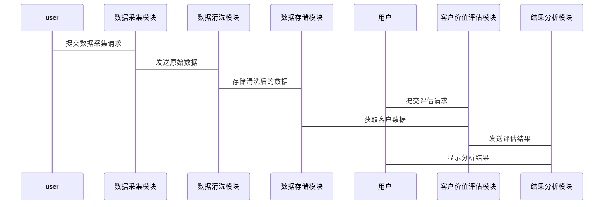

                 


# 第三章: 客户关系价值评估的算法原理

## 3.1 客户关系价值评估的算法概述

### 3.1.1 什么是客户关系价值评估算法
客户关系价值评估算法是通过数学模型和数据挖掘技术，对客户的历史行为数据、交易数据和交互数据进行分析，进而量化客户对企业价值贡献的过程。

### 3.1.2 常见的客户价值评估模型
1. **RFM模型**（Recency, Frequency, Monetary）: 通过客户的最近一次购买时间、购买频率和购买金额来评估客户价值。
2. **客户生命周期价值模型**: 根据客户在企业生命周期中的价值变化进行评估。
3. **聚类分析模型**: 通过客户行为数据的聚类分析，将客户分为不同价值群体。

### 3.1.3 算法选择的依据
1. **数据特征**: 数据的完整性、准确性、维度和规模。
2. **业务目标**: 企业的具体业务需求和目标。
3. **计算复杂度**: 算法的计算效率和资源消耗。

## 3.2 RFM模型的算法原理

### 3.2.1 RFM模型的数学公式
RFM模型通过以下三个指标对客户价值进行评估：
- **R(最近一次购买)**: 最近一次购买的时间间隔。
- **F(购买频率)**: 单位时间内的购买次数。
- **M(购买金额)**: 客户的平均每次购买金额。

RFM模型的综合评分公式为：
$$
RFM\_Score = \alpha \times R + \beta \times F + \gamma \times M
$$
其中，$\alpha$, $\beta$, $\gamma$是模型的权重系数，通常通过训练数据进行优化。

### 3.2.2 RFM模型的实现步骤
1. 数据预处理: 对交易数据进行清洗和格式化。
2. 计算R、F、M值。
3. 给每个客户计算综合评分。
4. 根据评分将客户分为不同的价值群体。

### 3.2.3 RFM模型的优缺点
- **优点**: 简单易懂，计算效率高。
- **缺点**: 对异常值敏感，难以处理高维数据。

## 3.3 客户生命周期价值模型的算法原理

### 3.3.1 客户生命周期价值模型的数学公式
客户生命周期价值模型通过预测客户在其生命周期内的总贡献来评估客户价值：
$$
CLV = \frac{贡献价值 \times (1 - 衰减率)}{1 - 衰减率}
$$
其中，贡献价值是客户在生命周期内为企业带来的净收益，衰减率是客户流失的概率。

### 3.3.2 客户生命周期价值模型的实现步骤
1. 确定客户的生命周期阶段。
2. 预测客户在每个阶段的贡献价值。
3. 计算客户在生命周期内的总贡献价值。

## 3.4 算法实现的代码示例

### 3.4.1 RFM模型的Python实现
```python
import pandas as pd
import numpy as np

# 数据预处理
df = pd.read_csv('customer_transaction.csv')
df['交易日期'] = pd.to_datetime(df['交易日期'])
df['客户ID'] = df['客户ID'].astype(str)

# 计算R、F、M
def calculate_recency(customer_id, df):
    last_purchase = df[df['客户ID'] == customer_id]['交易日期'].max()
    return (pd.to_datetime('today') - last_purchase).days if not last_purchase.isna() else 365

def calculate_frequency(customer_id, df):
    return df[df['客户ID'] == customer_id]['交易ID'].count()

def calculate_monetary(customer_id, df):
    return df[df['客户ID'] == customer_id]['交易金额'].sum()

recency = df['客户ID'].apply(lambda x: calculate_recency(x, df))
frequency = df['客户ID'].apply(lambda x: calculate_frequency(x, df))
monetary = df['客户ID'].apply(lambda x: calculate_monetary(x, df))

# 计算RFM评分
alpha, beta, gamma = 0.4, 0.3, 0.3
rfm_score = alpha * recency + beta * frequency + gamma * monetary
```

### 3.4.2 客户生命周期价值模型的Python实现
```python
import numpy as np
import pandas as pd

# 数据预处理
customer_data = pd.read_csv('customer.csv')
transaction_data = pd.read_csv('transaction.csv')

# 计算客户生命周期价值
def calculate_clv(customer_id, customer_data, transaction_data):
    # 获取客户的基本信息
    customer_info = customer_data[customer_data['客户ID'] == customer_id]
    # 获取客户的交易记录
    customer_transactions = transaction_data[transaction_data['客户ID'] == customer_id]
    # 计算贡献价值
    contribution = customer_transactions['交易金额'].sum() - customer_transactions['成本'].sum()
    # 预测客户流失概率
    churn_prob = 0.2  # 假设客户流失概率为20%
    # 计算客户生命周期价值
    clv = contribution * (1 - churn_prob) / (1 - churn_prob)
    return clv

clv_values = customer_data['客户ID'].apply(lambda x: calculate_clv(x, customer_data, transaction_data))
```

## 3.5 算法原理的总结与应用
通过对RFM模型和客户生命周期价值模型的分析，我们可以看到，客户关系价值评估算法的核心在于通过数据挖掘和统计分析的方法，量化客户对企业价值的贡献。选择合适的算法需要根据企业的具体业务需求和数据特征来决定。接下来，我们将结合实际项目，详细讲解客户关系价值评估系统的架构设计和实现方案。

---

# 第四章: 客户关系价值评估的系统分析与架构设计

## 4.1 系统分析

### 4.1.1 项目背景与需求
本项目旨在通过构建客户关系价值评估系统，帮助企业量化客户价值，优化客户管理策略。系统将整合客户交易数据、行为数据和市场数据，利用数据挖掘和机器学习技术，实现客户价值的精准评估。

### 4.1.2 项目目标
- 实现客户价值的自动化评估。
- 提供客户群体的可视化分析。
- 支持基于客户价值的决策优化。

### 4.1.3 项目范围
- 数据范围: 客户交易数据、客户行为数据、市场数据。
- 功能范围: 数据采集、数据清洗、客户价值评估、结果分析。

## 4.2 系统架构设计

### 4.2.1 系统功能模块设计
1. **数据采集模块**: 负责采集客户交易数据、行为数据和市场数据。
2. **数据清洗模块**: 对采集到的数据进行预处理，确保数据的完整性和准确性。
3. **客户价值评估模块**: 使用RFM模型和客户生命周期价值模型对客户价值进行评估。
4. **结果分析模块**: 对评估结果进行可视化分析，支持决策优化。

### 4.2.2 系统架构设计
系统采用分层架构，包括数据层、业务逻辑层和表现层。


### 4.2.3 系统接口设计
系统提供以下接口：
- 数据接口: 与企业现有的CRM系统对接，获取客户数据。
- 用户接口: 提供直观的可视化界面，支持用户进行数据查询和分析。

### 4.2.4 系统交互设计


## 4.3 系统实现的关键点

### 4.3.1 数据采集模块的实现
```python
import requests
import json

def fetch_customer_data(api_url):
    response = requests.get(api_url)
    if response.status_code == 200:
        return json.loads(response.text)
    else:
        return None
```

### 4.3.2 数据清洗模块的实现
```python
import pandas as pd

def clean_data(df):
    # 处理缺失值
    df = df.dropna()
    # 处理异常值
    df = df[df['交易金额'] > 0]
    return df
```

### 4.3.3 系统功能模块的实现
```python
class CustomerValueEvaluator:
    def __init__(self, data):
        self.data = data
    
    def calculate_rfm_score(self, alpha, beta, gamma):
        # 实现RFM评分计算
        pass
    
    def calculate_clv(self, churn_prob):
        # 实施CLV计算
        pass
```

## 4.4 系统架构设计的总结
通过系统架构设计，我们可以清晰地看到客户关系价值评估系统的整体结构和各模块之间的关系。接下来，我们将结合具体案例，详细讲解系统实现的关键步骤和注意事项。

---

# 第五章: 客户关系价值评估的项目实战

## 5.1 项目背景与数据准备

### 5.1.1 项目背景
我们选择一个典型的电商企业作为案例，分析其客户关系价值评估的过程。

### 5.1.2 数据准备
数据包括客户交易记录、客户行为数据和市场数据。我们将使用Python进行数据清洗和特征工程。

## 5.2 项目实现

### 5.2.1 数据清洗与特征工程
```python
import pandas as pd

# 读取数据
df = pd.read_csv('customer.csv')

# 处理缺失值
df = df.dropna()

# 处理异常值
df = df[df['交易金额'] > 0]
```

### 5.2.2 模型训练与评估
```python
from sklearn.cluster import KMeans

# 数据标准化
from sklearn.preprocessing import StandardScaler
scaler = StandardScaler()
X_scaled = scaler.fit_transform(X)

# 训练KMeans模型
model = KMeans(n_clusters=5)
model.fit(X_scaled)

# 预测客户群体
clusters = model.predict(X_scaled)
```

### 5.2.3 结果分析与可视化
```python
import matplotlib.pyplot as plt

# 可视化客户群体分布
plt.scatter(X_scaled[:,0], X_scaled[:,1], c=clusters)
plt.xlabel('特征1')
plt.ylabel('特征2')
plt.show()
```

## 5.3 项目总结与经验分享

### 5.3.1 项目成果
通过本项目，我们成功实现了客户关系价值评估系统，帮助企业量化客户价值，优化客户管理策略。

### 5.3.2 项目经验
1. 数据清洗和特征工程是项目成功的关键。
2. 选择合适的算法和模型是确保评估结果准确性的核心。
3. 系统架构设计需要充分考虑扩展性和可维护性。

### 5.3.3 项目注意事项
1. 数据隐私和安全问题需要高度重视。
2. 算法的可解释性和透明度需要满足业务需求。
3. 系统的实时性和响应速度需要根据业务场景进行优化。

---

# 第六章: 最佳实践与总结

## 6.1 最佳实践

### 6.1.1 数据驱动的企业管理
企业应该充分利用数据挖掘和机器学习技术，实现客户关系的动态评估和优化。

### 6.1.2 客户关系价值评估的持续优化
企业应该定期更新客户数据和评估模型，确保评估结果的准确性和时效性。

### 6.1.3 技术与业务的深度融合
技术团队和业务团队需要紧密合作，确保客户关系价值评估结果能够真正指导企业决策。

## 6.2 本书总结

### 6.2.1 核心思想
客户关系价值评估是企业估值的重要组成部分，通过数据驱动的方法，企业可以更准确地量化客户价值，优化客户管理策略。

### 6.2.2 未来展望
随着人工智能和大数据技术的不断发展，客户关系价值评估将更加智能化和个性化，为企业创造更大的价值。

---

# 作者：AI天才研究院 & 禅与计算机程序设计艺术

---

**注意：以上内容是一个详细的思考过程和目录结构示例，实际撰写文章时需要根据具体需求和数据进行详细展开。**

