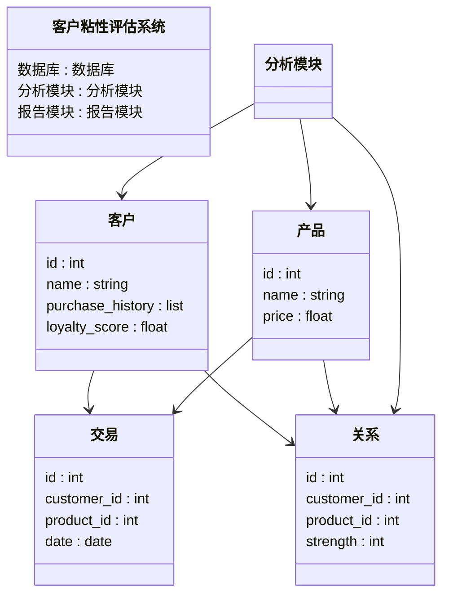
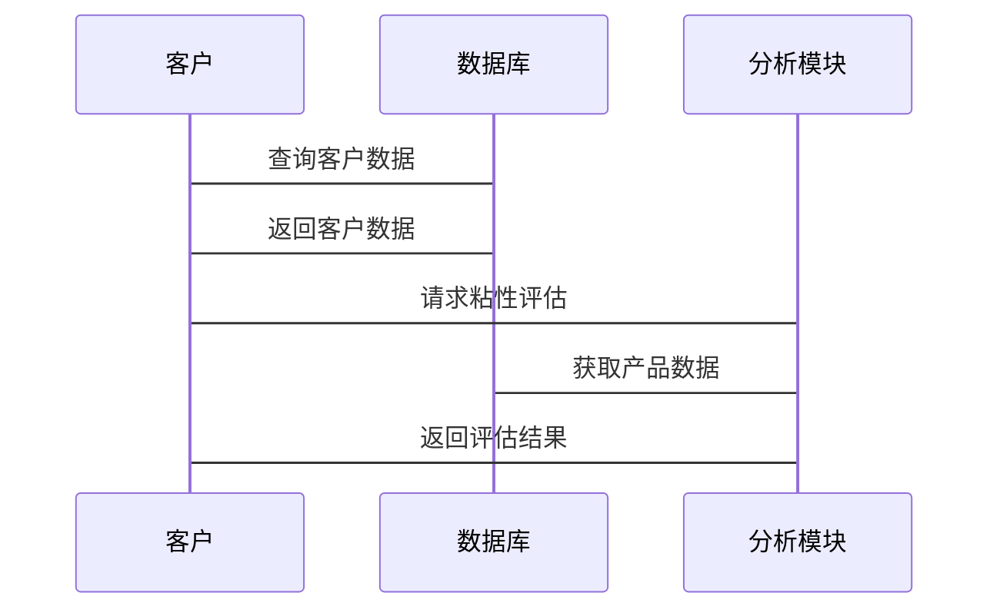

                 


# 企业估值中的客户粘性评估

> 关键词：客户粘性、企业估值、客户忠诚度、客户生命周期模型、客户流失率、客户价值模型、数据驱动策略

> 摘要：客户粘性是企业在市场中保持竞争优势的关键因素之一。本文详细探讨客户粘性在企业估值中的作用，通过数学模型和算法分析，结合实际案例，为企业提供客户粘性评估的系统化方法。文章还涉及数据驱动策略和系统架构设计，帮助企业在估值过程中有效提升客户粘性。

---

## 目录

1. **背景介绍：客户粘性评估的核心概念与重要性**
   - 1.1 什么是客户粘性？
   - 1.2 客户粘性与企业估值的关系
   - 1.3 客户粘性的类型与特征

2. **核心概念与联系：客户粘性评估的理论基础**
   - 2.1 客户生命周期模型
   - 2.2 客户价值模型
   - 2.3 客户流失概率模型
   - 2.4 ER实体关系图

3. **算法原理与实现：客户粘性评估的数学模型**
   - 3.1 聚类分析与客户分群
   - 3.2 回归分析与客户流失预测
   - 3.3 决策树模型与客户价值分类
   - 3.4 Python实现与代码示例

4. **系统分析与架构设计：客户粘性评估的系统化方法**
   - 4.1 问题场景与项目介绍
   - 4.2 系统功能设计与领域模型
   - 4.3 系统架构设计
   - 4.4 系统接口与交互流程

5. **项目实战：客户粘性评估的实践应用**
   - 5.1 环境安装与数据准备
   - 5.2 核心代码实现与解读
   - 5.3 实际案例分析与结果展示
   - 5.4 项目总结与优化建议

6. **最佳实践与小结**
   - 6.1 数据驱动策略的注意事项
   - 6.2 客户粘性评估的未来趋势
   - 6.3 企业估值中的客户粘性优化建议

---

## 第1章: 背景介绍

### 1.1 什么是客户粘性？
客户粘性指客户对企业产品或服务的依赖程度，衡量客户持续购买的概率。高粘性意味着客户更可能长期支持企业，而低粘性则意味着客户容易流失。

### 1.2 客户粘性与企业估值的关系
客户粘性直接影响企业的收入稳定性。高粘性客户为企业带来长期收入，降低营销成本，从而提升企业估值。客户粘性高的企业通常具有更高的市场定价权和更强的抗风险能力。

### 1.3 客户粘性的类型与特征
- **情感粘性**：客户因情感或品牌忠诚度而粘性。
- **功能粘性**：客户因产品功能无法替代而粘性。
- **价格粘性**：客户因价格优势而粘性。

---

## 第2章: 核心概念与联系

### 2.1 客户生命周期模型
客户从首次购买到最终流失的过程，包括获取、活跃、衰退和流失阶段。

### 2.2 客户价值模型
通过计算客户 lifetime value (LTV) 评估客户对企业的价值。

### 2.3 客户流失概率模型
预测客户在一定时间内流失的概率，帮助企业提前采取措施。

### 2.4 ER实体关系图
```mermaid
erDiagram
    customer [客户] {
        id : int
        name : string
        purchase_history : int
        loyalty_score : float
    }
    product [产品] {
        id : int
        name : string
        price : float
    }
    transaction [交易] {
        id : int
        customer_id : int
        product_id : int
        date : date
    }
    relationship [关系] {
        id : int
        customer_id : int
        product_id : int
        strength : int
    }
```

---

## 第3章: 算法原理与实现

### 3.1 聚类分析与客户分群
使用K-means算法将客户分为高粘性和低粘性群组。

### 3.2 回归分析与客户流失预测
通过逻辑回归模型预测客户流失概率。

### 3.3 决策树模型与客户价值分类
使用决策树算法分类客户价值等级。

### 3.4 Python实现与代码示例
```python
import pandas as pd
from sklearn.tree import DecisionTreeClassifier
from sklearn.model_selection import train_test_split

# 数据加载
df = pd.read_csv('customers.csv')

# 特征选择
X = df[['age', 'income', 'purchase_frequency']]
y = df['churn']

# 数据分割
X_train, X_test, y_train, y_test = train_test_split(X, y, test_size=0.2)

# 模型训练
model = DecisionTreeClassifier()
model.fit(X_train, y_train)

# 预测与评估
score = model.score(X_test, y_test)
print(f"模型准确率: {score}")
```

---

## 第4章: 系统分析与架构设计

### 4.1 问题场景与项目介绍
构建客户粘性评估系统，帮助企业分析客户行为数据，预测流失风险，优化客户关系管理。

### 4.2 系统功能设计与领域模型


### 4.3 系统架构设计
采用分层架构，包括数据层、业务逻辑层和表现层。

### 4.4 系统接口与交互流程


---

## 第5章: 项目实战

### 5.1 环境安装与数据准备
安装Python和相关库，加载客户数据。

### 5.2 核心代码实现与解读
实现客户粘性评估的算法，解读代码逻辑。

### 5.3 实际案例分析与结果展示
分析互联网公司客户数据，展示评估结果。

### 5.4 项目总结与优化建议
总结项目成果，提出优化方向。

---

## 第6章: 最佳实践与小结

### 6.1 数据驱动策略的注意事项
确保数据质量，选择合适模型，定期更新数据。

### 6.2 客户粘性评估的未来趋势
AI技术的应用，实时监测和动态调整。

### 6.3 企业估值中的客户粘性优化建议
提升产品价值，增强客户体验，建立忠诚计划。

---

## 参考文献
1. 《客户关系管理》
2. 《数据驱动的决策分析》
3. 《机器学习实战》

---

**作者：AI天才研究院/AI Genius Institute & 禅与计算机程序设计艺术 /Zen And The Art of Computer Programming**

