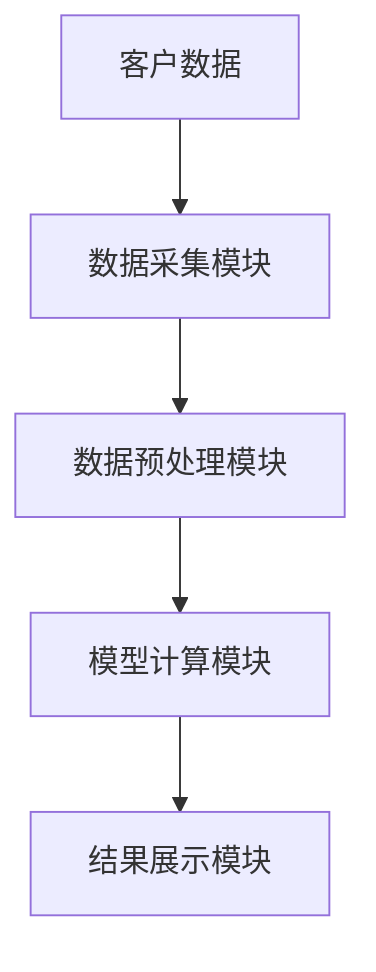
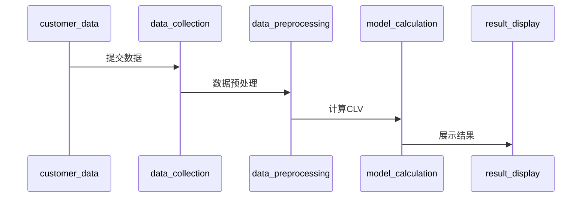

                 


# 企业估值中的客户终身价值计算

> 关键词：客户终身价值（CLV）、企业估值、客户价值、生命周期价值、数据驱动决策

> 摘要：客户终身价值（CLV）是企业在评估客户价值和制定长期战略时的重要指标。本文将深入探讨CLV的计算方法、应用场景、系统架构设计以及实际案例分析，帮助读者理解如何通过数据驱动的方法提升企业估值和客户管理能力。

---

## 第一章：客户终身价值（CLV）概述

### 1.1 问题背景与重要性

#### 1.1.1 企业估值中的客户价值问题

企业估值的核心在于评估客户的价值，而客户的价值不仅仅体现在短期的交易中，更体现在他们一生中为企业带来的收入和利润。传统的估值方法往往只关注当前的财务表现，而忽略了客户未来的贡献。这种短视的估值方式可能导致企业错失长期价值的增长机会。

#### 1.1.2 客户终身价值的核心概念

客户终身价值（CLV）是指一个客户在其整个生命周期内为企业带来的总收入减去获取和维护该客户所花费的成本。CLV不仅考虑了客户的当前价值，还考虑了客户未来的潜在价值。通过计算CLV，企业可以更准确地评估客户的长期价值，并制定更有针对性的客户管理策略。

#### 1.1.3 CLV 在企业决策中的作用

CLV为企业提供了以下几方面的价值：
- **客户细分**：通过CLV，企业可以将客户分为高价值和低价值客户，从而优化资源配置。
- **定价策略**：CLV帮助企业确定合理的定价策略，确保客户为企业创造的净价值与其支付的成本相匹配。
- **营销投资决策**：通过CLV，企业可以评估不同营销活动的回报，优化营销预算的分配。
- **客户保留策略**：CLV为企业制定客户保留策略提供了依据，帮助企业在客户流失前采取有效措施。

### 1.2 CLV 的计算模型与方法

#### 1.2.1 CLV 的基本公式与假设

CLV的计算基于以下假设：
- 客户的购买行为服从一定的概率分布。
- 客户的购买行为随时间推移而变化。
- 客户的流失概率是恒定的。

CLV的基本公式为：

$$ CLV = \frac{R}{(1 - \omega)} $$

其中：
- $R$ 表示客户生命周期内的预期收入。
- $\omega$ 表示客户流失的概率。

#### 1.2.2 CLV 的核心输入参数

CLV的计算需要以下关键输入参数：
1. **客户年度收入（ARPU）**：客户在生命周期内的年收入。
2. **客户流失率（$\omega$）**：客户在某一时间点流失的概率。
3. **贴现率（$\delta$）**：用于将未来的收入折现到当前的价值。
4. **成本（C）**：获取和维护客户的成本。

#### 1.2.3 CLV 的应用场景与边界

CLV的应用场景包括：
- **客户细分与价值评估**：将客户分为高价值和低价值客户，优化资源配置。
- **定价策略制定**：根据客户的CLV确定产品或服务的定价。
- **营销投资决策**：评估不同营销活动的回报，优化预算分配。
- **客户保留策略制定**：根据客户的CLV制定客户保留计划，降低高价值客户的流失率。

CLV的计算边界包括：
- CLV的计算基于客户的购买行为和流失概率，忽略了市场的宏观经济波动。
- CLV的计算假设客户的行为是稳定的，忽略了客户的个体差异。

---

## 第二章：CLV 的计算模型与算法

### 2.1 CLV 的数学模型

#### 2.1.1 CLV 的基本公式

$$ CLV = \frac{R}{(1 - \omega)} $$

其中：
- $R$ 表示客户生命周期内的预期收入。
- $\omega$ 表示客户流失的概率。

#### 2.1.2 CLV 的扩展公式

$$ CLV = \sum_{t=1}^{n} \frac{R_t}{(1 + \delta)^t} \cdot (1 - \omega)^{t-1} $$

其中：
- $R_t$ 表示第 $t$ 年的收入。
- $\delta$ 表示贴现率。
- $\omega$ 表示客户流失概率。

### 2.2 客户流失概率的计算方法

#### 2.2.1 基于历史数据的流失概率估计

客户流失概率可以通过历史数据分析得出。假设企业有 $N$ 个客户，其中 $M$ 个客户在生命周期内流失。则客户流失概率 $\omega$ 可以表示为：

$$ \omega = \frac{M}{N} $$

#### 2.2.2 基于机器学习的流失概率预测

客户流失概率也可以通过机器学习模型进行预测。常用的方法包括逻辑回归、随机森林和XGBoost等。以逻辑回归为例，流失概率的预测公式为：

$$ P(\text{流失}) = \frac{1}{1 + e^{-\beta x}} $$

其中：
- $\beta$ 是模型的系数。
- $x$ 是客户的特征向量。

### 2.3 CLV 的计算步骤与流程

#### 2.3.1 数据收集与预处理

1. 收集客户的基本信息，包括客户的购买记录、支付方式、消费频率等。
2. 预处理数据，包括数据清洗、特征提取和数据标准化。

#### 2.3.2 参数估计与模型训练

1. 通过历史数据估计客户流失概率 $\omega$ 和贴现率 $\delta$。
2. 使用机器学习模型训练客户流失概率的预测模型。

#### 2.3.3 CLV 的计算与验证

1. 使用估计的参数和模型计算客户的CLV。
2. 验证计算结果的准确性，调整模型参数以提高预测精度。

---

## 第三章：系统分析与架构设计

### 3.1 问题场景与需求分析

#### 3.1.1 系统目标

系统目标是通过计算客户的CLV，帮助企业优化客户管理策略，提升企业估值。

#### 3.1.2 系统功能需求

- 数据采集与处理：收集和预处理客户数据。
- 模型计算：计算客户的CLV。
- 结果展示：展示客户的CLV和相关分析结果。

### 3.2 系统功能设计

#### 3.2.1 数据采集模块

数据采集模块负责收集客户的基本信息和交易数据，包括：
- 客户ID
- 购买记录
- 支付方式
- 消费频率

#### 3.2.2 模型计算模块

模型计算模块负责计算客户的CLV，包括：
- 客户流失概率的计算
- CLV的计算
- 模型验证与优化

#### 3.2.3 结果展示模块

结果展示模块负责展示客户的CLV和相关分析结果，包括：
- 客户CLV的分布
- 高价值客户的识别
- 客户流失预警

### 3.3 系统架构设计

#### 3.3.1 系统架构图



#### 3.3.2 系统功能模块

- 数据采集模块：负责收集客户数据。
- 数据预处理模块：负责清洗和标准化数据。
- 模型计算模块：负责计算客户的CLV。
- 结果展示模块：负责展示计算结果。

### 3.4 系统接口设计

- 数据采集模块接口：`get_customer_data()`
- 数据预处理模块接口：`preprocess_data(data)`
- 模型计算模块接口：`calculate_clv(data)`
- 结果展示模块接口：`display_results(results)`

### 3.5 系统交互流程



---

## 第四章：项目实战

### 4.1 环境安装与配置

#### 4.1.1 环境需求

- Python 3.8+
- Jupyter Notebook
- Pandas、NumPy、Scikit-learn、XGBoost

### 4.2 核心实现代码

#### 4.2.1 数据预处理代码

```python
import pandas as pd
import numpy as np

# 加载数据
data = pd.read_csv('customer_data.csv')

# 数据清洗
data.dropna(inplace=True)

# 特征提取
features = data[['age', 'gender', 'purchase_frequency', 'annual_revenue']]
```

#### 4.2.2 CLV 计算代码

```python
from sklearn.linear_model import LogisticRegression

# 训练流失概率预测模型
model = LogisticRegression()
model.fit(features, target)

# 预测流失概率
predicted_proba = model.predict_proba(features)[:, 1]

# 计算CLV
R = features['annual_revenue'].mean()
omega = predicted_proba.mean()
clv = R / (1 - omega)
```

### 4.3 案例分析与结果解读

#### 4.3.1 案例分析

假设某电商企业有1000个客户，平均年度收入为1000元，流失概率为10%。则客户的CLV为：

$$ CLV = \frac{1000}{1 - 0.1} = 1111.11 \text{元} $$

#### 4.3.2 结果解读

通过计算，企业可以识别高价值客户，制定针对性的营销策略，优化客户保留计划，从而提升整体企业估值。

---

## 第五章：总结与展望

### 5.1 总结

客户终身价值（CLV）是企业在评估客户价值和制定长期战略时的重要指标。通过计算CLV，企业可以优化客户管理策略，提升企业估值。

### 5.2 最佳实践 tips

- **数据质量**：确保数据的准确性和完整性。
- **模型可解释性**：选择易于解释的模型，便于业务人员理解和应用。
- **持续监控**：定期更新模型参数，适应市场变化。

### 5.3 注意事项

- CLV的计算需要考虑客户的行为特征和市场环境的变化。
- CLV的计算结果仅供参考，实际应用中需要结合具体业务场景进行调整。

### 5.4 拓展阅读

- 《Data-Driven Marketing: The 54-Point Customer View》
- 《Customer Lifetime Value in Theory and Practice》

---

**作者：AI天才研究院/AI Genius Institute & 禅与计算机程序设计艺术 /Zen And The Art of Computer Programming**

