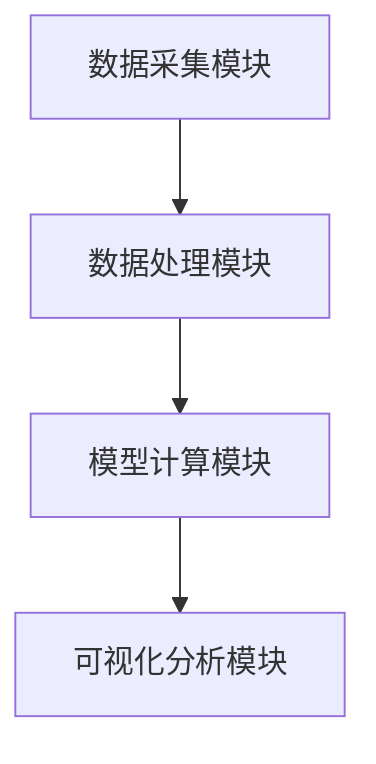
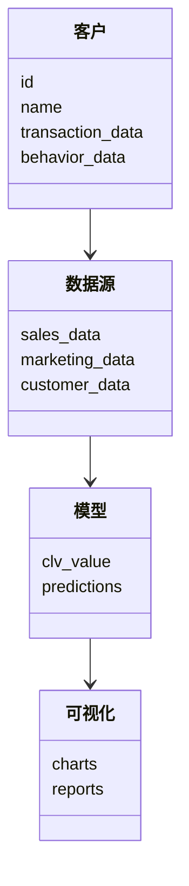
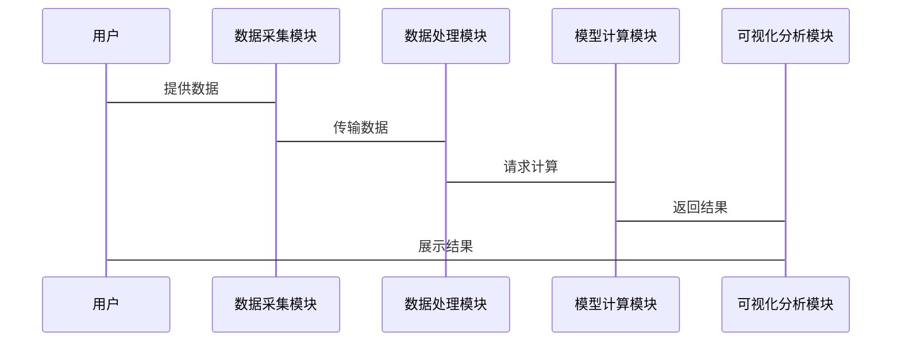

                 


# {{此处是文章标题}}

## {{文章标题}}

### 关键词：{{企业估值, 客户终身价值, 企业价值评估, 客户价值模型, 数据驱动决策, 企业估值方法论}}

### 摘要：{{本文深入探讨了客户终身价值（Customer Lifetime Value，CLV）在企业估值中的应用，从理论基础、计算方法、系统架构到实际案例，全面解析如何通过CLV提升企业估值准确性。结合技术实现，本文为企业估值提供了新的视角和实践指导。}}

---

## 第一章：客户终身价值评估的背景与概念

### 1.1 企业估值中的客户价值

#### 1.1.1 什么是客户终身价值
客户终身价值（CLV）是指客户为企业带来的长期收入减去获取和维护该客户的成本。它是衡量客户对企业贡献的重要指标。

#### 1.1.2 客户终身价值的重要性
CLV帮助企业识别高价值客户，优化资源分配，提升客户保留率和满意度，从而提高企业整体估值。

#### 1.1.3 客户终身价值与企业估值的关系
CLV是企业估值的核心因素之一，因为它直接反映了客户的长期贡献能力。

### 1.2 客户终身价值评估的背景

#### 1.2.1 数字化时代客户价值的变化
数字化技术使得客户行为数据更加可量化，为企业精准评估客户价值提供了可能。

#### 1.2.2 数据驱动的企业决策趋势
现代企业越来越依赖数据驱动的决策，CLV评估正是数据驱动决策的重要应用之一。

#### 1.2.3 客户终身价值评估的兴起
随着市场竞争加剧，企业需要更精确地评估客户价值，CLV评估因此逐渐兴起。

### 1.3 客户终身价值评估的核心概念

#### 1.3.1 客户终身价值的定义与特点
CLV是一个动态的、长期的客户价值指标，需要结合客户行为、市场环境和企业策略进行综合评估。

#### 1.3.2 客户生命周期与价值的关系
客户在不同生命周期阶段对企业的价值贡献不同，CLV需要考虑客户在整个生命周期的贡献。

#### 1.3.3 客户价值评估的边界与外延
CLV评估需要明确评估的范围和边界，包括时间范围、客户群体等。

## 第二章：客户终身价值评估的核心理论

### 2.1 客户终身价值的理论基础

#### 2.1.1 客户价值理论概述
客户价值理论强调从客户角度出发，衡量客户对企业的真实贡献。

#### 2.1.2 终身价值模型的演变
CLV模型从简单的线性模型发展到复杂的机器学习模型，反映了技术的进步和企业需求的变化。

#### 2.1.3 理论基础与实际应用的结合
CLV理论需要结合企业的实际情况进行调整和优化。

### 2.2 客户终身价值评估的核心要素

#### 2.2.1 客户的获取成本
获取新客户所需的投资是CLV计算的重要组成部分。

#### 2.2.2 客户的保留成本
维持客户关系所需的成本直接影响CLV的计算。

#### 2.2.3 客户的收入贡献
客户为企业带来的收入是CLV的核心指标。

#### 2.2.4 客户生命周期阶段
客户在不同阶段的贡献和需求不同，需要分别评估。

### 2.3 客户终身价值与企业估值的关系

#### 2.3.1 客户价值对企业估值的影响
高CLV客户能够显著提升企业估值，反之则可能降低估值。

#### 2.3.2 企业估值中的客户价值评估方法
CLV评估方法包括定量分析和定性分析，帮助企业更准确地评估客户价值。

#### 2.3.3 客户价值评估的边界与外延
CLV评估需要明确数据范围、时间范围和客户群体范围，以确保评估的准确性和可操作性。

## 第三章：客户终身价值的计算方法

### 3.1 客户终身价值的计算模型

#### 3.1.1 简单模型
简单的CLV计算模型适用于数据有限的企业，但可能不够精确。

#### 3.1.2 复杂模型
复杂模型结合了更多的变量和因素，能够更准确地评估客户价值。

#### 3.1.3 基于机器学习的模型
机器学习模型通过大数据分析，能够更精准地预测客户的长期价值。

### 3.2 客户终身价值计算的关键参数

#### 3.2.1 客户的生命周期价值
客户在整个生命周期内为企业带来的总收入。

#### 3.2.2 客户的获取成本
获取新客户所需的投资，包括营销费用和时间成本。

#### 3.2.3 客户的保留成本
维持客户关系所需的成本，包括客服费用和技术支持。

#### 3.2.4 客户的收入贡献
客户为企业带来的直接收入，包括销售额和服务收入。

### 3.3 客户终身价值计算的步骤

#### 3.3.1 数据收集与准备
收集客户行为数据、交易数据和市场数据，为计算CLV提供基础。

#### 3.3.2 参数估计
通过统计分析和机器学习模型，估计CLV计算中的关键参数。

#### 3.3.3 计算与验证
根据估计的参数计算CLV，并通过实际数据进行验证和调整。

#### 3.3.4 结果分析
分析CLV计算结果，识别高价值客户，优化企业资源分配。

## 第四章：客户终身价值评估的算法原理

### 4.1 客户终身价值计算的算法概述

#### 4.1.1 基于历史数据的回归算法
通过回归分析，预测客户的长期价值。

#### 4.1.2 基于机器学习的预测算法
利用机器学习模型，如随机森林和神经网络，预测客户的CLV。

#### 4.1.3 基于客户分群的算法
将客户分为不同的群体，分别计算各群体的CLV。

### 4.2 客户终身价值计算的数学模型

#### 4.2.1 简单线性回归模型
$$ CLV = a + b \cdot t $$
其中，a是截距，b是回归系数，t是时间变量。

#### 4.2.2 多元回归模型
$$ CLV = a + b_1 \cdot x_1 + b_2 \cdot x_2 + \dots + b_n \cdot x_n $$
其中，x_i是多个自变量，b_i是对应的回归系数。

#### 4.2.3 基于机器学习的模型
使用随机森林或神经网络模型，预测客户的CLV。

### 4.3 客户终身价值计算的流程

#### 4.3.1 数据准备
- 收集客户交易数据
- 收集客户行为数据
- 收集市场数据

#### 4.3.2 数据清洗
- 去除异常值
- 填补缺失值
- 标准化数据

#### 4.3.3 模型训练
- 选择合适的算法
- 调参优化
- 训练模型

#### 4.3.4 模型验证
- 使用测试数据验证模型
- 计算误差指标（如MAE、RMSE）
- 调整模型参数

#### 4.3.5 模型应用
- 预测客户CLV
- 分析高价值客户
- 优化企业资源分配

### 4.4 本章小结
本章详细介绍了客户终身价值计算的算法原理，包括回归模型和机器学习模型，并通过流程图展示了计算的步骤。

---

## 第五章：客户终身价值评估的系统架构设计

### 5.1 问题场景介绍

#### 5.1.1 企业面临的客户价值评估挑战
- 数据分散
- 模型复杂
- 实时性要求高

#### 5.1.2 客户终身价值评估系统的目标
- 实时计算CLV
- 可视化分析
- 提供决策支持

### 5.2 系统功能设计

#### 5.2.1 数据采集模块
- 收集客户交易数据
- 收集客户行为数据
- 收集市场数据

#### 5.2.2 数据处理模块
- 数据清洗
- 数据转换
- 数据存储

#### 5.2.3 模型计算模块
- 训练CLV模型
- 预测客户CLV
- 输出结果

#### 5.2.4 可视化分析模块
- 展示客户CLV分布
- 可视化客户群体分析
- 提供决策支持

### 5.3 系统架构设计

#### 5.3.1 系统架构图


#### 5.3.2 实体关系图


### 5.4 系统接口设计

#### 5.4.1 API接口设计
- RESTful API
- 输入数据格式：JSON
- 输出结果格式：JSON

#### 5.4.2 数据接口
- 数据采集接口
- 数据处理接口
- 模型计算接口

### 5.5 系统交互设计

#### 5.5.1 交互流程图


---

## 第六章：客户终身价值评估的项目实战

### 6.1 环境安装

#### 6.1.1 安装Python
- 下载安装Python
- 安装必要的库（如pandas、numpy、scikit-learn）

#### 6.1.2 安装机器学习框架
- 安装scikit-learn
- 安装xgboost
- 安装lightgbm

#### 6.1.3 安装可视化工具
- 安装matplotlib
- 安装seaborn
- 安装plotly

### 6.2 系统核心实现源代码

#### 6.2.1 数据处理代码
```python
import pandas as pd
import numpy as np

# 读取数据
data = pd.read_csv('customer_data.csv')

# 数据清洗
data = data.dropna()
data = data[~data.duplicated()]
data['transaction_date'] = pd.to_datetime(data['transaction_date'])
```

#### 6.2.2 模型训练代码
```python
from sklearn.model_selection import train_test_split
from sklearn.ensemble import RandomForestRegressor

# 分割数据
X = data.drop('clv', axis=1)
y = data['clv']
X_train, X_test, y_train, y_test = train_test_split(X, y, test_size=0.2, random_state=42)

# 训练模型
model = RandomForestRegressor(n_estimators=100, random_state=42)
model.fit(X_train, y_train)
```

#### 6.2.3 模型预测代码
```python
# 预测结果
y_pred = model.predict(X_test)

# 评估模型
from sklearn.metrics import mean_absolute_error, mean_squared_error
print(f"MAE: {mean_absolute_error(y_test, y_pred)}")
print(f"RMSE: {np.sqrt(mean_squared_error(y_test, y_pred))}")
```

### 6.3 代码应用解读与分析

#### 6.3.1 数据处理解读
- 数据清洗：去除缺失值和重复值，确保数据质量。
- 数据转换：将日期转换为可处理的格式，方便后续分析。

#### 6.3.2 模型训练解读
- 使用随机森林模型进行训练，能够捕捉复杂的客户行为模式。
- 调参优化：通过调整n_estimators参数，优化模型性能。

#### 6.3.3 模型预测解读
- 预测客户CLV，评估模型准确性，为后续决策提供支持。

### 6.4 实际案例分析

#### 6.4.1 案例背景
某电商平台希望通过CLV评估，识别高价值客户，优化营销策略。

#### 6.4.2 数据准备
- 收集过去三年的交易数据
- 收集客户行为数据
- 收集市场活动数据

#### 6.4.3 模型训练
- 使用随机森林模型，预测客户的CLV
- 识别高价值客户群体

#### 6.4.4 结果分析
- 高价值客户贡献了企业80%的收入
- 针对高价值客户制定个性化营销策略

### 6.5 本章小结
本章通过实际案例，详细展示了客户终身价值评估系统的实现过程，包括环境安装、数据处理、模型训练和结果分析。

---

## 第七章：客户终身价值评估总结与展望

### 7.1 最佳实践Tips

#### 7.1.1 数据质量管理
- 确保数据的完整性和准确性
- 定期更新数据

#### 7.1.2 模型优化
- 根据企业需求调整模型参数
- 定期重新训练模型

#### 7.1.3 决策支持
- 将CLV评估结果应用于实际业务决策
- 提供可视化报告，便于管理层理解

### 7.2 本章小结
本文从背景、理论、算法、系统架构到项目实战，全面解析了客户终身价值评估的核心内容和实践方法。

### 7.3 注意事项

#### 7.3.1 数据隐私保护
- 遵守数据隐私法规
- 保护客户数据安全

#### 7.3.2 模型局限性
- CLV评估具有一定的局限性，需要结合实际情况进行调整

#### 7.3.3 持续优化
- 定期评估模型性能
- 根据市场变化调整评估策略

### 7.4 拓展阅读

#### 7.4.1 推荐书籍
- 《客户关系管理》
- 《数据驱动的决策》

#### 7.4.2 推荐博客
- [数据驱动的客户价值评估](https://example.com)
- [机器学习在企业估值中的应用](https://example.com)

---

## 作者：AI天才研究院/AI Genius Institute & 禅与计算机程序设计艺术 /Zen And The Art of Computer Programming

