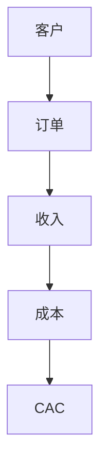
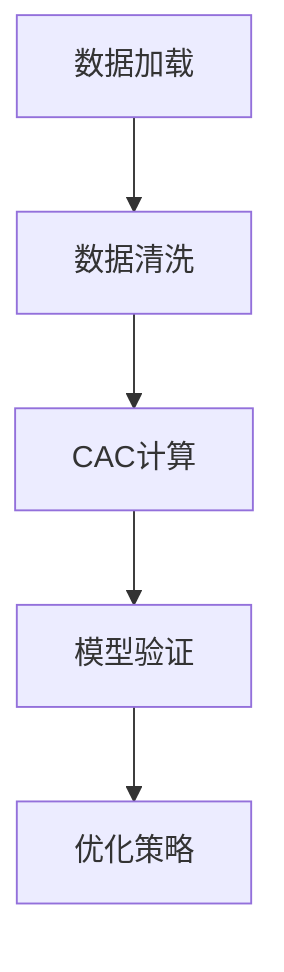
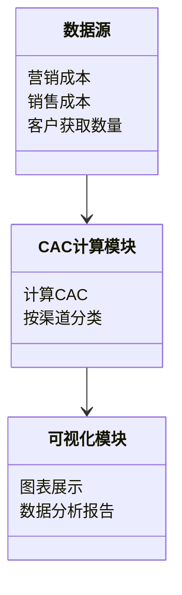
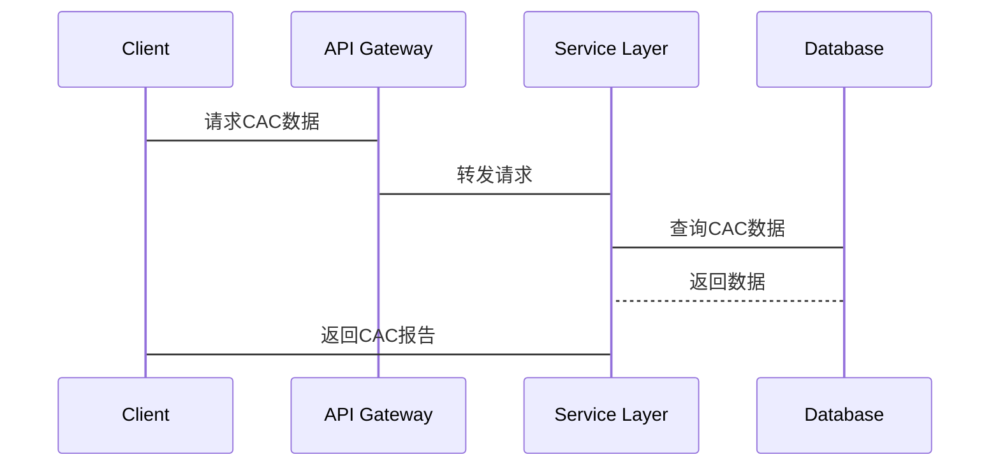

                 


# 企业估值中的客户获取成本分析

---

## 关键词：
客户获取成本（CAC）、企业估值、营销成本、客户生命周期价值（CLV）、企业利润

---

## 摘要：
客户获取成本（CAC）是企业在获取新客户过程中所花费的所有成本，包括营销、销售和客户支持等。本文从企业估值的角度，深入分析CAC的核心概念、计算方法、与客户生命周期价值（CLV）的关系，以及如何通过优化CAC来提升企业价值。文章结合实际案例和数学模型，详细讲解CAC在企业估值中的应用，为企业制定科学的营销策略和投资决策提供理论支持。

---

# 第1章: 客户获取成本（CAC）的定义与背景

## 1.1 客户获取成本（CAC）的定义
### 1.1.1 CAC的定义与核心概念
客户获取成本（Customer Acquisition Cost，CAC）是指企业为获取一个新客户所支付的所有直接和间接成本。这些成本包括营销支出（广告、SEO、内容营销等）、销售团队的工资、客户支持费用以及其他与客户获取相关的支出。

CAC的核心概念在于它衡量了企业获取客户的效率和成本效益。通过分析CAC，企业可以评估其营销策略的有效性，并优化资源分配以降低获取客户的成本。

### 1.1.2 CAC在企业估值中的重要性
在企业估值中，CAC是一个关键指标，因为它直接反映了企业获取客户的效率和成本结构。投资者和企业高层通常关注CAC，以评估企业的市场竞争力和盈利能力。

- **CAC与企业价值的关系**：CAC越低，企业在获取客户方面越高效，通常意味着更高的利润 margins 和更强的市场竞争力。
- **CAC与客户生命周期价值（CLV）的关系**：如果CAC低于CLV，说明企业从客户身上获得的收益大于获取客户所花费的成本，这是一个健康的信号。

### 1.1.3 CAC与企业生命周期的关系
CAC在企业生命周期中扮演着重要角色：
- **初创企业**：CAC通常较高，因为市场推广和销售团队的投入较大。
- **成长期企业**：通过优化营销策略和提高转化率，CAC逐渐下降。
- **成熟期企业**：CAC趋于稳定，企业通过客户留存和交叉销售进一步提升收益。

---

## 1.2 CAC的核心要素与计算公式
### 1.2.1 CAC的计算公式
CAC的计算公式如下：
$$CAC = \frac{营销成本 + 销售成本}{客户获取数量}$$

其中：
- 营销成本：包括广告支出、内容营销、SEO等。
- 销售成本：包括销售团队的工资、客户支持费用等。
- 客户获取数量：企业在一定时间内获取的新客户数量。

### 1.2.2 CAC的关键影响因素
CAC的高低受多种因素影响，包括：
1. **营销渠道的选择**：不同渠道的转化率和成本不同。
2. **销售团队的效率**：销售人员的转化率和成本直接影响CAC。
3. **客户定位**：目标客户群体的精准度影响获取成本。
4. **市场竞争力**：市场竞争激烈时，CAC通常较高。

### 1.2.3 CAC与企业利润的关系
CAC与企业利润密切相关：
- 如果CAC低于客户生命周期价值（CLV），企业能够从客户身上获得正向的净收益。
- 如果CAC高于CLV，企业将难以盈利，需要优化营销策略或提高客户价值。

---

## 1.3 CAC在不同行业中的应用
### 1.3.1 SaaS行业的CAC特点
在SaaS（软件即服务）行业，CAC通常是企业的关键指标之一。由于SaaS客户通常具有较高的留存率和生命周期价值，企业通常愿意投入较高的CAC以获取高质量客户。

### 1.3.2 电子商务行业的CAC特点
在电子商务行业，CAC通常包括广告支出、SEO优化、物流成本等。由于市场竞争激烈，电子商务企业的CAC通常较高，但可以通过规模化效应降低成本。

### 1.3.3 传统行业的CAC特点
在传统行业（如零售、制造等），CAC通常包括广告支出、销售人员工资等。由于客户获取渠道较为传统，CAC通常较高，且优化空间较大。

---

## 1.4 CAC与企业估值的关联
### 1.4.1 CAC在企业估值中的作用
CAC是企业估值的重要参考指标。投资者通常关注企业的CAC和CLV的比值：
$$CAC \ Ratio = \frac{CAC}{CLV}$$

- 如果CAC Ratio < 1，说明企业从客户身上获得的收益大于获取客户的成本，这是一个健康的信号。
- 如果CAC Ratio > 1，说明企业获取客户的成本过高，需要优化营销策略或提高客户价值。

### 1.4.2 CAC与企业价值的关系
企业价值通常与CAC和CLV密切相关。企业价值可以用以下公式估算：
$$企业价值 = \frac{CAC \times CLV}{CAC \ Ratio}$$

---

## 1.5 本章小结
本章介绍了CAC的定义、核心要素和计算公式，并分析了CAC在不同行业中的应用及其与企业估值的关联。通过理解CAC的核心概念和影响因素，企业可以更好地优化客户获取策略，提升整体价值。

---

# 第2章: CAC的核心概念与联系

## 2.1 CAC的核心概念原理
### 2.1.1 CAC的计算模型
CAC的计算模型可以分为以下步骤：
1. **数据收集**：收集营销成本、销售成本和客户获取数量。
2. **数据整理**：将数据按时间维度或渠道维度进行分类。
3. **计算CAC**：使用公式$$CAC = \frac{营销成本 + 销售成本}{客户获取数量}$$计算CAC。

### 2.1.2 CAC与客户生命周期价值（CLV）的关系
CLV是客户在企业生命周期内为企业带来的总收益，公式如下：
$$CLV = CAC \times 客户留存率 \times 客户生命周期长度$$

客户留存率越高，客户生命周期长度越长，CLV越高。

### 2.1.3 CAC与企业利润率的关系
企业利润率与CAC密切相关。如果CAC占收入的比例较低，企业通常能够实现更高的利润率。

---

## 2.2 CAC与相关指标的对比
### 2.2.1 CAC与客户留存率的对比
客户留存率越高，企业从客户身上获得的收益越多，CAC的回报率越高。

### 2.2.2 CAC与客户转化率的对比
客户转化率越高，单位客户的获取成本（CAC）越低。

### 2.2.3 CAC与客户满意度的对比
客户满意度高通常意味着客户留存率高，从而CLV高，CAC的回报率也高。

---

## 2.3 CAC的ER实体关系图


---

## 2.4 本章小结
本章分析了CAC的核心概念原理及其与相关指标的联系，强调了CAC在企业估值中的重要性。通过对比分析，企业可以更好地理解CAC与其他指标的关系，并优化整体客户管理策略。

---

# 第3章: CAC的算法原理与数学模型

## 3.1 CAC的计算流程
### 3.1.1 数据收集与整理
数据收集是CAC计算的基础。企业需要收集以下数据：
- 营销成本：包括广告支出、内容营销成本等。
- 销售成本：包括销售团队工资、客户支持费用等。
- 客户获取数量：企业在一定时间内获取的新客户数量。

### 3.1.2 数据分析与建模
使用Python进行数据分析和建模：
```python
import pandas as pd
import numpy as np

# 数据加载
data = pd.read_csv('customer_acquisition.csv')

# CAC计算
cac = (data['营销成本'] + data['销售成本']) / data['客户获取数量']
print(cac)
```

### 3.1.3 模型验证与优化
通过对比不同渠道的CAC，优化营销策略。例如：
```python
# 按渠道计算CAC
cac_per_channel = data.groupby('营销渠道')['CAC'].mean()
print(cac_per_channel)
```

---

## 3.2 CAC的数学模型
### 3.2.1 CAC的基本公式
$$CAC = \frac{营销成本 + 销售成本}{客户获取数量}$$

### 3.2.2 CAC与CLV的关系
$$CLV = CAC \times 客户留存率 \times 客户生命周期长度$$

---

## 3.3 CAC的算法流程图


---

## 3.4 本章小结
本章详细讲解了CAC的计算流程和数学模型，并通过Python代码示例展示了如何进行数据分析和建模。通过优化CAC，企业可以提升客户获取效率和整体价值。

---

# 第4章: 系统分析与架构设计

## 4.1 问题场景介绍
企业需要一个系统来实时监控和分析CAC，优化营销策略。

---

## 4.2 系统功能设计
### 4.2.1 领域模型（Mermaid 类图）


### 4.2.2 系统架构设计（Mermaid 架构图）


---

## 4.3 系统接口设计
- **API接口**：提供RESTful API，支持查询CAC数据。
- **数据接口**：与企业现有的数据源（如CRM系统）对接，获取营销和销售数据。

---

## 4.4 系统交互设计（Mermaid 序列图）


---

## 4.5 本章小结
本章通过系统分析和架构设计，展示了如何构建一个用于CAC分析的系统。通过实时监控和分析，企业可以更好地优化营销策略。

---

# 第5章: 项目实战

## 5.1 环境安装
- **工具安装**：安装Python、Pandas、NumPy、Matplotlib。
- **数据源**：获取客户获取数据，格式为CSV。

---

## 5.2 系统核心实现
### 5.2.1 数据加载与清洗
```python
import pandas as pd

# 数据加载
data = pd.read_csv('customer_acquisition.csv')

# 数据清洗
data.dropna(inplace=True)
data['日期'] = pd.to_datetime(data['日期'])
```

### 5.2.2 CAC计算与分析
```python
# CAC计算
data['CAC'] = (data['营销成本'] + data['销售成本']) / data['客户获取数量']

# 按渠道分类
cac_per_channel = data.groupby('营销渠道')['CAC'].mean()
print(cac_per_channel)
```

### 5.2.3 可视化与报告
```python
import matplotlib.pyplot as plt

# 图表绘制
plt.figure(figsize=(10, 6))
cac_per_channel.plot.bar()
plt.title('各渠道CAC对比')
plt.xlabel('营销渠道')
plt.ylabel('CAC')
plt.show()
```

---

## 5.3 案例分析
### 5.3.1 数据分析
假设某SaaS企业收集了以下数据：
| 日期    | 营销渠道 | 营销成本 | 销售成本 | 客户获取数量 |
|---------|----------|----------|----------|-------------|
| 2023-10 | Google Ads | 5000     | 2000     | 100         |
| 2023-10 | Facebook  | 4000     | 1500     | 80          |

计算各渠道的CAC：
$$CAC_{Google\ Ads} = \frac{5000 + 2000}{100} = 70$$
$$CAC_{Facebook} = \frac{4000 + 1500}{80} = 68.75$$

### 5.3.2 投资回报分析
假设客户生命周期价值（CLV）为150，计算CAC Ratio：
$$CAC\ Ratio = \frac{70}{150} \approx 0.467$$
$$CAC\ Ratio = \frac{68.75}{150} \approx 0.458$$

由于CAC Ratio < 1，说明企业从客户身上获得的收益大于获取客户的成本，这是一个健康的信号。

---

## 5.4 项目小结
本章通过实际案例展示了如何计算和分析CAC，并通过可视化工具生成报告。通过优化CAC，企业可以提升客户获取效率和整体价值。

---

# 第6章: 最佳实践与总结

## 6.1 最佳实践
- **数据质量**：确保数据准确性和完整性。
- **渠道优化**：通过A/B测试优化营销渠道。
- **客户留存**：提高客户留存率以降低CAC的回报周期。

## 6.2 小结
本文从企业估值的角度，深入分析了客户获取成本（CAC）的核心概念、计算方法和优化策略。通过实际案例和系统设计，展示了如何通过优化CAC提升企业价值。

## 6.3 注意事项
- CAC的计算需要结合企业实际业务场景。
- 数据分析结果需要结合行业特点进行解读。

## 6.4 拓展阅读
- 《SaaS定价策略与客户获取成本分析》
- 《客户生命周期价值（CLV）的深度剖析》

---

# 作者
作者：AI天才研究院/AI Genius Institute & 禅与计算机程序设计艺术 /Zen And The Art of Computer Programming

