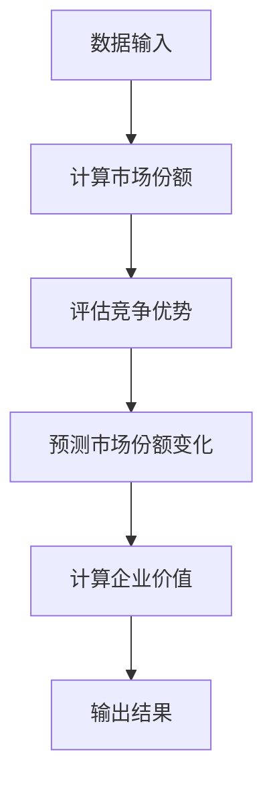
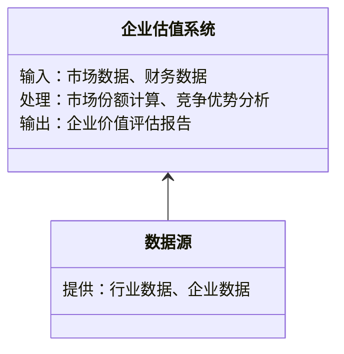

                 


# 企业估值中的市场份额价值法

> **关键词**：企业估值，市场份额，价值评估，市场分析，投资决策

> **摘要**：本文深入探讨了市场份额价值法在企业估值中的应用，通过逻辑分析、数学建模和案例研究，详细阐述了如何利用市场份额数据对企业价值进行科学评估。文章从理论基础、算法原理、系统设计到项目实战，全面解析了市场份额价值法的核心要素和实践应用，为企业估值提供了全新的视角和方法论。

---

## 第1章: 企业估值的核心问题与市场份额价值法的背景

### 1.1 企业估值的核心问题

企业估值是企业战略管理、投资决策和资本运作中的核心问题。传统的估值方法，如DCF（Discounted Cash Flow）和PE（Price Earnings）等，主要关注企业的财务指标和未来现金流预测。然而，在实际操作中，这些方法往往忽略了企业的市场地位和竞争优势，导致估值结果与实际价值存在较大偏差。

**问题背景**：
- 企业的市场地位直接影响其收入和利润。
- 市场份额是企业竞争力的直观体现。
- 竞争环境的变化会导致市场份额波动，进而影响企业价值。

**问题描述**：
- 企业如何通过市场份额数据建立价值评估模型？
- 市场份额与企业价值之间的关系如何量化？
- 如何将市场份额价值法与其他估值方法有机结合？

**问题解决**：
- 通过市场份额价值法，将市场地位转化为可量化的价值贡献。
- 建立动态的市场份额模型，捕捉市场变化对企业价值的影响。

**边界与外延**：
- 适用于企业战略规划、并购评估和投资决策。
- 不适用于市场地位不明显或市场数据缺失的企业。

### 1.2 市场份额价值法的核心概念与联系

#### 核心概念

- **市场份额**：企业在特定市场中的销售量、收入或用户数占整体市场的比例。
- **企业价值**：企业整体价值的度量，包括资产、品牌、客户关系等无形资产。
- **竞争优势**：企业在市场中胜过竞争对手的能力，包括成本、技术、品牌等。

#### 概念属性对比

| 概念       | 属性                         |
|------------|------------------------------|
| 市场份额    | 数量化、动态性、行业差异性    |
| 企业价值    | 综合性、长期性、可比性        |
| 竞争优势    | 核心性、可持续性、可衡量性    |

#### ER实体关系图

```mermaid
er
    class Diagram {
        企业,
        市场份额,
        企业价值,
        竞争优势
    }
    企业 -- 竞争优势：企业通过竞争优势获得市场份额。
    市场份额 -- 企业价值：市场份额影响企业整体价值。
    竞争优势 <---> 企业：竞争优势由企业内部因素决定。
```

---

## 第2章: 市场份额价值法的算法原理

### 2.1 市场份额与企业价值的数学模型

#### 市场份额对企业价值的影响公式

$$ V = M \times S \times P $$

- **V**：企业价值
- **M**：市场份额
- **S**：行业规模
- **P**：价格或利润率

#### 市场份额的动态变化模型

$$ \Delta M = \alpha \times (M_{\text{competitor}} - M) + \beta \times (Trend) $$

- **\alpha**：竞争影响系数
- **Trend**：市场趋势因素

### 2.2 市场份额价值法的算法流程



---

## 第3章: 市场份额价值法的系统设计

### 3.1 系统功能设计

#### 领域模型



#### 系统架构


---

## 第4章: 市场份额价值法的项目实战

### 4.1 项目环境与数据准备

```bash
# 安装依赖
pip install pandas numpy matplotlib
```

### 4.2 核心代码实现

```python
import pandas as pd
import numpy as np

# 示例数据
data = {
    '企业': ['A', 'B', 'C'],
    '市场份额': [0.3, 0.2, 0.5],
    '行业规模': [100, 100, 100],
    '利润率': [0.2, 0.15, 0.3]
}

df = pd.DataFrame(data)

# 计算企业价值
df['企业价值'] = df['市场份额'] * df['行业规模'] * df['利润率']
```

### 4.3 案例分析与结果解读

以科技行业为例，假设某企业的市场份额为20%，行业规模为100亿元，利润率15%。根据公式：

$$ V = 0.2 \times 100 \times 0.15 = 3 \text{亿元} $$

---

## 第5章: 总结与展望

### 5.1 总结

- 市场份额价值法通过量化市场地位，为企业估值提供了新的视角。
- 综合考虑市场份额、行业规模和利润率，能够更准确地评估企业价值。

### 5.2 展望

- 结合大数据和AI技术，进一步优化市场份额预测模型。
- 开发实时监控系统，动态调整企业估值。

---

## 作者：AI天才研究院 & 禅与计算机程序设计艺术

