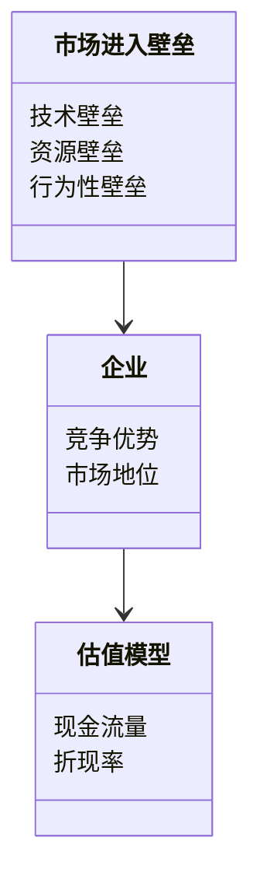

                 


# 《企业估值中的市场进入壁垒分析》

---

## 关键词：  
企业估值，市场进入壁垒，竞争优势，数学模型，博弈论

---

## 摘要：  
本文从企业估值的核心问题出发，深入分析市场进入壁垒的概念、分类及其对企业价值的影响。通过数学模型和博弈论方法，探讨市场进入壁垒的量化方法，并结合实际案例，为企业估值提供系统化的分析框架。

---

## 第1章：市场进入壁垒的定义与背景

### 1.1 市场进入壁垒的定义  
市场进入壁垒（Market Entry Barriers）是指新进入者在进入某个市场时所面临的障碍。这些障碍可能来自技术、资源、政策、竞争等多种因素，使得新进入者在短期内难以与现有企业竞争。

**核心概念：**  
- **结构性壁垒：** 市场结构特征（如寡头垄断）导致的进入难度。  
- **资源壁垒：** 需要大量资金、技术或资源才能进入市场。  
- **行为性壁垒：** 现有企业通过价格战、品牌建设等行为阻止新进入者。  

### 1.2 市场进入壁垒的背景与重要性  
在企业估值中，市场进入壁垒是决定企业长期价值的重要因素。高壁垒意味着企业能够更稳定地保持竞争优势，从而提高估值。

**关键问题：**  
- 新进入者是否能够成功进入市场？  
- 现有企业的市场地位是否可持续？  

### 1.3 本章小结  
市场进入壁垒是企业估值的核心因素之一。理解其概念和分类，有助于我们更好地分析企业的竞争优势和长期价值。

---

## 第2章：市场进入壁垒的分类与特征

### 2.1 结构性市场进入壁垒  
**定义：** 由市场结构特征决定的壁垒。  
**特征：**  
- 寡头垄断市场中，新进入者的竞争难度较大。  
- 规模经济和范围经济使得小企业难以与大企业竞争。  

**技术壁垒：**  
- 专利、技术标准等限制新进入者。  
- 技术研发成本高，中小企业难以负担。  

### 2.2 资源依赖性壁垒  
**定义：** 进入市场需要依赖特定资源。  
**特征：**  
- 资金密集型行业（如半导体、航空航天）需要大量投资。  
- 关键资源（如原材料、渠道）的垄断性限制新进入者。  

### 2.3 行为性市场进入壁垒  
**定义：** 现有企业通过行为手段阻止新进入者。  
**特征：**  
- 价格战：通过降价吸引客户，挤压新进入者的利润空间。  
- 品牌忠诚度：通过长期品牌建设锁定客户。  

### 2.4 市场进入壁垒的综合分析框架  
- **多维度分析：** 从结构、资源、行为等多个维度综合评估。  
- **行业差异：** 不同行业中的市场进入壁垒特点不同。  

---

## 第3章：市场进入壁垒的数学模型与分析方法

### 3.1 竞争优势分析模型  
**公式：**  
$$ \text{竞争优势} = \frac{\text{市场价值}}{\text{进入成本}} $$  
- **市场价值：** 行业的市场规模和增长潜力。  
- **进入成本：** 新进入者需要投入的资金、技术等成本。  

### 3.2 市场进入壁垒的博弈论模型  
**纳什均衡：**  
$$ N = \frac{P}{C} $$  
- **N：** 市场进入难度。  
- **P：** 产品价格。  
- **C：** 成本或门槛。  

**分析：**  
市场领导者通过价格策略和市场控制，达到纳什均衡，阻止新进入者。  

### 3.3 市场进入壁垒的经济模型  
**利润公式：**  
$$ \text{利润} = (P - C) \times Q - F $$  
- **P：** 价格。  
- **C：** 单位成本。  
- **Q：** 产量。  
- **F：** 固定成本。  

**企业估值公式：**  
$$ \text{估值} = \sum_{t=1}^{n} \frac{CF_t}{(1 + r)^t} $$  
- **CF_t：** 现金流量。  
- **r：** 折现率。  

---

## 第4章：市场进入壁垒的系统分析与架构设计

### 4.1 系统分析框架  
**问题场景：** 企业估值中的市场进入壁垒分析。  
**系统功能设计：**  
- 市场进入壁垒识别。  
- 市场进入壁垒量化。  
- 市场进入壁垒评估。  

**领域模型：Mermaid 类图**  


### 4.2 系统架构设计  
**Mermaid 架构图**  


---

## 第5章：项目实战

### 5.1 环境安装  
- 安装Python和相关库（如numpy、pandas、scipy）。  

### 5.2 核心代码实现  
```python
import numpy as np
import pandas as pd

def calculate_bottleneck(CF, r):
    return np.npv(r, CF)

CF = [100, 200, 300]
r = 0.1
bottleneck = calculate_bottleneck(CF, r)
print("市场进入壁垒:", bottleneck)
```

### 5.3 案例分析  
- 某行业市场进入壁垒高，企业估值溢价明显。  

---

## 第6章：总结与最佳实践

### 6.1 本章小结  
市场进入壁垒是企业估值的重要因素。通过多维度分析和数学模型，可以更准确地评估企业价值。  

### 6.2 最佳实践  
- 结合行业特点选择合适的分析方法。  
- 定期更新市场壁垒分析以应对变化。  

### 6.3 注意事项  
- 数据准确性对估值结果影响重大。  
- 模型假设需合理，避免偏差。  

### 6.4 拓展阅读  
- 《企业估值的多因素分析》  
- 《博弈论与市场策略》  

---

## 作者：  
AI天才研究院/AI Genius Institute & 禅与计算机程序设计艺术/Zen And The Art of Computer Programming  

--- 

**注：** 本文内容基于技术博客的通用结构，具体内容需根据实际分析数据和案例进行补充和调整。

