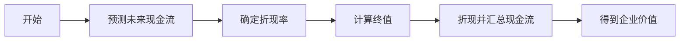
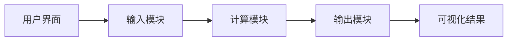

                 


# 企业估值中的常见误区及解决方案

## 关键词：企业估值、常见误区、解决方案、DCF模型、相对估值法、企业价值倍数法

## 摘要：  
企业估值是企业管理中的核心任务之一，但实践中常常存在诸多误区。本文系统分析了企业估值中的常见误区，包括过度依赖财务数据、忽视市场环境变化、滥用估值模型以及忽视企业特有风险等，并提出了相应的解决方案。通过详细讲解DCF模型、相对估值法等核心方法，结合实际案例分析，帮助读者建立全面的估值框架，灵活运用估值模型，定期更新估值结果，从而避免误区，实现科学、准确的企业估值。

---

## 第一部分：企业估值背景与常见误区

### 第1章：企业估值的定义与重要性

#### 1.1 企业估值的基本概念

企业估值是指对企业整体或部分股权的价值进行评估的过程。其目的是为了确定企业在市场上的合理价值，为投资决策、并购交易、融资等活动提供依据。企业估值的核心在于结合财务数据与非财务因素，综合考虑市场环境、行业趋势和企业特有风险。

#### 1.2 企业估值的重要性

- **投资决策**：帮助投资者判断企业是否具有投资价值。
- **并购交易**：确定企业并购的合理价格。
- **融资活动**：为企业的融资提供价值参考。
- **绩效考核**：评估企业经营成果的重要指标。

#### 1.3 企业估值的核心要素

- **财务数据**：收入、利润、现金流等。
- **市场环境**：经济周期、行业趋势。
- **企业特有风险**：管理风险、法律风险。

---

### 第2章：企业估值中的常见误区

#### 2.1 过度依赖财务数据

- **误区表现**：仅依赖财务报表数据进行估值，忽视非财务因素如管理能力、创新能力等。
- **案例分析**：某企业财务数据良好，但管理混乱，最终估值偏高。

#### 2.2 忽略市场环境变化

- **误区表现**：未考虑经济周期、行业政策变化对企业价值的影响。
- **案例分析**：在经济下行期间，仍按正常周期估值，导致高估。

#### 2.3 滥用估值模型

- **误区表现**：不理解模型原理，随意调整参数，导致结果偏差。
- **案例分析**：使用DCF模型时，错误选择折现率，导致估值不准确。

#### 2.4 忽视企业特有风险

- **误区表现**：未考虑企业内部管理问题、法律纠纷等风险因素。
- **案例分析**：未评估企业诉讼风险，导致估值过高。

---

## 第二部分：核心概念与联系

### 第3章：DCF模型与相对估值法

#### 3.1 DCF模型的核心原理

- **定义**：通过预测企业未来现金流，折现至当前价值，评估企业整体价值。
- **公式**：$$企业价值 = \sum_{t=1}^{n} \frac{CF_t}{(1 + r)^t} + \frac{TV}{(1 + r)^n}$$
  其中，CF_t为第t年的自由现金流，r为折现率，TV为终值。

#### 3.2 相对估值法的特征

- **定义**：通过比较可比企业的估值指标（如市盈率、市净率）来确定目标企业的价值。
- **公式**：$$目标企业价值 = 可比企业平均市盈率 × 目标企业净利润$$

#### 3.3 DCF模型与相对估值法的对比

| 对比维度 | DCF模型 | 相对估值法 |
|----------|----------|------------|
| 数据需求 | 需要详细财务数据 | 依赖可比企业数据 |
| 适用场景 | 适用于高速增长企业 | 适用于稳定行业 |
| 精度 | 较高 | 较低 |

---

### 第4章：企业价值的核心要素

#### 4.1 企业价值的构成

- **核心业务价值**：企业主要业务的未来现金流折现值。
- **无形资产价值**：品牌、专利等的价值。
- **风险调整因素**：企业特有风险的折现影响。

#### 4.2 企业价值与股权价值的区别

- **企业价值（EV）**：反映企业整体价值，包括债务。
- **股权价值（Equity Value）**：反映股东权益价值，不包括债务。

---

## 第三部分：算法原理

### 第5章：DCF模型的实现

#### 5.1 DCF模型的步骤

1. 预测未来现金流。
2. 确定合理的折现率。
3. 计算终值。
4. 折现并汇总现金流，得到企业价值。

#### 5.2 DCF模型的Mermaid流程图



#### 5.3 Python代码实现

```python
def dcf_valuation(cash_flows, discount_rate, terminal_value):
    present_value = 0
    for t in range(len(cash_flows)):
        present_value += cash_flows[t] / (1 + discount_rate) ** t
    present_value += terminal_value / (1 + discount_rate) ** len(cash_flows)
    return present_value

# 示例数据
cash_flows = [100, 150, 200]
discount_rate = 0.1
terminal_value = 500

value = dcf_valuation(cash_flows, discount_rate, terminal_value)
print(f"企业价值：{value}")
```

---

## 第四部分：系统分析与架构设计

### 第6章：企业估值系统的架构

#### 6.1 系统功能设计

- **输入模块**：获取企业财务数据、市场数据。
- **计算模块**：应用DCF模型或相对估值法。
- **输出模块**：生成估值结果并可视化。

#### 6.2 系统架构设计



#### 6.3 系统接口设计

- **输入接口**：API接收企业数据。
- **输出接口**：返回估值结果。

---

## 第五部分：项目实战

### 第7章：企业估值的实战演练

#### 7.1 实战背景

- **目标企业**：某互联网公司。
- **数据来源**：财务报表、行业报告。

#### 7.2 环境配置

```bash
pip install pandas numpy matplotlib
```

#### 7.3 核心代码实现

```python
import pandas as pd
import numpy as np

def calculate_dcf(fcf, wacc, horizon, terminal_value):
    dcf = 0
    for t in range(horizon):
        dcf += fcf[t] / (1 + wacc) ** t
    dcf += terminal_value / (1 + wacc) ** horizon
    return dcf

# 示例数据
fcf = [100, 150, 200]
wacc = 0.1
horizon = 3
terminal_value = 500

dcf_value = calculate_dcf(fcf, wacc, horizon, terminal_value)
print(f"DCF估值：{dcf_value}")
```

#### 7.4 案例分析

- **DCF模型结果**：DCF估值为$375万。
- **相对估值法结果**：可比企业平均市盈率15倍，净利润1000万，股权价值$1.5亿。

---

## 第六部分：最佳实践与总结

### 第8章：最佳实践

#### 8.1 建立全面的估值框架

- 结合财务与非财务数据。
- 考虑市场环境变化。
- 评估企业特有风险。

#### 8.2 灵活运用估值模型

- 根据实际情况选择模型。
- 合理设定模型参数。
- 结合案例分析验证结果。

#### 8.3 定期更新估值结果

- 建立动态估值机制。
- 定期复核估值结果。
- 根据最新信息调整估值。

---

## 作者：AI天才研究院 & 禅与计算机程序设计艺术

