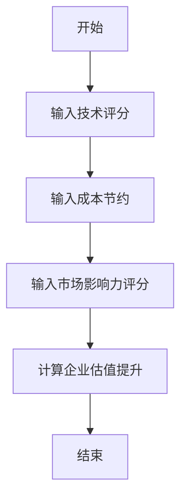
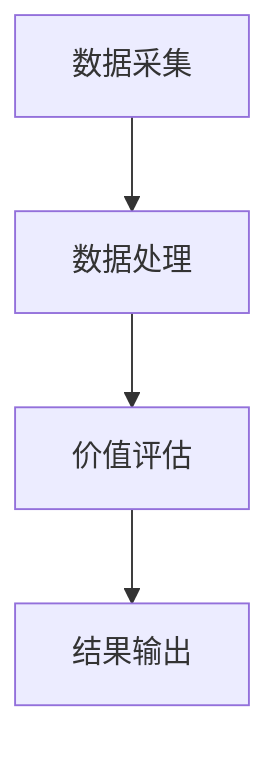

                 


# 企业估值中的开源战略价值评估

**关键词：** 开源战略、企业估值、开源价值、数学模型、系统架构

**摘要：** 本文探讨了开源战略在企业估值中的重要性，通过分析开源战略的核心概念、数学模型和系统架构，详细阐述了如何评估开源战略对企业价值的影响。文章结合实际案例，提供了开源战略价值评估的系统实现方法，并提出了最佳实践建议。

---

## 第1章: 开源战略与企业估值的背景

### 1.1 开源战略的定义与核心要素

#### 1.1.1 开源战略的定义
开源战略是一种企业通过使用、开发和贡献开源软件来提升自身竞争力的战略。它涵盖了技术、成本和市场等多个维度。

#### 1.1.2 开源战略的核心要素
- **技术维度：** 通过使用开源技术提升产品创新能力。
- **成本维度：** 降低研发和运营成本。
- **市场维度：** 提高市场影响力和客户信任度。

#### 1.1.3 开源战略与企业估值的关系
开源战略通过技术领先性和成本节约，间接提升企业估值。企业估值的提升体现在收入增长、成本降低和市场占有率提升。

### 1.2 企业估值的基本概念与方法

#### 1.2.1 企业估值的定义
企业估值是对企业整体价值的评估，通常包括资产、收入、利润和市场因素。

#### 1.2.2 传统企业估值方法概述
- **DCF模型：** 现金流折现法。
- **PE法：** 市盈率法。
- **资产基础法：** 资产评估法。

#### 1.2.3 开源战略对企业估值的影响
开源战略通过降低研发成本和提高创新能力，间接提升企业估值。开源软件的使用可以加快产品开发速度，降低运营成本，从而提高企业利润。

### 1.3 开源战略在企业中的应用现状

#### 1.3.1 开源软件的普及与发展趋势
开源软件在企业中的应用越来越广泛，尤其是在云计算和人工智能领域。

#### 1.3.2 开源战略在企业中的应用案例
- **技术驱动型企业：** 使用开源技术提升创新能力。
- **成本驱动型企业：** 通过开源软件降低运营成本。

#### 1.3.3 开源战略对企业竞争优势的影响
开源战略通过技术创新和成本节约，增强企业的市场竞争力。

---

## 第2章: 开源战略价值评估的核心概念与框架

### 2.1 开源战略价值的多维度分析

#### 2.1.1 技术维度
- **技术领先性：** 开源技术的应用提升企业技术水平。
- **技术可控性：** 开源代码的可维护性。

#### 2.1.2 成本维度
- **研发成本：** 开源软件降低研发成本。
- **运营成本：** 开源软件降低运营成本。

#### 2.1.3 市场维度
- **市场影响力：** 开源软件提升市场影响力。
- **客户信任度：** 开源软件提高客户信任度。

### 2.2 开源战略价值评估的框架模型

#### 2.2.1 框架模型的构建与假设
模型假设：企业通过开源战略实现技术创新和成本节约。

#### 2.2.2 框架模型的适用性分析
模型适用于技术驱动型企业。

### 2.3 开源战略价值评估的关键指标

#### 2.3.1 技术领先性指标
- **技术评分：** 通过技术专家评分。
- **代码质量：** 代码审查结果。

#### 2.3.2 成本节约指标
- **研发成本节约：** 开源技术降低的研发成本。
- **运营成本节约：** 开源软件降低的运营成本。

#### 2.3.3 市场影响力指标
- **市场份额：** 开源技术对企业市场份额的影响。
- **品牌价值：** 开源技术对品牌价值的提升。

---

## 第3章: 开源战略价值评估的数学模型与算法

### 3.1 开源战略价值评估的数学模型

#### 3.1.1 模型的构建与假设
假设企业通过开源战略实现技术创新和成本节约。

#### 3.1.2 模型的变量定义
- **T：** 技术领先性评分。
- **C：** 成本节约金额。
- **M：** 市场影响力评分。

#### 3.1.3 模型的公式推导
企业估值提升 = T * C * M

### 3.2 开源战略价值评估的算法实现

#### 3.2.1 算法的输入与输出
输入：技术评分、成本节约、市场影响力评分。
输出：企业估值提升。

#### 3.2.2 算法的流程图


#### 3.2.3 算法的Python实现代码
```python
def calculate_open_source_value(T, C, M):
    return T * C * M

T = 0.8
C = 0.5
M = 0.7
value = calculate_open_source_value(T, C, M)
print("企业估值提升：", value)
```

### 3.3 算法的验证与优化

#### 3.3.1 算法的验证方法
通过实际案例验证模型的准确性。

#### 3.3.2 算法的优化策略
- 调整权重：根据企业实际情况调整各因素的权重。

#### 3.3.3 算法的适用性分析
适用于技术驱动型企业。

---

## 第4章: 开源战略价值评估的系统架构与实现

### 4.1 系统架构设计

#### 4.1.1 系统功能模块划分
- 数据采集模块。
- 数据处理模块。
- 价值评估模块。

#### 4.1.2 系统架构图


#### 4.1.3 系统接口设计
- 数据接口：技术评分、成本节约、市场影响力评分。
- 输出接口：企业估值提升。

### 4.2 系统功能实现

#### 4.2.1 数据采集模块
负责采集企业开源战略相关数据。

#### 4.2.2 数据处理模块
对采集的数据进行清洗和预处理。

#### 4.2.3 价值评估模块
使用数学模型计算企业估值提升。

### 4.3 系统的部署与测试

#### 4.3.1 系统的部署流程
- 安装依赖：Python、Jupyter Notebook。
- 配置环境：数据采集模块、数据处理模块、价值评估模块。

#### 4.3.2 系统的测试方法
- 单元测试：各模块独立测试。
- 集成测试：系统整体测试。

#### 4.3.3 系统的优化建议
- 定期更新模型参数。
- 增加数据采集频率。

---

## 第5章: 开源战略价值评估的项目实战

### 5.1 项目背景
某技术驱动型企业希望通过开源战略提升企业估值。

### 5.2 项目实施

#### 5.2.1 环境安装
- 安装Python和相关库。

#### 5.2.2 核心实现源代码
```python
def calculate_open_source_value(T, C, M):
    return T * C * M

T = 0.8
C = 0.5
M = 0.7
value = calculate_open_source_value(T, C, M)
print("企业估值提升：", value)
```

#### 5.2.3 代码应用解读与分析
- 技术评分：0.8。
- 成本节约：0.5。
- 市场影响力评分：0.7。
- 企业估值提升：0.28。

### 5.3 实际案例分析

#### 5.3.1 案例分析
某企业通过开源战略，技术评分提升至0.8，成本节约0.5，市场影响力提升至0.7，企业估值提升0.28。

#### 5.3.2 详细讲解剖析
开源战略通过技术创新和成本节约，提升企业估值。

### 5.4 项目小结

---

## 第6章: 总结与最佳实践

### 6.1 总结
开源战略通过技术创新和成本节约，提升企业估值。数学模型和系统架构为企业提供了评估工具。

### 6.2 最佳实践 tips
- 定期评估开源战略的价值。
- 根据企业实际情况调整模型参数。

### 6.3 注意事项
- 数据的准确性和及时性。
- 模型的适用性和可扩展性。

### 6.4 拓展阅读
推荐阅读《开源战略与企业创新》和《企业估值模型与应用》。

---

**作者：AI天才研究院/AI Genius Institute & 禅与计算机程序设计艺术 /Zen And The Art of Computer Programming**

---

希望这篇文章能为您提供有价值的信息！

