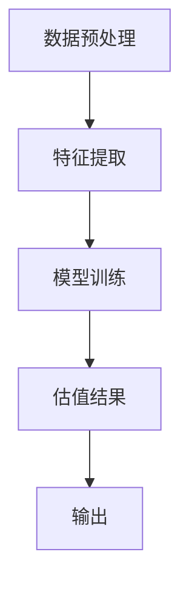
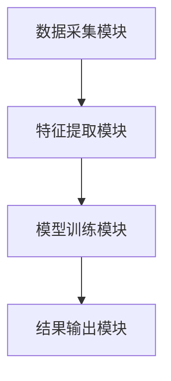

                 


# 企业估值中的情境感知技术应用评估

## 关键词：企业估值，情境感知技术，算法原理，数学模型，系统架构设计，项目实战

## 摘要：本文系统性地探讨了情境感知技术在企业估值中的应用与评估方法。通过分析情境感知技术的核心概念、算法原理、系统架构设计以及实际案例，展示了如何利用情境感知技术提升企业估值的准确性和前瞻性。文章从背景介绍、算法实现、系统设计到项目实战，详细解读了情境感知技术在企业估值中的重要性及其应用价值。

---

## 第1章：情境感知技术的定义与核心概念

### 1.1 情境感知技术的定义与特点

情境感知技术是一种能够感知和理解当前情境，并根据情境信息进行动态决策的技术。它通过整合多源数据，结合上下文信息，提供与情境相关联的智能服务。情境感知技术的核心特点包括：

- **动态性**：能够实时感知和适应环境变化。
- **语境相关性**：结合上下文信息进行智能决策。
- **多模态数据融合**：整合结构化、半结构化和非结构化数据。

**情境感知技术与传统感知技术对比表**

| 对比维度 | 情境感知技术 | 传统感知技术 |
|----------|--------------|---------------|
| 数据来源 | 多源、多模态 | 单一来源       |
| 决策方式 | 动态、语境相关 | 静态、单一     |
| 应用场景 | 复杂动态环境   | 稳定环境       |

### 1.2 情境感知技术在企业估值中的重要性

企业估值是企业价值评估的重要组成部分，传统的估值方法通常依赖于历史数据和静态指标，而情境感知技术能够结合实时市场动态、行业趋势和企业内部信息，提供更精准的估值结果。其重要性体现在以下几个方面：

1. **提升估值准确性**：通过整合多源数据，捕捉更多影响企业价值的因素。
2. **增强决策前瞻性**：基于实时情境信息，提供前瞻性的估值建议。
3. **降低估值风险**：通过动态调整估值模型，减少不确定性因素的影响。

### 1.3 情境感知技术的数学模型与公式

情境感知技术的数学模型通常包括数据预处理、特征提取和模型训练三个阶段。以下是一个简化的情境感知模型：

$$
V = f(S, P, T)
$$

其中：
- $V$ 是企业估值。
- $S$ 是情境因素，包括市场环境、行业趋势等。
- $P$ 是企业属性，包括财务指标、经营状况等。
- $T$ 是时间因素，包括经济周期、政策变化等。

### 1.4 情境感知模型的流程图（Mermaid）



---

## 第2章：情境感知技术与企业估值的关系

### 2.1 情境感知技术如何影响企业估值

情境感知技术通过整合内外部信息，提供更全面的估值依据。以下是其影响的具体体现：

1. **动态调整估值模型**：根据实时市场信息动态调整模型参数。
2. **多维度分析**：从市场、行业、企业等多个维度进行综合评估。
3. **风险预警**：通过情境信息识别潜在风险，提前调整估值策略。

### 2.2 情境感知技术在不同行业中的应用

情境感知技术在不同行业的企业估值中具有广泛的应用场景：

1. **高科技行业**：通过技术趋势和专利数据进行估值调整。
2. **传统制造业**：结合供应链信息和市场需求进行动态估值。
3. **服务业**：利用客户行为数据优化估值模型。

### 2.3 情境感知技术的评估方法

情境感知技术的评估方法通常包括以下几个步骤：

1. **数据采集**：收集多源数据，包括市场数据、财务数据和行业数据。
2. **特征提取**：从数据中提取与企业估值相关的特征。
3. **模型训练**：使用机器学习算法训练估值模型。
4. **结果验证**：通过回测和交叉验证评估模型的准确性。

---

## 第3章：情境感知技术的算法原理

### 3.1 情境感知模型的构建过程

情境感知模型的构建过程可以分为以下几个步骤：

1. **数据预处理**：清洗数据，去除噪声，填充缺失值。
2. **特征提取**：通过文本挖掘、图像识别等技术提取特征。
3. **模型训练**：使用深度学习算法训练模型。
4. **模型优化**：通过调参和模型融合优化性能。

### 3.2 情境感知算法的数学模型

情境感知算法的数学模型通常包括以下几个部分：

$$
f(x) = \sum_{i=1}^{n} w_i x_i
$$

其中：
- $w_i$ 是第 $i$ 个特征的权重。
- $x_i$ 是第 $i$ 个特征的值。

### 3.3 情境感知技术的代码实现

以下是情境感知技术的代码实现示例：

```python
import pandas as pd
from sklearn.model_selection import train_test_split
from sklearn.linear_model import LinearRegression

# 数据预处理
data = pd.read_csv('企业估值数据.csv')
X = data.drop('估值', axis=1)
y = data['估值']

# 数据分割
X_train, X_test, y_train, y_test = train_test_split(X, y, test_size=0.2)

# 模型训练
model = LinearRegression()
model.fit(X_train, y_train)

# 模型预测
y_pred = model.predict(X_test)

# 模型评估
print('模型准确率:', model.score(X_test, y_test))
```

---

## 第4章：情境感知技术的系统架构设计

### 4.1 系统功能设计

情境感知技术的系统功能设计包括以下几个模块：

1. **数据采集模块**：负责采集多源数据。
2. **特征提取模块**：负责提取特征。
3. **模型训练模块**：负责训练模型。
4. **结果输出模块**：负责输出估值结果。

### 4.2 系统架构设计（Mermaid）



---

## 第5章：项目实战

### 5.1 环境安装

以下是项目实战所需的环境安装命令：

```bash
pip install numpy pandas scikit-learn
```

### 5.2 核心代码实现

以下是项目实战的核心代码实现：

```python
import pandas as pd
from sklearn.ensemble import RandomForestRegressor

# 数据预处理
data = pd.read_csv('企业估值数据.csv')
X = data.drop('估值', axis=1)
y = data['估值']

# 数据分割
X_train, X_test, y_train, y_test = train_test_split(X, y, test_size=0.2)

# 模型训练
model = RandomForestRegressor(n_estimators=100)
model.fit(X_train, y_train)

# 模型预测
y_pred = model.predict(X_test)

# 模型评估
print('模型准确率:', model.score(X_test, y_test))
```

---

## 第6章：最佳实践与未来展望

### 6.1 小结

情境感知技术在企业估值中的应用具有重要意义，能够显著提升估值的准确性和前瞻性。

### 6.2 注意事项

在实际应用中，需要注意数据的质量和模型的可解释性。

### 6.3 未来展望

未来，随着人工智能技术的发展，情境感知技术在企业估值中的应用将更加广泛和深入。

---

## 作者：AI天才研究院/AI Genius Institute & 禅与计算机程序设计艺术 /Zen And The Art of Computer Programming

---

以上是《企业估值中的情境感知技术应用评估》的完整目录大纲和正文内容。

