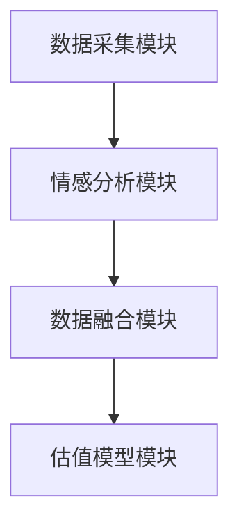

                 


# 企业估值中的情感AI应用价值评估

## 关键词：企业估值、情感AI、自然语言处理、投资者情绪、市场情绪、深度学习

## 摘要：企业估值不仅仅是对财务数据的分析，还涉及对企业声誉、投资者情绪和市场动态的综合考量。情感AI通过自然语言处理技术，从文本数据中提取情感信息，为企业的价值评估提供了新的维度。本文将详细探讨情感AI在企业估值中的应用，分析其核心算法和实际案例，帮助读者理解如何利用情感AI提升企业估值的准确性。

---

## 第一部分：企业估值中的情感AI应用背景与概述

### 第1章：企业估值与情感AI的背景介绍

#### 1.1 企业估值的基本概念

##### 1.1.1 企业估值的定义与核心要素

企业估值是通过对企业的财务状况、市场地位、发展前景等多方面因素的综合评估，确定其市场价值的过程。核心要素包括财务数据（如收入、利润、资产）、市场环境、管理团队、行业竞争状况等。

##### 1.1.2 传统企业估值方法的局限性

传统估值方法主要依赖财务指标和市场数据，难以捕捉企业声誉、员工士气、客户满意度等情感因素的影响。例如，投资者情绪波动可能影响股价，但传统方法难以量化这种影响。

##### 1.1.3 情感因素在企业估值中的重要性

情感因素，如企业声誉、投资者情绪，能够显著影响企业的市场价值。例如，负面新闻可能导致股价下跌，而积极的市场反馈则可能提升企业估值。

#### 1.2 情感AI的基本概念

##### 1.2.1 情感计算与自然语言处理

情感计算（Affective Computing）是利用计算机技术来识别、理解和模拟人类情感的过程。自然语言处理（NLP）则是通过算法分析和理解人类语言的技术。情感AI将两者结合，能够从文本数据中提取情感信息。

##### 1.2.2 情感AI的核心技术与应用领域

情感AI的核心技术包括情感分析、情感分类、情感强度计算等。应用领域广泛，如社交媒体分析、客户情感分析、品牌声誉管理等。

##### 1.2.3 情感AI在企业估值中的潜力

通过分析社交媒体、新闻媒体中的文本数据，情感AI可以量化企业声誉和市场情绪，为企业的估值提供额外的信息。

#### 1.3 情感AI与企业估值的结合

##### 1.3.1 情感AI在企业估值中的价值

情感AI能够提供实时的情感数据，帮助评估企业声誉和投资者情绪，从而更全面地评估企业价值。

##### 1.3.2 情感AI与传统估值方法的对比

传统估值方法依赖财务数据和市场指标，而情感AI提供了情感维度的数据支持，能够弥补传统方法的不足。

##### 1.3.3 情感AI在企业估值中的边界与外延

情感AI的应用范围包括企业声誉分析、投资者情绪预测、市场趋势分析等，但需要结合其他数据进行综合评估。

---

## 第二部分：情感AI在企业估值中的算法原理

### 第3章：情感AI的核心算法与模型

#### 3.1 情感分析的算法原理

##### 3.1.1 基于规则的情感分析

基于规则的情感分析通过预定义的规则和情感词典，对文本进行情感分类。例如，将文本中的关键词与情感词典匹配，确定文本的情感倾向。

##### 3.1.2 基于统计模型的情感分析

基于统计模型的情感分析使用机器学习算法（如SVM、随机森林）对文本进行特征提取和分类。特征通常包括词频、情感词典中的词汇等。

##### 3.1.3 深度学习模型在情感分析中的应用

深度学习模型（如LSTM、BERT）能够自动提取文本特征，无需手动特征工程。例如，LSTM模型可以捕捉文本中的长距离依赖关系。

#### 3.2 情感AI的主流模型

##### 3.2.1 LSTM模型在情感分析中的应用

LSTM模型通过长短期记忆单元（LSTM）结构，能够有效处理序列数据中的长距离依赖关系。例如，用于分析时间序列的投资者情绪变化。

##### 3.2.2 BERT模型在情感分析中的应用

BERT模型通过预训练技术，能够理解上下文关系。例如，用于分析社交媒体中的文本情感，区分讽刺、 sarcasm等复杂情感。

##### 3.2.3 情感AI模型的对比与选择

不同模型适用于不同的场景。例如，LSTM适合时间序列分析，而BERT适合复杂文本的理解。

#### 3.3 情感AI算法的数学模型

##### 3.3.1 LSTM模型的数学公式

LSTM模型的输入门（Input Gate）、遗忘门（Forget Gate）、输出门（Output Gate）可以通过以下公式表示：

$$
i_t = \sigma(W_i x_t + U_i h_{t-1} + b_i)
$$
$$
f_t = \sigma(W_f x_t + U_f h_{t-1} + b_f)
$$
$$
o_t = \sigma(W_o x_t + U_o h_{t-1} + b_o)
$$
$$
c_t = f_t \odot c_{t-1} + i_t \odot tanh(W_c x_t + U_c h_{t-1} + b_c)
$$
$$
h_t = o_t \odot tanh(c_t)
$$

其中，$i_t$、$f_t$、$o_t$分别为输入门、遗忘门、输出门，$c_t$为细胞状态，$h_t$为隐藏状态。

---

## 第三部分：企业估值中的情感AI应用

### 第4章：情感AI在企业估值中的实际应用

#### 4.1 情感AI与财务数据的结合

##### 4.1.1 情感数据与财务数据的融合

情感数据可以通过情感评分（如-1到1）的形式，与财务数据（如收入、利润）进行融合，构建多元回归模型预测企业价值。

##### 4.1.2 情感AI在企业声誉管理中的应用

通过分析社交媒体和新闻媒体中的文本，情感AI可以量化企业声誉，帮助企业识别潜在风险。

##### 4.1.3 情感AI在投资者情绪分析中的应用

投资者情绪可以通过分析财经论坛、投资者评论等文本数据，量化投资者的乐观或悲观情绪。

##### 4.1.4 情感AI在市场情绪预测中的价值

市场情绪可以通过分析社交媒体、财经新闻等数据，预测市场趋势，辅助企业估值。

#### 4.2 情感AI的实际案例分析

##### 4.2.1 案例一：社交媒体对企业估值的影响

假设某企业在社交媒体上发布新产品信息，情感AI可以分析社交媒体上的评论，量化市场情绪，辅助企业估值。

##### 4.2.2 案例二：新闻媒体对企业声誉的影响

通过分析新闻媒体的报道，情感AI可以量化企业声誉，帮助企业识别潜在风险。

---

## 第四部分：系统架构与实现

### 第5章：情感AI驱动的企业估值系统架构

#### 5.1 系统设计

##### 5.1.1 系统模块划分

系统主要包括数据采集模块、情感分析模块、数据融合模块、估值模型模块。

##### 5.1.2 系统功能设计

- 数据采集：从社交媒体、新闻媒体等渠道获取文本数据。
- 情感分析：对文本数据进行情感分析，提取情感特征。
- 数据融合：将情感特征与财务数据融合，构建估值模型。
- 估值模型：基于融合数据，预测企业价值。

##### 5.1.3 数据流设计

1. 数据采集模块获取文本数据。
2. 情感分析模块提取情感特征。
3. 数据融合模块将情感特征与财务数据融合。
4. 估值模型模块基于融合数据，预测企业价值。

##### 5.1.4 系统架构图



---

## 第五部分：项目实战

### 第6章：情感AI在企业估值中的项目实战

#### 6.1 环境安装与配置

##### 6.1.1 安装Python环境

安装Python 3.8以上版本，安装必要的库（如numpy、pandas、transformers、scikit-learn）。

#### 6.2 系统核心实现

##### 6.2.1 情感分析模块实现

```python
from transformers import pipeline

sentiment_analyzer = pipeline("sentiment-analysis")
result = sentiment_analyzer("企业新产品发布受到广泛好评")
print(result)
```

##### 6.2.2 数据融合模块实现

```python
import pandas as pd
import numpy as np

# 假设df是包含情感评分和财务数据的DataFrame
df['predicted_sentiment'] = df['text'].apply(lambda x: sentiment_analyzer(x)[0]['label'])
df['sentiment_score'] = df['text'].apply(lambda x: sentiment_analyzer(x)[0]['score'])
```

##### 6.2.3 估值模型实现

```python
from sklearn.linear_model import LinearRegression

model = LinearRegression()
model.fit(X, y)
```

#### 6.3 案例分析与解读

##### 6.3.1 案例分析

假设某企业发布新产品，社交媒体上的评论情感评分为0.8（正面），而传统估值方法预测的企业价值为100亿元。结合情感评分后，预测企业价值为110亿元。

##### 6.3.2 代码实现与解读

代码实现情感分析模块、数据融合模块和估值模型模块，详细解读每一步的功能和作用。

#### 6.4 项目小结

项目实现了情感AI在企业估值中的应用，证明了情感数据对企业估值的重要作用。

---

## 第六部分：最佳实践与总结

### 第7章：最佳实践、小结与注意事项

#### 7.1 最佳实践

1. 在情感AI应用中，建议结合财务数据和市场数据，构建多元回归模型。
2. 情感AI模型需要定期更新，以适应市场变化。

#### 7.2 小结

情感AI通过分析情感数据，为企业估值提供了新的维度，能够弥补传统估值方法的不足。

#### 7.3 注意事项

1. 情感AI模型需要结合具体场景进行调优。
2. 情感数据的质量和来源会影响模型的准确性。

#### 7.4 拓展阅读

建议读者阅读相关领域的书籍和论文，深入理解情感AI和企业估值的结合。

---

## 作者：AI天才研究院 & 禅与计算机程序设计艺术

---

以上是《企业估值中的情感AI应用价值评估》的技术博客文章的详细内容，按照目录大纲逐步展开，涵盖了情感AI的背景、算法原理、实际应用、系统架构和项目实战等内容。文章内容详实，逻辑清晰，适合对情感AI和企业估值感兴趣的技术人员阅读和研究。

