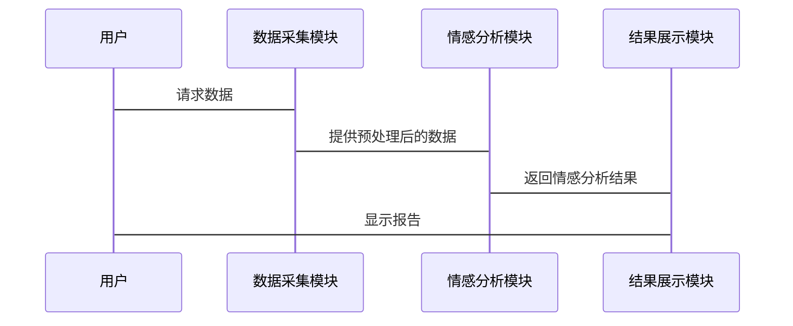

                 


# 企业估值中的情感人工智能评估

> 关键词：企业估值，情感人工智能，情感分析，自然语言处理，机器学习

> 摘要：随着人工智能技术的快速发展，情感人工智能在企业估值中的应用逐渐受到关注。本文从情感人工智能的基本概念出发，分析其在企业估值中的核心作用，并详细介绍情感人工智能的算法原理、数学模型、系统架构设计以及实际项目中的应用案例，最后总结情感人工智能在企业估值中的最佳实践和未来发展方向。

---

## 第1章: 情感人工智能与企业估值的背景介绍

### 1.1 情感人工智能的基本概念

#### 1.1.1 情感人工智能的定义
情感人工智能（Emotion Artificial Intelligence, EAI）是人工智能领域的一个分支，专注于理解和分析人类情感。它通过自然语言处理、机器学习等技术，从文本、语音或图像中提取情感信息，进而进行情感分类或强度计算。

#### 1.1.2 情感人工智能的核心要素
- **自然语言处理（NLP）**：用于理解和生成人类语言。
- **情感分类**：将文本分为积极、消极或中性。
- **情感强度计算**：量化情感的强度，例如从0到1的评分。

#### 1.1.3 情感人工智能与企业估值的关系
情感人工智能可以帮助分析企业声誉、市场情绪等非财务因素，从而辅助企业估值。

### 1.2 企业估值的传统方法与挑战

#### 1.2.1 传统企业估值方法概述
- **财务指标法**：如市盈率、市净率等。
- **DCF模型**：通过现金流折现进行估值。

#### 1.2.2 传统方法的局限性
- 仅依赖财务数据，忽视市场情绪和企业声誉的影响。
- 无法捕捉市场参与者的心理因素。

#### 1.2.3 引入情感人工智能的必要性
情感人工智能可以帮助分析市场情绪，提供更全面的估值依据。

### 1.3 情感人工智能在企业估值中的应用前景

#### 1.3.1 情感人工智能的优势
- 提供非财务数据支持，增强估值的全面性。
- 实时分析市场情绪，提高估值的时效性。

#### 1.3.2 情感人工智能在企业估值中的潜在应用场景
- 分析媒体报道和社交媒体数据，评估企业声誉。
- 监测行业趋势，预测市场波动对企业估值的影响。

#### 1.3.3 情感人工智能对企业价值的影响
通过分析市场情绪，调整估值模型中的参数，提供更准确的估值结果。

---

## 第2章: 情感人工智能的核心概念与联系

### 2.1 情感人工智能的核心原理

#### 2.1.1 情感分析的基本原理
- 通过文本预处理、特征提取和分类器训练，识别文本中的情感倾向。

#### 2.1.2 情感人工智能的实现流程
1. **文本预处理**：去除停用词、分词等。
2. **特征提取**：提取文本特征，如TF-IDF。
3. **情感分类**：使用机器学习或深度学习模型进行分类。

#### 2.1.3 情感人工智能与自然语言处理的关系
自然语言处理为情感人工智能提供技术支持，情感人工智能则是自然语言处理的一个应用领域。

### 2.2 情感人工智能的核心技术

#### 2.2.1 文本预处理技术
- **分词**：将文本分割成词语或短语。
- **去除停用词**：移除无意义的词汇，如“的”、“是”等。

#### 2.2.2 情感分类算法
- **基于规则的分类**：根据预定义的规则进行分类。
- **机器学习分类**：如支持向量机（SVM）、随机森林（Random Forest）等。
- **深度学习分类**：如卷积神经网络（CNN）、循环神经网络（RNN）等。

#### 2.2.3 情感强度计算方法
- **基于概率论的强度计算**：如贝叶斯模型。
- **基于深度学习的强度预测**：如长短时记忆网络（LSTM）。

### 2.3 情感人工智能与企业估值的关联

#### 2.3.1 情感数据对企业价值的影响
- 正面情感增强企业价值，负面情感则可能降低企业价值。

#### 2.3.2 情感人工智能在企业估值中的具体应用
- 分析新闻、评论等文本数据，评估企业声誉和市场前景。
- 监测行业趋势，预测市场波动对企业估值的影响。

#### 2.3.3 情感人工智能与企业财务指标的结合
将情感数据与财务指标结合，提供更全面的估值依据。

---

## 第3章: 情感人工智能算法原理与数学模型

### 3.1 情感分析算法概述

#### 3.1.1 基于规则的情感分析算法
- 通过预定义的规则和情感词典进行情感分类。

#### 3.1.2 基于机器学习的情感分析算法
- 使用SVM、随机森林等算法，基于特征向量进行分类。

#### 3.1.3 基于深度学习的情感分析算法
- 使用CNN、RNN等深度学习模型，自动提取文本特征。

### 3.2 情感分析的数学模型

#### 3.2.1 基于贝叶斯的分类模型
- 使用贝叶斯定理，计算每个类别的概率。

#### 3.2.2 基于支持向量机的分类模型
- 将文本特征映射到高维空间，寻找最优超平面。

#### 3.2.3 基于深度学习的序列模型
- 使用LSTM处理序列数据，捕捉上下文信息。

### 3.3 情感强度计算的数学模型

#### 3.3.1 情感强度的度量方法
- 使用情感词典中的情感强度评分，加权计算整体情感强度。

#### 3.3.2 基于概率论的情感强度计算
- 使用贝叶斯网络计算情感强度的概率分布。

#### 3.3.3 基于深度学习的情感强度预测模型
- 使用回归模型预测情感强度。

---

## 第4章: 情感人工智能在企业估值中的系统分析与架构设计

### 4.1 系统分析

#### 4.1.1 问题场景介绍
- 需要分析企业声誉和市场情绪，辅助企业估值。

#### 4.1.2 项目目标与范围
- 开发一个情感人工智能系统，辅助企业估值。

#### 4.1.3 系统功能需求分析
- 数据采集：从新闻、社交媒体等来源获取文本数据。
- 情感分析：对文本进行情感分类和强度计算。
- 结果展示：生成情感报告，辅助估值。

### 4.2 系统架构设计

#### 4.2.1 系统架构概述
- 包括数据采集模块、情感分析模块、结果展示模块。

#### 4.2.2 系统模块划分
- **数据采集模块**：负责数据的获取和预处理。
- **情感分析模块**：包括文本预处理、特征提取、情感分类和强度计算。
- **结果展示模块**：生成情感报告，提供可视化界面。

#### 4.2.3 系统接口设计
- 数据接口：与数据源对接，获取文本数据。
- 分析接口：提供情感分析服务，返回情感分类和强度。
- 展示接口：提供结果展示的API，供用户查看。

### 4.3 系统交互设计

#### 4.3.1 系统交互流程
1. 用户输入查询条件，触发数据采集。
2. 数据采集模块获取数据并预处理。
3. 情感分析模块进行分类和强度计算。
4. 结果展示模块生成报告，返回给用户。

#### 4.3.2 系统交互序列图


#### 4.3.3 系统交互的实现细节
- 数据采集模块使用爬虫技术获取文本数据。
- 情感分析模块使用预训练的模型进行分类和强度计算。
- 结果展示模块生成可视化报告，方便用户理解。

---

## 第5章: 情感人工智能在企业估值中的项目实战

### 5.1 环境安装与配置

#### 5.1.1 开发环境的选择
- 使用Python作为开发语言。
- 安装必要的库，如NLTK、Scikit-learn、TensorFlow等。

#### 5.1.2 相关工具的安装
- 安装Jupyter Notebook用于开发和调试。
- 安装数据库和可视化工具，如MySQL、Tableau等。

### 5.2 系统核心实现源代码

#### 5.2.1 数据预处理代码
```python
import nltk
from sklearn.feature_extraction.text import TfidfVectorizer

def preprocess(text):
    # 分词
    words = nltk.word_tokenize(text)
    # 去除停用词
    stop_words = set(nltk.corpus.stopwords.words('english'))
    filtered_words = [word for word in words if word.lower() not in stop_words]
    return ' '.join(filtered_words)
```

#### 5.2.2 情感分类代码
```python
from sklearn.svm import SVC
from sklearn.metrics import accuracy_score

# 训练模型
model = SVC()
model.fit(X_train, y_train)

# 预测
y_pred = model.predict(X_test)
print("Accuracy:", accuracy_score(y_test, y_pred))
```

#### 5.2.3 情感强度计算代码
```python
import numpy as np
from sklearn.linear_model import LinearRegression

# 训练回归模型
regressor = LinearRegression()
regressor.fit(X_train_int, y_train_int)

# 预测强度
y_pred_int = regressor.predict(X_test_int)
print("预测情感强度:", y_pred_int)
```

### 5.3 项目实战案例分析

#### 5.3.1 案例背景
假设我们有一家科技公司的新闻数据，需要分析这些新闻的情感倾向。

#### 5.3.2 数据采集与预处理
- 使用爬虫获取相关新闻文本。
- 对文本进行分词和去停用词处理。

#### 5.3.3 情感分析与强度计算
- 使用SVM进行情感分类，LinearRegression进行强度预测。

#### 5.3.4 结果展示
- 生成情感分析报告，包括情感分类结果和强度评分。

### 5.4 项目小结

---

## 第6章: 情感人工智能在企业估值中的最佳实践与未来展望

### 6.1 最佳实践

#### 6.1.1 数据质量的重要性
- 确保数据的多样性和代表性。

#### 6.1.2 模型选择的策略
- 根据任务需求选择合适的模型，如深度学习模型适合大数据场景。

#### 6.1.3 模型调优的技巧
- 使用交叉验证和网格搜索优化模型参数。

### 6.2 小结

### 6.3 注意事项

#### 6.3.1 数据隐私问题
- 遵守数据隐私法规，保护用户数据安全。

#### 6.3.2 模型的可解释性
- 选择可解释性强的模型，便于用户理解和信任。

#### 6.3.3 情感数据的动态变化
- 定期更新模型，适应市场情绪的变化。

### 6.4 拓展阅读

#### 6.4.1 深度学习在情感分析中的应用
- 推荐阅读相关论文和书籍。

#### 6.4.2 情感人工智能的最新研究
- 关注学术会议和期刊的最新研究成果。

---

## 作者信息

作者：AI天才研究院/AI Genius Institute & 禅与计算机程序设计艺术 /Zen And The Art of Computer Programming

---

以上是文章的完整内容，涵盖了情感人工智能在企业估值中的各个方面，包括背景介绍、核心概念、算法原理、系统架构设计、项目实战以及最佳实践与未来展望。通过一步步的分析推理，您可以深入了解情感人工智能如何辅助企业估值，并在实际项目中应用这些技术。

