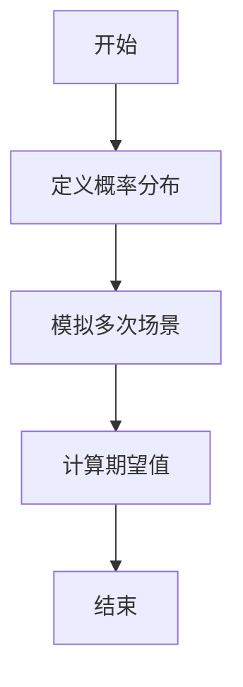
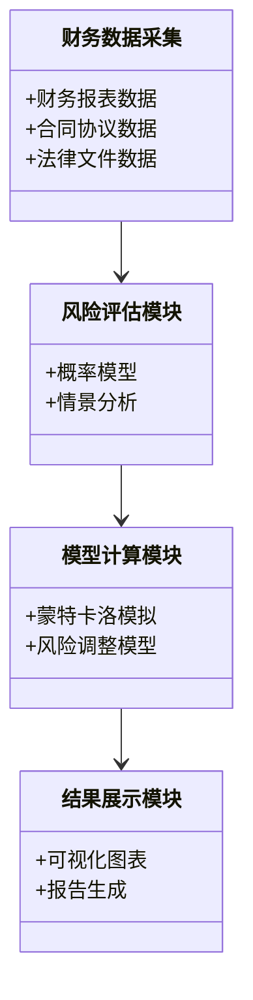

                 


# 企业估值中的或有负债处理方法

## 关键词：
企业估值、或有负债、财务报表、法律风险、资产减值、投资决策、财务模型

## 摘要：
在企业估值过程中，或有负债是一个复杂而重要的因素。本文从定义、分类、会计处理、法律性质、财务影响、定性与定量分析方法、数学模型、系统架构和实战案例等多个维度，详细探讨或有负债的处理方法。通过实例分析和数学模型，帮助读者理解或有负债在企业估值中的重要性，并提供实际操作的指导。

---

# 第1章: 或有负债的基本概念

## 1.1 或有负债的定义与分类

### 1.1.1 或有负债的定义
或有负债（Contingent Liabilities）是指那些取决于未来某种不确定事件是否发生的潜在负债。它们并不在企业的资产负债表中直接列示，但一旦触发条件成立，可能会转化为实际负债。

### 1.1.2 或有负债的主要分类
- **合同责任**：因合同或协议产生的潜在责任，如未履行的合同义务。
- **担保责任**：为企业或其他方提供担保所形成的潜在负债。
- **补偿责任**：因违约或过失需要赔偿的潜在责任。
- **连带责任**：与其他方共同承担的潜在责任。

### 1.1.3 或有负债的会计处理
- 会计确认：只有在满足高度可能性且金额可计量时，才需确认为负债。
- 信息披露：即使未确认，也需在财务报表附注中披露相关风险。

## 1.2 或有负债的法律性质

### 1.2.1 合同责任与连带责任
- 合同责任：基于合同条款的潜在义务。
- 连带责任：与其他方共同承担的责任，可能在一方无法履行时全部承担。

### 1.2.2 担保责任与补偿责任
- 担保责任：为企业或其他方的债务提供担保。
- 补偿责任：因过失或违约需赔偿的潜在责任。

### 1.2.3 或有负债的法律后果
- 影响企业的信用评级和融资能力。
- 可能导致资产被冻结或处置。

## 1.3 或有负债在企业估值中的重要性

### 1.3.1 或有负债对企业财务状况的影响
- 增加企业的潜在债务负担。
- 影响企业的偿债能力和财务稳定性。

### 1.3.2 或有负债对企业价值评估的影响
- 高估或低估企业的实际价值。
- 增加企业的财务风险和不确定性。

### 1.3.3 或有负债的潜在风险与机会
- 风险：可能引发财务危机。
- 机会：通过有效管理或有负债，增强企业的财务灵活性。

---

# 第2章: 或有负债的会计处理与披露

## 2.1 或有负债的会计确认与计量

### 2.1.1 或有负债的确认标准
- 高度可能性：或有负债很可能导致企业承担偿债义务。
- 金额可计量：能够合理估计潜在负债的金额。

### 2.1.2 或有负债的计量方法
- 确定性原则：只有在金额确定的情况下才能确认。
- 概率加权：考虑不同情况下负债发生的概率和金额。

### 2.1.3 或有负债的会计处理流程
1. 识别潜在的或有负债。
2. 分析触发条件和金额的可计量性。
3. 确认符合会计准则的负债。
4. 进行信息披露。

## 2.2 或有负债的财务报表披露

### 2.2.1 或有负债在资产负债表中的列示
- 或有负债通常不在资产负债表中列示，但需在附注中披露。

### 2.2.2 或有负债在附注中的披露要求
- 描述或有负债的性质和金额。
- 分析或有负债的潜在影响。

### 2.2.3 或有负债披露的注意事项
- 避免过度乐观或悲观的估计。
- 确保披露信息的准确性和完整性。

## 2.3 或有负债的审计与核查

### 2.3.1 或有负债的审计程序
- 检查或有负债的识别和确认过程。
- 验证或有负债的披露是否符合会计准则。

### 2.3.2 或有负债的核查方法
- 分析合同和协议的条款。
- 评估潜在负债发生的可能性和金额。

### 2.3.3 或有负债审计中的常见问题
- 低估或遗漏潜在负债。
- 未充分披露或有负债的风险。

---

# 第3章: 或有负债对财务报表的影响

## 3.1 或有负债对资产负债表的影响

### 3.1.1 或有负债对资产的影响
- 可能导致资产减值或处置。

### 3.1.2 或有负债对负债的影响
- 增加企业的潜在债务负担。

### 3.1.3 或有负债对所有者权益的影响
- 或有负债可能减少所有者权益。

## 3.2 或有负债对利润表的影响

### 3.2.1 或有负债对收入的影响
- 可能导致收入减少或费用增加。

### 3.2.2 或有负债对费用的影响
- 增加企业运营成本。

### 3.2.3 或有负债对净利润的影响
- 或有负债可能减少企业的净利润。

## 3.3 或有负债对现金流量表的影响

### 3.3.1 或有负债对经营活动的影响
- 可能导致现金流减少。

### 3.3.2 或有负债对投资活动的影响
- 影响企业投资决策。

### 3.3.3 或有负债对筹资活动的影响
- 影响企业的融资能力和成本。

---

# 第4章: 或有负债的定性与定量分析方法

## 4.1 或有负债的定性分析

### 4.1.1 或有负债的法律性质分析
- 分析或有负债的法律依据和触发条件。

### 4.1.2 或有负债的经济影响分析
- 评估或有负债对企业的经济影响。

### 4.1.3 或有负债的行业差异分析
- 不同行业或有负债的特点和风险。

## 4.2 或有负债的定量分析

### 4.2.1 或有负债的量化方法
- 使用概率加权法计算潜在负债的期望值。

### 4.2.2 或有负债的敏感性分析
- 分析不同假设下或有负债对估值的影响。

### 4.2.3 或有负债的情景分析
- 分析不同情景下或有负债的可能损失。

---

# 第5章: 或有负债的数学模型与算法

## 5.1 或有负债的概率模型

### 5.1.1 概率论基础
- 概率分布、期望值、方差等基本概念。

### 5.1.2 或有负债的蒙特卡洛模拟
- 使用蒙特卡洛方法模拟或有负债的可能损失。



### 5.1.3 Python代码实现
```python
import numpy as np
np.random.seed(0)

def monte_carlo_simulation(trials):
    losses = []
    for _ in range(trials):
        # 假设损失金额服从均匀分布
        loss = np.random.uniform(0, 100)
        losses.append(loss)
    return np.mean(losses), np.std(losses)

mean_loss, std_loss = monte_carlo_simulation(10000)
print(f"期望损失: {mean_loss}, 标准差: {std_loss}")
```

---

## 5.2 或有负债的风险调整模型

### 5.2.1 风险调整折现率法（WACC）
- 使用加权平均资本成本调整风险。

### 5.2.2 风险中性定价法
- 考虑风险因素调整未来现金流。

### 5.2.3 资产负债表调整法
- 根据或有负债的可能影响调整资产负债表。

---

## 5.3 或有负债的系统架构设计

### 5.3.1 系统功能设计
- 数据采集、风险评估、模型计算、结果展示。



### 5.3.2 系统接口设计
- 数据接口：从财务系统获取数据。
- 计算接口：调用概率模型和蒙特卡洛模拟。
- 展示接口：生成可视化报告。

---

## 5.4 或有负债的实战案例

### 5.4.1 案例背景
- 某企业因未履行合同可能面临诉讼赔偿。

### 5.4.2 数据分析
- 计算赔偿金额的期望值和标准差。

### 5.4.3 模型应用
- 使用蒙特卡洛模拟评估潜在损失。

### 5.4.4 结果解读
- 期望赔偿金额为50万元，标准差为10万元。

---

# 第6章: 或有负债的系统实现与应用

## 6.1 系统环境与安装

### 6.1.1 系统环境
- 操作系统：Windows/Linux/OS X
- 开发工具：Python、Jupyter Notebook、Mermaid
- 数据库：MySQL/PostgreSQL

### 6.1.2 安装步骤
1. 安装Python和必要的库（numpy, matplotlib, pandas）。
2. 安装Jupyter Notebook。
3. 安装Mermaid CLI工具。

## 6.2 系统核心实现

### 6.2.1 数据采集模块
```python
import pandas as pd

def load_financial_data():
    data = pd.read_csv('financial_data.csv')
    return data

data = load_financial_data()
print(data.head())
```

### 6.2.2 风险评估模块
```python
import numpy as np

def calculate_probability_loss(data):
    losses = data['loss_amount'].values
    probabilities = data['probability'].values
    expected_loss = np.sum(losses * probabilities)
    return expected_loss

expected_loss = calculate_probability_loss(data)
print(f"期望损失: {expected_loss}")
```

### 6.2.3 模型计算模块
```python
import numpy as np
np.random.seed(0)

def monte_carlo_simulation(trials):
    losses = []
    for _ in range(trials):
        loss = np.random.uniform(0, 100)
        losses.append(loss)
    return np.mean(losses), np.std(losses)

mean_loss, std_loss = monte_carlo_simulation(10000)
print(f"期望损失: {mean_loss}, 标准差: {std_loss}")
```

### 6.2.4 结果展示模块
```python
import matplotlib.pyplot as plt

def plot_loss_distribution(losses):
    plt.hist(losses, bins=20, alpha=0.7)
    plt.xlabel('损失金额')
    plt.ylabel('频数')
    plt.title('损失金额分布')
    plt.show()

losses = np.random.uniform(0, 100, 10000)
plot_loss_distribution(losses)
```

---

## 6.3 系统优化与扩展

### 6.3.1 系统优化
- 提高计算效率。
- 改善用户界面。

### 6.3.2 系统扩展
- 集成更多的数学模型。
- 支持多语言处理。

---

# 第7章: 或有负债的实战案例分析

## 7.1 案例背景

### 7.1.1 企业基本情况
- 行业：制造业。
- 主要业务：生产与销售电子产品。

### 7.1.2 案件背景
- 企业因产品质量问题面临多起诉讼。
- 可能需要赔偿金额在50万到100万美元之间。

## 7.2 数据分析

### 7.2.1 数据采集
- 从财务报表和法律文件中提取相关数据。

### 7.2.2 数据清洗
- 处理缺失值和异常值。

## 7.3 模型应用

### 7.3.1 概率模型
- 计算每种赔偿金额的概率。

### 7.3.2 蒙特卡洛模拟
- 模拟10000次赔偿金额的分布。

## 7.4 结果解读

### 7.4.1 期望损失
- 期望赔偿金额：75万美元。

### 7.4.2 标准差
- 标准差：10万美元。

### 7.4.3 风险分析
- 有30%的概率赔偿金额超过80万美元。

## 7.5 案例小结

### 7.5.1 经验总结
- 及时识别和评估或有负债。
- 建立有效的风险管理系统。

### 7.5.2 操作建议
- 定期审查和更新或有负债清单。
- 与法律顾问和财务团队紧密合作。

---

# 第8章: 或有负债处理的注意事项与未来展望

## 8.1 注意事项

### 8.1.1 数据的准确性和完整性
- 确保数据的准确性和完整性。

### 8.1.2 模型的合理性和适用性
- 根据实际情况选择合适的模型。

### 8.1.3 结果的合理解释
- 避免过度解读模型结果。

## 8.2 未来展望

### 8.2.1 技术进步
- 大数据分析和人工智能在或有负债处理中的应用。

### 8.2.2 行业趋势
- 或有负债管理的全球化和标准化。

### 8.2.3 研究方向
- 或有负债与企业信用评级的关系。

---

# 作者：AI天才研究院/AI Genius Institute & 禅与计算机程序设计艺术 /Zen And The Art of Computer Programming

