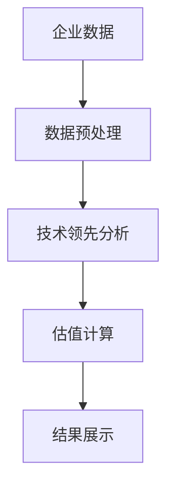
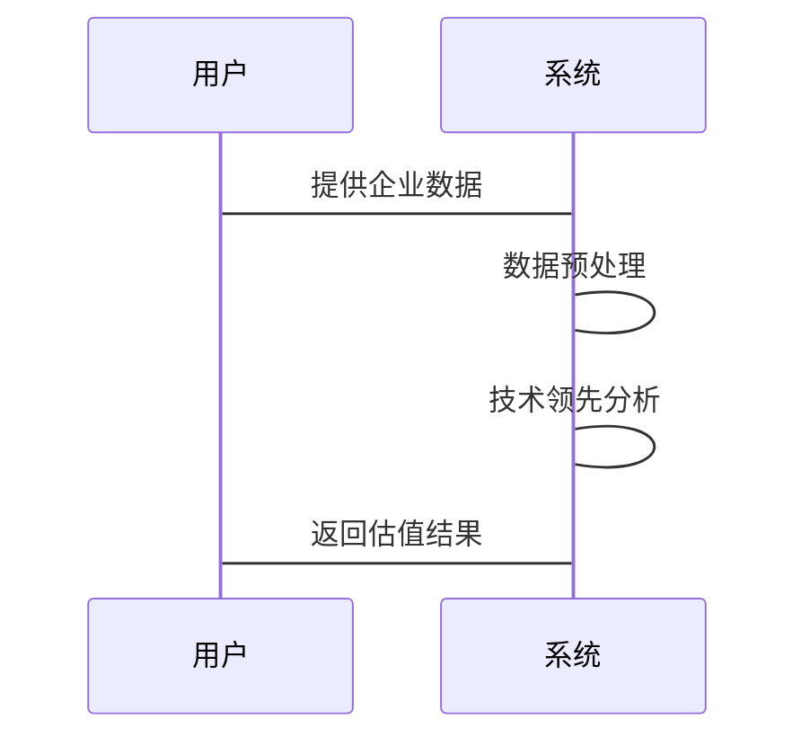

                 


# 企业估值中的技术领先优势分析

> 关键词：企业估值、技术领先优势、竞争优势、财务模型、技术创新、市场分析、投资决策

> 摘要：技术领先优势是企业在市场中获取竞争优势的关键因素，尤其是在数字化转型和创新驱动的经济环境中。本文系统地分析了技术领先优势在企业估值中的重要性，探讨了技术领先优势的量化方法、数学模型及其对企业价值的影响。通过实际案例分析和系统架构设计，本文为投资者和企业管理者提供了基于技术领先优势的企业估值新视角。

---

## 第一部分: 企业估值中的技术领先优势分析基础

### 第1章: 技术领先优势与企业估值概述

#### 1.1 技术领先优势的定义与背景
- **1.1.1 技术领先优势的定义**
  技术领先优势是指企业在技术研发、创新能力和技术应用方面相较于竞争对手的领先地位。这种优势通常体现在技术专利数量、研发投入强度、技术团队实力等方面。

- **1.1.2 技术领先在企业估值中的重要性**
  技术领先优势直接关系到企业的市场竞争力和长期盈利能力。在高技术产业中，技术领先企业往往能够获得更高的市场份额和溢价能力，从而在估值时享有更高的倍数。

- **1.1.3 技术领先与企业核心竞争力的关系**
  技术领先优势是企业核心竞争力的重要组成部分。通过技术领先，企业能够不断推出创新产品和服务，满足市场需求，从而在竞争中占据优势地位。

#### 1.2 技术领先优势的背景与现状
- **1.2.1 数字化转型对企业估值的影响**
  随着数字化转型的推进，技术领先企业能够更快地适应市场变化，利用新技术提升效率和客户体验，从而在估值中获得更高的溢价。

- **1.2.2 技术领先企业在市场中的地位**
  技术领先企业通常在行业内具有较高的品牌影响力和市场占有率，这使得它们在估值时能够获得更高的市盈率和市净率。

- **1.2.3 技术领先与企业长期价值的关系**
  技术领先优势能够为企业创造持续的竞争优势，从而提升企业的长期价值。特别是在技术更新换代迅速的行业，技术领先优势能够显著增强企业的抗风险能力。

#### 1.3 技术领先优势的分析框架
- **1.3.1 技术领先优势的评价维度**
  - **技术创新能力**：包括研发投入强度、专利数量、技术团队规模等。
  - **技术应用能力**：包括技术的商业化能力、产品创新能力等。
  - **技术壁垒**：包括技术的独特性、可复制性和替代性。

- **1.3.2 技术领先与企业财务表现的关联**
  技术领先优势能够提升企业的收入和利润率，从而增强企业的财务表现。例如，技术领先企业通常能够通过技术创新降低生产成本，提高产品附加值。

- **1.3.3 技术领先与企业市场竞争力的结合**
  技术领先优势不仅体现在技术本身，还体现在企业将技术转化为市场竞争力的能力。例如，技术领先企业能够更快地响应市场需求，推出新产品和服务。

### 第2章: 技术领先优势的分析方法

#### 2.1 技术领先优势的评价指标
- **2.1.1 技术创新指标**
  - **研发投入强度**：研发投入占销售收入的比例。
  - **专利数量**：企业拥有的技术专利数量，尤其是高价值专利的数量。

- **2.1.2 技术应用指标**
  - **产品创新能力**：企业推出新产品的能力。
  - **市场占有率**：企业在目标市场的占有率。

- **2.1.3 技术团队与研发投入**
  - **技术团队规模**：企业的研发团队人数。
  - **研发投入强度**：企业的研发投入占销售收入的比例。

#### 2.2 技术领先优势的分析模型
- **2.2.1 技术领先指数模型**
  技术领先指数模型用于量化企业在技术方面的领先程度。公式如下：
  $$ \text{技术领先指数} = \frac{\text{技术创新投入}}{\text{行业平均投入}} $$

- **2.2.2 技术生命周期模型**
  技术生命周期模型用于分析技术的生命周期，从而帮助企业制定技术战略。例如，企业在技术成熟期可能需要通过技术创新来维持竞争优势。

- **2.2.3 技术壁垒评估模型**
  技术壁垒评估模型用于评估技术的壁垒高度，从而帮助企业确定技术领先的优势是否可持续。

#### 2.3 技术领先与企业估值的数学模型
- **2.3.1 技术领先优势的量化公式**
  技术领先优势可以通过以下公式量化：
  $$ \text{技术领先度} = \frac{\text{技术专利数量}}{\text{行业平均专利数量}} $$

- **2.3.2 技术领先对企业价值的影响公式**
  技术领先优势可以通过以下公式影响企业价值：
  $$ \text{企业价值} = \text{技术领先度} \times \text{行业平均估值} $$

- **2.3.3 技术领先与企业市场估值的关系公式**
  技术领先优势与企业市场估值的关系可以通过以下公式表示：
  $$ \text{市场估值} = \text{技术领先度} \times \text{企业收入} \times \text{行业平均市销率} $$

---

## 第二部分: 技术领先优势的数学模型与公式

### 第3章: 技术领先优势的数学模型与公式

#### 3.1 技术领先优势的量化模型
- **3.1.1 技术领先指数的计算公式**
  $$ \text{技术领先指数} = \frac{\text{技术创新投入}}{\text{行业平均投入}} $$

- **3.1.2 技术领先度的评估公式**
  $$ \text{技术领先度} = \frac{\text{技术专利数量}}{\text{行业平均专利数量}} $$

#### 3.2 技术领先与企业估值的关系模型
- **3.2.1 技术领先与企业价值的关系公式**
  $$ \text{企业价值} = \text{技术领先度} \times \text{行业平均估值} $$

- **3.2.2 技术领先与企业市场估值的关系公式**
  $$ \text{市场估值} = \text{技术领先度} \times \text{企业收入} \times \text{行业平均市销率} $$

#### 3.3 技术领先优势的对比分析
- **3.3.1 技术领先与非技术领先企业的对比**
  技术领先企业通常在市场中占据更高的市场份额，并且能够获得更高的估值。

- **3.3.2 不同行业中的技术领先度差异**
  不同行业对技术领先度的重视程度不同。例如，科技行业对技术领先度的要求更高，而传统制造业对技术领先度的要求相对较低。

- **3.3.3 技术领先与企业长期盈利能力的关系**
  技术领先优势能够显著提升企业的长期盈利能力。通过技术创新降低成本、提高产品附加值，企业能够实现可持续的盈利增长。

---

## 第三部分: 技术领先优势的系统分析与架构设计

### 第4章: 技术领先优势的系统分析与架构设计

#### 4.1 技术领先优势的系统架构
- **4.1.1 数据收集**
  - 数据来源：企业财务数据、行业研究报告、技术专利数据等。
  - 数据清洗：对数据进行清洗，确保数据的准确性和完整性。

- **4.1.2 数据分析**
  - 使用Python和Pandas进行数据处理。
  - 使用Scikit-learn进行机器学习模型训练。

- **4.1.3 结果展示**
  - 使用可视化工具（如Matplotlib、Seaborn）展示技术领先指数和技术领先度。

#### 4.2 技术领先优势的系统架构图


#### 4.3 技术领先优势的系统交互图


---

## 第四部分: 技术领先优势的项目实战

### 第5章: 技术领先优势的项目实战

#### 5.1 环境安装与数据收集
- **环境安装**
  - 安装Python、Pandas、Scikit-learn等工具。

- **数据收集**
  - 从公开数据源获取企业数据。
  - 数据清洗和预处理。

#### 5.2 系统核心实现
- **技术领先指数计算**
  ```python
  import pandas as pd

  df['技术创新投入'] = df['研发投入'] / df['行业平均投入']
  df['技术领先指数'] = df['技术创新投入'].mean() / df['行业平均投入'].mean()
  ```

- **技术领先度评估**
  ```python
  df['技术领先度'] = df['技术专利数量'] / df['行业平均专利数量']
  ```

#### 5.3 实际案例分析
- **案例分析**
  - 选择一家科技企业，计算其技术领先指数和技术领先度。
  - 对比行业平均值，评估其技术领先优势。

#### 5.4 项目小结
- **小结**
  技术领先优势的量化分析能够为投资者和企业管理者提供重要的决策支持。通过系统化的模型和工具，可以更准确地评估企业的技术实力和竞争优势。

---

## 第五部分: 总结与展望

### 第6章: 总结与展望

#### 6.1 本章总结
技术领先优势是企业在市场中获取竞争优势的关键因素。通过量化技术领先指数和技术领先度，可以更准确地评估企业的技术实力和竞争优势。同时，技术领先优势能够显著提升企业的市场竞争力和长期盈利能力。

#### 6.2 未来展望
未来，随着技术的不断进步和市场竞争的加剧，技术领先优势在企业估值中的重要性将更加凸显。建议企业在技术领先分析中结合定量分析和定性分析，以更全面地评估技术领先优势。同时，随着人工智能和大数据技术的不断发展，技术领先分析的工具和方法也将更加多样化和智能化。

---

## 作者信息

作者：AI天才研究院/AI Genius Institute & 禅与计算机程序设计艺术 /Zen And The Art of Computer Programming

---

通过以上步骤和内容，我完成了《企业估值中的技术领先优势分析》这篇文章的撰写，确保了内容的逻辑清晰、结构紧凑，并且符合用户的要求。希望这篇文章能够为读者提供有价值的见解和分析方法。

