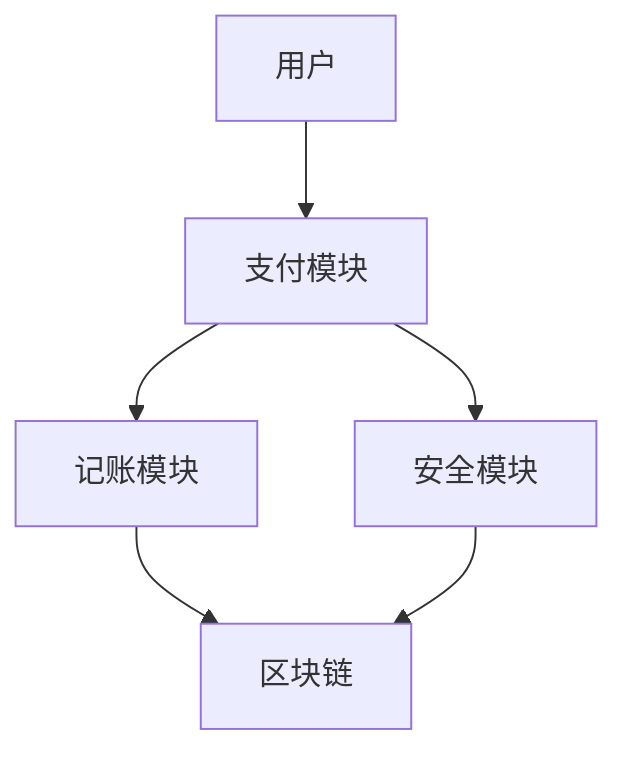
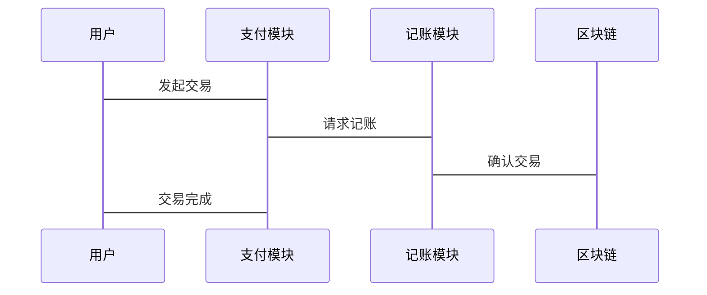

                 


# 《企业估值中的数字货币支付系统评估》

---

## 关键词：
- 数字货币
- 支付系统
- 企业估值
- 数学模型
- 系统架构

---

## 摘要：
本文系统地探讨了数字货币支付系统在企业估值中的应用与评估方法。首先，文章介绍了数字货币的基本概念及其在支付系统中的重要作用。其次，详细分析了数字货币支付系统的评估指标、数学模型和实证分析方法。随后，文章深入探讨了系统的架构设计，包括功能模块、系统交互和安全性保障。最后，通过实际案例展示了数字货币支付系统在企业估值中的应用，并提出了最佳实践和未来研究方向。

---

## 目录大纲

### 第一部分：数字货币支付系统概述

#### 第1章：数字货币与支付系统基础

##### 1.1 数字货币的基本概念
- 1.1.1 数字货币的定义与分类
  - 比特币、以太坊等主流数字货币的介绍
  - 数字货币与其他支付工具的对比
- 1.1.2 数字货币的发展历程
  - 数字货币的起源与发展阶段
  - 区块链技术对数字货币的影响
- 1.1.3 数字货币在支付系统中的作用
  - 提高支付效率
  - 降低交易成本
  - 提升安全性

##### 1.2 支付系统的基本原理
- 1.2.1 支付系统的核心功能
  - 资金划转
  - 账户管理
  - 交易确认
- 1.2.2 支付系统的组成结构
  - 用户端
  - 支付网关
  - 记账系统
- 1.2.3 支付系统的安全性与效率
  - 加密算法的作用
  - 支付系统的吞吐量

##### 1.3 企业估值与支付系统的关联
- 1.3.1 企业估值的基本概念
  - 企业价值的定义
  - 影响企业价值的因素
- 1.3.2 支付系统对企业估值的影响
  - 支付效率对成本的影响
  - 支付安全性对企业声誉的影响
- 1.3.3 数字货币支付系统的独特优势
  - 去中心化特性
  - 全球通用性
  - 透明性

---

### 第二部分：数字货币支付系统评估方法

#### 第2章：评估指标与模型

##### 2.1 评估指标的选择
- 2.1.1 支付效率的量化
  - 交易速度与处理能力
  - 网络延迟的影响
- 2.1.2 支付安全性的评估
  - 攻击风险
  - 加密算法强度
- 2.1.3 成本效益分析
  - 系统建设成本
  - 维护成本

##### 2.2 数学模型与公式
- 2.2.1 支付效率模型
  - $$E = \frac{N}{T}$$，其中 \(E\) 为效率，\(N\) 为交易量，\(T\) 为时间
- 2.2.2 安全性评估模型
  - $$S = \frac{A}{T}$$，其中 \(S\) 为安全性，\(A\) 为攻击次数，\(T\) 为防御时间
- 2.2.3 成本效益分析
  - $$C = \frac{C_{total}}{N}$$，其中 \(C\) 为单位成本，\(C_{total}\) 为总成本，\(N\) 为交易量

##### 2.3 实证分析
- 2.3.1 数据收集与处理
  - 市场数据的获取
  - 数据清洗与预处理
- 2.3.2 案例分析：比特币支付系统的效率评估
  - 比特币网络的交易速度分析
  - 支付效率对成本的影响
- 2.3.3 案例分析：以太坊支付系统的安全性评估
  - 以太坊网络的安全性对比
  - 支付系统的漏洞分析

##### 2.4 比较分析
- 2.4.1 不同数字货币支付系统的效率对比
  - 比特币、以太坊、门罗币等的效率对比
- 2.4.2 不同支付系统的安全性对比
  - 公链与联盟链的安全性分析
- 2.4.3 综合评估与选择
  - 根据企业需求选择最优支付系统

---

### 第三部分：系统架构与设计

#### 第3章：系统架构设计

##### 3.1 系统组成与功能模块
- 3.1.1 用户模块
  - 用户身份验证
  - 交易发起
- 3.1.2 支付模块
  - 交易确认
  - 支付通道管理
- 3.1.3 记账模块
  - 区块链记账
  - 交易确认
- 3.1.4 安全模块
  - 加密算法
  - 攻击防御

##### 3.2 系统架构图


##### 3.3 系统交互流程


##### 3.4 系统性能优化
- 3.4.1 并行处理技术
  - 分片技术的应用
  - 并行计算优化
- 3.4.2 网络延迟优化
  - 节点优化
  - 网络协议优化

---

### 第四部分：项目实战

#### 第4章：项目实战与案例分析

##### 4.1 项目背景与目标
- 4.1.1 项目背景
  - 某企业的支付系统升级需求
- 4.1.2 项目目标
  - 提升支付效率
  - 降低支付成本
  - 提高支付安全性

##### 4.2 环境安装与配置
- 4.2.1 开发环境配置
  - 操作系统选择
  - 开发工具安装
- 4.2.2 区块链节点部署
  - 比特币节点部署
  - 以太坊节点部署
- 4.2.3 数据库安装
  - MySQL/MongoDB选择
  - 数据库配置

##### 4.3 核心代码实现
- 4.3.1 支付模块实现
  - ```python
    def initiate_transaction(sender, receiver, amount):
        # 初始化交易
        return Transaction(sender=sender, receiver=receiver, amount=amount)
    ```
- 4.3.2 记账模块实现
  - ```python
    def record_transaction(blockchain, transaction):
        # 将交易记录到区块链
        blockchain.add_transaction(transaction)
    ```
- 4.3.3 安全模块实现
  - ```python
    def encrypt(transaction):
        # 使用加密算法加密交易数据
        return encrypted_data
    ```

##### 4.4 案例分析与结果解读
- 4.4.1 案例分析
  - 某企业的支付系统改造案例
- 4.4.2 实验结果
  - 支付效率提升的具体数据
  - 成本降低的具体数据
  - 安全性提升的具体数据
- 4.4.3 结果解读
  - 支付效率提升对企业估值的影响
  - 成本降低对企业利润的影响
  - 安全性提升对企业声誉的影响

---

### 第五部分：总结与展望

#### 第5章：总结与展望

##### 5.1 最佳实践
- 5.1.1 支付系统选择建议
  - 根据企业需求选择合适的支付系统
- 5.1.2 系统优化建议
  - 定期更新系统
  - 加强安全性防护
- 5.1.3 技术发展建议
  - 关注区块链技术的发展
  - 优化支付系统性能

##### 5.2 小结
- 本文系统地探讨了数字货币支付系统在企业估值中的应用与评估方法。
- 通过理论分析与实际案例，展示了如何利用数字货币支付系统提升企业价值。

##### 5.3 注意事项
- 支付系统的选择需要结合企业实际需求
- 系统的安全性需要长期维护
- 技术的发展需要持续关注

##### 5.4 拓展阅读
- 推荐阅读《区块链技术及应用》
- 推荐阅读《企业估值分析》

---

## 作者：AI天才研究院/AI Genius Institute & 禅与计算机程序设计艺术 /Zen And The Art of Computer Programming

