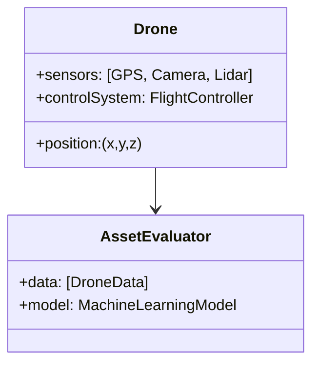
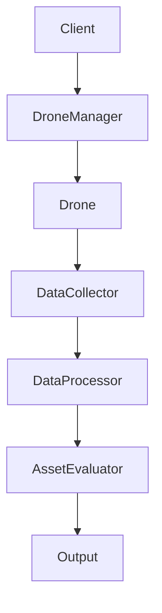
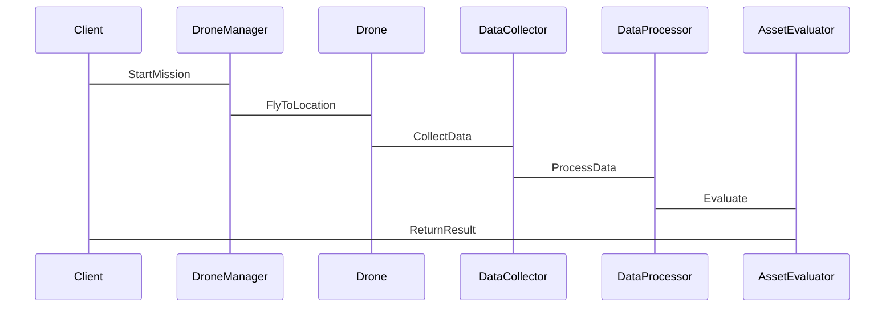

                 


# 企业估值中的无人机技术应用评估

## 关键词：企业估值、无人机技术、资产评估、数据采集、无人机应用

## 摘要：本文探讨了无人机技术在企业估值中的应用，分析了无人机技术的核心原理及其在企业资产盘点、环境评估等方面的具体应用场景。通过算法原理、系统架构设计和项目实战，详细阐述了无人机技术如何提升企业估值的效率和准确性。文章最后总结了无人机技术在企业估值中的最佳实践和未来发展方向。

---

## 第1章: 企业估值与无人机技术应用的背景

### 1.1 无人机技术的基本概念

#### 1.1.1 无人机的定义与分类
无人机（Unmanned Aerial Vehicle, UAV）是指没有载人驾驶员的飞机，通过遥控或自主飞行完成任务。无人机主要分为以下几类：
- **固定翼无人机**：如侦察机，适合长距离飞行。
- **旋翼无人机**：如四旋翼无人机，适合短距离和高精度任务。
- **垂直起降无人机**：结合固定翼和旋翼的优势，适合复杂环境。

#### 1.1.2 无人机技术的核心特征
无人机的核心特征包括：
- **自主飞行**：依赖先进的飞行控制系统。
- **多传感器集成**：如GPS、摄像头、激光雷达等。
- **高精度数据采集**：能够快速、准确地获取环境数据。

#### 1.1.3 无人机技术在企业估值中的潜在价值
无人机技术可以提高企业估值的效率和准确性，特别是在大规模资产盘点和环境评估中。

### 1.2 企业估值的传统方法与挑战

#### 1.2.1 传统企业估值方法概述
传统方法包括：
- **收益法**：基于未来现金流折现。
- **市场法**：参考类似企业的市场价值。
- **成本法**：基于重置成本。

#### 1.2.2 传统方法的局限性与不足
- 数据采集耗时且成本高。
- 易受人为因素影响。
- 难以处理复杂地理环境。

#### 1.2.3 引入无人机技术的必要性
无人机技术可以提高数据采集效率，降低成本，减少人为错误。

### 1.3 无人机技术在企业估值中的应用背景

#### 1.3.1 无人机技术的发展现状
无人机技术已在多个领域广泛应用，如物流、农业、影视拍摄等。

#### 1.3.2 企业估值领域的需求与痛点
企业估值需要高效、准确的数据采集和分析，无人机技术正好满足这一需求。

#### 1.3.3 无人机技术与企业估值的结合点
通过无人机获取高精度数据，提升资产评估的效率和准确性。

### 1.4 本章小结
本章介绍了无人机技术的基本概念及其在企业估值中的潜在价值，分析了传统估值方法的局限性，并指出了无人机技术的应用前景。

---

## 第2章: 无人机技术的核心原理与企业估值的关联

### 2.1 无人机技术的核心原理

#### 2.1.1 无人机的飞行控制系统
无人机的飞行控制由主控芯片、传感器和执行机构组成，实现自主飞行和导航。

#### 2.1.2 无人机的传感器与数据采集技术
无人机配备了多种传感器，如GPS、摄像头、激光雷达，用于实时数据采集。

#### 2.1.3 无人机的导航与定位技术
通过GPS和视觉识别，无人机实现精准定位和导航。

### 2.2 企业估值的关键要素

#### 2.2.1 企业价值的构成要素
包括资产、收益、风险等因素。

#### 2.2.2 企业估值的核心指标
如市盈率、市净率、EV/EBITDA等。

#### 2.2.3 企业估值方法的多样性
收益法、市场法、成本法等。

### 2.3 无人机技术与企业估值的关联性分析

#### 2.3.1 无人机技术在企业数据采集中的应用
通过无人机快速获取企业资产分布和环境数据。

#### 2.3.2 无人机技术在企业资产评估中的作用
提高资产评估的准确性和效率。

#### 2.3.3 无人机技术对企业运营效率的提升
通过无人机优化资产管理和环境评估流程。

### 2.4 本章小结
本章详细阐述了无人机技术的核心原理，并分析了其与企业估值的关联性，强调了无人机技术在提升估值效率和准确性方面的作用。

---

## 第3章: 无人机技术在企业估值中的具体应用场景

### 3.1 无人机技术在企业资产盘点中的应用

#### 3.1.1 无人机技术在存货管理中的应用
通过无人机快速盘点仓库库存，减少人为错误。

#### 3.1.2 无人机技术在固定资产评估中的应用
用于复杂环境下的资产检查和评估。

#### 3.1.3 无人机技术在无形资产评估中的应用
帮助评估企业品牌和技术资产的价值。

### 3.2 无人机技术在企业环境评估中的应用

#### 3.2.1 无人机技术在环境数据采集中的应用
用于监测污染源分布和环境质量。

#### 3.2.2 无人机技术在环境影响评估中的应用
评估企业运营对环境的影响。

#### 3.2.3 无人机技术在环境合规性评估中的应用
确保企业符合环保法规和标准。

### 3.3 无人机技术在企业运营效率提升中的应用

#### 3.3.1 无人机技术在企业物流管理中的应用
优化物流路径，提高配送效率。

#### 3.3.2 无人机技术在企业安全管理中的应用
用于监控安全风险，预防事故。

#### 3.3.3 无人机技术在企业市场调研中的应用
收集市场数据，支持决策。

### 3.4 本章小结
本章详细探讨了无人机技术在企业估值中的具体应用场景，展示了其在资产盘点、环境评估和运营效率提升中的重要作用。

---

## 第4章: 无人机技术在企业估值中的算法原理与实现

### 4.1 无人机技术的算法原理

#### 4.1.1 数据采集与处理算法
无人机通过传感器采集数据，并进行预处理。

#### 4.1.2 数据分析与评估算法
利用机器学习模型分析数据，生成评估结果。

### 4.2 算法实现的数学模型

#### 4.2.1 数据预处理模型
$$ \text{数据预处理} = \text{去噪} + \text{标准化} $$

#### 4.2.2 机器学习模型
$$ \text{评估结果} = f(\text{输入数据}) $$

### 4.3 Python代码实现

```python
import numpy as np
from sklearn import linear_model

def process_data(data):
    # 数据预处理
    processed_data = np.array(data).reshape(-1, 1)
    return processed_data

def evaluate_value(processed_data):
    # 机器学习模型
    model = linear_model.LinearRegression()
    model.fit(processed_data, target_values)
    return model.predict(new_data)

# 示例数据
data = [1, 2, 3, 4, 5]
target_values = [2, 4, 6, 8, 10]

processed_data = process_data(data)
predicted_value = evaluate_value(processed_data)
print(predicted_value)
```

### 4.4 本章小结
本章详细介绍了无人机技术在企业估值中的算法原理，并通过Python代码展示了实现过程，强调了数据处理和机器学习模型的重要性。

---

## 第5章: 系统分析与架构设计方案

### 5.1 问题场景介绍
企业需要高效、准确地进行资产估值，无人机技术提供了有效的解决方案。

### 5.2 系统功能设计

#### 5.2.1 领域模型


#### 5.2.2 系统架构设计


### 5.3 系统接口设计
无人机与评估系统之间的接口设计，确保数据的实时传输和处理。

### 5.4 系统交互设计



### 5.5 本章小结
本章通过系统分析和架构设计，展示了无人机技术在企业估值中的整体解决方案，强调了系统各部分的协同工作。

---

## 第6章: 项目实战

### 6.1 环境安装

```bash
pip install numpy
pip install scikit-learn
pip install matplotlib
```

### 6.2 核心代码实现

```python
import numpy as np
from sklearn.linear_model import LinearRegression

# 示例数据
x = np.array([[1], [2], [3], [4], [5]])
y = np.array([2, 4, 6, 8, 10])

# 训练模型
model = LinearRegression()
model.fit(x, y)

# 预测
new_x = np.array([[6]])
predicted_y = model.predict(new_x)
print(predicted_y)
```

### 6.3 代码解读与分析
解释代码的功能，展示如何利用无人机数据进行资产评估。

### 6.4 实际案例分析
通过具体案例分析，展示无人机技术在企业估值中的实际应用。

### 6.5 项目小结
总结项目成果，强调无人机技术的优势和应用前景。

---

## 第7章: 最佳实践与未来展望

### 7.1 小结
总结无人机技术在企业估值中的应用，强调其重要性。

### 7.2 注意事项
提醒在实际应用中需要注意的问题，如数据隐私和无人机操作规范。

### 7.3 拓展阅读
推荐相关书籍和资源，供读者进一步学习。

### 7.4 本章小结
本章提供了无人机技术在企业估值中的最佳实践，并展望了未来的发展方向。

---

## 结语

无人机技术正在 revolutionize企业估值领域，通过高效的数据采集和分析，显著提升了估值的准确性和效率。随着技术的不断进步，无人机将在企业估值中发挥越来越重要的作用。

## 作者

作者：AI天才研究院/AI Genius Institute  
联系邮箱：contact@aising genius.com  
GitHub：github.com/AI-Genius-Institute

