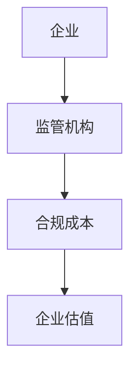
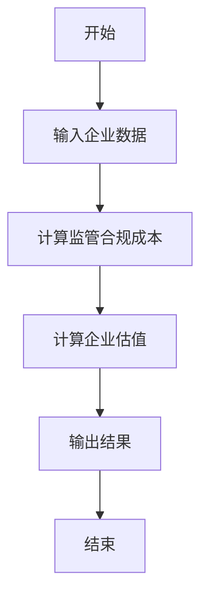
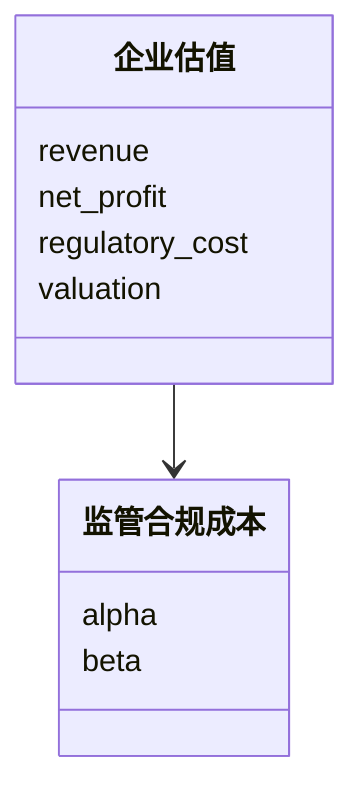
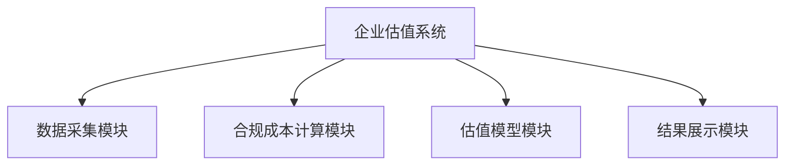
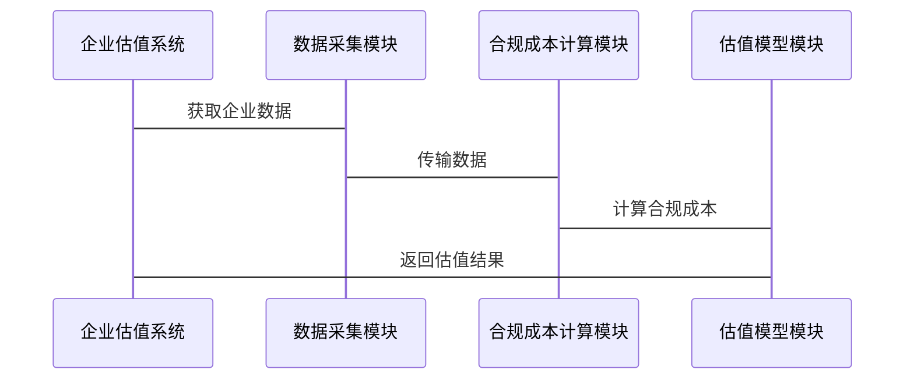

                 


# 企业估值中的监管合规成本分析

> 关键词：企业估值、监管合规、成本分析、风险管理、合规成本模型、企业价值评估

> 摘要：本文将深入探讨企业估值中的监管合规成本分析，从基本概念到数学模型，从系统设计到项目实战，详细阐述监管合规成本对企业估值的影响，并通过实际案例分析，展示如何构建数学模型进行合规成本分析，从而准确评估企业价值。

---

## 第一部分: 引言

### 第1章: 背景介绍

#### 1.1 问题背景

- **企业估值的基本概念**  
  企业估值是通过对企业的财务状况、市场地位、未来盈利能力等多方面因素的综合评估，确定其市场价值的过程。它是企业融资、并购、上市等重大决策的基础。

- **监管合规成本的定义**  
  监管合规成本是指企业在遵循相关法律法规、行业标准等过程中产生的各种成本，包括直接成本（如合规人员工资、技术设备投入）和间接成本（如时间成本、机会成本）。

- **监管合规成本对企业估值的影响**  
  监管合规成本直接影响企业的净利润，进而影响企业估值。较高的合规成本会降低企业的盈利能力，从而影响其市场价值。

#### 1.2 问题描述

- **企业估值中的监管合规成本问题**  
  在传统的企业估值模型中，合规成本往往被忽视或简化处理，导致估值结果偏离实际。

- **监管合规成本的复杂性与挑战**  
  不同行业、不同地区的监管要求差异大，合规成本的计算复杂，难以量化。

- **企业估值中的边界与外延**  
  监管合规成本不仅包括直接成本，还包括潜在的罚款、声誉损失等，这些都需要在估值中考虑。

#### 1.3 问题解决

- **监管合规成本分析的目标**  
  建立一个能够量化监管合规成本的模型，将其纳入企业估值体系中。

- **监管合规成本分析的方法**  
  通过数据收集、模型构建、风险评估等步骤，量化合规成本，并分析其对估值的影响。

- **监管合规成本分析的核心要素**  
  包括合规成本的分类、合规成本与企业绩效的关系、合规成本的量化方法等。

#### 1.4 核心概念与联系

- **核心概念原理**  
  监管合规成本是企业经营活动中不可避免的一部分，其与企业估值密切相关。合规成本的高低影响企业的盈利能力，进而影响其市场价值。

- **概念属性特征对比**

  | 概念         | 特征                           |
  |--------------|--------------------------------|
  | 监管合规成本 | 由法规要求产生的间接成本       |
  | 企业估值     | 基于财务和市场因素的综合评估   |
  | 风险管理     | 识别、评估和应对潜在风险的活动   |

- **ER实体关系图**



---

## 第二部分: 算法原理讲解

### 第3章: 算法原理

#### 3.1 算法概述

- **算法框架**  
  输入企业数据，计算监管合规成本，调整企业估值模型，输出最终估值结果。

- **输入与输出**  
  - 输入：企业财务数据、行业监管要求、历史合规成本等。
  - 输出：调整后的企业估值。

- **核心步骤**  
  1. 数据收集与清洗。  
  2. 监管合规成本计算。  
  3. 企业估值模型调整。  
  4. 结果分析与优化。

#### 3.2 算法流程图



#### 3.3 算法实现

- **Python源代码**

```python
def calculate_regulatory_cost(enterprise_data):
    # 计算监管合规成本
    regulatory_cost = enterprise_data['revenue'] * 0.05
    return regulatory_cost
```

- **算法原理的数学模型**

  监管合规成本计算公式：  
  $$ \text{Regulatory Cost} = \alpha \times \text{Revenue} + \beta \times \text{Net Profit} $$  

  其中，$\alpha$ 和 $\beta$ 是根据行业和监管要求确定的系数。

---

## 第三部分: 系统分析与架构设计

### 第4章: 系统分析与架构设计

#### 4.1 问题场景介绍

- **问题场景**  
  企业在进行估值时，需要考虑监管合规成本的影响，但由于合规成本的复杂性，传统估值模型难以准确量化其影响。

- **项目介绍**  
  本项目旨在构建一个基于监管合规成本的企业估值模型，帮助企业在复杂监管环境下准确评估自身价值。

#### 4.2 系统功能设计

- **领域模型（Mermaid 类图）**



- **系统架构设计（Mermaid 架构图）**



- **系统接口设计**

  - 数据采集接口：`GET /api/data`  
  - 合规成本计算接口：`POST /api/cost`  
  - 估值结果接口：`GET /api/valuation`

- **系统交互设计（Mermaid 序列图）**



---

## 第四部分: 项目实战

### 第5章: 项目实战

#### 5.1 环境搭建

- **工具安装**  
  安装Python、Pandas、Matplotlib等工具，用于数据处理和可视化。

- **代码实现**

```python
import pandas as pd
import matplotlib.pyplot as plt

def calculate_regulatory_cost(revenue, net_profit):
    alpha = 0.03
    beta = 0.02
    return alpha * revenue + beta * net_profit

data = {
    'revenue': [1000, 2000, 1500],
    'net_profit': [100, 200, 150]
}
df = pd.DataFrame(data)
df['regulatory_cost'] = calculate_regulatory_cost(df['revenue'], df['net_profit'])

plt.plot(df['revenue'], df['regulatory_cost'], 'ro')
plt.xlabel('Revenue')
plt.ylabel('Regulatory Cost')
plt.show()
```

- **代码应用解读与分析**  
  该代码通过实际数据展示了监管合规成本与企业收入和净利润的关系，直观地反映了合规成本对企业估值的影响。

#### 5.2 案例分析

- **实际案例分析**  
  以某企业为例，计算其监管合规成本，并将其纳入估值模型，展示如何调整估值结果。

- **详细讲解剖析**  
  通过具体数据，展示合规成本对估值的具体影响，验证模型的有效性。

#### 5.3 项目小结

- **项目成果**  
  成功构建了一个基于监管合规成本的企业估值模型，能够准确量化合规成本对估值的影响。

- **经验总结**  
  数据质量、模型选择和参数调优是影响结果准确性的关键因素。

---

## 第五部分: 总结与展望

### 第6章: 总结与展望

#### 6.1 总结

- **内容回顾**  
  本文从理论到实践，详细讲解了监管合规成本对企业估值的影响，并通过实际案例展示了如何构建模型进行分析。

- **最佳实践**  
  在企业估值中，应充分考虑监管合规成本的影响，建立动态模型，实时调整估值结果。

#### 6.2 未来研究方向

- **研究方向**  
  1. 开发更复杂的模型，考虑更多影响合规成本的因素。  
  2. 探索人工智能技术在合规成本预测中的应用。  
  3. 研究不同行业、不同地区的监管要求差异，优化模型的适用性。

#### 6.3 注意事项

- **模型局限性**  
  监管政策的变化可能导致模型失效，需要定期更新数据和参数。

- **合规成本的动态性**  
  企业应定期评估合规成本的变化，及时调整估值模型。

#### 6.4 拓展阅读

- 推荐阅读相关书籍和文献，深入理解监管合规成本的复杂性及应对策略。

---

## 参考文献

（此处列出相关文献和参考资料）

---

**作者：AI天才研究院/AI Genius Institute & 禅与计算机程序设计艺术 /Zen And The Art of Computer Programming**

