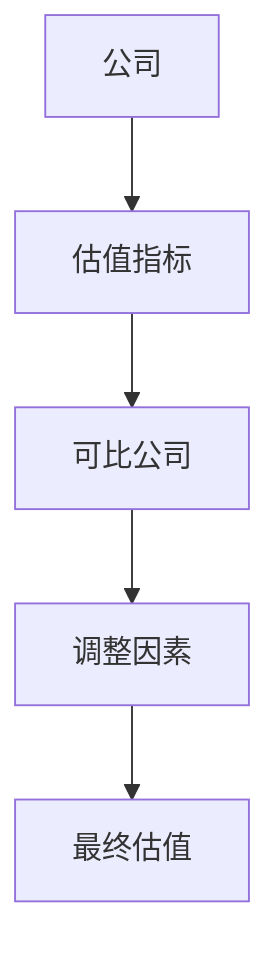
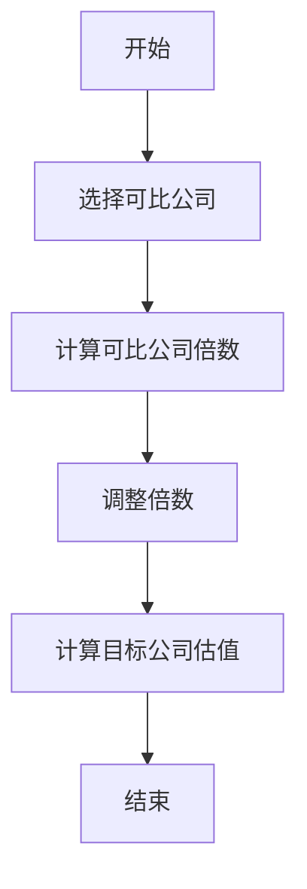
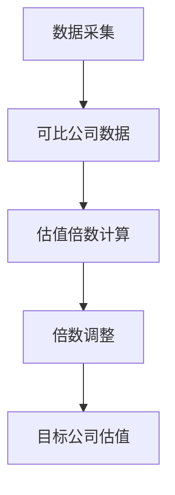

                 


# 企业估值中的相对估值法

## 关键词
企业估值，相对估值法，可比公司分析，EV/EBITDA，市盈率，市净率，并购估值

## 摘要
相对估值法是企业估值中的重要方法之一，通过比较可比公司的估值倍数来确定目标企业的价值。本文详细探讨了相对估值法的理论基础、数学模型、可比公司选择、估值调整以及实际应用案例，帮助读者掌握这一方法在企业估值中的应用。

---

# 《企业估值中的相对估值法》

## 第一章：相对估值法概述

### 1.1 相对估值法的定义与背景

相对估值法是一种基于可比公司分析的估值方法，通过比较目标公司与市场上类似公司的估值倍数（如市盈率、市净率、EV/EBITDA等）来确定目标公司的价值。这种方法在企业并购、融资和上市估值中广泛应用。

#### 核心概念解释

- **可比公司分析**：选择与目标公司相同或相似的公司作为参考，分析它们的估值倍数。
- **估值倍数**：常用的倍数包括市盈率（P/E）、市净率（P/B）、企业价值倍数（EV/EBITDA）等。

#### 相对估值法的重要性

- **市场数据的可获得性**：相对于DCF等绝对估值方法，相对估值法利用公开市场数据，操作简便。
- **假设的合理性**：假设市场上存在足够的可比公司，并且这些公司具有相似的业务模式和风险特征。

### 1.2 相对估值法的核心概念

#### 问题背景与问题描述

在企业并购或融资过程中，目标公司的内在价值难以准确评估，尤其是对于新兴企业或创新企业，DCF等绝对估值方法难以应用。相对估值法通过市场数据提供了一种替代方案。

#### 问题解决思路

1. **选择可比公司**：根据行业、规模、盈利能力等因素筛选出与目标公司相似的公司。
2. **计算可比公司估值倍数**：计算可比公司的市盈率、市净率等倍数。
3. **计算平均倍数**：对可比公司的倍数进行平均，得到目标公司的合理倍数。
4. **计算目标公司估值**：利用平均倍数乘以目标公司的相关指标（如净利润、EV等）得到估值。

#### 核心概念的结构与要素组成

- **可比公司选择**：行业、规模、盈利能力、财务状况。
- **估值倍数**：市盈率（P/E）、市净率（P/B）、EV/EBITDA。
- **倍数调整**：根据目标公司的特有因素（如风险、成长性）调整倍数。

#### 相对估值法的边界与外延

- **边界**：适用于市场数据充分且存在足够多的可比公司的情况。
- **外延**：可以与其他估值方法结合使用，如DCF模型结合相对估值法进行交叉验证。

---

## 第二章：相对估值法的理论基础

### 2.1 相对估值法的数学模型

相对估值法的核心在于通过可比公司的平均倍数来估计目标公司的合理倍数，进而计算其估值。

#### 常见的相对估值模型

1. **市盈率模型（P/E）**
   - $$ P = E \times P/E_{avg} $$
   - 其中，E为目标公司的净利润，P为目标公司的估值。

2. **市净率模型（P/B）**
   - $$ P = B \times P/B_{avg} $$
   - 其中，B为目标公司的净资产，P为目标公司的估值。

3. **EV/EBITDA模型**
   - $$ EV = EBITDA \times EV/EBITDA_{avg} $$
   - 其中，EV为目标公司的企业价值，EBITDA为目标公司的息税折旧及摊销前利润。

### 2.2 相对估值法的公式推导

#### EV/EBITDA模型的推导

假设我们有N家可比公司，每家公司的EV/EBITDA倍数分别为$$r_i$$，则平均倍数$$r_{avg}$$为：

$$ r_{avg} = \frac{1}{N} \sum_{i=1}^{N} r_i $$

目标公司的EV可以通过以下公式计算：

$$ EV = r_{avg} \times EBITDA $$

#### 代码实现示例

```python
def relative_valuationxEBITDA(companies, target_EBITDA):
    # 计算平均EV/EBITDA倍数
    avg_EV_EBITDA = sum([c.EV_EBITDA for c in companies]) / len(companies)
    # 计算目标公司EV
    target_EV = avg_EV_EBITDA * target_EBITDA
    return target_EV
```

### 2.3 相对估值法的假设条件

1. **可比公司假设**：可比公司具有相似的业务模式、风险特征和财务状况。
2. **市场效率假设**：市场能够合理反映公司的价值，不存在显著的市场失灵。
3. **相同风险假设**：可比公司与目标公司面临相似的市场风险和公司风险。

---

## 第三章：相对估值法的核心概念与联系

### 3.1 相对估值法的核心要素

#### 可比公司选择

- **行业分析**：目标公司所在的行业决定了可比公司的选择。
- **财务指标对比**：包括净利润、EBITDA、资产规模等。
- **公司规模**：通常选择规模相近的公司作为可比公司。

#### 估值倍数的计算与调整

- **倍数计算**：计算可比公司的市盈率、市净率、EV/EBITDA等倍数。
- **倍数调整**：根据目标公司的特有因素进行调整，如beta系数、成长性等。

### 3.2 相对估值法的ER实体关系图



### 3.3 相对估值法的流程图



---

## 第四章：相对估值法的算法原理

### 4.1 相对估值法的算法流程

#### 步骤1：选择可比公司

根据目标公司的行业、规模和财务状况，选择具有可比性的公司。

#### 步骤2：计算可比公司倍数

计算可比公司的市盈率、市净率、EV/EBITDA等倍数。

#### 步骤3：计算平均倍数

对可比公司的倍数进行平均，得到目标公司的合理倍数。

#### 步骤4：计算目标公司估值

利用平均倍数乘以目标公司的相关指标，得到目标公司的估值。

### 4.2 相对估值法的代码实现

```python
class Company:
    def __init__(self, name, pe, pb, ev_ebitda):
        self.name = name
        self.pe = pe
        self.pb = pb
        self.ev_ebitda = ev_ebitda

def calculate_relative_valuation(target_profit, comparable_companies):
    avg_pe = sum([c.pe for c in comparable_companies]) / len(comparable_companies)
    target_value = target_profit * avg_pe
    return target_value

# 示例
company1 = Company("Company A", 15, 2, 10)
company2 = Company("Company B", 16, 2.5, 12)
company3 = Company("Company C", 14, 1.8, 8)

comparable_companies = [company1, company2, company3]
target_profit = 10

target_value = calculate_relative_valuation(target_profit, comparable_companies)
print(f"目标公司估值：{target_value}")
```

### 4.3 相对估值法的系统架构设计

#### 系统功能设计

- 数据采集模块：收集目标公司和可比公司的财务数据。
- 倍数计算模块：计算可比公司的估值倍数。
- 倍数调整模块：根据目标公司的特有因素调整倍数。
- 估值计算模块：计算目标公司的估值。

#### 系统架构图



---

## 第五章：相对估值法的实际应用

### 5.1 相对估值法在并购中的应用

#### 案例分析

某公司计划并购一家科技初创公司，选择行业内3家可比公司进行分析，计算平均市盈率，进而得出目标公司的估值。

#### 代码实现

```python
def calculate_merger_valuation(target_profit, comparable_companies):
    avg_pe = sum([c.pe for c in comparable_companies]) / len(comparable_companies)
    target_value = target_profit * avg_pe
    return target_value

# 示例
company1 = Company("Company D", 20, 3, 15)
company2 = Company("Company E", 22, 3.5, 18)
company3 = Company("Company F", 18, 2.8, 12)

comparable_companies = [company1, company2, company3]
target_profit = 12

target_value = calculate_merger_valuation(target_profit, comparable_companies)
print(f"并购估值：{target_value}")
```

### 5.2 相对估值法的优缺点

- **优点**：操作简便，依赖市场数据，适合快速估值。
- **缺点**：依赖可比公司的选择，可能存在较大的主观性，且忽略公司的特有风险。

---

## 第六章：相对估值法的总结与展望

### 6.1 总结

相对估值法通过分析可比公司的估值倍数，提供了一种简便的企业估值方法。尽管存在一定的局限性，但在实际应用中具有重要的参考价值。

### 6.2 未来展望

未来，相对估值法可以通过引入更多数据源（如ESG因素）和更复杂的算法（如机器学习）进行优化，提高估值的准确性。

---

## 作者

作者：AI天才研究院/AI Genius Institute  
禅与计算机程序设计艺术/Zen And The Art of Computer Programming

