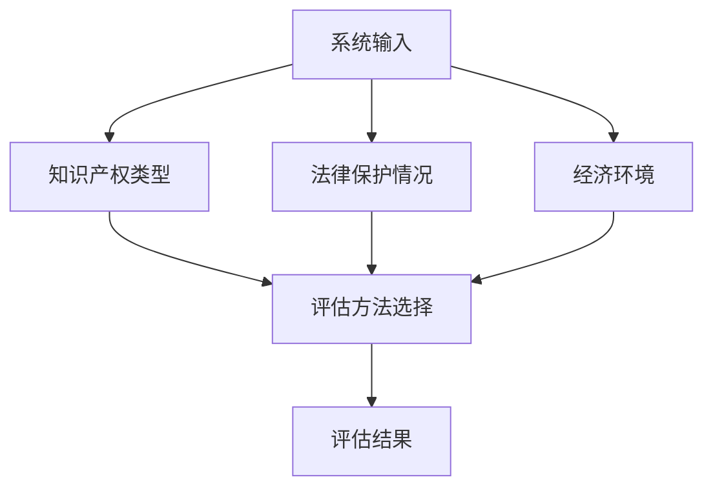

                 


```markdown
# 企业估值中的知识产权价值法

## 关键词：企业估值、知识产权、价值评估、无形资产评估、知识产权保护

## 摘要：
知识产权是企业在市场竞争中的一项重要无形资产，其价值评估对企业整体估值具有重要影响。本文从知识产权的基本概念出发，详细探讨其在企业估值中的作用、评估方法、法律与经济因素的影响，以及实际案例分析，为读者提供全面的理论与实践指导。

---

## 第一部分：知识产权价值评估的背景与基础

### 第1章：知识产权的基本概念与重要性

#### 1.1 知识产权的定义与核心要素
- 知识产权的定义：知识产权是指对创造性的智力成果依法享有的专有权利，包括专利权、商标权、著作权、商业秘密等。
- 核心要素：
  - 创造性：知识产权必须是原创性的智力成果。
  - 可保护性：通过法律手段获得专有权。
  - 经济价值：能够为企业带来经济效益。

#### 1.2 知识产权在企业中的重要性
- 知识产权是企业核心竞争力的体现。
- 知识产权保护企业免受市场竞争中的侵权行为。
- 知识产权的价值直接影响企业整体估值。

---

### 第2章：知识产权在企业估值中的作用

#### 2.1 企业估值的基本概念
- 企业估值是通过对企业的资产、负债、收益等进行综合评估，确定其市场价值的过程。
- 知识产权作为无形资产，是企业估值的重要组成部分。

#### 2.2 知识产权价值评估的背景与现状
- 随着知识经济的发展，知识产权在企业中的比重逐渐增加。
- 知识产权价值评估是企业融资、并购等活动中不可或缺的环节。

---

## 第二部分：知识产权评估的核心方法

### 第3章：知识产权的分类与评估方法

#### 3.1 知识产权的分类
- 专利权：技术类知识产权，包括发明专利、实用新型专利、外观设计专利。
- 商标权：用于区分商品或服务来源的标识。
- 著作权：文学、艺术、软件等作品的版权。
- 商业秘密：未公开的技术、诀窍、配方等。

#### 3.2 知识产权评估的基本方法
- 市场法：通过市场交易案例进行比较分析。
- 收益法：通过预测未来收益折现计算价值。
- 成本法：通过重置成本或历史成本进行评估。

---

### 第4章：知识产权价值的法律与经济因素

#### 4.1 知识产权法律体系的影响
- 知识产权保护的法律强度直接影响其价值。
- 不同国家的法律体系对知识产权的保护程度不同。

#### 4.2 经济因素对知识产权价值的影响
- 宏观经济环境：通货膨胀、利率变化等会影响评估结果。
- 行业特点：高技术行业知识产权价值较高，传统行业相对较低。

---

## 第三部分：知识产权价值评估的系统分析

### 第5章：知识产权价值评估模型与方法

#### 5.1 知识产权价值评估的数学模型
- 加权平均法：$$ V = \sum (w_i \times f_i) $$
  其中，$w_i$ 是各个因素的权重，$f_i$ 是对应因素的评分。
- 回归分析法：通过历史数据建立回归模型预测未来价值。

#### 5.2 知识产权评估的系统架构
- 系统输入：知识产权类型、法律保护情况、经济环境等。
- 系统输出：知识产权价值评估结果。



---

### 第6章：案例分析与实战

#### 6.1 案例背景
- 某科技公司拥有多项发明专利和技术诀窍，计划进行企业估值。

#### 6.2 评估过程
1. 确定知识产权类型：发明专利和商业秘密。
2. 收集市场交易案例：参考类似技术的交易价格。
3. 应用数学模型计算价值。

#### 6.3 评估结果
- 发明专利评估价值为1000万元。
- 商业秘密评估价值为500万元。
- 知识产权总价值为1500万元。

---

## 第四部分：总结与展望

### 第7章：总结与展望

#### 7.1 总结
- 知识产权是企业估值的重要组成部分。
- 通过科学的评估方法，可以准确衡量其价值。

#### 7.2 展望
- 随着技术进步，知识产权评估将更加依赖数据化和模型化的方法。
- 全球化背景下，跨法域的知识产权评估将更具挑战性。

---

## 附录

### 附录A：术语表
- 知识产权：Intangible Property Rights
- 无形资产：Intangible Assets

### 附录B：工具推荐
- 数据来源：国家知识产权局官网、专利数据库、行业报告。
- 工具软件：Excel、Python（Pandas、NumPy）、Matplotlib。

### 附录C：参考文献
- 知识产权相关法律文献
- 企业估值的经典文献

---

## 作者：AI天才研究院/AI Genius Institute & 禅与计算机程序设计艺术 /Zen And The Art of Computer Programming
```

