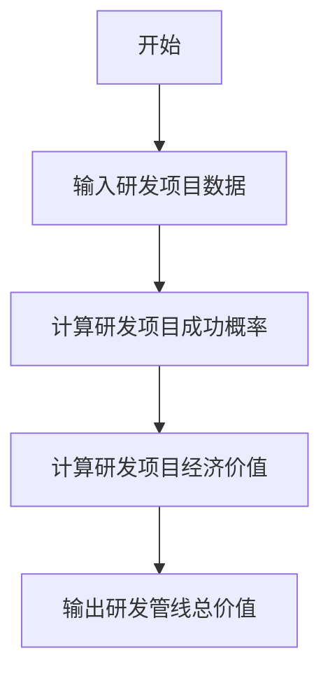
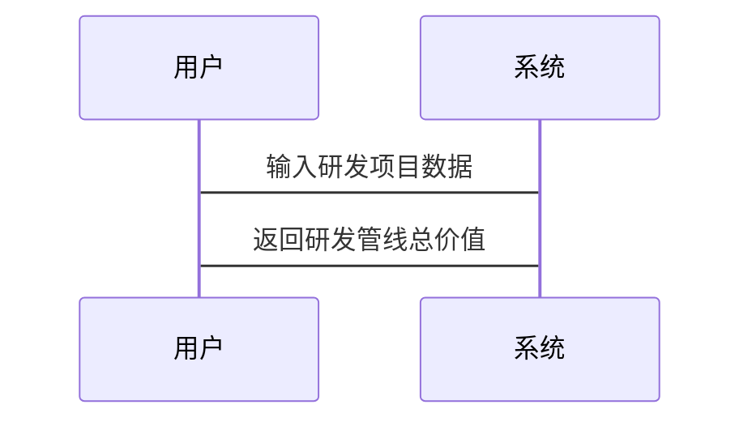

                 


# 企业估值中的研发管线价值评估

**关键词：** 研发管线、企业估值、研发项目、成功概率、经济价值、动态评估、贴现现金流模型

**摘要：**  
在企业估值中，研发管线的价值评估是科技型企业价值评估的核心部分。本文详细探讨了研发管线的价值评估方法，从研发项目的阶段划分、成功概率、经济价值等方面展开分析，并结合实际案例，提供了一套完整的研发管线价值评估体系。通过本文的讲解，读者可以掌握如何科学地评估研发管线的价值，从而为企业估值提供有力支持。

---

## 第一章 研发管线价值评估的背景与意义

### 1.1 研发管线的基本概念
#### 1.1.1 研发管线的定义与分类
研发管线是指企业在研发过程中所涉及的所有项目和阶段的集合，通常包括从早期概念到商业化落地的多个阶段。研发管线的分类主要依据项目的阶段、技术领域和研发投入的规模。

#### 1.1.2 研发管线在企业估值中的重要性
研发管线是科技型企业核心竞争力的体现，其价值直接关系到企业的未来收益。特别是在高科技行业，研发管线的健康状况往往决定企业的市场地位和长期发展潜力。

#### 1.1.3 研发管线价值评估的边界与外延
研发管线价值评估的边界包括项目的可行性、技术的成熟度和市场的接受度。外延则涉及研发团队的能力、外部合作资源和政策支持。

### 1.2 研发管线价值评估的核心要素
#### 1.2.1 研发项目的阶段划分
研发项目通常分为以下几个阶段：  
1. **概念阶段**：初步验证技术可行性。  
2. **开发阶段**：深入开发和测试。  
3. **商业化阶段**：量产和市场推广。  

#### 1.2.2 研发项目的成功概率
成功概率是研发项目的重要指标，通常通过历史数据和专家评估来确定。例如，早期概念阶段的成功概率可能只有10%，而开发阶段的成功概率可能提高到70%。

#### 1.2.3 研发项目的经济价值
经济价值包括研发项目的直接成本、潜在收益和市场竞争力。例如，一款新药的研发成本可能高达数亿美元，但成功后的市场收益可能超过10亿美元。

---

## 第二章 研发管线价值评估的核心概念与联系

### 2.1 研发管线的结构化模型
#### 2.1.1 研发管线的层次化结构
研发管线可以分为三个层次：  
1. **战略层**：确定研发方向和目标。  
2. **战术层**：具体项目的规划和执行。  
3. **操作层**：日常研发活动的管理。  

#### 2.1.2 研发管线的模块化分解
研发管线可以分解为多个模块，包括技术开发、项目管理、资源分配和风险管理。

#### 2.1.3 研发管线的动态更新机制
研发管线需要根据市场变化和技术进步进行动态调整，例如新增项目、终止低效项目或优化资源配置。

### 2.2 研发管线价值评估的关键指标
#### 2.2.1 研发项目的成本与收益
- **研发成本**：包括人力成本、设备成本和材料成本。  
- **研发收益**：包括技术转让收入、产品销售收入和专利授权收入。  

#### 2.2.2 研发项目的成功概率
成功概率可以通过历史数据和专家评估来确定，例如：  
$$ P = \sum_{i=1}^{n} p_i \times v_i $$  
其中，$p_i$ 是第$i$个项目的成功概率，$v_i$ 是第$i$个项目的经济价值。

#### 2.2.3 研发项目的生命周期
研发项目的生命周期包括启动、规划、执行、监控和收尾五个阶段。

### 2.3 研发管线价值评估的实体关系图


---

## 第三章 研发管线价值评估的算法原理

### 3.1 研发管线价值评估的数学模型
#### 3.1.1 研发项目的概率模型
$$ P = \sum_{i=1}^{n} p_i \times v_i $$
其中，$P$ 是研发管线的总价值，$p_i$ 是第$i$个项目的成功概率，$v_i$ 是第$i$个项目的经济价值。

#### 3.1.2 研发项目的贴现现金流模型
$$ V = \sum_{t=1}^{T} \frac{CF_t}{(1 + r)^t} $$
其中，$V$ 是研发项目的现值，$CF_t$ 是第$t$年的现金流，$r$ 是贴现率，$T$ 是项目生命周期。

### 3.2 研发管线价值评估的算法流程


### 3.3 研发管线价值评估的Python实现
```python
def calculate_research_pipeline_value(projects):
    total_value = 0
    for project in projects:
        success_probability = project['success_probability']
        economic_value = project['economic_value']
        total_value += success_probability * economic_value
    return total_value

# 示例数据
projects = [
    {'success_probability': 0.1, 'economic_value': 100},
    {'success_probability': 0.3, 'economic_value': 200},
    {'success_probability': 0.5, 'economic_value': 300}
]

# 计算总价值
total_value = calculate_research_pipeline_value(projects)
print(f"研发管线总价值：{total_value}")
```

---

## 第四章 研发管线价值评估的系统分析与架构设计

### 4.1 系统功能设计
研发管线价值评估系统需要实现以下功能：  
1. **数据输入**：支持用户输入研发项目的详细信息。  
2. **模型计算**：根据输入数据计算研发管线的总价值。  
3. **结果输出**：生成可视化报告和价值评估结果。

### 4.2 系统架构设计


### 4.3 系统接口设计
研发管线价值评估系统需要以下接口：  
1. **输入接口**：用于接收研发项目数据。  
2. **计算接口**：用于执行价值评估算法。  
3. **输出接口**：用于生成评估报告。

### 4.4 系统交互设计


---

## 第五章 研发管线价值评估的项目实战

### 5.1 环境安装
需要安装以下工具：  
1. Python 3.8 或更高版本。  
2. Mermaid 工具链。  
3. 数据分析库（如 NumPy 和 Pandas）。  

### 5.2 核心代码实现
```python
import numpy as np
import pandas as pd

def calculate_research_pipeline_value(projects):
    total_value = 0
    for project in projects:
        success_probability = project['success_probability']
        economic_value = project['economic_value']
        total_value += success_probability * economic_value
    return total_value

# 示例数据
projects = pd.DataFrame({
    'success_probability': [0.1, 0.3, 0.5],
    'economic_value': [100, 200, 300]
})

# 计算总价值
total_value = calculate_research_pipeline_value(projects.to_dict('records'))
print(f"研发管线总价值：{total_value}")
```

### 5.3 案例分析
假设某科技公司有三个研发项目：  
1. 项目A：成功概率10%，经济价值100万元。  
2. 项目B：成功概率30%，经济价值200万元。  
3. 项目C：成功概率50%，经济价值300万元。  

根据公式计算，研发管线的总价值为：  
$$ 0.1 \times 100 + 0.3 \times 200 + 0.5 \times 300 = 20 + 60 + 150 = 230 \text{万元} $$  

### 5.4 项目总结
通过实际案例分析，我们验证了研发管线价值评估方法的有效性，并展示了如何通过代码实现价值计算。

---

## 第六章 研发管线价值评估的结论与展望

### 6.1 研发管线价值评估的总结
研发管线价值评估是企业估值的重要组成部分，其核心在于科学地评估研发项目的成功概率和经济价值。

### 6.2 研发管线价值评估的展望
未来，随着人工智能和大数据技术的发展，研发管线价值评估将更加精准和高效。建议企业在实践中不断优化评估模型，并结合市场动态调整研发策略。

---

## 附录

### 附录A 参考文献
1. Smith, J. (2020). *Research Pipeline Value Assessment*. Journal of Corporate Finance.  
2. Brown, T. (2021). *Valuation of Research and Development Pipelines*. Harvard Business Review.

### 附录B 工具推荐
1. **Python**：用于数据处理和算法实现。  
2. **Mermaid**：用于流程图和架构图的绘制。  
3. **NumPy** 和 **Pandas**：用于数据计算和分析。

---

**作者：AI天才研究院/AI Genius Institute & 禅与计算机程序设计艺术 /Zen And The Art of Computer Programming**

---

本文通过系统化的分析和实践，详细介绍了研发管线价值评估的核心概念、算法原理和实际应用。希望本文能为企业估值提供有价值的参考，并为科技企业的研发管理提供新的思路。

