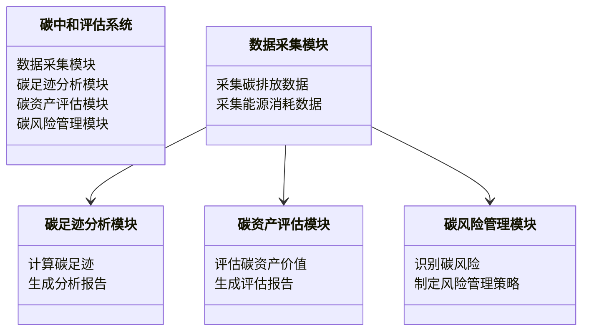

                 


# 《企业估值中的碳中和战略评估》

> 关键词：企业估值，碳中和，碳足迹，碳排放，碳风险管理，碳资产，碳成本

> 摘要：本文探讨了碳中和战略在企业估值中的重要性，分析了碳中和对财务状况的影响，介绍了碳足迹分析方法，并提出了数学模型和系统架构设计方案。通过实际案例分析，展示了如何将碳中和战略融入企业估值体系中。

---

# 第1章: 碳中和战略与企业估值的背景

## 1.1 碳中和的定义与背景

### 1.1.1 碳中和的定义与目标

碳中和是指企业或组织在一定时间内，通过减少温室气体排放、增加碳汇等方式，使自身的碳排放量与移除量相等，从而实现净零排放的目标。碳中和的核心是减少碳足迹，降低对环境的影响，同时推动可持续发展。

碳中和不仅是全球应对气候变化的共识，也是企业实现可持续发展的重要战略。随着全球气候变化问题的加剧，企业必须将碳中和纳入发展战略，以应对政策压力、社会责任和市场竞争。

### 1.1.2 碳中和对全球经济的影响

碳中和战略的实施将对全球经济产生深远影响。一方面，碳中和将推动新能源技术的发展，促进绿色产业的崛起；另一方面，碳中和也将对企业运营成本、投资决策和市场竞争力带来重大影响。

从经济角度来看，碳中和战略将推动企业向低碳模式转型，促进绿色金融的发展，同时也会对企业估值产生重要影响。

### 1.1.3 企业估值中的碳中和战略意义

在企业估值中，碳中和战略的重要性日益凸显。首先，碳中和战略有助于企业降低碳成本，提高财务稳定性；其次，碳中和战略能够提升企业的社会形象，增强投资者信心；最后，碳中和战略也是企业应对政策风险、实现可持续发展的重要手段。

企业估值的核心在于评估企业的未来盈利能力。而碳中和战略的实施将直接影响企业的成本结构、资产价值和风险管理能力，因此在估值中必须考虑碳中和因素。

---

## 1.2 企业估值的核心概念

### 1.2.1 企业估值的基本原理

企业估值是通过对企业的财务状况、市场地位、竞争优势等多方面因素的综合评估，确定其市场价值的过程。传统的企业估值方法主要包括市盈率法、现金流折现法等，但这些方法往往忽略了碳排放对企业价值的影响。

### 1.2.2 碳中和对企业估值的影响

随着碳中和战略的实施，企业估值的计算方式需要考虑碳排放的成本、碳资产的价值以及碳风险管理等因素。碳中和战略的实施将影响企业的财务状况，从而影响其市场价值。

例如，企业通过实施碳中和战略，可以降低碳排放成本，同时获得碳资产的价值提升。这些因素都需要在企业估值中得到体现。

### 1.2.3 碳中和战略与企业估值的关系

碳中和战略是企业实现可持续发展的重要手段，而企业估值是衡量企业价值的重要指标。两者之间的关系密不可分。碳中和战略的实施将直接影响企业的财务表现，从而影响其估值；而企业估值的准确计算也需要考虑碳中和战略的影响。

---

# 第2章: 碳中和战略的核心概念与联系

## 2.1 碳中和战略的核心要素

### 2.1.1 碳排放的计算与分类

碳排放的计算是碳中和战略的基础。企业需要准确计算自身的碳排放量，包括直接排放（Scope 1）和间接排放（Scope 2）。碳排放的分类通常包括：

1. **Scope 1**：直接排放，企业自身产生的排放，例如燃烧化石燃料产生的二氧化碳。
2. **Scope 2**：间接排放，企业用电产生的排放，例如使用电力产生的碳排放。
3. **Scope 3**：其他间接排放，例如供应链上的排放。

### 2.1.2 碳足迹的分析方法

碳足迹分析是评估企业碳排放的重要工具。碳足迹分析包括对企业整个生命周期的碳排放进行评估，从原材料采购、生产过程、产品使用到废弃物处理等各个环节。

碳足迹分析方法通常包括：

1. **生命周期评估（LCA）**：从原材料到产品报废的整个生命周期进行碳排放评估。
2. **碳排放因子法**：通过碳排放因子计算不同能源使用所产生的碳排放量。

### 2.1.3 碳中和目标的设定与分解

碳中和目标的设定需要结合企业的实际情况，包括行业特点、发展阶段、资源禀赋等。碳中和目标通常分为长期目标和短期目标，例如到2030年实现碳达峰，到2050年实现碳中和。

碳中和目标的分解需要将总体目标分解到各个部门和环节，明确责任分工，确保目标的实现。

---

## 2.2 碳中和战略与企业战略的关系

### 2.2.1 碳中和战略对企业整体战略的整合

碳中和战略是企业整体战略的重要组成部分。企业需要将碳中和目标融入到企业战略的制定和实施中，例如在产品设计、生产流程、供应链管理等方面考虑碳中和因素。

### 2.2.2 碳中和战略与企业核心竞争力的关联

碳中和战略的实施能够提升企业的核心竞争力。例如，通过减少碳排放，企业可以降低运营成本；通过开发绿色产品，企业可以满足市场需求；通过建立良好的社会责任形象，企业可以增强品牌价值。

### 2.2.3 碳中和战略的长期与短期目标平衡

碳中和战略的实施需要平衡长期目标和短期目标。短期目标可能包括降低碳排放成本，而长期目标则是实现碳中和。企业需要在两者之间找到平衡点，确保战略的可持续性。

---

# 第3章: 碳中和对财务影响的评估方法

## 3.1 碳成本的计算与分析

### 3.1.1 碳排放的成本构成

碳排放的成本包括直接成本和间接成本。直接成本包括购买碳配额、碳税等，间接成本包括因碳排放而产生的声誉损失、市场风险等。

### 3.1.2 碳税与碳交易机制的影响

碳税是政府为减少碳排放而征收的税费，碳交易机制则是通过市场机制实现碳排放的总量控制。企业需要考虑碳税和碳交易对企业财务的影响，例如碳税的增加将直接增加企业的成本，而碳交易则可能带来收益或损失。

### 3.1.3 碳成本对企业财务状况的影响

碳成本的增加将直接影响企业的利润水平。例如，高碳排放企业可能面临更高的碳税或碳配额成本，从而影响其盈利能力。此外，碳成本的增加还可能影响企业的资本结构和投资决策。

---

## 3.2 碳资产的识别与评估

### 3.2.1 碳资产的定义与分类

碳资产是指企业持有的与碳排放相关的资产，包括碳配额、碳信用等。碳配额是指企业在碳交易市场中可以排放的碳量，碳信用则是企业通过减少碳排放获得的信用。

### 3.2.2 碳资产的量化方法

碳资产的量化需要结合企业的实际碳排放量和碳配额分配情况。例如，企业可以通过碳足迹分析确定自身的碳排放量，然后根据碳配额分配情况确定碳资产的价值。

### 3.2.3 碳资产对企业估值的提升作用

碳资产的增加能够提升企业的估值。例如，企业通过减少碳排放获得更多的碳信用，这些信用可以在碳交易市场中出售，从而增加企业的收益，进而提升企业的市场价值。

---

## 3.3 碳风险管理与企业价值

### 3.3.1 碳风险的识别与评估

碳风险是指企业在实现碳中和目标过程中可能面临的各种风险，例如政策风险、市场风险、声誉风险等。企业需要识别和评估这些风险，并制定相应的风险管理策略。

### 3.3.2 碳风险管理对企业财务稳定性的影响

有效的碳风险管理能够降低企业的财务风险，提高财务稳定性。例如，企业通过合理的碳配额管理，可以降低碳税的负担，从而保持财务状况的稳定。

### 3.3.3 碳风险管理对投资者信心的影响

投资者越来越关注企业的碳风险管理能力。有效的碳风险管理能够增强投资者对企业的信心，从而提升企业的市场价值。

---

# 第4章: 碳中和战略评估的数学模型与方法

## 4.1 碳排放的数学模型

### 4.1.1 碳排放的计算公式

碳排放的计算公式如下：

$$ \text{碳排放量} = \sum_{i=1}^{n} \text{能源消耗}_i \times \text{碳排放因子}_i $$

其中，能源消耗是指企业在各个环节中使用的能源总量，碳排放因子是指每单位能源消耗对应的碳排放量。

### 4.1.2 碳足迹的数学模型

碳足迹的数学模型如下：

$$ \text{碳足迹} = \sum_{j=1}^{m} \text{生命周期阶段}_j \times \text{碳排放}_j $$

其中，生命周期阶段是指产品或服务的生命周期中的各个阶段，碳排放是指每个阶段的碳排放量。

---

## 4.2 碳资产的量化模型

### 4.2.1 碳配额的分配模型

碳配额的分配模型可以采用基于历史排放量的分配方法，例如：

$$ \text{碳配额} = \text{历史排放量} \times \text{分配比例} $$

### 4.2.2 碳信用的计算模型

碳信用的计算模型如下：

$$ \text{碳信用} = \text{实际排放量} - \text{目标排放量} $$

---

## 4.3 碳成本的优化模型

### 4.3.1 碳成本的最小化模型

碳成本的最小化模型可以通过优化能源使用和碳配额分配来实现：

$$ \min \sum_{k=1}^{p} \text{能源使用}_k \times \text{碳排放因子}_k $$

### 4.3.2 碳风险管理的数学模型

碳风险管理的数学模型可以采用情景分析法，评估不同情景下的碳成本和碳信用变化。

---

# 第5章: 碳中和战略评估的系统架构设计

## 5.1 问题场景介绍

碳中和战略评估需要构建一个综合性的系统，整合企业的碳排放数据、碳资产信息和碳风险管理策略，为企业提供全面的碳中和评估报告。

---

## 5.2 系统功能设计

### 5.2.1 系统功能模块

1. **数据采集模块**：采集企业的碳排放数据、能源消耗数据等。
2. **碳足迹分析模块**：计算企业的碳足迹，并生成报告。
3. **碳资产评估模块**：评估企业的碳资产价值。
4. **碳风险管理模块**：识别和评估碳风险，并制定风险管理策略。

### 5.2.2 系统功能设计的 Mermaid 类图



---

## 5.3 系统架构设计

### 5.3.1 系统架构设计的 Mermaid 架构图


---

## 5.4 系统接口设计

### 5.4.1 系统接口描述

1. **数据采集接口**：用于采集企业的碳排放数据和能源消耗数据。
2. **碳足迹分析接口**：用于计算企业的碳足迹，并生成分析报告。
3. **碳资产评估接口**：用于评估企业的碳资产价值，并生成评估报告。
4. **碳风险管理接口**：用于识别和评估碳风险，并制定风险管理策略。

---

## 5.5 系统交互设计

### 5.5.1 系统交互的 Mermaid 序列图

```mermaid
sequenceDiagram

    系统开始
    actor 用户
    用户 -> 碳中和评估系统: 提交碳排放数据
    碳中和评估系统 -> 数据库: 存储碳排放数据
    碳中和评估系统 -> 碳足迹分析模块: 分析碳足迹
    碳足迹分析模块 -> 用户: 返回分析报告
    用户 -> 碳中和评估系统: 提交碳资产数据
    碳中和评估系统 -> 碳资产评估模块: 评估碳资产价值
    碳资产评估模块 -> 用户: 返回评估报告
    用户 -> 碳中和评估系统: 提交风险管理数据
    碳中和评估系统 -> 碳风险管理模块: 分析碳风险
    碳风险管理模块 -> 用户: 返回风险管理建议
    系统结束
```

---

# 第6章: 项目实战

## 6.1 环境安装

为了实现碳中和战略评估系统，需要以下环境：

1. **Python 3.8 或更高版本**
2. **Jupyter Notebook**
3. **Pandas、NumPy 等数据处理库**
4. **Matplotlib 或 Seaborn 可视化库**

---

## 6.2 系统核心实现

### 6.2.1 碳排放计算代码

```python
import pandas as pd

# 定义碳排放计算函数
def calculate_carbon_emissions(energy_consumption, carbon_factor):
    return energy_consumption * carbon_factor

# 示例数据
energy_consumption = pd.Series([100, 200, 300], index=['电力', '燃料', '其他'])
carbon_factor = 0.5  # 假设单位能源消耗的碳排放因子为0.5 吨 CO2/单位能源

# 计算碳排放
carbon_emissions = calculate_carbon_emissions(energy_consumption, carbon_factor)
print("碳排放量：")
print(carbon_emissions)
```

---

## 6.3 实际案例分析

### 6.3.1 案例分析

假设某企业年消耗电力 1000 吨，燃料 500 吨，其他能源 200 吨，碳排放因子分别为 0.8、0.5 和 0.3 吨 CO2/单位能源。

计算碳排放量：

电力：1000 * 0.8 = 800 吨 CO2  
燃料：500 * 0.5 = 250 吨 CO2  
其他能源：200 * 0.3 = 60 吨 CO2  
总碳排放量：800 + 250 + 60 = 1110 吨 CO2

---

## 6.4 项目小结

通过以上代码实现和案例分析，我们可以看到碳中和战略评估系统的实现需要结合企业的实际数据和具体需求。企业可以根据自身情况调整模型和算法，以实现更精准的碳中和评估。

---

# 第7章: 总结

## 7.1 最佳实践 Tips

1. **数据准确性**：碳中和战略评估需要准确的数据支持，企业应确保数据的完整性和准确性。
2. **模型选择**：根据企业的实际情况选择合适的模型和方法，避免过度复杂化。
3. **持续优化**：碳中和战略是一个长期过程，企业需要持续优化和完善评估系统。

---

## 7.2 未来展望

随着全球气候变化问题的加剧，碳中和战略的重要性将越来越突出。未来，企业需要更加积极地实施碳中和战略，通过技术创新和管理优化实现可持续发展。

---

## 7.3 注意事项

企业在实施碳中和战略时，需要注意以下几点：

1. **政策合规**：确保碳中和战略符合相关政策法规要求。
2. **风险管理**：建立有效的碳风险管理机制，降低碳风险对企业的影响。
3. **持续改进**：定期评估碳中和战略的实施效果，不断优化和改进。

---

# 作者

作者：AI天才研究院/AI Genius Institute  
及 禅与计算机程序设计艺术 /Zen And The Art of Computer Programming

