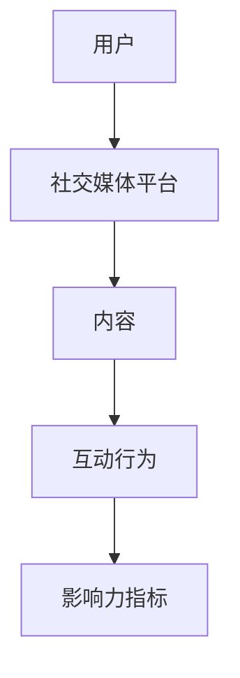
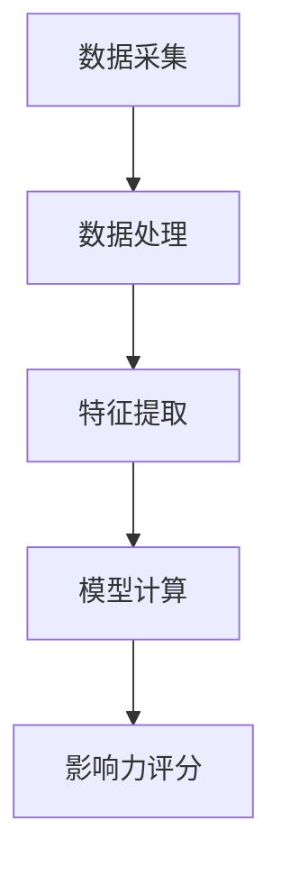
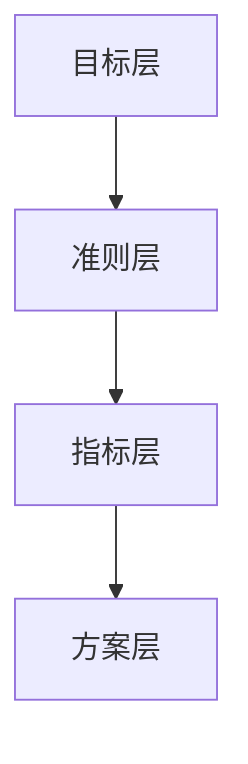
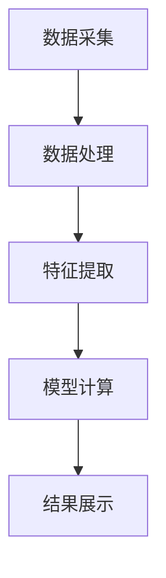
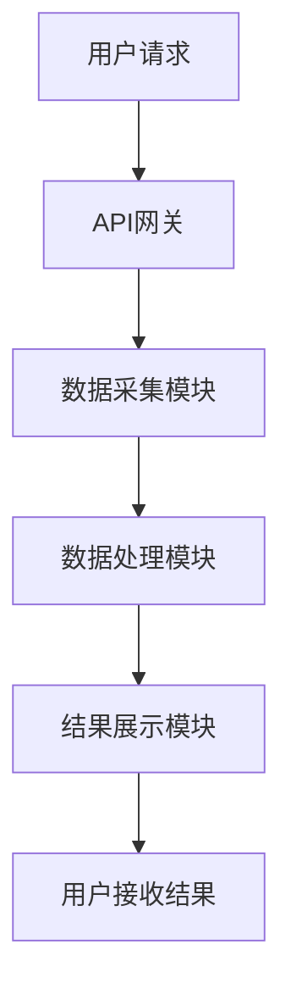

                 


# 企业估值中的社交媒体影响力评估

**关键词**：企业估值、社交媒体影响力、数据驱动方法、影响力评估模型、企业价值分析

**摘要**：随着社交媒体的普及，企业价值的评估不再仅仅依赖于传统的财务指标，社交媒体影响力已成为企业估值的重要组成部分。本文通过数据驱动的方法，系统地分析社交媒体影响力对企业的价值贡献，构建影响力评估模型，并探讨其在企业估值中的实际应用。

---

# 第1章: 背景与概述

## 1.1 企业估值的传统方法与社交媒体的兴起

### 1.1.1 传统企业估值方法的局限性

传统的企业估值方法主要依赖于财务指标，如净利润、营业收入、市盈率等。然而，这些方法难以全面反映企业的市场影响力和品牌价值，尤其是在数字时代，社交媒体的崛起为企业提供了新的价值评估维度。

### 1.1.2 社交媒体在企业估值中的重要性

社交媒体平台为企业提供了与消费者互动、传播品牌信息的重要渠道。通过分析社交媒体上的用户行为和内容互动，可以量化企业的品牌影响力、用户忠诚度和市场口碑，从而为企业估值提供更全面的依据。

### 1.1.3 本文的核心目标

本文旨在通过社交媒体数据，构建企业影响力评估模型，并将其与传统财务指标相结合，提供一种更全面的企业估值方法。

---

## 1.2 社交媒体影响力评估的定义与目标

### 1.2.1 定义

社交媒体影响力评估是指通过分析企业在社交媒体平台上的表现（如粉丝数量、互动率、内容传播广度等），量化其在社交媒体上的影响力，并将其与企业价值联系起来的过程。

### 1.2.2 目标

1. **量化社交媒体影响力**：通过指标量化企业在社交媒体上的影响力。
2. **评估影响力对估值的贡献**：分析社交媒体影响力如何影响企业的市场价值。
3. **提供数据驱动的估值方法**：结合社交媒体数据和财务数据，构建综合估值模型。

---

## 1.3 本文的结构安排

### 1.3.1 章节安排

1. 第1章：背景与概述
2. 第2章：社交媒体影响力评估的核心概念
3. 第3章：社交媒体影响力评估的方法
4. 第4章：社交媒体数据的采集与处理
5. 第5章：影响力评估模型的算法实现
6. 第6章：系统架构设计与实现
7. 第7章：项目实战与案例分析
8. 第8章：总结与展望

---

# 第2章: 社交媒体影响力评估的核心概念

## 2.1 核心概念的定义与属性

### 2.1.1 用户行为数据

用户行为数据包括用户的点赞、评论、分享、关注等行为，反映了用户对品牌内容的互动程度。

### 2.1.2 品牌内容数据

品牌内容数据包括企业在社交媒体上发布的内容（如文本、图片、视频）的传播广度和用户互动情况。

### 2.1.3 市场反馈数据

市场反馈数据包括用户对企业产品或服务的评价、投诉等，反映了企业的市场口碑。

---

## 2.2 核心概念的联系与对比

### 2.2.1 不同社交媒体平台的影响力对比

通过对比不同平台（如微博、微信、抖音等）的影响力指标，分析各平台对企业估值的贡献差异。

### 2.2.2 企业内部数据与外部数据的结合

企业内部数据（如销售数据）与外部社交媒体数据相结合，可以更全面地评估企业的市场表现。

---

## 2.3 实体关系图与流程图

### 2.3.1 实体关系图



### 2.3.2 核心流程图



---

# 第3章: 社交媒体影响力评估的方法

## 3.1 定性分析方法

### 3.1.1 专家评分法

通过专家对企业社交媒体表现的评分，量化企业的影响力。

### 3.1.2 内容分析法

通过分析企业发布的内容主题和情感倾向，评估其内容质量和传播效果。

---

## 3.2 定量分析方法

### 3.2.1 层次分析法（AHP）



---

## 3.3 综合评估模型

### 3.3.1 综合指标计算

$$ \text{综合影响力} = \alpha \times \text{互动率} + \beta \times \text{内容传播率} $$

---

# 第4章: 社交媒体数据的采集与处理

## 4.1 数据采集方法

### 4.1.1 API接口采集

通过社交媒体平台的API接口，获取用户行为数据和内容数据。

### 4.1.2 网页抓取

使用爬虫技术抓取社交媒体上的公开数据。

---

## 4.2 数据清洗与预处理

### 4.2.1 数据去重

去除重复数据，确保数据的唯一性。

### 4.2.2 数据填充

对缺失数据进行插值处理，确保数据完整性。

---

## 4.3 数据存储与管理

### 4.3.1 数据库设计

设计合理的数据库表结构，存储社交媒体数据。

### 4.3.2 数据索引优化

优化数据库索引，提高数据查询效率。

---

# 第5章: 影响力评估模型的算法实现

## 5.1 情感分析算法

### 5.1.1 基于机器学习的情感分析

使用支持向量机（SVM）或随机森林（RF）模型进行情感分类。

### 5.1.2 基于深度学习的情感分析

使用预训练的BERT模型进行情感分析。

---

## 5.2 影响力评分算法

### 5.2.1 加权评分模型

$$ \text{影响力评分} = \sum_{i=1}^{n} w_i \times x_i $$

---

## 5.3 算法实现代码示例

```python
def calculate_influence_score(data):
    weights = [0.4, 0.3, 0.2, 0.1]
    features = [data['互动率'], data['内容传播率'], data['用户增长率'], data['投诉率']]
    score = sum(w * f for w, f in zip(weights, features))
    return score
```

---

# 第6章: 系统架构设计与实现

## 6.1 系统功能设计

### 6.1.1 功能模块

- 数据采集模块
- 数据处理模块
- 模型计算模块
- 结果展示模块

---

## 6.2 系统架构设计



---

## 6.3 系统接口设计

### 6.3.1 API接口

- `/api/v1/data采集`
- `/api/v1/数据处理`

---

## 6.4 系统交互流程



---

# 第7章: 项目实战与案例分析

## 7.1 项目背景

### 7.1.1 案例背景

以一家互联网企业为例，分析其在社交媒体上的影响力对估值的贡献。

---

## 7.2 项目实施步骤

### 7.2.1 环境搭建

安装必要的开发工具和库，如Python、Pandas、Scikit-learn等。

---

## 7.3 核心代码实现

### 7.3.1 数据采集代码

```python
import requests

def fetch_data(url):
    response = requests.get(url)
    return response.json()
```

---

## 7.4 实验结果与分析

### 7.4.1 实验结果

通过实验得出企业社交媒体影响力的评分，并与传统估值方法进行对比。

---

## 7.5 项目总结

### 7.5.1 成果总结

总结项目实施成果，分析社交媒体影响力对企业的估值贡献。

---

# 第8章: 总结与展望

## 8.1 本文总结

### 8.1.1 核心成果

总结本文的核心研究成果，包括影响力评估模型和系统架构设计。

---

## 8.2 未来展望

### 8.2.1 研究方向

探讨未来的研究方向，如多平台数据融合、实时影响力评估等。

---

## 8.3 注意事项

### 8.3.1 数据隐私问题

强调数据隐私保护的重要性，避免用户信息泄露。

---

## 8.4 最佳实践 Tips

### 8.4.1 数据采集建议

建议在数据采集过程中注意数据的多样性和代表性。

---

## 8.5 小结

社交媒体影响力评估为企业估值提供了新的视角和方法，未来需要进一步研究其与传统估值方法的结合。

---

**作者：AI天才研究院/AI Genius Institute & 禅与计算机程序设计艺术 /Zen And The Art of Computer Programming**

---

通过以上内容，您可以系统地了解企业估值中的社交媒体影响力评估的各个方面，包括背景、核心概念、评估方法、数据处理、算法实现、系统设计和项目实战等。希望本文对您有所帮助！

