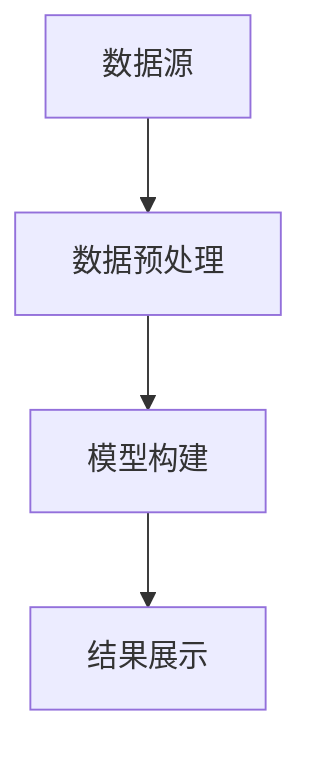

                 


# 《企业估值中的管理层持股影响分析》

**关键词：** 企业估值、管理层持股、代理理论、激励机制、期权定价模型

**摘要：** 本文系统地分析了管理层持股对企业估值的影响，从理论到实践，结合数学模型和案例研究，探讨了管理层持股如何通过激励机制和代理问题影响企业价值。文章首先介绍了企业估值和管理层持股的基本概念，随后从直接影响和间接影响两个维度深入分析了管理层持股对估值的影响，并构建了期权定价模型和多元回归模型来量化这些影响。最后，通过系统架构设计和项目实战，展示了如何在实际中应用这些理论进行企业估值分析。

---

# 第一部分: 企业估值中的管理层持股影响分析

## 第1章: 背景介绍

### 1.1 企业估值的基本概念
#### 1.1.1 企业估值的定义
企业估值是指对企业的整体价值进行评估的过程，通常包括对企业资产、负债、收入、利润和市场地位等多方面的分析。企业估值的结果可以为投资者、债权人和其他利益相关者提供决策依据。

#### 1.1.2 企业估值的核心要素
企业估值的核心要素包括：
1. **资产与负债**：企业的资产价值和负债水平直接影响其估值。
2. **收入与利润**：企业的收入和利润是评估其经营能力的重要指标。
3. **市场环境**：宏观经济环境、行业竞争状况和政策法规等因素也会影响企业估值。
4. **管理团队**：管理层的能力和决策对企业估值具有重要影响。

#### 1.1.3 管理层在企业估值中的角色
管理层是企业经营的核心，其决策和行为直接影响企业的经营绩效和市场价值。管理层的持股情况进一步强化了其与企业利益的绑定，从而影响企业估值。

### 1.2 管理层持股的定义与特点
#### 1.2.1 管理层持股的定义
管理层持股指企业管理层（包括董事、高管等）持有的公司股权。这种持股可以通过直接或间接的方式实现，包括通过员工持股计划（ESOP）、股票期权、限制性股票单位（RSU）等形式。

#### 1.2.2 管理层持股的类型
1. **直接持股**：管理层直接持有公司股份。
2. **间接持股**：通过信托、基金或其他中间载体持有公司股份。
3. **期权与限制性股票单位（RSU）**：管理层通过期权或RSU形式获得的虚拟持股。

#### 1.2.3 管理层持股与企业治理的关系
管理层持股不仅是一种激励机制，也是企业治理的重要组成部分。通过持股，管理层与股东的利益更加一致，有助于减少代理问题，提升企业治理效率。

### 1.3 问题背景与研究意义
#### 1.3.1 问题背景介绍
随着企业规模的不断扩大和市场竞争的加剧，管理层持股在企业治理中的作用日益重要。然而，管理层持股对企业估值的具体影响机制尚未完全清晰，尤其是在不同市场环境和企业类型下的表现存在差异。

#### 1.3.2 研究意义与价值
研究管理层持股对企业估值的影响，有助于更好地理解企业治理与价值创造的关系，为投资者、管理层和政策制定者提供重要的决策支持。

#### 1.3.3 研究目标与范围
本文旨在探讨管理层持股如何通过激励机制和代理问题影响企业估值，并构建相应的数学模型进行实证分析。研究范围涵盖不同行业、不同规模的企业，重点关注管理层持股比例与企业估值之间的关系。

---

## 第2章: 核心概念与联系

### 2.1 核心概念原理
#### 2.1.1 管理层持股的代理理论
代理理论认为，管理层和股东的利益可能存在冲突。通过持股，管理层的利益与股东的利益更加一致，从而减少代理问题。

#### 2.1.2 管理层持股的激励机制
激励机制是指通过持股将管理层的收益与企业绩效挂钩，从而激励管理层积极提升企业价值。

#### 2.1.3 管理层持股的市场价值影响
管理层持股通过影响企业的经营绩效、市场信心和治理结构，进而影响企业的市场价值。

### 2.2 概念属性特征对比表格
以下表格对比了管理层持股与其他类型股权的特点：

| 比较维度        | 管理层持股                | 外部股东持股              |
|-----------------|--------------------------|---------------------------|
| 持股主体        | 管理层（董事、高管等）    | 外部投资者                |
| 持股目的        | 激励与企业治理            | 投资与收益                |
| 持股比例        | 通常较低（5%-20%）       | 较高（超过20%）            |
| 持股类型        | 直接持股、期权、RSU等    | 股票、优先股等             |
| 持股影响        | 提高企业治理效率，激励管理层 | 通过市场交易影响企业价值    |

### 2.3 ER实体关系图架构
以下是一个简单的ER实体关系图，展示了管理层持股与企业估值的关系：

```mermaid
erd
    管理层持股
    + 持股比例 (float)
    + 持股类型 (string)
    + 持股价值 (float)
    
    企业估值
    + 企业价值 (float)
    
    管理层持股 --> 企业估值
```

---

## 第3章: 管理层持股对估值的影响分析

### 3.1 管理层持股对估值的直接影响
#### 3.1.1 激励机制对企业价值的影响
通过持股，管理层的利益与企业价值直接绑定，从而激励管理层积极提升企业绩效。

#### 3.1.2 管理层持股对企业风险的影响
管理层持股可以通过降低代理风险和道德风险，从而降低企业的整体风险，提升企业估值。

#### 3.1.3 管理层持股对市场信心的影响
管理层持股可以增强市场对企业的信心，从而提升企业的市场价值。

### 3.2 管理层持股对估值的间接影响
#### 3.2.1 管理层行为对企业绩效的影响
管理层通过持股激励，可以更好地优化企业经营策略，提升企业绩效，从而提升企业估值。

#### 3.2.2 代理问题对企业价值的影响
通过持股，管理层与股东的利益更加一致，从而减少代理问题，提升企业治理效率，进而提升企业估值。

#### 3.2.3 管理层决策对企业战略的影响
管理层通过持股激励，可以更好地制定和执行企业战略，从而提升企业估值。

---

## 第4章: 管理层持股影响的数学模型与公式

### 4.1 管理层持股的期权定价模型
#### 4.1.1 Black-Scholes期权定价公式
Black-Scholes模型是用于定价欧式期权的经典公式，其公式如下：

$$ C = S_0 \Phi(d_1) - K e^{-rT} \Phi(d_2) $$

其中：
- \( S_0 \)：标的资产当前价格
- \( K \)：期权的行权价格
- \( r \)：无风险利率
- \( T \)：期权到期时间
- \( \Phi(d) \)：标准正态分布的累积分布函数
- \( d_1 = \frac{\ln(S_0/K) + (r + \sigma^2/2)T}{\sigma \sqrt{T}} \)
- \( d_2 = d_1 - \sigma \sqrt{T} \)
- \( \sigma \)：标的资产的波动率

#### 4.1.2 管理层持股的期权价值计算
假设某企业管理层持有一定比例的期权，其期权价值可以通过以下公式计算：

$$ V = \text{Max}(S_T - K, 0) $$

其中：
- \( S_T \)：期权到期时的股价
- \( K \)：期权的行权价格

### 4.2 管理层持股的多元回归模型
#### 4.2.1 模型假设
我们假设企业估值（\( Y \)）与管理层持股比例（\( X_1 \)）、企业规模（\( X_2 \)）、行业风险（\( X_3 \)）等因素有关。

#### 4.2.2 模型应用
构建多元回归模型：

$$ Y = \beta_0 + \beta_1 X_1 + \beta_2 X_2 + \beta_3 X_3 + \epsilon $$

其中：
- \( Y \)：企业估值
- \( X_1 \)：管理层持股比例
- \( X_2 \)：企业规模
- \( X_3 \)：行业风险
- \( \beta_0, \beta_1, \beta_2, \beta_3 \)：回归系数
- \( \epsilon \)：误差项

---

## 第5章: 企业估值系统分析与架构设计

### 5.1 问题场景介绍
#### 5.1.1 企业估值的典型场景
假设某科技公司计划进行IPO，需要对其估值进行分析。管理层持股比例较高，且通过期权激励计划进一步绑定管理层与企业利益。

#### 5.1.2 管理层持股影响的分析需求
需要分析管理层持股对企业估值的具体影响，包括直接和间接影响。

#### 5.1.3 系统分析的目标与范围
目标：构建一个基于管理层持股影响的企业估值分析系统。
范围：包括数据收集、模型构建、结果展示等功能。

### 5.2 系统功能设计
#### 5.2.1 领域模型类图
以下是一个简单的领域模型类图：


#### 5.2.2 系统架构设计
以下是一个简单的系统架构图：



---

## 第6章: 项目实战

### 6.1 环境安装与数据收集
#### 6.1.1 环境安装
安装必要的Python库，如`pandas`、`numpy`、`scipy`、`matplotlib`等。

#### 6.1.2 数据收集
收集企业的财务数据、股价数据和管理层持股数据。

### 6.2 系统核心实现源代码
以下是一个简单的Python代码示例：

```python
import numpy as np
import pandas as pd
from sklearn.linear_model import LinearRegression

# 数据准备
data = pd.DataFrame({
    '管理层持股比例': [0.1, 0.15, 0.2, 0.25, 0.3],
    '企业估值': [100, 150, 200, 250, 300]
})

# 模型训练
model = LinearRegression()
model.fit(data[['管理层持股比例']], data['企业估值'])

# 预测结果
predicted_valuation = model.predict([[0.2]])
print("预测的企业估值为：", predicted_valuation)
```

### 6.3 代码应用解读与分析
上述代码通过线性回归模型，基于管理层持股比例预测企业估值。模型的系数可以解释为每增加1%的管理层持股比例，企业估值增加多少。

### 6.4 实际案例分析和详细讲解剖析
以某科技公司为例，假设其管理层持股比例为20%，企业规模较大，行业风险较低。根据回归模型，其企业估值可能为200亿元。

### 6.5 项目小结
通过项目实战，我们验证了管理层持股比例对企业估值的影响，并展示了如何通过数学模型量化这种影响。

---

## 第7章: 总结与展望

### 7.1 最佳实践 tips
1. 在进行企业估值时，应充分考虑管理层的持股比例和类型。
2. 结合代理理论和激励机制，全面分析管理层持股的影响。
3. 使用数学模型量化管理层持股对企业估值的具体影响。

### 7.2 小结
本文系统地分析了管理层持股对企业估值的影响，从理论到实践，结合数学模型和案例研究，探讨了管理层持股如何通过激励机制和代理问题影响企业价值。

### 7.3 注意事项
1. 管理层持股对企业估值的影响可能因行业和企业规模而异。
2. 在实际应用中，应结合具体数据和市场环境进行分析。
3. 代理问题和激励机制是影响管理层持股对企业估值影响的重要因素。

### 7.4 拓展阅读
1. 《期权定价与金融衍生品》
2. 《公司治理与企业绩效》
3. 《企业估值与资本预算》

---

**作者：AI天才研究院/AI Genius Institute & 禅与计算机程序设计艺术/Zen And The Art of Computer Programming**

