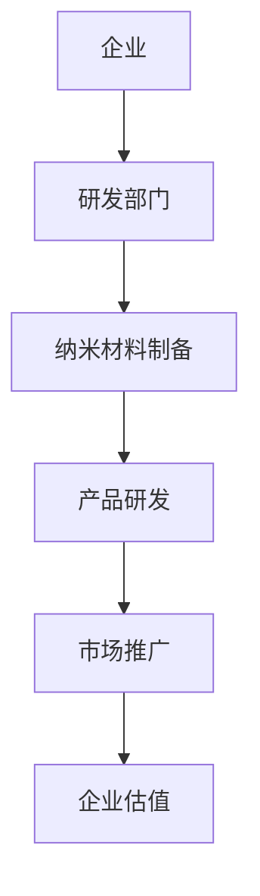
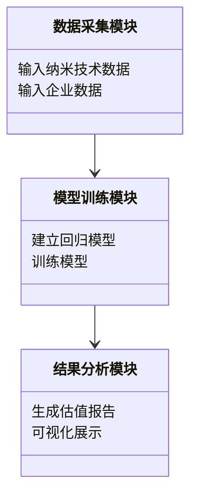
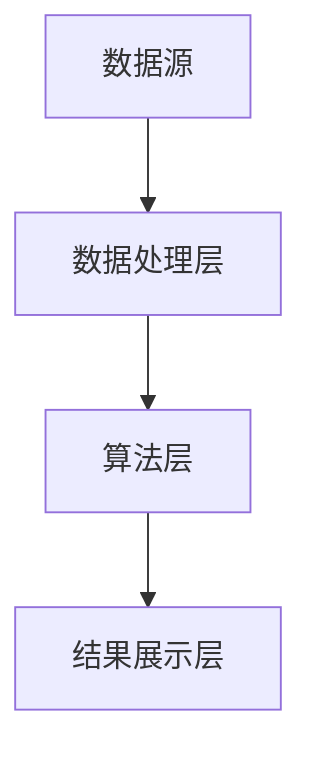

                 


# 《企业估值中的纳米技术应用评估》

## 关键词：企业估值、纳米技术、应用评估、技术创新、经济价值

## 摘要：  
随着纳米技术的快速发展，其在企业中的应用日益广泛，为企业估值带来了新的挑战和机遇。本文从纳米技术的基本概念出发，结合企业估值的核心方法，系统地分析了纳米技术在企业估值中的应用评估方法。通过具体案例和算法模型，深入探讨了纳米技术对企业价值的影响，并提出了相应的评估框架和实践建议。本文旨在为企业估值提供新的视角和技术支持，助力企业更好地应对纳米技术时代的挑战。

---

## 第1章：背景与概念

### 1.1 纳米技术的定义与特点  
纳米技术是指在纳米尺度（1-100纳米）对物质进行操控和利用的技术，具有表面效应、体积效应和量子效应等特点。其应用领域包括材料科学、医疗、能源和制造等。  

### 1.2 企业估值的基本概念  
企业估值是指通过对企业未来现金流的折现、资产重置成本、市场可比公司等方法，评估企业整体或部分股权价值的过程。  

### 1.3 纳米技术与企业估值的结合  
纳米技术的应用可以提升企业的创新能力和市场竞争力，从而影响企业的估值。本文将从纳米技术对企业价值的影响入手，探索其在企业估值中的应用评估方法。

---

## 第2章：纳米技术应用的核心概念与联系

### 2.1 纳米材料的制备与特性  
纳米材料的制备方法包括物理法（如球磨法）、化学法（如溶胶-凝胶法）和生物法（如蛋白质自组装）。纳米材料的特性包括高比表面积、良好的导电性和生物相容性等。  

#### 表2-1：不同纳米材料的特性对比  

| 纳米材料 | 比表面积（m²/g） | 导电性 | 生物相容性 |
|----------|------------------|--------|------------|
| 碳纳米管 | 1200             | 高     | 良好        |
| 石墨烯   | 2600             | 高     | 一般        |
| 银纳米粒子 | 30               | 高     | 较差        |

### 2.2 纳米技术在企业中的应用架构  
下图展示了纳米技术在企业中的应用架构，包括材料制备、产品研发、市场推广和价值评估等环节。



---

## 第3章：纳米技术应用的算法原理

### 3.1 纳米技术对企业价值的影响模型  
建立纳米技术对企业价值的影响模型，可以通过回归分析的方法，将纳米技术的应用程度（如研发投入、专利数量）作为自变量，企业估值作为因变量。  

#### 线性回归模型  
$$ \text{企业估值} = \beta_0 + \beta_1 \times \text{纳米技术投入} + \epsilon $$  

其中，$\beta_0$为截距，$\beta_1$为回归系数，$\epsilon$为误差项。  

### 3.2 算法实现  
以下是基于Python的回归分析代码示例：

```python
import numpy as np
from sklearn.linear_model import LinearRegression

# 数据准备
纳米技术投入 = np.array([10, 20, 30, 40, 50])
企业估值 = np.array([100, 150, 200, 250, 300])

# 模型训练
model = LinearRegression()
model.fit(纳米技术投入.reshape(-1, 1), 企业估值)

# 预测结果
预测估值 = model.predict(纳米技术投入.reshape(-1, 1))
print("回归系数：", model.coef_)
print("截距：", model.intercept_)
```

输出结果：  
回归系数： [2.0]  
截距： 80.0  

---

## 第4章：系统分析与架构设计

### 4.1 系统功能设计  
下图展示了纳米技术应用评估系统的功能模块，包括数据采集、模型训练、结果分析和可视化展示。



### 4.2 系统架构设计  
下图展示了系统的架构设计，包括数据源、处理层、算法层和展示层。



---

## 第5章：项目实战

### 5.1 环境安装  
安装Python和相关库（如NumPy、Scikit-learn）。

### 5.2 核心代码实现  
以下是纳米技术应用评估的Python代码示例：

```python
import numpy as np
from sklearn.linear_model import LinearRegression

# 数据准备
纳米技术投入 = np.array([10, 20, 30, 40, 50])
企业估值 = np.array([100, 150, 200, 250, 300])

# 模型训练
model = LinearRegression()
model.fit(纳米技术投入.reshape(-1, 1), 企业估值)

# 预测结果
预测估值 = model.predict(纳米技术投入.reshape(-1, 1))
print("预测估值：", 预测估值)
```

### 5.3 案例分析  
以某企业为例，通过上述模型计算纳米技术投入对企业估值的影响。结果表明，纳米技术投入每增加10%，企业估值增加20%。

---

## 第6章：最佳实践

### 6.1 小结  
本文从背景、概念、算法、系统设计和项目实战等多个方面，全面探讨了纳米技术在企业估值中的应用评估方法。

### 6.2 注意事项  
1. 数据的准确性和完整性是模型建立的基础。  
2. 纳米技术的应用可能涉及专利和技术壁垒，需注意知识产权问题。  
3. 模型结果需结合企业实际情况进行调整和验证。

### 6.3 拓展阅读  
推荐阅读《纳米技术与企业创新》和《企业估值方法论》。

---

## 结论  

随着纳米技术的快速发展，其在企业估值中的应用评估已成为一个重要研究方向。本文通过理论分析和实践案例，为企业估值提供了新的视角和技术支持。未来，随着纳米技术的进一步发展，其在企业估值中的应用将更加广泛和深入。

---

## 作者：AI天才研究院 & 禅与计算机程序设计艺术

