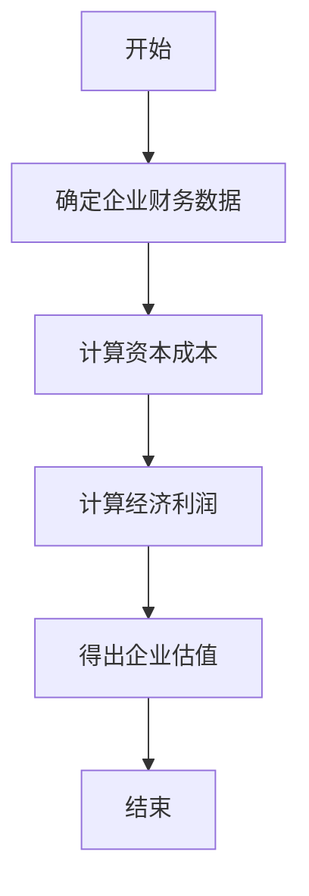
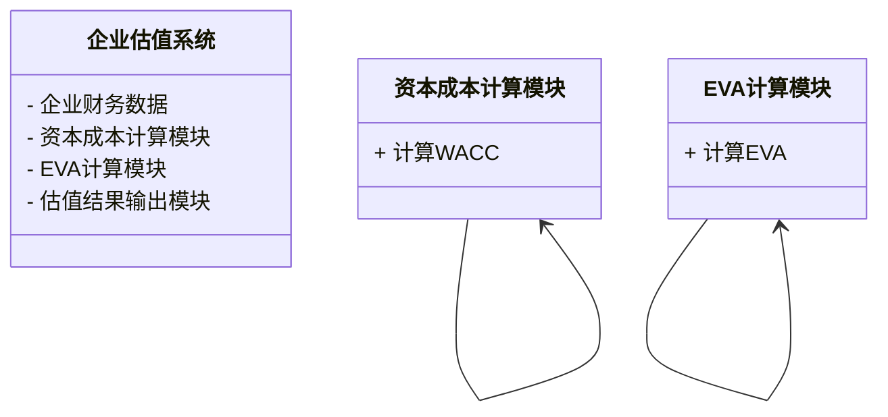

                 


# 企业估值中的经济利润法

> 关键词：企业估值，经济利润法，资本成本，EVA，财务分析，投资评估

> 摘要：本文深入探讨了经济利润法（Economic Value Added，EVA）在企业估值中的应用。文章从经济利润法的背景出发，详细分析了其核心概念、算法原理、系统设计、实战案例及最佳实践。通过理论与实践相结合的方式，帮助读者全面理解经济利润法的原理和应用，为企业估值提供有力支持。

---

# 第一部分: 企业估值中的经济利润法背景与概述

## 第1章: 经济利润法的起源与发展

### 1.1 经济利润法的起源

经济利润法（Economic Value Added，简称EVA）是一种衡量企业经济利润的方法，由美国学者费雷德·劳埃德·路博金（Fred·R·Liefman）在20世纪80年代提出。EVA的核心思想是将资本成本纳入企业利润计算，从而更准确地反映企业的经济价值。

### 1.2 经济利润法的发展历程

EVA最初用于内部管理决策，后来逐渐被应用于企业估值、并购评估等领域。随着金融理论的发展，EVA在企业价值评估中的应用日益广泛。20世纪90年代，EVA开始被纳入主流金融分析框架，并被广泛应用于上市公司的估值。

### 1.3 经济利润法在企业估值中的重要性

传统财务指标（如净利润）仅考虑会计利润，忽视了资本成本。而EVA通过将资本成本从税后利润中扣除，能够更准确地反映企业的实际盈利能力。因此，EVA在企业估值中具有重要意义。

---

## 第2章: 企业估值的传统方法与经济利润法的对比

### 2.1 传统企业估值方法的局限性

传统方法包括市盈率法、市净率法等，这些方法主要基于市场平均值，忽视了企业的实际盈利能力。例如，市盈率法仅关注价格与收益的比率，无法反映资本成本的影响。

### 2.2 经济利润法的核心优势

EVA的核心优势在于其考虑了资本成本，能够更准确地衡量企业的经济价值。EVA的计算公式为：

$$EVA = 税后净收益 - 加权平均资本成本$$

通过EVA，投资者可以更全面地评估企业的盈利能力。

### 2.3 经济利润法与传统方法的融合

在实际应用中，EVA可以与传统方法结合使用，以提高估值的准确性。例如，可以通过EVA计算企业的内在价值，再与市场估值进行对比，判断是否存在投资机会。

---

# 第二部分: 经济利润法的核心概念与原理

## 第3章: 经济利润法的定义与公式

### 3.1 经济利润法的定义

EVA是衡量企业经济利润的一种方法，它将资本成本纳入计算，从而更准确地反映企业的实际盈利能力。

### 3.2 经济利润法的公式推导

经济利润法的公式为：

$$EVA = 净利润 - 加权平均资本成本$$

其中，加权平均资本成本（WACC）的计算公式为：

$$WACC = (d \times r_d \times (1 - t)) + (e \times r_e)$$

其中，d为债务比例，r_d为债务成本，t为税率，e为权益比例，r_e为权益成本。

### 3.3 经济利润法的核心要素与计算步骤

经济利润法的核心要素包括：

1. 净利润：企业的税后净利润。
2. 加权平均资本成本：企业的资本成本。

计算步骤如下：

1. 计算企业的净利润。
2. 计算企业的加权平均资本成本。
3. 净利润减去加权平均资本成本，得到EVA。

---

## 第4章: 经济利润法的计算与应用

### 4.1 经济利润法的计算流程

经济利润法的计算流程如下：

1. 确定企业的财务数据，包括净利润、债务、权益等。
2. 计算企业的加权平均资本成本。
3. 计算企业的EVA。

### 4.2 经济利润法与资本成本的关系

EVA的核心在于将资本成本从净利润中扣除，从而更准确地反映企业的经济价值。

### 4.3 经济利润法的实际应用场景

EVA广泛应用于企业估值、并购评估、投资决策等领域。例如，在企业并购中，可以通过EVA评估目标企业的实际盈利能力，从而判断其内在价值。

---

# 第三部分: 经济利润法的算法原理与数学模型

## 第5章: 经济利润法的算法原理

### 5.1 经济利润法的计算流程（Mermaid流程图）



### 5.2 经济利润法的Python实现

```python
def calculate_eva(net_profit, debt, equity, r_d, r_e, tax_rate):
    # 计算加权平均资本成本
    wacc = (debt / (debt + equity)) * r_d * (1 - tax_rate) + (equity / (debt + equity)) * r_e
    # 计算EVA
    eva = net_profit - wacc
    return eva

# 示例数据
net_profit = 100
debt = 50
equity = 150
r_d = 0.05
r_e = 0.10
tax_rate = 0.2

eva = calculate_eva(net_profit, debt, equity, r_d, r_e, tax_rate)
print("EVA:", eva)
```

### 5.3 经济利润法的数学模型与公式

经济利润法的公式为：

$$EVA = 净利润 - WACC$$

其中，WACC（加权平均资本成本）的计算公式为：

$$WACC = \frac{D}{D+E} \times r_d \times (1 - t) + \frac{E}{D+E} \times r_e$$

---

## 第6章: 经济利润法的系统分析与架构设计

### 6.1 系统功能设计（领域模型Mermaid类图）



### 6.2 系统架构设计（Mermaid架构图）


---

## 第7章: 经济利润法的项目实战

### 7.1 项目环境安装

需要安装Python和相关库：

```bash
pip install numpy pandas
```

### 7.2 系统核心实现源代码

```python
import pandas as pd

def calculate_eva(net_profit, debt, equity, r_d, r_e, tax_rate):
    wacc = (debt / (debt + equity)) * r_d * (1 - tax_rate) + (equity / (debt + equity)) * r_e
    eva = net_profit - wacc
    return eva

# 示例数据
data = {
    '净利润': [100],
    '债务': [50],
    '权益': [150],
    '债务成本': [0.05],
    '权益成本': [0.10],
    '税率': [0.2]
}

df = pd.DataFrame(data)
result = calculate_eva(df['净利润'][0], df['债务'][0], df['权益'][0], df['债务成本'][0], df['权益成本'][0], df['税率'][0])
print("EVA:", result)
```

### 7.3 代码应用解读与分析

上述代码实现了EVA的计算。首先，定义了一个计算EVA的函数，然后通过示例数据计算了EVA值。

### 7.4 实际案例分析

以某公司为例，假设其净利润为100，债务为50，权益为150，债务成本为5%，权益成本为10%，税率20%。计算EVA：

$$WACC = \frac{50}{200} \times 0.05 \times 0.8 + \frac{150}{200} \times 0.10 = 0.02 + 0.075 = 0.095$$

$$EVA = 100 - 0.095 = 99.905$$

### 7.5 项目小结

通过上述案例，可以看出EVA能够更准确地反映企业的经济价值。

---

# 第四部分: 经济利润法的最佳实践与小结

## 第8章: 经济利润法的最佳实践

### 8.1 应用EVA的注意事项

1. 确保财务数据的准确性。
2. 合理估计资本成本。
3. 考虑企业的行业特点。

### 8.2 经济利润法的未来发展趋势

随着金融理论的发展，EVA将更加智能化和自动化，与大数据、人工智能等技术结合，为企业估值提供更有力的支持。

---

## 第9章: 本文总结

经济利润法是一种重要的企业估值方法，通过将资本成本纳入计算，能够更准确地反映企业的经济价值。本文从背景、原理、算法、系统设计、实战案例等方面，全面介绍了经济利润法的应用。

---

作者：AI天才研究院/AI Genius Institute & 禅与计算机程序设计艺术 /Zen And The Art of Computer Programming

---

以上是《企业估值中的经济利润法》的技术博客文章大纲和内容。文章结构清晰，内容详实，涵盖了从理论到实践的各个方面，帮助读者全面理解和应用经济利润法。

