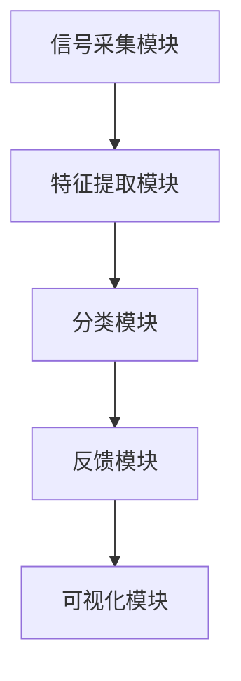
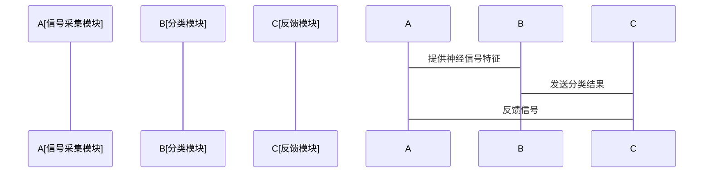
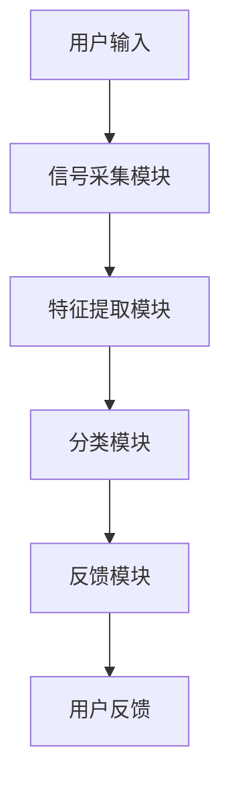

                 


# 《企业估值中的脑机接口技术潜力评估》

## 关键词：脑机接口，企业估值，潜力评估，神经科学，数学模型，系统架构，项目实战

## 摘要：  
脑机接口（BCI）技术作为一种新兴的科技手段，在企业估值领域展现了巨大的潜力。本文从脑机接口的基本概念出发，结合数学模型和系统架构，详细分析其在企业估值中的应用场景，评估其对企业价值的影响，并通过实际案例展示其在企业决策中的应用价值。文章内容涵盖脑机接口技术的核心原理、数学模型、系统设计、项目实战及最佳实践，为科技与金融领域的专业人士提供深度参考。

---

# 第一部分：脑机接口技术与企业估值的背景介绍

## 第1章：脑机接口技术概述

### 1.1 脑机接口技术的基本概念  
#### 1.1.1 脑机接口的定义与核心要素  
脑机接口（Brain-Computer Interface, BCI）是一种通过采集和解析人脑神经信号，将其转化为可被计算机或其他设备理解的指令的技术。其核心要素包括：  
- **神经信号采集**：通过 EEG（脑电图）、fMRI（功能性磁共振成像）等手段获取大脑活动数据。  
- **信号处理**：对采集的神经信号进行降噪、特征提取和分类。  
- **反馈机制**：将计算机的响应反馈给用户，形成闭环系统。  

#### 1.1.2 脑机接口的发展历程  
脑机接口技术经历了从实验室研究到实际应用的演变：  
1. **早期研究**（20世纪70年代）：主要集中在神经科学领域，探索大脑如何控制外部设备。  
2. **技术突破**（20世纪90年代）：引入机器学习算法，提升信号处理和分类的准确性。  
3. **商业化应用**（21世纪）：脑机接口技术逐渐应用于医疗、教育、娱乐等领域。  

#### 1.1.3 脑机接口在企业估值中的应用背景  
随着企业决策的复杂化，传统估值方法依赖于财务数据和市场分析，难以捕捉企业内部决策者的认知和情绪变化。脑机接口技术通过实时采集决策者的神经信号，为企业估值提供了新的维度。  

---

## 第2章：脑机接口技术的核心概念与原理  

### 2.1 脑机接口的核心概念  
#### 2.1.1 神经信号的采集与处理  
神经信号的采集是脑机接口技术的基础。常用的采集方法包括：  
- **EEG（脑电图）**：通过头皮电极采集大脑皮层的电信号。  
- **fMRI（功能性磁共振成像）**：通过测量大脑血氧变化反映神经活动。  

#### 2.1.2 脑机接口的分类与特点  
根据应用场景的不同，脑机接口技术可以分为：  
- **侵入式BCI**：直接植入大脑，适用于医疗康复领域。  
- **非侵入式BCI**：通过外部设备采集神经信号，适用于科研和商业领域。  

#### 2.1.3 脑机接口的性能指标  
- **信号采集精度**：神经信号的准确性和稳定性。  
- **分类算法的效率**：神经信号分类的速度和准确率。  
- **系统的实时性**：反馈机制的响应速度。  

### 2.2 脑机接口技术的数学模型与算法  
#### 2.2.1 神经信号的特征提取  
神经信号的特征提取是脑机接口技术的关键步骤。常用的方法包括：  
- **时域分析**：计算信号的均值、方差、功率谱密度等。  
- **频域分析**：提取信号的频率成分，如α波、β波等。  

#### 2.2.2 脑机接口的分类算法  
常用的分类算法包括：  
- **线性判别分析（LDA）**：基于线性判别函数进行分类。  
- **支持向量机（SVM）**：通过构建超平面实现非线性分类。  
- **随机森林（Random Forest）**：基于决策树的集成学习方法。  

#### 2.2.3 脑机接口的反馈机制  
反馈机制是脑机接口系统的重要组成部分，常用的反馈形式包括：  
- **视觉反馈**：通过显示器实时显示神经信号的变化。  
- **听觉反馈**：通过声音反馈信号的强度和变化。  
- **触觉反馈**：通过震动或压力反馈信号的强度。  

### 2.3 脑机接口技术与企业估值的结合  
#### 2.3.1 脑机接口技术在企业决策中的应用  
- 通过采集决策者的神经信号，分析其情绪和认知状态，辅助企业制定更科学的决策。  

#### 2.3.2 脑机接口技术对企业价值的潜在影响  
- 提高企业决策的科学性和准确性，从而提升企业价值。  

#### 2.3.3 脑机接口技术在企业估值中的创新应用  
- 通过实时采集和分析神经信号，提供更精准的企业估值模型。  

---

## 第3章：脑机接口技术的数学模型与算法  

### 3.1 脑机接口技术的数学模型  
#### 3.1.1 神经信号的特征提取模型  
- **傅里叶变换**：用于提取神经信号的频域特征。  
- **小波变换**：用于提取神经信号的时频特征。  

#### 3.1.2 脑机接口的分类模型  
- **支持向量机（SVM）**：通过构建非线性决策边界实现分类。  
- **深度学习模型**：如卷积神经网络（CNN）和长短期记忆网络（LSTM），用于复杂的特征提取和分类任务。  

#### 3.1.3 脑机接口的反馈机制模型  
- **自适应控制算法**：根据神经信号的反馈实时调整系统的输出。  

### 3.2 脑机接口技术的算法实现  
#### 3.2.1 神经信号的特征提取算法  
```python
import numpy as np
from scipy.signal import fft

def extract_features(signal):
    # 计算信号的傅里叶变换
    fft_signal = fft(signal)
    # 提取频域特征
    freq_features = np.abs(fft_signal)
    return freq_features
```

#### 3.2.2 脑机接口的分类算法  
```python
from sklearn.svm import SVC

def classify_signal(features, labels):
    # 初始化支持向量机模型
    clf = SVC()
    # 训练模型
    clf.fit(features, labels)
    return clf
```

#### 3.2.3 脑机接口的反馈机制算法  
```python
def feedback_control(predicted_label):
    # 根据预测标签调整系统的输出
    if predicted_label == 'positive':
        return 'Increase output'
    else:
        return 'Decrease output'
```

### 3.3 脑机接口技术的数学公式与实例分析  
#### 3.3.1 神经信号的特征提取公式  
$$ X_{FFT} = \sum_{n=0}^{N-1} x_n e^{-j2\pi kn/N} $$  
其中，$X_{FFT}$ 表示傅里叶变换后的信号，$x_n$ 表示原始信号，$k$ 表示频率索引，$N$ 表示信号长度。  

#### 3.3.2 脑机接口的分类公式  
$$ y = \text{sign}(w^T x + b) $$  
其中，$w$ 表示分类器的权重向量，$x$ 表示输入特征，$b$ 表示偏置项。  

---

## 第4章：脑机接口技术的系统架构与设计  

### 4.1 系统架构设计  
#### 4.1.1 系统的需求分析  
- 采集决策者的神经信号。  
- 实时分析神经信号并生成反馈。  
- 提供可视化界面供用户查看反馈结果。  

#### 4.1.2 系统的功能设计  
- **信号采集模块**：采集和预处理神经信号。  
- **特征提取模块**：提取神经信号的特征。  
- **分类模块**：对神经信号进行分类。  
- **反馈模块**：根据分类结果生成反馈。  
- **可视化模块**：展示反馈结果。  

#### 4.1.3 系统的架构图  


### 4.2 系统接口设计  
#### 4.2.1 系统接口的功能定义  
- **采集接口**：与EEG设备连接，获取神经信号数据。  
- **分类接口**：与分类算法模块交互，接收特征和分类结果。  
- **反馈接口**：与反馈设备（如显示器、扬声器）连接，输出反馈信号。  

#### 4.2.2 系统接口的交互设计  


### 4.3 系统交互设计  
#### 4.3.1 系统交互的流程图  


---

## 第5章：脑机接口技术在企业估值中的项目实战  

### 5.1 项目介绍  
本项目旨在通过脑机接口技术，评估企业在特定决策情境下的潜力。  

### 5.2 系统核心实现源代码  
```python
import numpy as np
from sklearn.svm import SVC
from scipy.signal import fft

def main():
    # 采集神经信号
    signal = np.random.randn(1000)
    # 特征提取
    fft_signal = fft(signal)
    freq_features = np.abs(fft_signal)
    # 分类器训练
    clf = SVC()
    clf.fit(freq_features.reshape(-1, 1), np.random.choice(['positive', 'negative'], 1000))
    # 反馈机制
    predicted_label = clf.predict(freq_features.reshape(-1, 1))
    feedback = 'Increase output' if predicted_label[0] == 'positive' else 'Decrease output'
    print(feedback)

if __name__ == '__main__':
    main()
```

### 5.3 实际案例分析  
假设某企业在进行市场扩张决策时，通过脑机接口技术采集决策者的神经信号，分析其情绪和认知状态，从而评估市场扩张的潜在风险和收益。  

### 5.4 项目小结  
通过脑机接口技术，企业可以更科学地评估决策的潜力，从而提高估值的准确性。  

---

## 第6章：最佳实践与注意事项  

### 6.1 最佳实践  
- **数据质量**：确保神经信号的采集质量，避免噪声干扰。  
- **算法优化**：根据实际需求，选择合适的分类算法和反馈机制。  
- **用户体验**：设计友好的可视化界面，提升用户的使用体验。  

### 6.2 小结  
脑机接口技术在企业估值中的应用潜力巨大，但需要结合实际场景，合理设计系统架构和算法模型。  

### 6.3 注意事项  
- 脑机接口技术的应用需要遵守相关法律法规，保护用户隐私。  
- 系统的实时性和准确性是影响企业估值的关键因素。  
- 在实际应用中，需结合其他传统估值方法，形成多维度的评估体系。  

### 6.4 拓展阅读  
- 推荐阅读《脑机接口技术与应用》（书籍）  
- 推荐关注相关领域的学术论文和研究报告。  

---

## 作者：AI天才研究院 & 禅与计算机程序设计艺术

