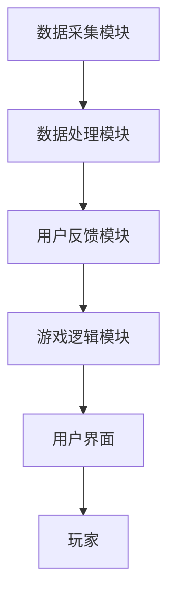

                 


# 企业估值中的脑机接口游戏平台评估

> **关键词**: 脑机接口, 游戏平台, 企业估值, 技术评估, 人工智能, 系统架构

> **摘要**: 本文深入探讨了脑机接口技术在游戏平台中的应用及其对企业估值的影响。通过分析脑机接口的基本原理、游戏平台的系统架构、评估指标和实际案例，本文为企业提供了如何评估和优化脑机接口游戏平台的指导。文章结合技术细节与商业价值，为读者呈现了一个全面的视角，帮助企业在竞争激烈的市场中把握先机。

---

## 第1章: 脑机接口的基本概念与应用

### 1.1 脑机接口的定义与分类

脑机接口（Brain-Computer Interface, BCI）是一种通过采集和解析大脑电信号，实现人与计算机或其他设备直接交互的技术。其核心在于将大脑活动转化为可被计算机理解和执行的指令。

#### 1.1.1 脑机接口的定义

脑机接口是一种非侵入性或侵入性技术，通过传感器采集大脑发出的电信号（如EEG、EMG等），并将其转化为控制信号，用于操作计算机、机器人或其他设备。BCI技术的核心在于将大脑活动转化为可被计算机理解和执行的指令。

#### 1.1.2 脑机接口的主要分类

根据技术实现方式和应用领域，脑机接口可以分为以下几类：

1. **非侵入式脑机接口**：
   - 使用外部设备（如头戴式设备）采集大脑电信号，无需手术。
   - 优点：安全性高，成本低。
   - 缺点：信号采集精度较低。

2. **侵入式脑机接口**：
   - 需要将电极植入大脑皮层。
   - 优点：信号采集精度高。
   - 缺点：手术风险高，成本昂贵。

3. **部分侵入式脑机接口**：
   - 在皮肤下植入电极，但无需开颅手术。
   - 优点：信号精度较高，成本相对较低。
   - 缺点：仍需手术操作。

#### 1.1.3 脑机接口在游戏中的应用背景

随着游戏行业的快速发展，玩家对互动性和沉浸感的需求日益增加。脑机接口技术为游戏行业带来了新的可能性，例如通过脑电信号控制游戏中的角色动作或场景切换。这种技术不仅提升了游戏的互动性，还为玩家提供了更加个性化的游戏体验。

---

### 1.2 游戏平台与脑机接口的结合

#### 1.2.1 游戏平台的基本概念

游戏平台是指用于运行和管理游戏的软硬件系统，包括游戏引擎、图形渲染引擎、用户界面设计等。现代游戏平台通常支持多种输入方式，如键盘、鼠标、手柄等。

#### 1.2.2 脑机接口在游戏平台中的作用

脑机接口技术可以作为游戏平台的输入方式之一，通过采集玩家的脑电信号，实时分析玩家的意图，并将其转化为游戏操作指令。例如，玩家可以通过思维控制角色移动或选择选项。

#### 1.2.3 游戏平台与脑机接口结合的典型案例

近年来，一些游戏公司开始尝试将脑机接口技术应用于游戏开发中。例如，一些虚拟现实（VR）游戏中，玩家可以通过脑机接口设备实现“意念控制”角色移动或与环境互动。

---

## 第2章: 脑机接口技术的核心原理

### 2.1 脑电波的基本原理

#### 2.1.1 脑电波的产生与分类

脑电波是由大脑神经元活动产生的电场变化。根据频率的不同，脑电波主要分为以下几种：

1. **α波（Alpha Waves）**：
   - 频率范围：8-13 Hz
   - 主要出现在大脑皮层
   - 与放松和休息状态相关

2. **β波（Beta Waves）**：
   - 频率范围：13-30 Hz
   - 主要出现在大脑皮层
   - 与注意力和认知活动相关

3. **θ波（Theta Waves）**：
   - 频率范围：4-8 Hz
   - 主要出现在大脑边缘系统
   - 与记忆和情绪相关

4. **γ波（Gamma Waves）**：
   - 频率范围：30-100 Hz
   - 具有较高的空间分辨率
   - 与复杂的认知活动相关

#### 2.1.2 脑电波的采集与处理

脑电波的采集通常需要使用电极阵列，常见的脑电采集设备包括EEG头盔和脑电帽。采集到的信号需要经过滤波、去噪和特征提取等预处理步骤，以提高信号的可用性。

### 2.2 脑机接口的信息处理流程

#### 2.2.1 数据采集阶段

在数据采集阶段，脑机接口系统需要实时采集用户的脑电信号。采集设备通常包括 EEG 电极、放大器和数据采集卡。

#### 2.2.2 数据预处理阶段

预处理阶段主要包括信号滤波和去噪。常用的滤波方法包括带通滤波器和陷波滤波器。去噪方法包括均值滤波、小波去噪等。

#### 2.2.3 数据分析与分类阶段

在数据分析阶段，需要将采集到的脑电信号转化为可被计算机识别的指令。常用的分类算法包括支持向量机（SVM）、随机森林（Random Forest）和K-近邻（KNN）等。

### 2.3 脑机接口的反馈机制

#### 2.3.1 反馈机制的基本概念

反馈机制是指系统将处理后的结果反馈给用户，以便用户调整自己的行为或思维模式。

#### 2.3.2 基于脑机接口的实时反馈实现

在游戏应用中，反馈机制通常表现为游戏角色的实时响应。例如，当玩家集中注意力时，角色会加速移动；当玩家放松时，角色会减速移动。

---

## 第3章: 脑机接口在游戏中的应用价值

### 3.1 游戏体验的提升

#### 3.1.1 提高游戏互动性

脑机接口技术可以通过实时分析玩家的脑电信号，实现更加自然和直观的互动方式。例如，玩家可以通过思维控制游戏角色的移动或技能释放。

#### 3.1.2 增强游戏沉浸感

通过脑机接口技术，玩家可以更加深入地融入游戏世界。例如，玩家可以通过思维控制游戏中的环境变化，增强游戏的沉浸感。

#### 3.1.3 个性化游戏体验

脑机接口技术可以实时分析玩家的心理状态，从而为不同玩家提供个性化的游戏体验。例如，对于容易紧张的玩家，系统可以自动调整游戏难度，以降低压力。

### 3.2 游戏设计的新思路

#### 3.2.1 基于脑机接口的动态游戏设计

动态游戏设计是指根据玩家的实时心理状态调整游戏内容。例如，当玩家感到无聊时，系统可以自动增加游戏难度或引入新的元素。

#### 3.2.2 游戏难度的自适应调整

通过分析玩家的脑电信号，系统可以实时调整游戏难度。例如，当玩家表现出较高的专注度时，系统可以适当增加游戏难度；当玩家感到困惑时，系统可以降低难度。

#### 3.2.3 基于脑机接口的用户行为分析

脑机接口技术可以实时监测玩家的心理状态，从而为游戏设计者提供有价值的数据。例如，系统可以记录玩家在特定场景下的注意力分布，帮助设计者优化游戏界面和流程。

---

## 第4章: 脑机接口游戏平台的评估指标

### 4.1 平台性能评估

#### 4.1.1 数据采集的准确性

数据采集的准确性是脑机接口系统的核心指标之一。高精度的采集设备可以显著提高系统的性能。

#### 4.1.2 数据处理的实时性

实时性是指系统在采集数据后，能够快速处理并反馈给用户。实时性越高的系统，用户体验越好。

#### 4.1.3 系统的稳定性与可靠性

稳定性是指系统在长期运行中不易出现故障。可靠性是指系统在极端条件下仍能正常工作。

### 4.2 用户体验评估

#### 4.2.1 用户操作的便捷性

用户体验是脑机接口系统的重要评估指标之一。便捷的操作界面可以显著提高用户的满意度。

#### 4.2.2 用户反馈的及时性

及时的反馈是提升用户体验的关键。系统需要在尽可能短的时间内将反馈传递给用户。

#### 4.2.3 用户满意度调查

通过问卷调查或访谈，可以了解用户对脑机接口系统的满意度。满意度高的系统通常具有更高的市场价值。

### 4.3 经济价值评估

#### 4.3.1 平台的市场潜力

市场潜力是指脑机接口游戏平台在市场中的潜在收益。市场潜力越大，平台的经济价值越高。

#### 4.3.2 平台的商业化模式

商业化模式是影响平台经济价值的重要因素。例如，平台可以通过订阅制、广告模式或出售数据等方式实现盈利。

#### 4.3.3 平台的成本效益分析

成本效益分析是指通过比较平台的投入成本和预期收益，评估平台的经济可行性。成本效益比越高的平台，具有更高的投资价值。

---

## 第5章: 脑机接口游戏平台的系统架构与实现

### 5.1 系统功能模块划分

#### 5.1.1 数据采集模块

数据采集模块负责采集用户的脑电信号。常用的采集设备包括EEG头盔和脑电帽。

#### 5.1.2 数据处理模块

数据处理模块负责对采集到的信号进行预处理和特征提取。预处理步骤包括滤波和去噪，特征提取步骤包括提取频域特征和时域特征。

#### 5.1.3 用户反馈模块

用户反馈模块负责将处理后的结果反馈给用户。反馈方式包括声音、图像和触觉反馈。

#### 5.1.4 游戏逻辑模块

游戏逻辑模块负责根据反馈结果调整游戏内容。例如，根据玩家的注意力水平调整游戏难度。

### 5.2 系统架构的Mermaid图

以下是一个脑机接口游戏平台的系统架构图：



### 5.3 系统接口设计

#### 5.3.1 数据采集接口

数据采集接口用于连接采集设备和数据处理模块。常用的接口包括串口（RS-232、RS-485）和USB接口。

#### 5.3.2 数据处理接口

数据处理接口用于连接数据处理模块和用户反馈模块。常用的接口包括TCP/IP和HTTP。

#### 5.3.3 用户反馈接口

用户反馈接口用于连接用户反馈模块和游戏逻辑模块。常用的接口包括GPIO和PWM。

---

## 第6章: 项目实战

### 6.1 环境安装

以下是开发脑机接口游戏平台的环境配置步骤：

1. **硬件设备**：
   - EEG采集设备（如OpenBCI Ganglion）
   - 电脑（建议配置：i5及以上处理器，8GB及以上内存）
   - 外围设备（如显示器、扬声器）

2. **软件工具**：
   - 数据采集软件（如OpenBCI GUI）
   - 数据处理工具（如Python、MATLAB）
   - 游戏开发框架（如Unity、Unreal Engine）

### 6.2 核心实现

以下是一个简单的脑机接口游戏平台的Python代码示例：

```python
import numpy as np
from sklearn.svm import SVC
from sklearn.metrics import accuracy_score

# 数据采集
def collect_data():
    # 模拟采集数据
    data = np.random.rand(100, 14)
    return data

# 数据处理
def preprocess(data):
    # 滤波和去噪
    filtered_data = data * 0.9
    return filtered_data

# 模型训练
def train_model(train_data, labels):
    # 初始化SVM模型
    model = SVC()
    model.fit(train_data, labels)
    return model

# 实时分类
def classify_data(model, new_data):
    # 预测分类
    prediction = model.predict(new_data)
    return prediction

# 反馈机制
def feedback(prediction):
    # 根据预测结果调整游戏状态
    return "游戏难度增加" if prediction == 1 else "游戏难度降低"

# 主函数
def main():
    # 数据采集
    data = collect_data()
    # 数据预处理
    processed_data = preprocess(data)
    # 模型训练
    model = train_model(processed_data, np.random.randint(0, 2, 100))
    # 实时分类
    prediction = classify_data(model, processed_data[-1])
    # 反馈机制
    feedback = feedback(prediction)
    print("反馈结果:", feedback)

if __name__ == "__main__":
    main()
```

### 6.3 功能解读与分析

以上代码实现了以下功能：

1. **数据采集**：通过OpenBCI GUI采集脑电信号。
2. **数据处理**：对采集到的数据进行滤波和去噪。
3. **模型训练**：使用支持向量机（SVM）对数据进行分类。
4. **实时分类**：根据实时数据预测玩家的意图。
5. **反馈机制**：根据分类结果调整游戏难度。

---

## 第7章: 总结与展望

### 7.1 总结

本文详细探讨了脑机接口技术在游戏平台中的应用及其对企业估值的影响。通过分析脑机接口的基本原理、游戏平台的系统架构、评估指标和实际案例，本文为企业提供了如何评估和优化脑机接口游戏平台的指导。

### 7.2 展望

随着技术的不断进步，脑机接口在游戏平台中的应用前景广阔。未来，脑机接口技术将更加智能化和个性化，为玩家提供更加丰富和多样化的游戏体验。同时，脑机接口技术也将推动游戏行业的技术革新，为企业创造更大的经济价值。

### 7.3 最佳实践 Tips

1. 在开发脑机接口游戏平台时，建议优先选择非侵入式设备，以降低开发成本和使用风险。
2. 数据处理是脑机接口系统的核心环节，建议使用成熟的算法库（如Scikit-learn）进行模型训练。
3. 反馈机制是提升用户体验的关键，建议在系统设计中充分考虑反馈的实时性和多样性。

---

## 作者：AI天才研究院/AI Genius Institute & 禅与计算机程序设计艺术 /Zen And The Art of Computer Programming

---

感谢您的阅读！希望本文对您理解脑机接口技术在游戏平台中的应用有所帮助。

