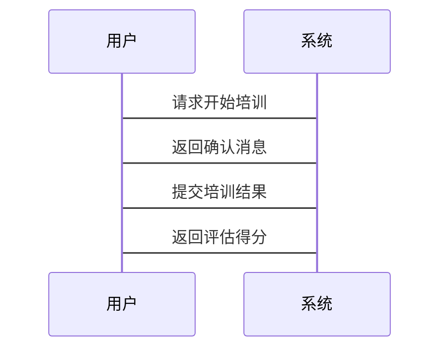

                 


# 企业估值中的虚拟现实培训应用评估

## 关键词：企业估值、虚拟现实、培训应用、评估模型、人工智能

## 摘要：  
随着虚拟现实（VR）技术的快速发展，其在企业培训中的应用越来越广泛。本文将探讨虚拟现实培训应用对企业估值的影响，分析如何通过评估模型和算法优化来提升企业培训的效果，并进一步为企业估值提供数据支持。文章从背景介绍、核心概念、算法原理、系统架构到项目实战和最佳实践等方面展开，结合实际案例和代码实现，为企业估值中的虚拟现实培训应用评估提供全面的理论和实践指导。

---

# 第1章: 虚拟现实技术与企业培训的结合

## 1.1 虚拟现实技术的起源与发展

### 1.1.1 VR技术的基本概念  
虚拟现实（Virtual Reality，简称VR）是一种通过计算机生成的三维虚拟环境，用户可以通过特殊的设备（如头显、手柄等）与之交互，获得沉浸式的体验。VR技术的核心在于模拟真实世界中的视觉、听觉、触觉等感官刺激，使用户感觉置身于虚拟环境中。

### 1.1.2 VR技术在企业培训中的应用现状  
目前，VR技术在企业培训中的应用主要集中在以下几个方面：  
1. **技能培训**：例如制造业中的设备操作培训，医疗行业中的手术模拟训练。  
2. **安全培训**：例如矿山、化工厂等高危环境下的应急演练。  
3. **领导力与团队协作培训**：通过模拟情景任务，提升员工的协作能力和应变能力。  

### 1.1.3 VR技术对企业估值的影响  
VR技术的应用不仅提升了培训效果，还通过降低培训成本、提高员工效率等方式间接提升了企业估值。例如，相比传统的线下培训，VR培训的投入成本更低，且能够更高效地提升员工技能，从而为企业创造更大的价值。

## 1.2 企业培训中的传统方法与挑战

### 1.2.1 传统企业培训的主要形式  
传统企业培训主要包括以下几种形式：  
1. **线下课堂培训**：由讲师主导，员工集中学习。  
2. **在线学习**：通过网络平台进行自主学习。  
3. **情景模拟**：通过角色扮演等方式模拟实际工作场景。  

### 1.2.2 传统培训方法的优缺点  
- **优点**：成本较低，覆盖面广，适合大规模培训。  
- **缺点**：互动性差，学习效果难以量化，员工参与度低。  

### 1.2.3 传统培训方法的局限性  
1. 难以模拟真实工作环境，员工无法获得沉浸式体验。  
2. 培训效果难以量化，缺乏数据支持。  
3. 员工参与度低，学习积极性不足。  

## 1.3 虚拟现实技术在企业培训中的优势

### 1.3.1 提高培训的沉浸感  
通过VR技术，员工可以在虚拟环境中身临其境地体验各种工作场景，从而提高学习效果。  

### 1.3.2 增强培训的互动性  
VR培训允许员工与虚拟环境中的物体和人物进行互动，增强了学习的趣味性和参与度。  

### 1.3.3 降低培训成本  
相比传统的线下培训，VR培训无需场地租赁、讲师费用等，且可以重复使用，显著降低了培训成本。  

---

## 第2章: 虚拟现实培训应用的评估指标

### 2.1 评估指标的定义与分类

#### 2.1.1 评估指标的基本概念  
评估指标是对VR培训应用效果的量化标准，通常包括培训效果、用户体验、成本效益等多个维度。  

#### 2.1.2 评估指标的分类  
1. **培训效果指标**：如知识掌握率、技能提升幅度等。  
2. **用户体验指标**：如沉浸感、操作便捷性等。  
3. **成本效益指标**：如培训成本与收益比。  

#### 2.1.3 评估指标的权重分配  
根据企业需求和培训目标，对不同指标赋予不同的权重。例如，技能提升幅度可能比沉浸感更重要。  

### 2.2 评估模型的构建

#### 2.2.1 数据采集与处理  
通过VR设备采集员工的培训数据，包括操作时间、错误率、任务完成度等。  

#### 2.2.2 模型设计与优化  
基于机器学习算法，构建评估模型，对培训效果进行预测和优化。  

#### 2.2.3 模型验证与评估  
通过实际数据验证模型的准确性，并根据反馈不断优化模型。  

### 2.3 评估结果对企业估值的影响

#### 2.3.1 评估结果的分析方法  
通过统计分析和数据挖掘，对企业培训效果进行综合评估。  

#### 2.3.2 评估结果对企业决策的影响  
评估结果可以为企业制定培训预算、优化培训策略提供数据支持。  

#### 2.3.3 评估结果的可视化展示  
通过图表、报告等方式，直观展示评估结果，帮助企业更好地理解和应用。  

---

## 第3章: 虚拟现实培训应用评估的核心概念与联系

### 3.1 虚拟现实培训应用的核心要素

#### 3.1.1 虚拟环境构建  
通过3D建模和渲染技术，构建逼真的虚拟培训环境。  

#### 3.1.2 交互设计  
设计自然的交互方式，使员工能够与虚拟环境中的物体和人物进行互动。  

#### 3.1.3 培训内容设计  
根据企业需求，设计针对性的培训内容，确保培训目标的实现。  

### 3.2 评估模型的数学模型与公式

#### 3.2.1 数据采集与特征提取  
假设我们有以下特征：  
- 员工年龄：$age$  
- 培训时间：$time$  
- 错误率：$error\_rate$  
- 任务完成度：$completion\_rate$  

#### 3.2.2 评估模型的构建  
使用线性回归模型进行评估：  
$$ score = \beta_0 + \beta_1 \cdot age + \beta_2 \cdot time + \beta_3 \cdot error\_rate + \beta_4 \cdot completion\_rate $$  

其中，$score$ 是员工的综合评估得分。  

#### 3.2.3 模型优化与验证  
通过交叉验证和参数调优，提高模型的准确性和可靠性。  

---

## 第4章: 虚拟现实培训应用的系统架构设计

### 4.1 系统功能设计

#### 4.1.1 领域模型设计  
使用mermaid类图描述系统的主要组件和交互关系：  

```mermaid
classDiagram

    class VR_Training_System {
        + users: User[]
        + sessions: Session[]
        + content: Content[]
    }

    class User {
        + id: int
        + name: string
        + score: float
    }

    class Session {
        + id: int
        + user: User
        + start_time: datetime
        + end_time: datetime
        + content: Content
    }

    class Content {
        + id: int
        + title: string
        + description: string
    }

    VR_Training_System o User
    VR_Training_System o Session
    VR_Training_System o Content
```

### 4.2 系统架构设计

#### 4.2.1 分层架构设计  
使用mermaid架构图描述系统架构：  


### 4.3 系统接口设计

#### 4.3.1 API接口设计  
定义RESTful API接口，例如：  
- POST /api/training/start  
- GET /api/training/scores  

#### 4.3.2 交互流程图  
使用mermaid序列图描述用户与系统的交互流程：  



---

## 第5章: 虚拟现实培训应用的项目实战

### 5.1 环境安装与配置

#### 5.1.1 安装VR开发框架  
选择合适的VR开发框架，例如Unity或Unreal Engine。  

#### 5.1.2 安装必要的依赖库  
安装OpenCV、Python等开发工具和库。  

### 5.2 核心代码实现

#### 5.2.1 VR环境渲染代码  
```python
import pygame
from pygame.locals import *

# 初始化pygame
pygame.init()

# 设置窗口大小
size = (800, 600)
screen = pygame.display.set_mode(size)

# 设置标题
pygame.display.set_caption("VR Training System")

# 主循环
running = True
while running:
    for event in pygame.event.get():
        if event.type == QUIT:
            running = False

    # 填充背景颜色
    screen.fill((0, 0, 0))

    # 绘制虚拟环境
    # ... 具体实现代码 ...

    pygame.display.flip()

pygame.quit()
```

#### 5.2.2 交互逻辑代码  
```python
# 定义用户输入处理
def handle_input():
    for event in pygame.event.get():
        if event.type == KEYDOWN:
            # 处理按键事件
            pass
```

#### 5.2.3 评估模型实现  
```python
# 使用机器学习模型进行评估
from sklearn.linear_model import LinearRegression

model = LinearRegression()
model.fit(X_train, y_train)
score = model.predict(X_test)
```

### 5.3 实际案例分析

#### 5.3.1 案例背景  
某企业引入VR培训系统，用于新员工的技能培训。  

#### 5.3.2 数据收集与分析  
通过VR系统采集员工的培训数据，包括操作时间、错误率等。  

#### 5.3.3 评估结果  
根据模型预测，员工的技能提升幅度显著高于传统培训方式。  

---

## 第6章: 最佳实践与小结

### 6.1 最佳实践

#### 6.1.1 系统设计注意事项  
- 确保系统稳定性，避免 crashes 和延迟。  
- 定期更新内容，保持培训的时效性。  

#### 6.1.2 代码实现技巧  
- 使用高效的渲染算法，提升系统性能。  
- 优化交互逻辑，确保用户体验流畅。  

### 6.2 小结  
虚拟现实技术在企业培训中的应用前景广阔，通过科学的评估模型和系统的架构设计，可以显著提升培训效果，进而优化企业估值。  

### 6.3 注意事项  
- 在实施VR培训前，需进行充分的市场调研和技术评估。  
- 确保数据安全，避免用户隐私泄露。  

### 6.4 拓展阅读  
- 《虚拟现实技术与企业应用》  
- 《人工智能在企业培训中的应用》  

---

## 作者：AI天才研究院 & 禅与计算机程序设计艺术

---

通过本文的详细讲解，读者可以全面了解虚拟现实培训应用在企业估值中的重要性，并掌握如何通过技术手段优化培训效果。希望本文能为企业在虚拟现实培训应用的评估和实践方面提供有价值的参考。

