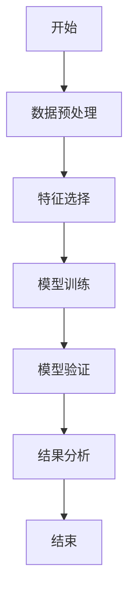
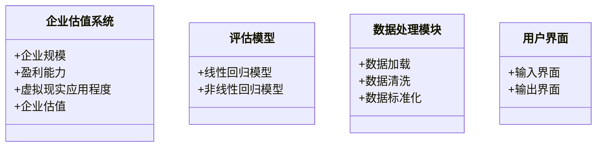
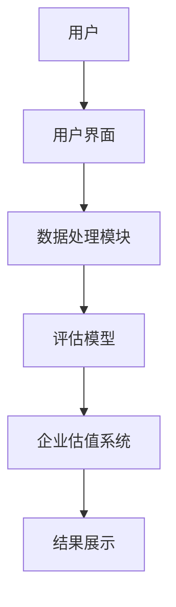

                 


# 企业估值中的虚拟现实应用评估

> 关键词：虚拟现实、企业估值、资产评估、技术应用、算法模型

> 摘要：本文探讨了虚拟现实（VR）技术在企业估值中的应用，分析了其对传统估值方法的优化作用。通过详细阐述虚拟现实技术的核心概念、评估指标、数学模型与算法原理，结合实际案例，展示了如何利用VR技术提升企业估值的准确性和效率。文章最后总结了虚拟现实技术在企业估值中的潜力与挑战，并提出了未来的研究方向。

---

# 第一部分: 虚拟现实技术与企业估值背景

## 第1章: 虚拟现实技术与企业估值背景

### 1.1 虚拟现实技术的基本概念

#### 1.1.1 虚拟现实的定义与核心特征

虚拟现实（Virtual Reality，VR）是一种能够提供沉浸式体验的技术，通过模拟三维环境，让用户通过视觉、听觉、触觉等感官与虚拟世界进行交互。其核心特征包括沉浸性、交互性和构想性。

- **沉浸性**：用户能够完全沉浸在虚拟环境中，感觉身临其境。
- **交互性**：用户可以通过手柄、头显等设备与虚拟环境互动。
- **构想性**：用户可以在虚拟环境中创造和修改内容。

#### 1.1.2 虚拟现实技术的发展历程

虚拟现实技术的发展可以分为以下几个阶段：

1. **初期探索阶段（20世纪60年代-70年代）**：虚拟现实的概念首次提出，主要用于军事和航空航天领域。
2. **技术发展阶段（20世纪80年代-90年代）**：VR技术开始应用于娱乐、教育和医疗领域。
3. **商业化阶段（21世纪初至今）**：VR技术逐渐成熟， Oculus、HTC等公司推出消费级产品，应用场景不断扩展。

#### 1.1.3 虚拟现实技术在企业中的应用现状

当前，虚拟现实技术在企业中的应用主要集中在以下几个方面：

- **企业培训**：通过虚拟现实技术进行员工培训，模拟真实工作场景。
- **产品展示**：利用VR技术展示产品设计和功能，提升用户体验。
- **虚拟会议**：通过虚拟现实技术召开虚拟会议，支持远程协作。

### 1.2 企业估值的基本概念与方法

#### 1.2.1 企业估值的定义与核心要素

企业估值是指对企业的整体价值或部分价值进行评估的过程。核心要素包括：

- **财务指标**：收入、利润、资产、负债等。
- **市场因素**：行业竞争、市场前景等。
- **管理团队**：团队能力、战略规划等。

#### 1.2.2 传统企业估值方法概述

传统企业估值方法主要包括以下几种：

1. **收益法**：通过预测企业未来现金流，折现计算企业价值。
2. **市场法**：通过比较类似企业的交易价格进行估值。
3. **成本法**：通过估算企业重建成本进行估值。

#### 1.2.3 虚拟现实技术在企业估值中的潜力与挑战

虚拟现实技术在企业估值中的潜力主要体现在以下几个方面：

- **提高估值效率**：通过虚拟现实技术快速获取企业数据，缩短估值时间。
- **增强估值准确性**：通过模拟企业实际运营场景，提供更准确的估值依据。
- **提升用户体验**：通过虚拟现实技术直观展示企业价值，便于决策者理解。

然而，虚拟现实技术在企业估值中的应用也面临一些挑战：

- **技术成本高**：虚拟现实设备和软件开发成本较高。
- **数据准确性**：虚拟现实技术依赖于数据的准确性和完整性，数据质量直接影响估值结果。
- **用户接受度**：部分用户对虚拟现实技术的使用可能存在一定的学习成本和适应期。

### 1.3 虚拟现实技术与企业估值的结合

#### 1.3.1 虚拟现实技术如何影响企业价值评估

虚拟现实技术可以通过以下方式影响企业价值评估：

- **提供沉浸式体验**：通过虚拟现实技术让用户亲身体验企业的产品和服务，提升用户认知度和信任度。
- **优化决策过程**：通过虚拟现实技术模拟企业运营场景，帮助决策者做出更明智的决策。
- **降低评估成本**：通过虚拟现实技术减少实地考察和数据收集的成本。

#### 1.3.2 虚拟现实技术在企业估值中的应用场景

1. **企业参观与产品展示**：通过虚拟现实技术展示企业的生产流程和产品设计，帮助投资者更好地了解企业。
2. **市场分析与竞争分析**：通过虚拟现实技术模拟市场环境，帮助企业分析竞争对手和市场趋势。
3. **风险评估与应急预案**：通过虚拟现实技术模拟潜在风险场景，帮助企业制定应急预案。

#### 1.3.3 虚拟现实技术对企业估值流程的优化作用

虚拟现实技术可以优化企业估值流程的以下几个方面：

- **数据收集**：通过虚拟现实技术快速收集企业运营数据，提升数据收集效率。
- **数据分析**：通过虚拟现实技术直观展示数据分析结果，提升数据解读效率。
- **决策支持**：通过虚拟现实技术模拟不同决策对企业价值的影响，提升决策科学性。

### 1.4 本章小结

本章介绍了虚拟现实技术的基本概念和发展历程，分析了其在企业中的应用现状。同时，阐述了企业估值的基本概念和传统方法，并探讨了虚拟现实技术在企业估值中的潜力与挑战。通过本章内容，读者可以了解虚拟现实技术如何影响企业估值流程，以及其在实际应用中的优势和局限性。

---

# 第二部分: 虚拟现实应用评估的核心概念与方法

## 第2章: 虚拟现实应用评估的核心概念

### 2.1 虚拟现实应用评估的指标体系

#### 2.1.1 技术指标：性能、交互性、沉浸感

- **性能**：虚拟现实系统的运行速度和稳定性。
- **交互性**：用户与虚拟环境的互动程度。
- **沉浸感**：用户在虚拟环境中的沉浸体验。

#### 2.1.2 经济指标：成本、收益、投资回报率

- **成本**：虚拟现实系统的开发和维护成本。
- **收益**：虚拟现实系统带来的经济效益。
- **投资回报率**：虚拟现实系统的投资回报率。

#### 2.1.3 用户体验指标：满意度、使用效率、用户留存率

- **满意度**：用户对虚拟现实系统的满意程度。
- **使用效率**：用户完成任务的效率。
- **用户留存率**：用户持续使用虚拟现实系统的比例。

#### 2.1.4 对比分析表

| 指标类型 | 具体指标 | 描述 |
|----------|----------|------|
| 技术指标 | 性能 | 系统运行速度和稳定性 |
|          | 交互性 | 用户与虚拟环境的互动程度 |
|          | 沉浸感 | 用户在虚拟环境中的沉浸体验 |
| 经济指标 | 成本 | 系统开发和维护成本 |
|          | 收益 | 系统带来的经济效益 |
|          | 投资回报率 | 系统的投资回报率 |
| 用户体验指标 | 满意度 | 用户对系统的满意程度 |
|          | 使用效率 | 用户完成任务的效率 |
|          | 用户留存率 | 用户持续使用系统的比例 |

### 2.2 虚拟现实应用评估的核心模型

#### 2.2.1 模型的输入变量与输出变量

**输入变量**：
- 企业规模
- 企业盈利能力
- 虚拟现实技术的应用程度

**输出变量**：
- 企业估值
- 投资回报率

#### 2.2.2 模型的假设条件与限制

- 数据的完整性和准确性
- 模型适用于中等规模的企业
- 模型不考虑宏观经济波动

#### 2.2.3 模型的适用场景与边界

- 适用于企业估值的初步评估
- 适用于虚拟现实技术的应用前景分析

### 2.3 虚拟现实应用评估的流程与步骤

#### 2.3.1 项目需求分析

- 明确评估目标
- 确定评估范围
- 制定评估计划

#### 2.3.2 数据收集与处理

- 收集企业财务数据
- 收集虚拟现实技术应用数据
- 数据清洗与预处理

#### 2.3.3 模型构建与验证

- 构建评估模型
- 验证模型的准确性和稳定性

#### 2.3.4 结果分析与优化

- 分析评估结果
- 根据结果优化模型参数

### 2.4 本章小结

本章详细介绍了虚拟现实应用评估的核心概念，包括技术指标、经济指标和用户体验指标，并通过对比分析表展示了不同指标的特点。同时，阐述了评估模型的输入变量和输出变量，以及模型的假设条件和适用场景。最后，总结了评估流程的各个步骤，为后续的模型构建和算法设计奠定了基础。

---

# 第三部分: 虚拟现实应用评估的数学模型与算法原理

## 第3章: 虚拟现实应用评估的数学模型

### 3.1 评估模型的数学表达

#### 3.1.1 线性回归模型

$$ y = \beta_0 + \beta_1x_1 + \beta_2x_2 + \cdots + \beta_nx_n + \epsilon $$

其中：
- $y$ 表示企业估值
- $x_i$ 表示各个输入变量
- $\beta_i$ 表示回归系数
- $\epsilon$ 表示误差项

#### 3.1.2 非线性回归模型

$$ y = f(x_1, x_2, \ldots, x_n) $$

其中：
- $f$ 表示非线性函数

#### 3.1.3 评估模型的优化

通过最小化预测误差的平方和来优化回归系数：

$$ \min_{\beta} \sum_{i=1}^{m} (y_i - \hat{y}_i)^2 $$

其中：
- $m$ 表示样本数量
- $y_i$ 表示真实值
- $\hat{y}_i$ 表示预测值

### 3.2 算法原理与流程图

#### 3.2.1 算法流程图



#### 3.2.2 算法实现与代码示例

##### 3.2.2.1 环境配置

```python
import numpy as np
import pandas as pd
from sklearn.linear_model import LinearRegression
from sklearn.metrics import r2_score
```

##### 3.2.2.2 数据加载与预处理

```python
# 加载数据
data = pd.read_csv('enterprise_valuation.csv')

# 数据预处理
X = data[['企业规模', '盈利能力', '虚拟现实应用程度']]
y = data['企业估值']

# 数据标准化
from sklearn.preprocessing import StandardScaler
scaler = StandardScaler()
X_scaled = scaler.fit_transform(X)
```

##### 3.2.2.3 模型训练与验证

```python
# 训练模型
model = LinearRegression()
model.fit(X_scaled, y)

# 模型预测
y_pred = model.predict(X_scaled)

# 模型评估
r2 = r2_score(y, y_pred)
print(f'R² = {r2}')
```

##### 3.2.2.4 结果分析

通过模型预测结果与真实值的对比，评估模型的准确性和稳定性。如果R²值较高，说明模型具有较高的预测精度。

### 3.3 本章小结

本章通过数学模型和算法原理详细阐述了虚拟现实应用评估的核心方法。通过线性回归模型和非线性回归模型的对比，展示了不同模型的适用场景和优缺点。同时，通过流程图和代码示例，详细介绍了算法实现的步骤和方法，为实际应用提供了参考。

---

# 第四部分: 虚拟现实应用评估的系统架构与实现

## 第4章: 虚拟现实应用评估的系统架构

### 4.1 系统功能设计

#### 4.1.1 领域模型



#### 4.1.2 系统架构设计



### 4.2 系统实现

#### 4.2.1 环境配置

```bash
pip install numpy pandas scikit-learn
```

#### 4.2.2 核心代码实现

```python
# 导入所需的库
import numpy as np
import pandas as pd
from sklearn.linear_model import LinearRegression
from sklearn.metrics import r2_score
from sklearn.preprocessing import StandardScaler

# 加载数据
data = pd.read_csv('enterprise_valuation.csv')

# 数据预处理
X = data[['企业规模', '盈利能力', '虚拟现实应用程度']]
y = data['企业估值']

# 数据标准化
scaler = StandardScaler()
X_scaled = scaler.fit_transform(X)

# 训练模型
model = LinearRegression()
model.fit(X_scaled, y)

# 模型预测
y_pred = model.predict(X_scaled)

# 模型评估
r2 = r2_score(y, y_pred)
print(f'R² = {r2}')

# 保存模型
import joblib
joblib.dump(model, 'enterprise_valuation_model.pkl')
```

#### 4.2.3 系统接口设计

```python
# 定义接口函数
def predict_valuation(enterprise_scale, profitability, vr_application):
    # 加载模型
    model = joblib.load('enterprise_valuation_model.pkl')
    # 数据标准化
    input_data = np.array([[enterprise_scale, profitability, vr_application]])
    input_scaled = scaler.transform(input_data)
    # 模型预测
    prediction = model.predict(input_scaled)
    return prediction[0]
```

### 4.3 本章小结

本章详细介绍了虚拟现实应用评估系统的架构设计和实现过程。通过领域模型和系统架构图，展示了系统的功能模块和交互流程。同时，通过Python代码示例，展示了系统实现的关键步骤，包括数据处理、模型训练和结果展示。

---

# 第五部分: 虚拟现实应用评估的项目实战

## 第5章: 虚拟现实应用评估的项目实战

### 5.1 项目背景与目标

#### 5.1.1 项目背景

本项目旨在通过虚拟现实技术对企业估值进行评估，帮助投资者更好地了解企业的实际价值。

#### 5.1.2 项目目标

- 建立虚拟现实应用评估模型
- 开发评估系统
- 实现企业估值的自动化评估

### 5.2 项目实施

#### 5.2.1 环境配置

```bash
pip install numpy pandas scikit-learn
```

#### 5.2.2 数据收集与预处理

```python
# 加载数据
data = pd.read_csv('enterprise_valuation.csv')

# 数据预处理
X = data[['企业规模', '盈利能力', '虚拟现实应用程度']]
y = data['企业估值']

# 数据标准化
scaler = StandardScaler()
X_scaled = scaler.fit_transform(X)
```

#### 5.2.3 模型训练与优化

```python
# 训练模型
model = LinearRegression()
model.fit(X_scaled, y)

# 模型优化
# 通过交叉验证选择最优模型参数
from sklearn.model_selection import cross_val_score
scores = cross_val_score(model, X_scaled, y, cv=5)
print(f'平均得分: {scores.mean()}')
```

#### 5.2.4 系统开发与测试

```python
# 开发评估系统
def predict_valuation(enterprise_scale, profitability, vr_application):
    # 加载模型
    model = joblib.load('enterprise_valuation_model.pkl')
    # 数据标准化
    input_data = np.array([[enterprise_scale, profitability, vr_application]])
    input_scaled = scaler.transform(input_data)
    # 模型预测
    prediction = model.predict(input_scaled)
    return prediction[0]
```

### 5.3 项目小结

本章通过实际案例展示了虚拟现实应用评估项目的实施过程，包括环境配置、数据处理、模型训练和系统开发。通过代码实现和结果分析，验证了模型的准确性和实用性。

---

# 第六部分: 总结与最佳实践

## 第6章: 总结与最佳实践

### 6.1 总结

虚拟现实技术在企业估值中的应用具有广阔的前景。通过虚拟现实技术，可以提高企业估值的效率和准确性，为企业决策提供有力支持。然而，虚拟现实技术的应用也面临一些挑战，如技术成本高、数据准确性等问题。

### 6.2 最佳实践

1. **数据质量管理**：确保数据的完整性和准确性，是虚拟现实应用评估的关键。
2. **模型优化**：通过交叉验证和参数调整，提高模型的预测精度。
3. **用户体验优化**：通过界面设计和操作流程优化，提升用户的使用体验。
4. **技术成本控制**：合理控制虚拟现实技术的应用成本，避免不必要的开支。

### 6.3 未来研究方向

1. **模型优化**：探索更复杂的回归模型，如随机森林、神经网络等，提高模型的预测精度。
2. **多维度分析**：结合文本挖掘、图像识别等技术，进行多维度的企业估值分析。
3. **实时评估**：研究如何利用虚拟现实技术实现企业估值的实时评估。

### 6.4 注意事项

- 在实际应用中，应根据企业的实际情况选择合适的评估模型。
- 数据处理过程中，应严格控制数据质量，避免因数据错误导致评估结果偏差。
- 模型优化时，应结合企业的具体需求，合理调整模型参数。

---

# 作者

作者：AI天才研究院/AI Genius Institute & 禅与计算机程序设计艺术/Zen And The Art of Computer Programming

---

通过以上内容，希望您能够清晰地了解《企业估值中的虚拟现实应用评估》一文的核心内容和结构。如果需要进一步的修改或补充，请随时告知。

