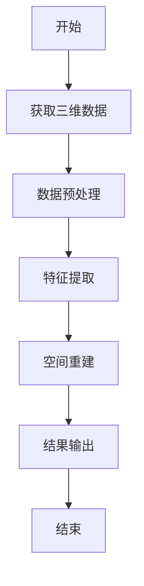
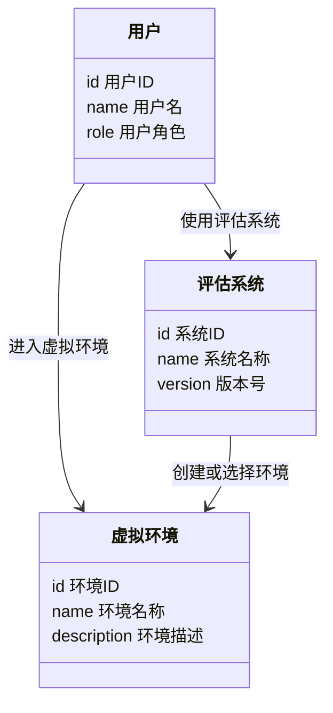

                 


# 企业估值中的虚拟现实技术评估

> 关键词：虚拟现实技术, 企业估值, 三维空间重建, 虚拟环境, 投资评估, 估值模型

> 摘要：本文探讨了虚拟现实（VR）技术在企业估值中的应用，分析了其核心原理、算法模型及系统架构，并通过实际案例展示了其在企业估值中的潜力与优势。文章从背景介绍到系统设计，再到实战案例，全面解析了虚拟现实技术如何为企业估值提供新的视角与方法。

---

## 第1章: 虚拟现实技术与企业估值的背景

### 1.1 虚拟现实技术的起源与发展

#### 1.1.1 VR技术的基本概念
虚拟现实（Virtual Reality，VR）是一种通过计算机技术模拟产生真实三维环境的技术，用户可以通过特定设备（如头显、手柄等）与虚拟环境进行交互。VR的核心在于提供沉浸式的体验，使用户感觉身临其境。

#### 1.1.2 VR技术在企业估值中的应用背景
企业估值是企业在市场中的价值评估，通常涉及资产、收入、利润等多种因素。然而，传统的估值方法往往依赖于静态的数据分析，难以直观展示企业的动态发展和空间布局。VR技术的引入，为企业的空间展示、资产配置和运营模拟提供了新的可能性。

#### 1.1.3 企业估值中的问题与挑战
传统的估值方法存在以下问题：
1. **信息维度不足**：难以全面展示企业的空间布局和动态发展。
2. **缺乏直观性**：数据呈现多为表格和图表，难以直观展示企业的实际运营情况。
3. **互动性有限**：用户无法与估值模型进行深度交互，影响决策的准确性。

### 1.2 虚拟现实技术在企业估值中的应用前景

#### 1.2.1 VR技术在企业估值中的潜在价值
1. **沉浸式体验**：通过VR技术，用户可以直观感受企业的空间布局和运营环境。
2. **实时交互**：用户可以通过VR设备与虚拟环境进行实时互动，调整参数并观察结果。
3. **动态模拟**：VR技术可以模拟企业的未来发展，帮助评估潜在风险和机会。

#### 1.2.2 企业估值中的传统方法与VR技术的结合
1. **DCF模型**：通过VR技术模拟企业的现金流，帮助评估其内在价值。
2. **相对估值法**：利用VR技术展示可比公司的情况，辅助判断目标公司价值。
3. **情景分析法**：通过VR模拟不同情景下的企业表现，帮助制定估值策略。

#### 1.2.3 VR技术对企业估值效率的提升
1. **数据可视化**：将复杂的财务数据转化为直观的虚拟场景，提升理解效率。
2. **实时反馈**：用户可以通过VR设备实时调整参数并观察结果，加快估值过程。
3. **多维度分析**：结合空间、时间、财务等多个维度，提供全面的估值视角。

---

## 第2章: 虚拟现实技术的核心概念与属性

### 2.1 虚拟现实技术的核心原理

#### 2.1.1 沉浸式体验的实现方式
1. **硬件设备**：如VR头显、手柄、追踪器等，用于捕捉用户动作并生成反馈。
2. **软件渲染**：通过图形引擎（如Unreal Engine、Unity）渲染虚拟环境，提供实时画面。

#### 2.1.2 交互性与实时反馈机制
1. **输入设备**：用户通过手柄、语音识别等方式与虚拟环境互动。
2. **实时渲染**：系统根据用户输入实时更新虚拟环境，提供即时反馈。

#### 2.1.3 虚拟环境的构建与优化
1. **建模技术**：使用3D建模工具构建虚拟场景，如Blender、Maya等。
2. **优化技术**：通过LOD（细节层次）、遮挡剔除等技术优化渲染性能。

### 2.2 虚拟现实技术的属性对比

#### 2.2.1 沉浸感与真实感的对比
| 属性 | 沉浸感 | 真实感 |
|------|--------|--------|
| 定义 | 用户感觉身临其境 | 虚拟环境与现实高度相似 |
| 技术实现 | 依赖于硬件设备和实时渲染 | 依赖于建模精度和物理模拟 |

#### 2.2.2 交互性与被动观察的对比
| 属性 | 交互性 | 被动观察 |
|------|--------|----------|
| 用户行为 | 主动操作 | 被动观看 |
| 体验效果 | 高度参与 | 较低参与 |
| 应用场景 | 适用于需要用户操作的场景 | 适用于展示性场景 |

#### 2.2.3 虚拟环境的可定制性与灵活性
1. **可定制性**：用户可以根据需求调整虚拟环境的布局、颜色、材质等。
2. **灵活性**：支持多种场景切换，适应不同的估值需求。

### 2.3 虚拟现实技术的ER实体关系图

```mermaid
erDiagram
    用户 {
        id 用户ID
        name 用户名
        role 用户角色
    }
    评估系统 {
        id 系统ID
        name 系统名称
        version 版本号
    }
    虚拟环境 {
        id 环境ID
        name 环境名称
        description 环境描述
    }
    用户 --> 评估系统 : 使用评估系统
    用户 --> 虚拟环境 : 进入虚拟环境
    评估系统 --> 虚拟环境 : 创建或选择环境
```

---

## 第3章: 虚拟现实技术在企业估值中的算法与数学模型

### 3.1 基于VR的三维空间重建算法

#### 3.1.1 算法概述
三维空间重建是通过多视角图像或深度数据，重构物体或场景的三维模型的过程。在企业估值中，可以用于构建企业的虚拟空间布局。

#### 3.1.2 算法流程



#### 3.1.3 算法实现的Python代码示例
```python
import numpy as np

def reconstruct_3d_space(data):
    # 数据预处理
    processed_data = data preprocess
    # 特征提取
    features = extract_features(processed_data)
    # 空间重建
    model = create_model(features)
    return model
```

#### 3.1.4 数学模型与公式
三维空间重建的数学模型可以表示为：
$$
x = f(p, d)
$$
其中，$x$ 是重建的三维点，$p$ 是输入数据，$d$ 是模型参数。

---

## 第4章: 虚拟现实技术的系统分析与架构设计

### 4.1 系统功能设计

#### 4.1.1 领域模型


---

### 持续更新中...

