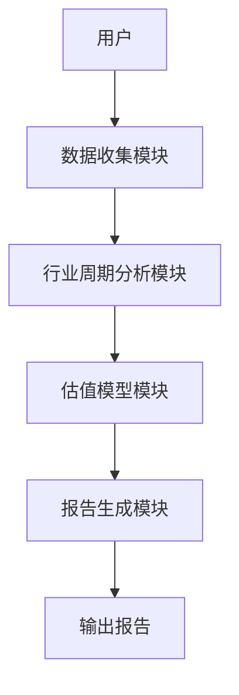
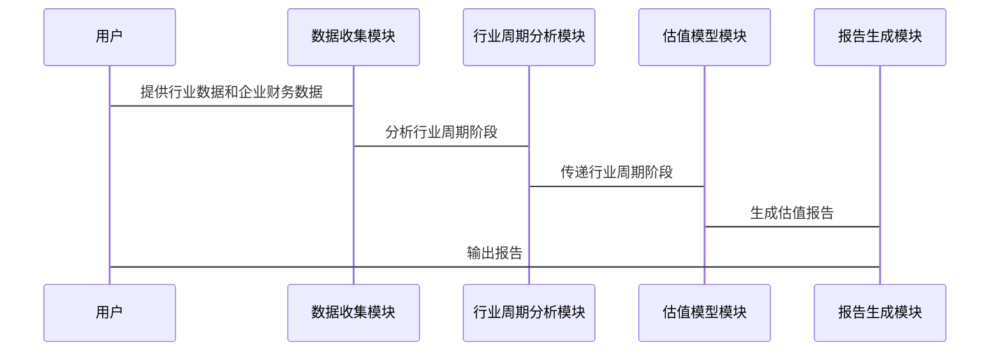

                 


# 企业估值中的行业周期影响

---

## 关键词：
企业估值、行业周期、财务分析、DCF模型、经济周期、市场分析、动态调整

---

## 摘要：
企业估值是投资决策中的核心问题，而行业周期是影响企业价值的重要因素。本文从行业周期的基本概念出发，分析其对企业估值模型的影响，结合动态调整的DCF模型和行业周期指数，探讨如何在不同行业周期阶段进行企业估值。通过实际案例和系统架构设计，提供一种基于行业周期的企业估值方法，帮助投资者在不同经济环境下做出更准确的估值决策。

---

## 正文

### 第一部分：行业周期与企业估值概述

#### 第1章：行业周期与企业估值的基本概念

##### 1.1 行业周期的基本概念
行业周期是指一个行业从发展、繁荣到衰退、复苏的循环过程。每个行业都有其独特的周期性，这种周期性受到市场需求、技术进步、政策变化和经济环境等多种因素的影响。行业周期对企业估值至关重要，因为它直接影响企业的收入、成本和利润。

##### 1.2 行业周期对企业估值的影响
在不同的行业周期阶段，企业的财务表现和市场地位会发生显著变化。例如，在行业高峰期，企业可能盈利丰厚；而在衰退期，企业可能面临盈利能力下降的风险。因此，在进行企业估值时，必须考虑当前行业周期所处的阶段。

##### 1.3 行业周期与其他影响因素的相互作用
行业周期与其他因素（如宏观经济环境、企业自身管理、竞争格局等）相互作用，共同影响企业的价值。例如，在行业周期处于衰退期时，宏观经济的不景气可能进一步加剧企业的困境。

---

#### 第2章：行业周期分析的核心概念

##### 2.1 行业周期的定义与分类
行业周期可以分为四个主要阶段：复苏期、增长期、成熟期和衰退期。每个阶段的特点如下：
- **复苏期**：行业开始复苏，市场需求逐步恢复。
- **增长期**：行业快速发展，市场需求旺盛。
- **成熟期**：行业增长放缓，市场趋于饱和。
- **衰退期**：行业需求下降，企业面临竞争压力。

##### 2.2 行业周期的特征对比
以下是不同行业周期阶段的特征对比：

| 阶段 | 市场需求 | 竞争状况 | 利润水平 | 投资回报 |
|------|----------|----------|----------|----------|
| 复苏期 | 增长     | 中等     | 中等     | 中等     |
| 增长期 | 增长     | 高       | 高       | 高       |
| 成熟期 | 稳定     | 高       | 中等     | 中等     |
| 衰退期 | 下降     | 高       | 低       | 低       |

##### 2.3 行业周期与企业生命周期的关系
行业周期与企业生命周期密切相关。例如，在行业衰退期，企业可能面临生存压力，而行业增长期则为企业提供了快速发展的机会。

---

### 第二部分：数学模型与算法

#### 第3章：基于行业周期的动态估值模型

##### 3.1 行业周期指数的引入
行业周期指数是用来衡量行业所处周期阶段的指标。可以通过统计分析方法构建行业周期指数，例如使用主成分分析（PCA）提取关键特征。

##### 3.2 动态调整的DCF模型
动态调整的DCF模型在传统DCF模型的基础上引入行业周期因素，根据行业周期阶段调整折现率和现金流预测。

##### 3.3 基于机器学习的行业周期预测
使用机器学习算法（如LSTM）预测行业周期变化，并将其纳入企业估值模型中。

以下是一个动态调整的DCF模型的数学公式：

$$
\text{企业价值} = \sum_{t=1}^{n} \frac{\text{现金流}_t}{(1 + r)^t} + \text{终值}
$$

其中，$r$ 是根据行业周期阶段调整后的折现率。

---

### 第三部分：系统架构与设计

#### 第4章：系统架构与功能设计

##### 4.1 问题场景介绍
构建一个基于行业周期的企业估值系统，能够根据行业周期阶段动态调整估值模型。

##### 4.2 系统功能设计
- 数据收集模块：收集行业数据和企业财务数据。
- 行业周期分析模块：分析行业周期阶段。
- 估值模型模块：根据行业周期阶段动态调整DCF模型。
- 报告生成模块：生成估值报告。

##### 4.3 系统架构设计

以下是一个系统架构图：



##### 4.4 系统接口设计
- 数据接口：从数据库中获取行业数据和企业财务数据。
- 模型接口：将行业周期阶段传递给DCF模型。

##### 4.5 系统交互设计

以下是一个交互序列图：



---

### 第四部分：项目实战

#### 第5章：基于行业周期的估值实战

##### 5.1 环境安装
需要安装Python、Pandas、NumPy、Matplotlib和Scikit-learn。

##### 5.2 数据收集与特征工程
收集行业数据和企业财务数据，进行数据清洗和特征工程。

##### 5.3 模型训练与结果分析
使用动态调整的DCF模型进行估值，并根据行业周期阶段调整模型参数。

##### 5.4 代码实现

以下是Python代码示例：

```python
import pandas as pd
import numpy as np
import matplotlib.pyplot as plt
from sklearn.linear_model import LinearRegression

# 数据收集与预处理
df = pd.read_csv('industry_data.csv')
df['周期阶段'] = df['行业周期指数'].apply(lambda x: '复苏期' if x < 0.25 else '增长期' if 0.25 <= x < 0.75 else '成熟期' if 0.75 <= x < 0.9 else '衰退期')

# 基于周期阶段的动态调整DCF模型
def adjusted_dcf(value, stage):
    if stage == '复苏期':
        discount_rate = 0.08
    elif stage == '增长期':
        discount_rate = 0.06
    elif stage == '成熟期':
        discount_rate = 0.05
    else:
        discount_rate = 0.04
    return value / (1 + discount_rate)

# 应用DCF模型
df['DCF估值'] = df['企业价值'].apply(adjusted_dcf, args=[df['周期阶段']])
```

---

### 第五部分：最佳实践与总结

#### 第6章：最佳实践与总结

##### 6.1 总结
行业周期是影响企业估值的重要因素。通过动态调整的DCF模型和行业周期指数，可以更准确地进行企业估值。

##### 6.2 常见错误
- 忽略行业周期的影响。
- 未根据行业周期阶段调整模型参数。

##### 6.3 未来趋势
随着大数据和人工智能技术的发展，行业周期分析将更加精准，企业估值模型也将更加智能化。

---

## 作者信息

作者：AI天才研究院/AI Genius Institute & 禅与计算机程序设计艺术 /Zen And The Art of Computer Programming

---

以上是《企业估值中的行业周期影响》的目录大纲和文章内容。希望对您有所帮助！

