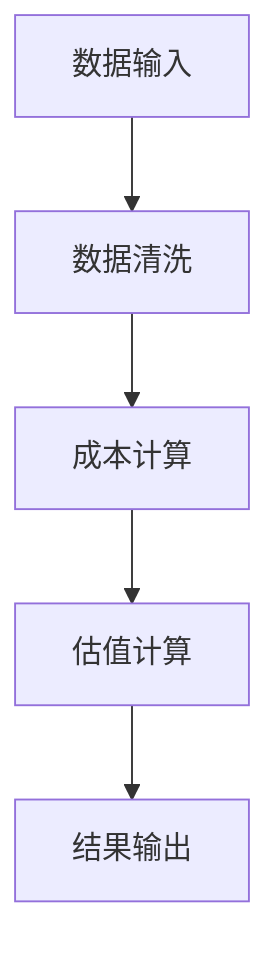

                 


# 企业估值中的规模经济效应分析

> **关键词**：企业估值，规模经济效应，边际成本，平均成本，成本函数，企业架构，系统设计

> **摘要**：本文深入分析了规模经济效应在企业估值中的应用，探讨了规模经济的原理及其对企业发展的影响，结合数学模型和系统设计，提供了从理论到实践的详细指南。

---

## 第一部分: 企业估值中的规模经济效应概述

### 第1章: 规模经济效应的基本概念

#### 1.1 规模经济效应的定义与特征

##### 1.1.1 规模经济效应的定义
规模经济效应是指随着企业生产规模的扩大，单位产品或服务的成本逐渐下降的现象。这种效应源于固定成本的分摊和边际成本的递减。

##### 1.1.2 规模经济效应的特征
- **范围经济**：企业通过扩大生产范围降低单位成本。
- **学习曲线效应**：随着生产经验的积累，效率提高，成本下降。
- **技术经济性**：技术进步使得大规模生产更具效率。

##### 1.1.3 规模经济效应与企业估值的关系
规模经济效应直接影响企业的利润和成本结构，进而影响企业估值。

#### 1.2 企业估值的基本原理

##### 1.2.1 企业估值的定义
企业估值是通过对企业的财务状况、市场地位和未来盈利能力的评估，确定其市场价值的过程。

##### 1.2.2 企业估值的核心方法
- **DCF模型**：现金流折现法。
- **相对估值法**：与可比公司进行比较。

##### 1.2.3 企业估值与规模经济的结合
规模经济效应是影响企业估值的重要因素，特别是在制造业和服务业中。

---

### 第2章: 规模经济效应的经济学理论基础

#### 2.1 边际成本与平均成本的分析

##### 2.1.1 边际成本的概念
边际成本是指每增加一单位产品所增加的总成本。

##### 2.1.2 平均成本的概念
平均成本是总成本除以总产量。

##### 2.1.3 边际成本与平均成本的关系
随着产量增加，边际成本先下降后上升，而平均成本始终下降。

#### 2.2 规模经济的类型与表现

##### 2.2.1 内在规模经济
由企业内部效率提升带来的成本下降。

##### 2.2.2 外在规模经济
由市场外部因素（如供应商折扣）带来的成本下降。

##### 2.2.3 规模经济的边界与限制
规模经济并非无限，存在边际成本的最低点。

#### 2.3 规模经济效应的数学模型与公式

##### 2.3.1 边际成本公式
$$MC = \frac{\Delta C}{\Delta Q}$$

##### 2.3.2 平均成本公式
$$AC = \frac{C}{Q}$$

---

### 第3章: 规模经济效应在企业估值中的应用

#### 3.1 规模经济效应对企业成本的影响

##### 3.1.1 成本曲线的分析
- **边际成本曲线**：U型曲线。
- **平均成本曲线**：递减曲线。

##### 3.1.2 规模经济对企业利润的影响
规模经济降低单位成本，提高利润率。

#### 3.2 规模经济效应与企业市场结构

##### 3.2.1 垄断竞争市场中的规模经济
企业通过规模经济降低成本，增强竞争力。

##### 3.2.2 寡头市场中的规模经济
寡头企业通过规模经济形成市场进入障碍。

##### 3.2.3 完全垄断市场中的规模经济
完全垄断企业通过规模经济最大化利润。

---

### 第4章: 规模经济效应的系统分析与架构设计

#### 4.1 企业估值系统的总体架构

##### 4.1.1 企业估值系统的功能模块
- 数据采集模块。
- 成本分析模块。
- 估值计算模块。

##### 4.1.2 企业估值系统的数据流分析
数据从输入到输出的流程。

##### 4.1.3 企业估值系统的架构图


#### 4.2 规模经济效应的系统实现

##### 4.2.1 边际成本计算
```python
def calculate边际成本(total_cost, quantity):
    return (total_cost[1] - total_cost[0]) / (quantity[1] - quantity[0])
```

##### 4.2.2 平均成本计算
```python
def calculate平均成本(total_cost, quantity):
    return total_cost / quantity
```

---

### 第5章: 项目实战

#### 5.1 环境安装

##### 5.1.1 安装Python和相关库
安装`numpy`和`pandas`用于数据处理。

#### 5.2 核心实现

##### 5.2.1 成本计算代码
```python
import numpy as np
import pandas as pd

def calculate边际成本(total_cost, quantity):
    return np.gradient(total_cost, quantity)

def calculate平均成本(total_cost, quantity):
    return total_cost / quantity

# 示例数据
quantity = np.array([100, 200, 300])
total_cost = np.array([1000, 1500, 1800])

边际成本 = calculate边际成本(total_cost, quantity)
平均成本 = calculate平均成本(total_cost, quantity)

print("边际成本:", 边际成本)
print("平均成本:", 平均成本)
```

#### 5.3 实际案例分析

##### 5.3.1 案例分析
分析某制造企业的成本数据，计算其规模经济效应。

##### 5.3.2 结果解读
根据计算结果，评估企业的规模经济效应是否显著。

#### 5.4 项目总结

##### 5.4.1 成功经验
成功实现规模经济效应的计算和分析。

##### 5.4.2 注意事项
数据准确性、模型适用性。

---

## 第六部分: 最佳实践与小结

### 6.1 小结

规模经济效应是企业估值中的关键因素，通过数学模型和系统设计可以有效评估其影响。

### 6.2 注意事项

- 数据质量。
- 模型假设的合理性。

### 6.3 拓展阅读

- 《企业财务分析》。
- 《规模经济与企业战略》。

---

**作者：AI天才研究院 & 禅与计算机程序设计艺术**

