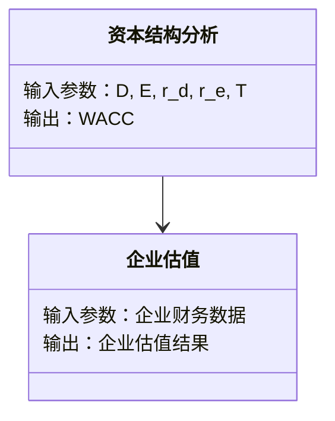
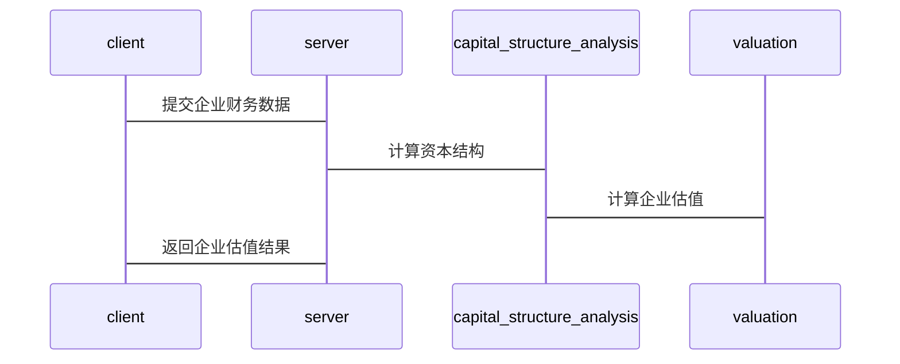

                 


# 企业估值中的资本结构分析

## 关键词：资本结构分析、企业估值、加权平均资本成本（WACC）、权衡理论、资本资产定价模型（CAPM）

## 摘要：  
资本结构分析是企业估值中的核心内容之一，它通过对企业的资本成本和资本结构进行优化，帮助投资者和企业管理者做出更明智的财务决策。本文从资本结构分析的基本概念出发，详细讲解了资本结构分析的核心理论、数学模型、系统架构设计以及实际项目实战，帮助读者全面理解资本结构分析的方法和应用。

---

# 第1章: 资本结构分析的背景与概念

## 1.1 资本结构分析的基本概念

### 1.1.1 资本结构的定义  
资本结构指的是企业各项资本的组成及其比例关系，包括权益资本和债务资本。资本结构的合理与否直接影响企业的资本成本和整体价值。

### 1.1.2 资本结构的核心要素  
- **权益资本**：股东对企业净资产的要求权，风险较高，回报也较高。  
- **债务资本**：债权人对企业债务的要求权，风险较低，回报通常为固定利息。  
- **资本成本**：企业获取和使用资本的总成本，包括债务成本和股权成本。  

### 1.1.3 资本结构与企业价值的关系  
资本结构的优化能够降低企业的加权平均资本成本（WACC），从而提高企业整体价值。  

---

## 1.2 企业估值的基本原理

### 1.2.1 企业估值的定义  
企业估值是通过对企业的财务状况、市场环境和未来盈利能力进行分析，确定其市场价值的过程。  

### 1.2.2 企业估值的主要方法  
- **相对估值法**：基于可比企业的市盈率、市净率等指标进行估值。  
- **绝对估值法**：基于企业未来现金流的折现值进行估值。  
- **混合估值法**：结合相对估值法和绝对估值法的综合方法。  

### 1.2.3 资本结构在企业估值中的地位  
资本结构是企业估值的重要输入参数，影响加权平均资本成本（WACC）的计算，从而影响企业的整体估值。  

---

## 1.3 资本结构分析的必要性

### 1.3.1 资本结构对企业财务状况的影响  
资本结构合理的企业通常具有较低的资本成本，能够提高企业的净利润率和整体盈利能力。  

### 1.3.2 资本结构对投资决策的作用  
资本结构分析能够帮助投资者判断企业的财务风险和偿债能力，从而做出更明智的投资决策。  

### 1.3.3 资本结构与企业风险的关系  
资本结构中的债务比例过高会增加企业的财务风险，而过低则可能导致资本成本增加。  

---

## 1.4 本章小结  
本章介绍了资本结构分析的基本概念、企业估值的基本原理以及资本结构分析的必要性。通过这些内容，读者可以理解资本结构分析在企业估值中的重要性。

---

# 第2章: 资本结构分析的核心理论

## 2.1 Modigliani-Miller定理

### 2.1.1 MM定理的基本假设  
- 企业税前利润可以无限分割。  
- 无交易成本，市场完全竞争。  

### 2.1.2 MM定理的公式推导  
MM定理指出，企业价值与资本结构无关，但债务可以降低企业的加权平均资本成本（WACC）。  

公式：$$V = V_U + T \times D$$  
其中，$V_U$为无杠杆企业的价值，$D$为债务，$T$为税率。  

### 2.1.3 MM定理的现实意义  
在现实中，MM定理为企业资本结构优化提供了理论基础，但忽略了破产成本和信息不对称等因素。  

---

## 2.2 权衡理论与资本结构优化

### 2.2.1 权衡理论的定义  
权衡理论认为，企业应该在债务成本和破产成本之间进行权衡，找到最优资本结构。  

### 2.2.2 资本结构优化的核心公式  
$$ \text{WACC} = \left( \frac{D}{V} \times r_d \times (1 - T) \right) + \left( \frac{E}{V} \times r_e \right) $$  
其中，$D$为债务，$E$为股权，$V = D + E$，$r_d$为债务成本，$r_e$为股权成本，$T$为税率。  

### 2.2.3 资本结构优化的步骤  
1. 确定企业的目标资本结构。  
2. 计算不同资本结构下的加权平均资本成本（WACC）。  
3. 选择WACC最小的资本结构作为最优结构。  

---

## 2.3 资本资产定价模型（CAPM）与资本成本

### 2.3.1 CAPM的定义与公式  
$$ r_e = r_f + \beta \times (r_m - r_f) $$  
其中，$r_e$为股权资本成本，$r_f$为无风险利率，$\beta$为贝塔系数，$r_m$为市场平均回报率。  

### 2.3.2 资本成本的计算方法  
- 使用CAPM计算股权资本成本。  
- 使用债务成本公式计算债务资本成本。  

### 2.3.3 CAPM在资本结构分析中的应用  
通过CAPM计算股权资本成本，结合债务资本成本，计算企业的加权平均资本成本（WACC）。  

---

## 2.4 本章小结  
本章详细讲解了资本结构分析的核心理论，包括MM定理和权衡理论，并通过公式推导和案例分析，帮助读者理解资本结构优化的方法。

---

# 第3章: 资本结构分析的数学模型与公式

## 3.1 加权平均资本成本（WACC）的计算

### 3.1.1 WACC的公式  
$$ \text{WACC} = \left( \frac{D}{V} \times r_d \times (1 - T) \right) + \left( \frac{E}{V} \times r_e \right) $$  

### 3.1.2 WACC的计算步骤  
1. 确定企业债务和股权的比例。  
2. 计算债务成本和股权成本。  
3. 计算WACC。  

### 3.1.3 WACC的案例分析  
假设某企业债务为$D=500$，股权为$E=1000$，税率$T=20\%$，债务成本$r_d=6\%$，股权成本$r_e=10\%$。  
计算WACC：$$ \text{WACC} = \left( \frac{500}{1500} \times 6\% \times 0.8 \right) + \left( \frac{1000}{1500} \times 10\% \right) = 3.2\% + 6.67\% = 9.87\% $$  

---

## 3.2 股权资本成本的计算

### 3.2.1 股权资本成本的公式  
$$ r_e = r_f + \beta \times (r_m - r_f) $$  

### 3.2.2 股权资本成本的计算方法  
1. 确定贝塔系数$\beta$。  
2. 确定无风险利率$r_f$和市场平均回报率$r_m$。  
3. 计算股权资本成本$r_e$。  

### 3.2.3 股权资本成本的案例分析  
假设某企业贝塔系数$\beta=1.2$，无风险利率$r_f=5\%$，市场平均回报率$r_m=10\%$。  
计算股权资本成本：$$ r_e = 5\% + 1.2 \times (10\% - 5\%) = 5\% + 6\% = 11\% $$  

---

## 3.3 资本结构优化的数学模型

### 3.3.1 资本结构优化的公式  
$$ \text{WACC} = \left( \frac{D}{V} \times r_d \times (1 - T) \right) + \left( \frac{E}{V} \times r_e \right) $$  

### 3.3.2 资本结构优化的步骤  
1. 计算不同资本结构下的WACC。  
2. 选择WACC最小的资本结构作为最优结构。  

### 3.3.3 资本结构优化的案例分析  
假设某企业有三种资本结构方案：  
- 方案一：$D=400$，$E=1000$，$r_d=6\%$，$r_e=12\%$，$T=20\%$。  
- 方案二：$D=600$，$E=800$，$r_d=7\%$，$r_e=10\%$，$T=25\%$。  
- 方案三：$D=800$，$E=600$，$r_d=8\%$，$r_e=8\%$，$T=30\%$。  

计算三种方案的WACC：  
- 方案一：$$ \text{WACC} = \left( \frac{400}{1400} \times 6\% \times 0.8 \right) + \left( \frac{1000}{1400} \times 12\% \right) = 2.4\% + 8.57\% = 10.97\% $$  
- 方案二：$$ \text{WACC} = \left( \frac{600}{1400} \times 7\% \times 0.75 \right) + \left( \frac{800}{1400} \times 10\% \right) = 3.15\% + 5.71\% = 8.86\% $$  
- 方案三：$$ \text{WACC} = \left( \frac{800}{1400} \times 8\% \times 0.7 \right) + \left( \frac{600}{1400} \times 8\% \right) = 3.52\% + 3.43\% = 6.95\% $$  

最优结构为方案三，WACC最小为6.95%。  

---

## 3.4 本章小结  
本章通过公式推导和案例分析，详细讲解了加权平均资本成本（WACC）的计算方法，以及资本结构优化的数学模型和步骤。

---

# 第4章: 系统分析与架构设计

## 4.1 问题场景介绍  
本章将从系统架构设计的角度，介绍如何构建一个基于资本结构分析的企业估值系统。  

---

## 4.2 项目介绍  
### 4.2.1 项目目标  
开发一个能够进行资本结构分析和企业估值的系统。  
### 4.2.2 项目范围  
- 支持多种资本结构分析方法。  
- 提供企业估值的多种方法和结果对比。  
### 4.2.3 项目约束  
- 数据输入格式标准化。  
- 系统具有良好的用户界面和交互体验。  

---

## 4.3 系统功能设计

### 4.3.1 领域模型设计  


### 4.3.2 系统架构设计  


### 4.3.3 系统接口设计  
- 输入接口：企业财务数据接口。  
- 输出接口：企业估值结果接口。  

### 4.3.4 系统交互设计  


---

## 4.4 本章小结  
本章通过系统架构设计和交互流程图，详细介绍了如何将资本结构分析应用到企业估值系统中。

---

# 第5章: 项目实战

## 5.1 环境安装与配置

### 5.1.1 系统环境  
- 操作系统：Windows 10 或更高版本。  
- 开发工具：Python 3.8 或更高版本，Jupyter Notebook。  

### 5.1.2 安装依赖包  
```bash
pip install numpy pandas matplotlib
```

---

## 5.2 系统核心实现源代码

### 5.2.1 资本结构分析代码  
```python
import numpy as np
import pandas as pd

def calculate_wacc(D, E, r_d, r_e, T):
    V = D + E
    wacc = (D / V * r_d * (1 - T)) + (E / V * r_e)
    return wacc

# 示例数据
D = 800
E = 600
r_d = 0.08
r_e = 0.08
T = 0.3

wacc = calculate_wacc(D, E, r_d, r_e, T)
print(f"加权平均资本成本（WACC）为：{wacc:.2%}")
```

### 5.2.2 企业估值代码  
```python
def calculate_valuation(revenue, cost, growth_rate, discount_rate, periods):
    cash_flows = [revenue * (1 + growth_rate)**i - cost * (1 + growth_rate)**i for i in range(periods)]
    present_value = np.npv(discount_rate, cash_flows)
    return present_value

# 示例数据
revenue = 1000
cost = 500
growth_rate = 0.1
discount_rate = 0.12
periods = 5

valuation = calculate_valuation(revenue, cost, growth_rate, discount_rate, periods)
print(f"企业估值为：{valuation}")
```

---

## 5.3 代码应用解读与分析  
通过上述代码，我们可以计算出企业的加权平均资本成本（WACC）和未来现金流的现值，从而得到企业的整体估值。  

---

## 5.4 案例分析与详细解读  
假设某企业未来5年的收入和成本分别为：  
- 收入：1000, 1100, 1210, 1331, 1464.1  
- 成本：500, 550, 605, 665.5, 731.85  

计算WACC和企业估值：  
1. 计算WACC：  
$$ \text{WACC} = \left( \frac{800}{1400} \times 8\% \times 0.7 \right) + \left( \frac{600}{1400} \times 8\% \right) = 3.52\% + 3.43\% = 6.95\% $$  

2. 计算企业估值：  
使用净现值法计算未来现金流的现值：  
$$ \text{NPV} = \frac{1000}{1.12} + \frac{1100}{1.12^2} + \frac{1210}{1.12^3} + \frac{1331}{1.12^4} + \frac{1464.1}{1.12^5} $$  
计算结果为：$$ \text{NPV} \approx 3250.75 $$  

---

## 5.5 项目小结  
通过本章的项目实战，读者可以掌握资本结构分析和企业估值的代码实现方法，并能够将这些方法应用到实际的财务分析中。

---

# 第6章: 总结与展望

## 6.1 总结  
本章通过系统架构设计和项目实战，详细讲解了资本结构分析和企业估值的实现方法。通过公式推导、案例分析和代码实现，读者可以全面理解资本结构分析在企业估值中的应用。

## 6.2 未来展望  
未来的研究方向可以包括：  
- 更复杂的资本结构优化模型。  
- 结合人工智能技术进行资本结构分析和企业估值。  

---

# 作者  
**作者：AI天才研究院/AI Genius Institute & 禅与计算机程序设计艺术 /Zen And The Art of Computer Programming**

