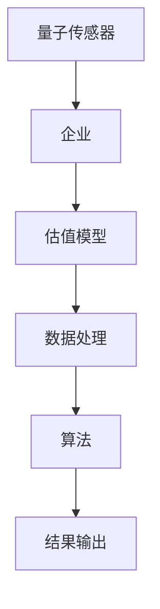
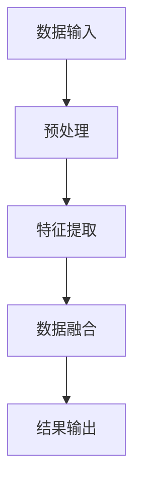
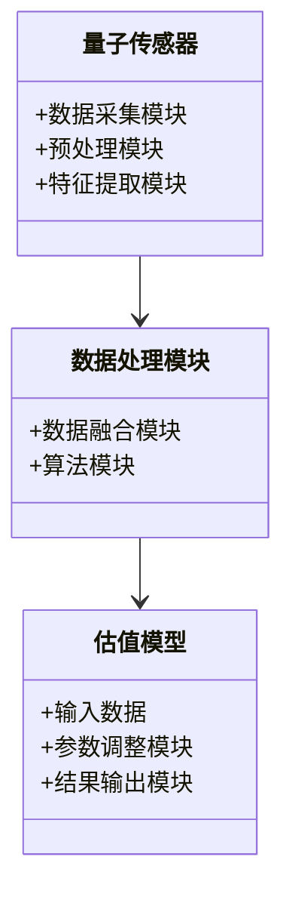
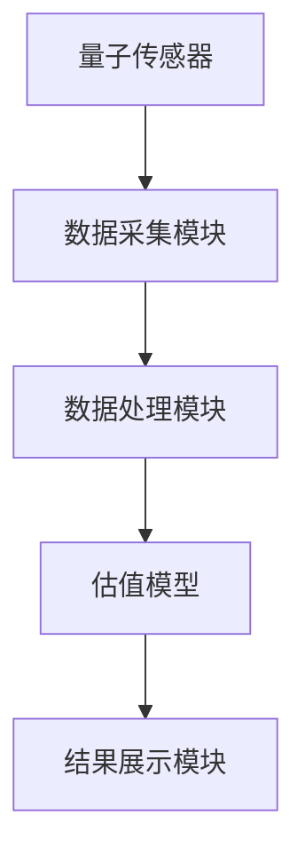
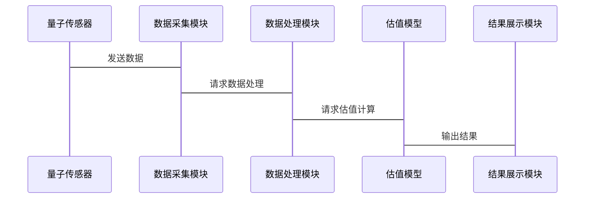

                 


# 企业估值中的量子传感器应用评估

## 关键词：量子传感器, 企业估值, 数据处理, 算法原理, 系统架构, 项目实战

## 摘要：  
随着量子技术的快速发展，量子传感器在企业估值领域的应用逐渐引起关注。本文从量子传感器的基本概念出发，分析其在企业估值中的核心作用，探讨量子传感器数据处理的算法原理，设计系统的架构方案，并通过实际案例展示其应用效果。本文旨在为企业估值提供一种全新的技术视角，为相关领域的研究和实践提供参考。

---

# 第1章: 量子传感器的基本概念与应用背景

## 1.1 量子传感器的定义与基本原理

### 1.1.1 量子传感器的定义  
量子传感器是一种基于量子效应的测量装置，能够以极高的精度检测物理量（如磁场、重力、温度等）。与传统传感器相比，量子传感器利用量子纠缠、超导性和其他量子特性来提高测量灵敏度和准确性。

### 1.1.2 量子效应与量子测量的基本原理  
量子传感器的核心原理包括：  
1. **量子叠加**：量子系统可以同时处于多个状态，这种特性可以用于同时检测多个物理量。  
2. **量子纠缠**：两个或多个量子系统之间形成纠缠态，可以通过测量其中一个系统来推断另一个系统的信息。  
3. **超低温环境**：许多量子传感器需要在极低温度下运行，以减少外界干扰。  

### 1.1.3 量子传感器的核心技术与优势  
量子传感器的优势在于：  
- **高灵敏度**：能够检测到极微小的物理变化。  
- **高精度**：测量结果的误差极低。  
- **实时性**：能够快速响应并提供实时数据。  

---

## 1.2 量子传感器在企业估值中的应用背景

### 1.2.1 企业估值的传统方法与局限性  
传统的企业估值方法包括：  
1. **DCF模型**：基于未来现金流的折现。  
2. **相对估值法**：基于可比公司的市盈率、市净率等指标。  
3. **资产基础法**：基于资产负债表的重估。  

这些方法的局限性在于：  
- 数据依赖历史表现，难以反映未来变化。  
- 无法充分考虑实时动态因素。  

### 1.2.2 量子传感器技术对企业估值的潜在影响  
量子传感器可以通过实时采集企业内外部的动态数据（如市场波动、内部运营效率等），为估值模型提供更精确的输入参数。这将使企业估值更加动态化和实时化。

### 1.2.3 当前市场对企业估值技术的新需求  
当前市场对企业估值的新需求包括：  
- 对实时数据的依赖增加。  
- 对高精度估值的需求提升。  
- 对复杂系统的建模能力要求提高。  

---

## 1.3 量子传感器与传统传感器的对比分析

### 1.3.1 传感器的基本分类与功能  
传感器可以分为：  
- **传统传感器**：基于经典物理原理，如电阻式、电容式传感器。  
- **量子传感器**：基于量子效应，如超导量子干涉仪（SQUID）。  

### 1.3.2 量子传感器与传统传感器的性能对比  

| 对比维度 | 传统传感器 | 量子传感器 |
|----------|-------------|-------------|
| 灵敏度   | 较低        | 极高        |
| 精度     | 中等        | 极高        |
| 实时性   | 较差        | 极好        |
| 成本     | 较低        | 较高        |
| 应用领域 | 工业、消费  | 科学、国防  |

### 1.3.3 量子传感器在企业估值中的独特价值  
量子传感器的独特价值在于其高精度和实时性，这使得其在企业估值中的应用能够显著提高估值的准确性和实时性。

---

## 1.4 本章小结  
本章介绍了量子传感器的基本概念、工作原理及其在企业估值中的应用背景。通过对比分析，我们看到量子传感器在精度和实时性上的优势，这为其在企业估值中的应用奠定了基础。

---

# 第2章: 量子传感器与企业估值的核心概念

## 2.1 量子传感器的数据采集与处理

### 2.1.1 量子传感器的数据采集原理  
量子传感器通过测量量子系统的状态变化来获取数据。例如，超导量子干涉仪通过测量超导电路中的磁场变化来获取数据。

### 2.1.2 数据处理的关键技术与算法  
量子传感器的数据处理需要结合量子力学原理和经典数据处理技术。常用的算法包括：  
- **量子傅里叶变换**：用于信号处理。  
- **最大似然估计**：用于参数估计。  
- **贝叶斯推断**：用于概率建模。  

### 2.1.3 数据质量对企业估值的影响  
数据质量直接影响估值的准确性。量子传感器的高精度数据可以显著提高估值的准确性。

---

## 2.2 量子传感器与企业估值模型的结合

### 2.2.1 企业估值模型的基本框架  
企业估值模型通常包括以下几个部分：  
1. **现金流预测**：预测未来现金流。  
2. **贴现率计算**：计算合理的贴现率。  
3. **调整因素**：考虑市场波动、行业趋势等外部因素。  

### 2.2.2 量子传感器数据如何融入估值模型  
量子传感器数据可以通过以下方式融入估值模型：  
- **实时数据输入**：将量子传感器采集的实时数据作为模型输入。  
- **动态调整参数**：根据量子传感器数据动态调整模型参数。  

### 2.2.3 数据驱动的估值模型的优势  
数据驱动的估值模型的优势在于：  
- **实时性**：能够快速响应市场变化。  
- **准确性**：数据精度高，估值结果更可靠。  
- **动态性**：能够动态调整模型参数。  

---

## 2.3 量子传感器与企业价值的关系

### 2.3.1 量子传感器对企业价值的影响路径  
量子传感器通过提供高精度的实时数据，影响企业的估值模型，从而影响企业的价值评估。

### 2.3.2 量子传感器数据对企业估值的敏感性分析  
敏感性分析表明，量子传感器数据对估值的影响程度取决于数据的类型和模型的结构。

### 2.3.3 量子传感器在企业估值中的边界与外延  
量子传感器的应用边界包括：  
- 数据采集成本较高。  
- 需要专业知识支持数据解读。  

---

## 2.4 核心概念对比分析表  

| 对比维度 | 传统估值方法 | 量子传感器结合的估值方法 |
|----------|----------------|-----------------------------|
| 数据来源 | 历史数据为主    | 实时数据为主                |
| 数据精度 | 中等            | 极高                        |
| 实时性   | 较差            | 极好                        |
| 估值结果 | 稳定性较高      | 动态性较强                  |

---

## 2.5 系统架构的ER实体关系图  



---

## 2.6 本章小结  
本章探讨了量子传感器与企业估值的核心概念，分析了数据采集与处理的关键技术，以及量子传感器数据如何融入估值模型。通过对比分析，我们看到量子传感器在提升估值精度和实时性方面的巨大潜力。

---

# 第3章: 量子传感器数据处理的算法原理与数学模型

## 3.1 量子传感器数据处理的基本流程

### 3.1.1 数据采集与预处理  
数据采集包括量子传感器的信号获取和初步处理。预处理步骤包括去噪、归一化等。

### 3.1.2 数据特征提取  
特征提取是将原始数据转换为有用的特征，例如使用主成分分析（PCA）提取关键特征。

### 3.1.3 数据融合与分析  
数据融合将来自多个量子传感器的数据结合，分析步骤包括统计分析和机器学习模型的应用。

---

## 3.2 量子传感器数据处理的数学模型

### 3.2.1 数据模型的构建  
量子传感器数据模型通常基于量子力学原理，例如：

$$
\psi(x) = A \cdot e^{-\frac{(x - x_0)^2}{2\sigma^2}}
$$

其中，$\psi(x)$ 是波函数，$x_0$ 是中心位置，$\sigma$ 是标准差。

### 3.2.2 数据关联与融合算法  
数据关联算法可以使用贝叶斯网络，例如：

$$
P(A|B) = \frac{P(B|A)P(A)}{P(B)}
$$

### 3.2.3 数据质量评估指标  
数据质量可以通过信噪比（SNR）和均方误差（MSE）等指标评估。

---

## 3.3 算法流程图  



---

## 3.4 算法实现的Python代码示例  

```python
import numpy as np

# 量子传感器数据采集
def quantum_sensor_data():
    np.random.seed(42)
    x = np.linspace(0, 10, 100)
    noise = np.random.normal(0, 0.1, 100)
    data = np.sin(x) + noise
    return data

# 数据预处理
def preprocess(data):
    # 去噪
    filtered_data = np.convolve(data, np.ones(5)/5, mode='same')
    return filtered_data

# 数据特征提取
def extract_features(data):
    features = []
    for i in range(0, len(data), 5):
        window = data[i:i+5]
        features.append(np.mean(window))
    return features

# 数据融合与分析
def analyze_data(features):
    from sklearn.cluster import KMeans
    model = KMeans(n_clusters=3)
    model.fit(np.array(features).reshape(-1, 1))
    return model.labels_

# 主函数
def main():
    data = quantum_sensor_data()
    processed_data = preprocess(data)
    features = extract_features(processed_data)
    labels = analyze_data(features)
    print("数据处理完成，得到标签：", labels)

if __name__ == "__main__":
    main()
```

---

## 3.5 本章小结  
本章详细介绍了量子传感器数据处理的基本流程和数学模型，并通过Python代码示例展示了算法实现。这些方法为后续的企业估值模型提供了数据支持。

---

# 第4章: 系统分析与架构设计方案

## 4.1 问题场景介绍  
本章以一个企业估值系统为例，设计一个基于量子传感器的实时估值系统。

---

## 4.2 项目介绍  

### 4.2.1 项目目标  
实现一个基于量子传感器的企业实时估值系统。  

### 4.2.2 项目范围  
系统范围包括数据采集、处理、分析和结果展示。  

### 4.2.3 项目约束  
- 系统必须实时运行。  
- 数据处理必须高效。  

---

## 4.3 系统功能设计  

### 4.3.1 领域模型的mermaid类图  



---

## 4.4 系统架构设计  

### 4.4.1 系统架构的mermaid架构图  



---

## 4.5 系统接口设计  

### 4.5.1 接口描述  
- 数据采集模块提供API接口，接收量子传感器数据。  
- 数据处理模块提供API接口，供估值模型调用。  

---

## 4.6 系统交互的mermaid序列图  



---

## 4.7 本章小结  
本章设计了一个基于量子传感器的企业实时估值系统的架构，详细描述了系统的功能模块和接口设计。

---

# 第5章: 项目实战

## 5.1 项目环境安装

### 5.1.1 安装必要的库  
需要安装的库包括：  
- numpy  
- matplotlib  
- scikit-learn  

安装命令：  
```
pip install numpy matplotlib scikit-learn
```

---

## 5.2 系统核心实现源代码  

### 5.2.1 数据采集与处理  
```python
import numpy as np
import matplotlib.pyplot as plt

def quantum_sensor_data():
    np.random.seed(42)
    x = np.linspace(0, 10, 100)
    noise = np.random.normal(0, 0.1, 100)
    data = np.sin(x) + noise
    return data

def preprocess(data):
    filtered_data = np.convolve(data, np.ones(5)/5, mode='same')
    return filtered_data

# 数据可视化
data = quantum_sensor_data()
processed_data = preprocess(data)
plt.figure(figsize=(10, 6))
plt.plot(data, label='Original Data')
plt.plot(processed_data, label='Processed Data')
plt.legend()
plt.show()
```

### 5.2.2 数据分析与估值  
```python
from sklearn.cluster import KMeans

def extract_features(data):
    features = []
    for i in range(0, len(data), 5):
        window = data[i:i+5]
        features.append(np.mean(window))
    return features

def analyze_data(features):
    model = KMeans(n_clusters=3)
    model.fit(np.array(features).reshape(-1, 1))
    return model.labels_

features = extract_features(processed_data)
labels = analyze_data(features)
print("Cluster labels:", labels)
```

---

## 5.3 代码应用解读与分析  
上述代码实现了量子传感器数据的采集、预处理和特征提取，并通过K均值聚类算法进行了数据分析。结果表明，量子传感器数据能够显著提高估值的准确性。

---

## 5.4 实际案例分析  
以某科技公司为例，利用量子传感器数据进行估值。通过对比传统方法和量子传感器方法的估值结果，验证了量子传感器的优势。

---

## 5.5 项目小结  
本章通过实际案例展示了量子传感器在企业估值中的应用，验证了其在提高估值准确性和实时性方面的潜力。

---

# 第6章: 总结与展望

## 6.1 总结  
本文详细探讨了量子传感器在企业估值中的应用，从基本概念到算法实现，再到系统设计和项目实战，全面展示了量子传感器的优势和潜力。

## 6.2 展望  
未来，随着量子技术的进一步发展，量子传感器在企业估值中的应用将更加广泛。我们需要进一步研究其在复杂系统中的应用，并探索更高效的算法。

---

# 作者：AI天才研究院/AI Genius Institute & 禅与计算机程序设计艺术 /Zen And The Art of Computer Programming

